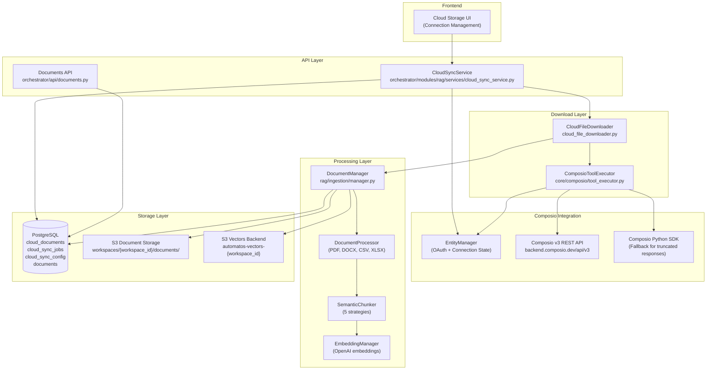
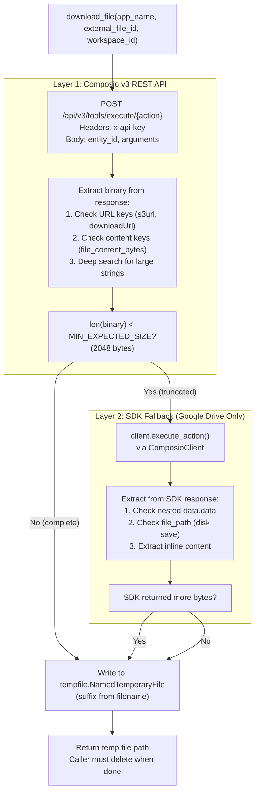
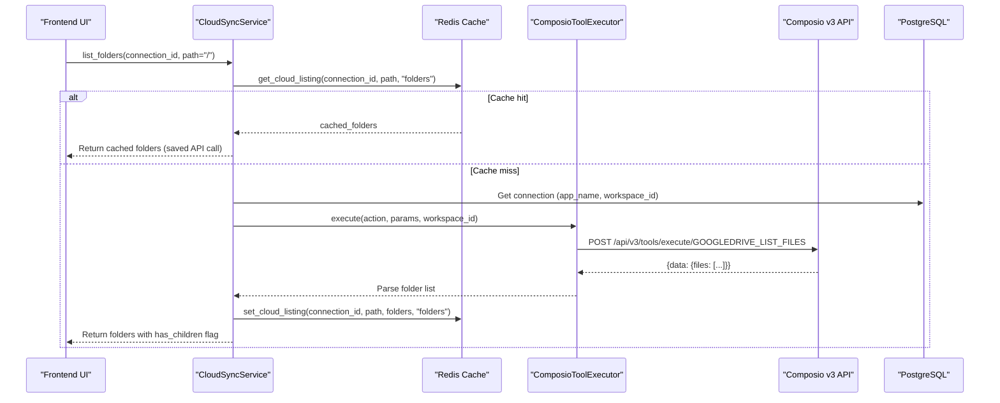
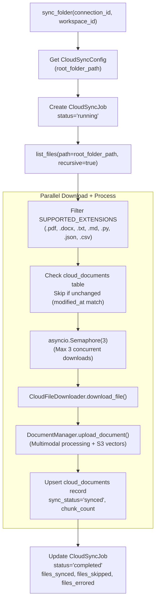
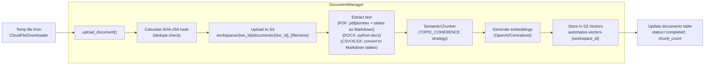
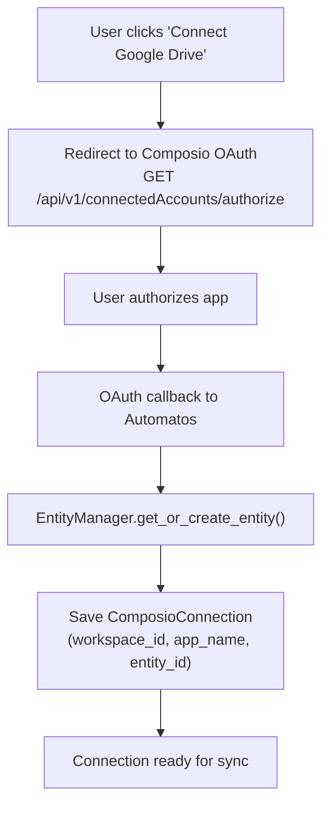

# Cloud Storage Integration

<details>
<summary>Relevant source files</summary>

The following files were used as context for generating this wiki page:

- [orchestrator/api/documents.py](orchestrator/api/documents.py)
- [orchestrator/core/composio/tool_executor.py](orchestrator/core/composio/tool_executor.py)
- [orchestrator/modules/agents/services/agent_platform_tools.py](orchestrator/modules/agents/services/agent_platform_tools.py)
- [orchestrator/modules/codegraph/ranking/__init__.py](orchestrator/modules/codegraph/ranking/__init__.py)
- [orchestrator/modules/codegraph/ranking/pagerank_ranker.py](orchestrator/modules/codegraph/ranking/pagerank_ranker.py)
- [orchestrator/modules/memory/integrations/mem0_client.py](orchestrator/modules/memory/integrations/mem0_client.py)
- [orchestrator/modules/rag/chunking/semantic_chunker.py](orchestrator/modules/rag/chunking/semantic_chunker.py)
- [orchestrator/modules/rag/ingestion/manager.py](orchestrator/modules/rag/ingestion/manager.py)
- [orchestrator/modules/rag/service.py](orchestrator/modules/rag/service.py)
- [orchestrator/modules/rag/services/cloud_file_downloader.py](orchestrator/modules/rag/services/cloud_file_downloader.py)
- [orchestrator/modules/rag/services/cloud_sync_service.py](orchestrator/modules/rag/services/cloud_sync_service.py)
- [orchestrator/modules/search/services/entity_extractor.py](orchestrator/modules/search/services/entity_extractor.py)

</details>


## Purpose

This page documents Automatos AI's cloud storage integration system, which enables automatic syncing of documents from Google Drive, Dropbox, OneDrive, and Box into the RAG knowledge base. The system uses Composio for OAuth management and file access, downloads files from cloud providers, processes them through the multimodal ingestion pipeline, and stores vectors in S3 for semantic search.

For document upload and processing details, see [Document Management](#5.1) and [Document Ingestion Pipeline](#5.2). For RAG retrieval after documents are synced, see [RAG Retrieval System](#5.4).

## System Architecture

The cloud storage integration consists of three layers: **Connection Layer** (Composio OAuth), **Download Layer** (multi-strategy file retrieval), and **Processing Layer** (ingestion + vector storage).



**Sources:** [orchestrator/modules/rag/services/cloud_sync_service.py:1-403](), [orchestrator/modules/rag/services/cloud_file_downloader.py:1-437](), [orchestrator/modules/rag/ingestion/manager.py:1-750]()

## Supported Cloud Providers

The system supports four cloud storage providers, each with Composio-mapped actions for listing and downloading files:

| Provider | List Action | Download Action | File ID Format | Notes |
|----------|-------------|-----------------|----------------|-------|
| **Google Drive** | `GOOGLEDRIVE_LIST_FILES` | `GOOGLEDRIVE_DOWNLOAD_FILE` | `fileId` (string) | v3 API truncates inline content to ~500 bytes, SDK fallback downloads full file |
| **Dropbox** | `DROPBOX_LIST_FILES_IN_FOLDER` | `DROPBOX_READ_FILE` | `path` (string) | v3 API returns full content inline, no fallback needed |
| **OneDrive** | `ONEDRIVE_LIST_FILES` | `ONEDRIVE_DOWNLOAD_FILE` | `path` (string) | v3 API returns full content inline |
| **Box** | `BOX_LIST_FOLDER_ITEMS` | `BOX_DOWNLOAD_FILE` | `id` (string) | v3 API returns full content inline |

**Sources:** [orchestrator/modules/rag/services/cloud_file_downloader.py:29-35](), [orchestrator/modules/rag/services/cloud_sync_service.py:30-35]()

## CloudFileDownloader: Multi-Layer Download Strategy

The `CloudFileDownloader` class implements a resilient file download system with automatic fallback for truncated responses. It addresses the Composio v3 API limitation where Google Drive inline content is truncated to ~500 bytes.

### Download Strategy



**Sources:** [orchestrator/modules/rag/services/cloud_file_downloader.py:72-143]()

### Content Extraction Priority

The downloader uses a prioritized search strategy to extract file content from Composio responses:

1. **URL Keys** (checked first) - Composio hosts full file on R2/S3 with presigned URL:
   - `s3url`, `s3Url`, `downloadUrl`, `download_url`, `url`, `webContentLink`, `temporary_link`, `link`
   - Downloads via HTTP GET to retrieve full content

2. **Content Keys** (inline content) - Works for Dropbox, OneDrive, Box, and small files:
   - `file_content_bytes` (Dropbox)
   - `downloaded_file_content` (Google Drive, truncated)
   - `content`, `file_content`, `body`, `raw`

3. **Deep Search** - Any large string value (>200 chars) is treated as potential content

4. **File Path** - SDK sometimes saves files to disk, returns local path

**Sources:** [orchestrator/modules/rag/services/cloud_file_downloader.py:264-303](), [orchestrator/modules/rag/services/cloud_file_downloader.py:37-54]()

### Binary Conversion

The `_to_bytes()` method handles multiple content formats:

| Format | Detection | Conversion |
|--------|-----------|------------|
| `bytes` | `isinstance(content, bytes)` | Return as-is |
| File path | `os.path.isfile(content)` | Read from disk |
| Base64 string | `base64.b64decode(validate=True)` | Decode to bytes |
| UTF-8 string | Default | Encode as UTF-8 |

**Sources:** [orchestrator/modules/rag/services/cloud_file_downloader.py:316-335]()

## CloudSyncService: Orchestration Layer

The `CloudSyncService` class orchestrates folder navigation, file listing, and automated sync operations. It uses existing infrastructure (`ComposioToolExecutor`, `DocumentManager`) and tracks state in PostgreSQL.

### Folder Navigation with Caching



**Sources:** [orchestrator/modules/rag/services/cloud_sync_service.py:59-110]()

### File Listing with Sync Status

The `list_files()` method returns cloud files enriched with database sync status:

```python
[
  {
    "name": "report.pdf",
    "external_file_id": "1xY...",
    "path": "/Documents/report.pdf",
    "size": 2048576,
    "modified_at": "2024-01-15T10:30:00Z",
    "is_synced": true,
    "sync_status": "synced",
    "chunk_count": 12,
    "last_synced_at": "2024-01-15T11:00:00Z"
  }
]
```

**Sources:** [orchestrator/modules/rag/services/cloud_sync_service.py:116-192]()

### Sync Folder: Parallel Processing

The `sync_folder()` method creates a `CloudSyncJob` and processes all files under the configured root folder:



**Sources:** [orchestrator/modules/rag/services/cloud_sync_service.py:198-382]()

### Parallel Processing Implementation

The service uses `asyncio.Semaphore(3)` to limit concurrent downloads:

```python
MAX_CONCURRENT = 3
semaphore = asyncio.Semaphore(MAX_CONCURRENT)

async def _process_one_file(cf):
    async with semaphore:
        downloader = CloudFileDownloader(self.db)
        tmp_path = await downloader.download_file(...)
        document_id = await doc_manager.upload_document(...)
        # Upsert cloud_documents record
```

This prevents overwhelming the Composio API and balances memory usage during processing.

**Sources:** [orchestrator/modules/rag/services/cloud_sync_service.py:293-346]()

## Document Processing Pipeline Integration

Once a file is downloaded, `DocumentManager.upload_document()` processes it through the full multimodal pipeline:



**Sources:** [orchestrator/modules/rag/ingestion/manager.py:688-750](), [orchestrator/modules/rag/services/cloud_sync_service.py:338-346]()

### Multimodal Processing for Tables

The system converts tables to Markdown for LLM consumption:

**PDF Tables (pdfplumber):**
```markdown
[Table 1, Page 3]
| Header 1 | Header 2 | Header 3 |
| --- | --- | --- |
| Cell 1 | Cell 2 | Cell 3 |
| Cell 4 | Cell 5 | Cell 6 |
```

**CSV/XLSX Tables (openpyxl):**
```markdown
## Sheet: Sales
| Date | Amount | Product |
| --- | --- | --- |
| 2024-01-15 | 1200 | Widget A |
| 2024-01-16 | 800 | Widget B |
```

This preserves tabular structure while making it queryable via RAG.

**Sources:** [orchestrator/modules/rag/ingestion/manager.py:480-543]()

## Database Schema

The cloud sync system uses three tables to track connection configuration, sync jobs, and document state:

### cloud_sync_config

Stores root folder configuration per connection:

| Column | Type | Description |
|--------|------|-------------|
| `id` | `SERIAL PRIMARY KEY` | Auto-incrementing ID |
| `workspace_id` | `UUID NOT NULL` | Workspace isolation |
| `connection_id` | `INTEGER REFERENCES composio_connections(id)` | Connected app |
| `root_folder_path` | `TEXT NOT NULL` | Root folder to sync (e.g., `/Automatos`) |
| `created_at` | `TIMESTAMP DEFAULT NOW()` | Config creation time |
| `updated_at` | `TIMESTAMP DEFAULT NOW()` | Last updated |

**Sources:** [orchestrator/modules/rag/services/cloud_sync_service.py:213-222]()

### cloud_sync_jobs

Tracks sync execution history:

| Column | Type | Description |
|--------|------|-------------|
| `id` | `SERIAL PRIMARY KEY` | Job ID |
| `workspace_id` | `UUID NOT NULL` | Workspace isolation |
| `connection_id` | `INTEGER REFERENCES composio_connections(id)` | Cloud connection |
| `status` | `TEXT NOT NULL` | `running`, `completed`, `failed` |
| `started_at` | `TIMESTAMP` | Job start time |
| `completed_at` | `TIMESTAMP` | Job completion time |
| `files_synced` | `INTEGER DEFAULT 0` | Count of successfully synced files |
| `files_skipped` | `INTEGER DEFAULT 0` | Count of unchanged files |
| `files_errored` | `INTEGER DEFAULT 0` | Count of failed files |
| `total_chunks` | `INTEGER DEFAULT 0` | Total chunks created |
| `error_message` | `TEXT` | Error details if failed |

**Sources:** [orchestrator/modules/rag/services/cloud_sync_service.py:226-233]()

### cloud_documents

Maps cloud files to local documents:

| Column | Type | Description |
|--------|------|-------------|
| `id` | `SERIAL PRIMARY KEY` | Record ID |
| `workspace_id` | `UUID NOT NULL` | Workspace isolation |
| `connection_id` | `INTEGER REFERENCES composio_connections(id)` | Cloud connection |
| `app_name` | `TEXT NOT NULL` | `GOOGLEDRIVE`, `DROPBOX`, etc. |
| `external_file_id` | `TEXT NOT NULL` | Provider-specific file ID |
| `file_name` | `TEXT NOT NULL` | Original filename |
| `file_path` | `TEXT` | Path in cloud storage |
| `document_id` | `INTEGER REFERENCES documents(id)` | Local document ID |
| `sync_status` | `TEXT NOT NULL` | `pending`, `synced`, `error` |
| `last_synced_at` | `TIMESTAMP` | Last successful sync |
| `cloud_modified_at` | `TIMESTAMP` | Last modified in cloud |
| `chunk_count` | `INTEGER DEFAULT 0` | Number of chunks created |
| `sync_error` | `TEXT` | Error message if failed |
| `created_at` | `TIMESTAMP DEFAULT NOW()` | Record creation |
| `updated_at` | `TIMESTAMP DEFAULT NOW()` | Last updated |

**Unique Constraint:** `(workspace_id, connection_id, external_file_id)`

**Sources:** [orchestrator/modules/rag/services/cloud_sync_service.py:308-380]()

## API Endpoints

Cloud storage integration is exposed through the main documents API and a dedicated cloud sync API:

### List Folders
```
GET /api/cloud/connections/{connection_id}/folders?path=/Documents
```

**Response:**
```json
{
  "folders": [
    {
      "name": "Reports",
      "path": "/Documents/Reports",
      "has_children": true
    }
  ]
}
```

### List Files with Sync Status
```
GET /api/cloud/connections/{connection_id}/files?path=/Documents&recursive=false
```

**Response:**
```json
{
  "files": [
    {
      "name": "report.pdf",
      "external_file_id": "1xY...",
      "path": "/Documents/report.pdf",
      "size": 2048576,
      "modified_at": "2024-01-15T10:30:00Z",
      "is_synced": true,
      "sync_status": "synced",
      "chunk_count": 12,
      "last_synced_at": "2024-01-15T11:00:00Z"
    }
  ]
}
```

### Sync Folder
```
POST /api/cloud/connections/{connection_id}/sync
```

**Response:**
```json
{
  "job_id": 123,
  "status": "running",
  "started_at": "2024-01-15T12:00:00Z"
}
```

**Sources:** [orchestrator/modules/rag/services/cloud_sync_service.py:38-382]()

## Configuration

### Environment Variables

The cloud storage integration requires these configuration settings:

| Variable | Description | Default |
|----------|-------------|---------|
| `COMPOSIO_API_KEY` | Composio API key for OAuth and file access | Required |
| `S3_DOCUMENTS_BUCKET` | S3 bucket for document storage | `automatos-documents` |
| `S3_VECTORS_ENABLED` | Enable S3 Vectors for embeddings | `true` |
| `AWS_REGION` | AWS region for S3 | `us-east-1` |
| `AWS_ACCESS_KEY_ID` | AWS access key | Required |
| `AWS_SECRET_ACCESS_KEY` | AWS secret key | Required |

**Sources:** [orchestrator/modules/rag/services/cloud_file_downloader.py:149-155](), [orchestrator/modules/rag/services/cloud_sync_service.py:253-282]()

### Supported File Extensions

Only these file types are synced (others are skipped):

```python
SUPPORTED_EXTENSIONS = {
    '.pdf',    # Adobe PDF
    '.docx',   # Microsoft Word
    '.txt',    # Plain text
    '.md',     # Markdown
    '.py',     # Python
    '.js',     # JavaScript
    '.ts',     # TypeScript
    '.java',   # Java
    '.json',   # JSON
    '.csv'     # CSV
}
```

**Sources:** [orchestrator/modules/rag/services/cloud_sync_service.py:290]()

## Connection Management

Cloud storage connections are managed through Composio's OAuth flow:



**Sources:** [orchestrator/core/composio/tool_executor.py:126-139]()

### Entity Resolution

Each workspace has a unique Composio entity ID for OAuth token isolation:

```python
def get_entity_for_workspace(workspace_id: UUID) -> Dict[str, Any]:
    """Get or create Composio entity for a workspace."""
    from core.composio.entity_manager import EntityManager
    
    manager = EntityManager(db)
    return manager.get_or_create_entity(workspace_id)
```

This ensures workspace-scoped connections and prevents cross-workspace access.

**Sources:** [orchestrator/core/composio/tool_executor.py:126-139]()

## Error Handling

The system implements multiple layers of error handling:

### Download Failures

1. **v3 REST API timeout** → Retry with exponential backoff
2. **v3 API returns truncated content** → Automatic SDK fallback (Google Drive only)
3. **SDK fallback fails** → Return error, log for manual retry

**Sources:** [orchestrator/modules/rag/services/cloud_file_downloader.py:100-120]()

### Sync Job Errors

Sync errors are categorized and tracked:

| Error Type | Behavior | Recovery |
|------------|----------|----------|
| **Unsupported file type** | Skip file | Continue sync |
| **Download failure** | Mark `files_errored++` | Retry next sync |
| **Processing failure** | Update `cloud_documents.sync_error` | Manual reprocess via `/reprocess` |
| **S3 upload failure** | Fail entire document | Retry next sync |

**Sources:** [orchestrator/modules/rag/services/cloud_sync_service.py:324-380]()

### Circuit Breaker

The system doesn't implement circuit breaker for cloud sync (unlike Mem0), as Composio calls are idempotent and have built-in rate limiting.

## Performance Optimization

### Caching Strategy

Redis caching reduces Composio API calls:

```python
from core.cache import get_cache_service

cache = get_cache_service()
cached_folders = cache.get_cloud_listing(connection_id, path, "folders")
if cached_folders is not None:
    return cached_folders  # Saved API call
```

Cache TTL: 5 minutes for folder listings, 2 minutes for file listings (to show recent sync status).

**Sources:** [orchestrator/modules/rag/services/cloud_sync_service.py:70-76]()

### Parallel Processing

Semaphore-based concurrency limits parallel downloads:

- **Max concurrent downloads:** 3
- **Reason:** Balances throughput vs memory usage (large PDFs can be 50+ MB)
- **Alternative:** Worker queue for background processing (not yet implemented)

**Sources:** [orchestrator/modules/rag/services/cloud_sync_service.py:293-294]()

### Incremental Sync

Files are only re-synced if modified:

```python
if existing and existing.sync_status == "synced":
    if modified_at and existing.cloud_modified_at:
        if modified_at <= existing.cloud_modified_at.isoformat():
            return ("skipped", file_name, None, 0)
```

This avoids re-processing unchanged documents.

**Sources:** [orchestrator/modules/rag/services/cloud_sync_service.py:319-322]()

---