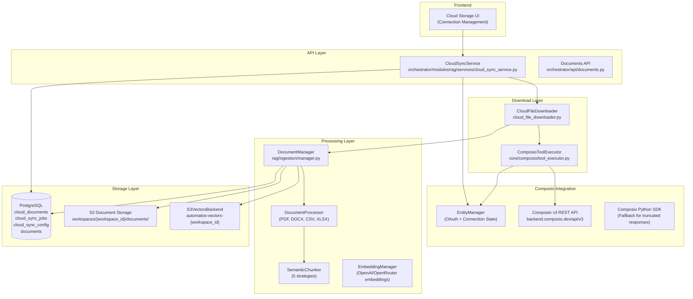
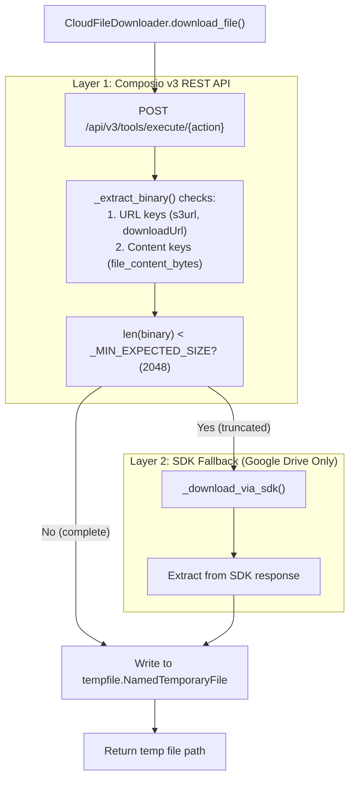
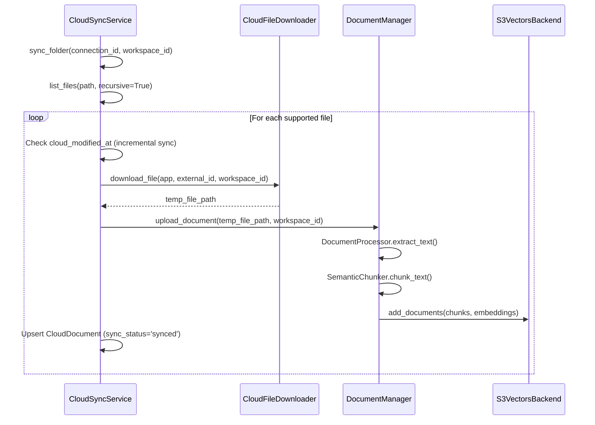

# Cloud Storage Integration

Relevant source files

The following files were used as context for generating this wiki page:

- [README.md](README.md)
- [docker-compose.yml](docker-compose.yml)
- [docs/README.md](docs/README.md)
- [frontend/.dockerignore](frontend/.dockerignore)
- [frontend/Dockerfile](frontend/Dockerfile)
- [orchestrator/Dockerfile](orchestrator/Dockerfile)
- [orchestrator/api/cloud_documents.py](orchestrator/api/cloud_documents.py)
- [orchestrator/api/knowledge_multimodal.py](orchestrator/api/knowledge_multimodal.py)
- [orchestrator/core/database/migrations/010_vector_dimensions_4096.sql](orchestrator/core/database/migrations/010_vector_dimensions_4096.sql)
- [orchestrator/core/models/cloud_sync.py](orchestrator/core/models/cloud_sync.py)
- [orchestrator/core/redis/client.py](orchestrator/core/redis/client.py)
- [orchestrator/modules/rag/chunking/semantic_chunker.py](orchestrator/modules/rag/chunking/semantic_chunker.py)
- [orchestrator/modules/rag/ingestion/manager.py](orchestrator/modules/rag/ingestion/manager.py)
- [orchestrator/modules/rag/services/cloud_file_downloader.py](orchestrator/modules/rag/services/cloud_file_downloader.py)
- [orchestrator/modules/rag/services/cloud_sync_service.py](orchestrator/modules/rag/services/cloud_sync_service.py)
- [orchestrator/modules/search/services/entity_extractor.py](orchestrator/modules/search/services/entity_extractor.py)
- [orchestrator/modules/search/vector_store/__init__.py](orchestrator/modules/search/vector_store/__init__.py)
- [orchestrator/modules/search/vector_store/backends/s3_vectors_backend.py](orchestrator/modules/search/vector_store/backends/s3_vectors_backend.py)
- [orchestrator/modules/tools/services/__init__.py](orchestrator/modules/tools/services/__init__.py)
- [orchestrator/requirements.txt](orchestrator/requirements.txt)
- [orchestrator/scripts/recreate_s3_index.py](orchestrator/scripts/recreate_s3_index.py)

## Purpose

This page documents Automatos AI's cloud storage integration system (PRD-42), which enables automatic syncing of documents from Google Drive, Dropbox, OneDrive, and Box into the RAG knowledge base. The system uses Composio for OAuth management and file access, downloads files from cloud providers, processes them through the multimodal ingestion pipeline, and stores vectors in a workspace-scoped S3 Vectors backend for semantic search.

For document upload and processing details, see [Document Management](7.1) and [Document Ingestion Pipeline](7.2). For RAG retrieval after documents are synced, see [RAG Retrieval System](7.4).

## System Architecture

The cloud storage integration consists of three layers: **Connection Layer** (Composio OAuth), **Download Layer** (multi-strategy file retrieval), and **Processing Layer** (ingestion + vector storage).

### Architecture Overview

**Sources:** [orchestrator/modules/rag/services/cloud_sync_service.py:38-54](), [orchestrator/modules/rag/services/cloud_file_downloader.py:60-71](), [orchestrator/modules/rag/ingestion/manager.py:113-130](), [orchestrator/modules/search/vector_store/backends/s3_vectors_backend.py:24-63]()

## Supported Cloud Providers

The system supports four cloud storage providers, each with Composio-mapped actions for listing and downloading files:

| Provider | List Action | Download Action | File ID Format | Notes |
|----------|-------------|-----------------|----------------|-------|
| **Google Drive** | `GOOGLEDRIVE_LIST_FILES` | `GOOGLEDRIVE_DOWNLOAD_FILE` | `fileId` | v3 API truncates inline content; SDK fallback used |
| **Dropbox** | `DROPBOX_LIST_FILES_IN_FOLDER` | `DROPBOX_READ_FILE` | `path` | Returns full content inline |
| **OneDrive** | `ONEDRIVE_LIST_FILES` | `ONEDRIVE_DOWNLOAD_FILE` | `path` | Returns full content inline |
| **Box** | `BOX_LIST_FOLDER_ITEMS` | `BOX_DOWNLOAD_FILE` | `id` | Returns full content inline |

**Sources:** [orchestrator/modules/rag/services/cloud_file_downloader.py:29-35](), [orchestrator/modules/rag/services/cloud_sync_service.py:29-35]()

## CloudFileDownloader: Multi-Layer Download Strategy

The `CloudFileDownloader` class addresses the Composio v3 API limitation where Google Drive inline content is truncated to ~500 bytes by using a prioritized extraction strategy and an SDK fallback.

### Download Logic Flow

**Sources:** [orchestrator/modules/rag/services/cloud_file_downloader.py:72-143](), [orchestrator/modules/rag/services/cloud_file_downloader.py:99-119]()

### Content Extraction Priority
The downloader retrieves data in this order:
1. **URL Keys**: `s3url`, `s3Url`, `downloadUrl`, `url`, etc. If present, the full file is downloaded via HTTP GET [orchestrator/modules/rag/services/cloud_file_downloader.py:49-54]().
2. **Content Keys**: `file_content_bytes`, `downloaded_file_content`, `content`, `file_content` [orchestrator/modules/rag/services/cloud_file_downloader.py:38-45]().
3. **Fallback**: If REST API returns truncated data (specifically for Google Drive), it triggers `_download_via_sdk` [orchestrator/modules/rag/services/cloud_file_downloader.py:99-119]().

**Sources:** [orchestrator/modules/rag/services/cloud_file_downloader.py:37-54](), [orchestrator/modules/rag/services/cloud_file_downloader.py:99-119]()

## CloudSyncService: Orchestration Layer

The `CloudSyncService` class orchestrates folder navigation, file listing, and automated sync operations. It tracks state in the `CloudDocument`, `CloudSyncConfig`, and `CloudSyncJob` models [orchestrator/modules/rag/services/cloud_sync_service.py:22-25]().

### Sync Process Flow

**Sources:** [orchestrator/modules/rag/services/cloud_sync_service.py:198-382](), [orchestrator/modules/rag/ingestion/manager.py:157-194](), [orchestrator/modules/search/vector_store/backends/s3_vectors_backend.py:177-181]()

## S3 Vectors Backend

Automatos AI uses a specialized S3 Vectors backend for long-term knowledge storage (PRD-42). Each workspace is isolated into its own S3 vector bucket [orchestrator/modules/search/vector_store/backends/s3_vectors_backend.py:8-10]().

### Implementation Details
- **Bucket Naming**: `automatos-vectors-{workspace_id}` (configured via `S3_VECTORS_BUCKET`) [orchestrator/modules/search/vector_store/backends/s3_vectors_backend.py:43-47]().
- **Index Name**: `documents-index` (configured via `S3_VECTORS_INDEX_NAME`) [orchestrator/modules/search/vector_store/backends/s3_vectors_backend.py:49]().
- **Dimensions**: Defaults to 4096 (Migration 010) to support models like `qwen/qwen3-embedding-8b` [orchestrator/core/database/migrations/010_vector_dimensions_4096.sql:1-14]().
- **Search Metric**: `COSINE` similarity [orchestrator/modules/search/vector_store/backends/s3_vectors_backend.py:9]().

**Sources:** [orchestrator/modules/search/vector_store/backends/s3_vectors_backend.py:8-10](), [orchestrator/modules/search/vector_store/backends/s3_vectors_backend.py:43-51](), [orchestrator/core/database/migrations/010_vector_dimensions_4096.sql:1-14]()

### Search and Indexing
The `S3VectorsBackend` implements the `search`, `add_documents`, and `delete_documents` methods. When searching, it converts S3 distance scores to similarity scores using `1.0 - score` [orchestrator/modules/search/vector_store/backends/s3_vectors_backend.py:151]().

**Sources:** [orchestrator/modules/search/vector_store/backends/s3_vectors_backend.py:123-168](), [orchestrator/modules/search/vector_store/backends/s3_vectors_backend.py:177-215]()

## Document Ingestion Pipeline

When a file is synced, it passes through the `DocumentProcessor` and `SemanticChunker`.

### Extraction Strategies
The `DocumentProcessor` detects file types using magic numbers and extensions [orchestrator/modules/rag/ingestion/manager.py:131-156]():
- **PDF**: Uses `pdfplumber` with a fallback to `PyPDF2` [orchestrator/modules/rag/ingestion/manager.py:157-194]().
- **DOCX**: Uses `python-docx` [orchestrator/modules/rag/ingestion/manager.py:196-204]().
- **Markdown/Code**: Uses specialized LangChain splitters [orchestrator/modules/rag/ingestion/manager.py:122-130]().
- **Tables**: Extraction from documents is handled by the `TableExtraction` logic [orchestrator/api/knowledge_multimodal.py:40]().

**Sources:** [orchestrator/modules/rag/ingestion/manager.py:131-156](), [orchestrator/modules/rag/ingestion/manager.py:157-194](), [orchestrator/modules/rag/ingestion/manager.py:196-204]()

### Semantic Chunking
The `SemanticChunker` supports multiple strategies (PRD-21):
- `SEMANTIC_SIMILARITY`: Uses embedding similarity between sentences.
- `INFORMATION_DENSITY`: Uses entropy calculations via `InformationTheory`.
- `TOPIC_COHERENCE`: Segments based on thematic shifts.

**Sources:** [orchestrator/modules/rag/chunking/semantic_chunker.py:22-28](), [orchestrator/modules/rag/chunking/semantic_chunker.py:107-152](), [orchestrator/modules/rag/chunking/semantic_chunker.py:154-180]()

## Performance & Scaling

### Incremental Sync
`CloudSyncService` avoids redundant processing by comparing the `modified_at` timestamp from the cloud provider against the `cloud_modified_at` field in the `CloudDocument` table [orchestrator/modules/rag/services/cloud_sync_service.py:319-322]().

**Sources:** [orchestrator/modules/rag/services/cloud_sync_service.py:319-322]()

### Deployment Configuration
The backend Dockerfile ensures all necessary system dependencies for document processing (Tesseract, Ghostscript, libmagic, libpango) are installed [orchestrator/Dockerfile:18-32]().

**Sources:** [orchestrator/Dockerfile:18-32]()

---