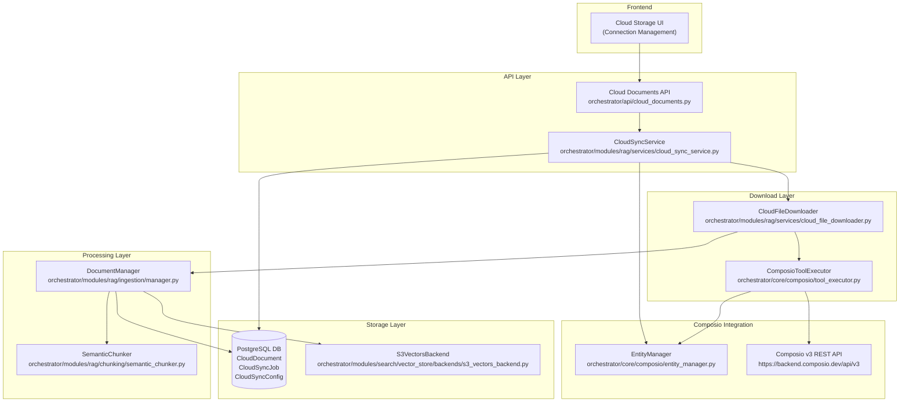
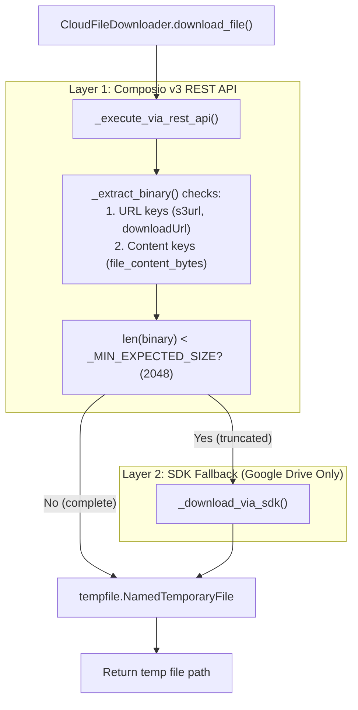
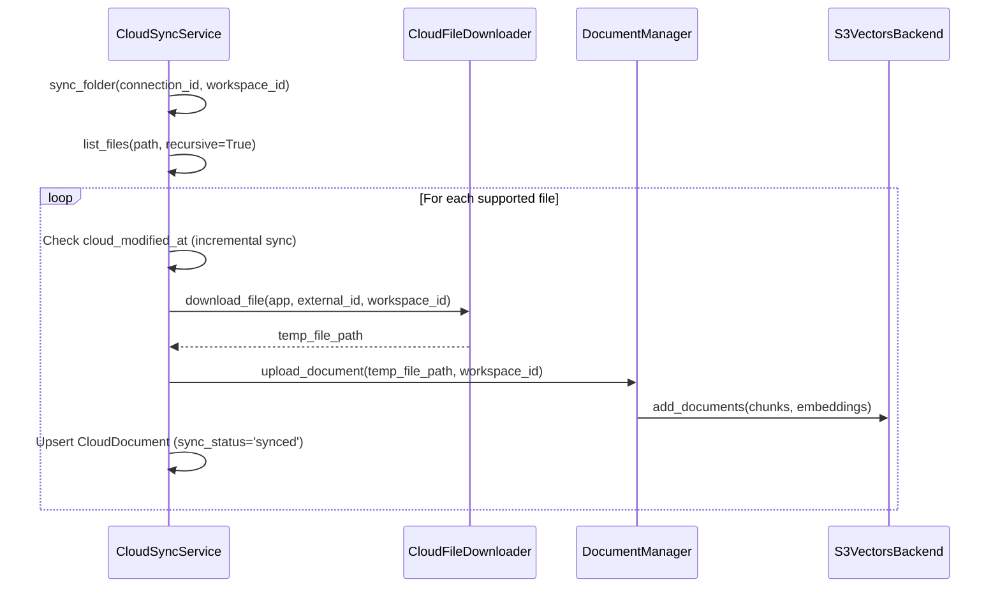

# Cloud Storage Integration

Relevant source files

The following files were used as context for generating this wiki page:

- [docker-compose.yml](docker-compose.yml)
- [frontend/.dockerignore](frontend/.dockerignore)
- [frontend/Dockerfile](frontend/Dockerfile)
- [orchestrator/Dockerfile](orchestrator/Dockerfile)
- [orchestrator/api/cloud_documents.py](orchestrator/api/cloud_documents.py)
- [orchestrator/core/database/migrations/010_vector_dimensions_4096.sql](orchestrator/core/database/migrations/010_vector_dimensions_4096.sql)
- [orchestrator/core/models/cloud_sync.py](orchestrator/core/models/cloud_sync.py)
- [orchestrator/core/redis/client.py](orchestrator/core/redis/client.py)
- [orchestrator/modules/search/vector_store/__init__.py](orchestrator/modules/search/vector_store/__init__.py)
- [orchestrator/modules/search/vector_store/backends/s3_vectors_backend.py](orchestrator/modules/search/vector_store/backends/s3_vectors_backend.py)
- [orchestrator/requirements.txt](orchestrator/requirements.txt)
- [orchestrator/scripts/recreate_s3_index.py](orchestrator/scripts/recreate_s3_index.py)

## Purpose

This page documents Automatos AI's cloud storage integration system (PRD-42), which enables automatic syncing of documents from Google Drive, Dropbox, OneDrive, and Box into the RAG knowledge base. The system uses Composio for OAuth management and file access, downloads files from cloud providers, processes them through the multimodal ingestion pipeline, and stores vectors in a workspace-scoped S3 Vectors backend for semantic search.

For document upload and processing details, see [Document Management](7.1) and [Document Ingestion Pipeline](7.2). For RAG retrieval after documents are synced, see [RAG Retrieval System](7.4).

## System Architecture

The cloud storage integration consists of three layers: **Connection Layer** (Composio OAuth), **Download Layer** (multi-strategy file retrieval), and **Processing Layer** (ingestion + vector storage).

### Architecture Overview

**Sources:** [orchestrator/api/cloud_documents.py:25-25](), [orchestrator/modules/search/vector_store/backends/s3_vectors_backend.py:24-63](), [orchestrator/core/models/cloud_sync.py:21-131]()

## Supported Cloud Providers

The system supports multiple cloud storage providers, identified via Composio app categories or known application names.

| Provider | List Action | Download Action | File ID Format |
|----------|-------------|-----------------|----------------|
| **GOOGLEDRIVE** | `GOOGLEDRIVE_LIST_FILES` | `GOOGLEDRIVE_DOWNLOAD_FILE` | `fileId` |
| **DROPBOX** | `DROPBOX_LIST_FILES_IN_FOLDER` | `DROPBOX_READ_FILE` | `path` |
| **ONEDRIVE** | `ONEDRIVE_LIST_FILES` | `ONEDRIVE_DOWNLOAD_FILE` | `path` |
| **BOX** | `BOX_LIST_FOLDER_ITEMS` | `BOX_DOWNLOAD_FILE` | `id` |

**Sources:** [orchestrator/api/cloud_documents.py:206-227](), [orchestrator/api/cloud_documents.py:185-201]()

## CloudFileDownloader: Multi-Layer Download Strategy

The `CloudFileDownloader` addresses API limitations (such as truncated inline content) by using a prioritized extraction strategy and an SDK fallback.

### Download Logic Flow

**Sources:** [orchestrator/api/cloud_documents.py:185-201]()

### Content Extraction Priority
The downloader retrieves data in this order:
1. **URL Keys**: `s3url`, `s3Url`, `downloadUrl`, `url`, `webContentLink`, `temporary_link`. If present, the full file is downloaded via HTTP GET.
2. **Content Keys**: `file_content_bytes`, `downloaded_file_content`, `content`, `file_content`.
3. **Fallback**: If REST API returns truncated data (specifically for Google Drive), it triggers an SDK-based download.

## CloudSyncService: Orchestration Layer

The `CloudSyncService` orchestrates folder navigation, file listing, and automated sync operations. It tracks state in the `CloudDocument`, `CloudSyncConfig`, and `CloudSyncJob` models.

### Sync Process Flow

**Sources:** [orchestrator/api/cloud_documents.py:25-106](), [orchestrator/modules/search/vector_store/backends/s3_vectors_backend.py:177-181](), [orchestrator/core/models/cloud_sync.py:46-97]()

## S3 Vectors Backend

Automatos AI uses a specialized S3 Vectors backend for long-term knowledge storage (PRD-42). Each workspace is isolated into its own S3 vector bucket.

### Implementation Details
- **Bucket Naming**: `automatos-vectors-{workspace_id}` (configured via `S3_VECTORS_BUCKET`). [orchestrator/modules/search/vector_store/backends/s3_vectors_backend.py:8-10](), [orchestrator/modules/search/vector_store/backends/s3_vectors_backend.py:46-47]()
- **Index Name**: `documents-index` (configured via `S3_VECTORS_INDEX_NAME`). [orchestrator/modules/search/vector_store/backends/s3_vectors_backend.py:49-49]()
- **Dimensions**: Upgraded to 4096 (Migration 010) to support models like `qwen/qwen3-embedding-8b`. [orchestrator/core/database/migrations/010_vector_dimensions_4096.sql:1-13](), [orchestrator/core/database/migrations/010_vector_dimensions_4096.sql:71-73]()
- **Search Metric**: `COSINE` similarity. [orchestrator/modules/search/vector_store/backends/s3_vectors_backend.py:35-35](), [orchestrator/modules/search/vector_store/backends/s3_vectors_backend.py:51-51]()

### Search and Indexing
The `S3VectorsBackend` implements `search`, `add_documents`, and `delete_documents`. When searching, it converts S3 distance scores to similarity scores using `1.0 - score`. [orchestrator/modules/search/vector_store/backends/s3_vectors_backend.py:123-168](), [orchestrator/modules/search/vector_store/backends/s3_vectors_backend.py:151-151]()

## Performance & Maintenance

### Incremental Sync
The system avoids redundant processing by comparing the `modified_at` timestamp from the cloud provider against the `cloud_modified_at` field in the `CloudDocument` table. [orchestrator/core/models/cloud_sync.py:86-88]()

### Index Recreation
The script `recreate_s3_index.py` allows administrators to delete and recreate the S3 Vectors index at a new dimension (e.g., when migrating from 1536d to 4096d). This is a destructive operation that wipes all existing vectors in the S3 backend. [orchestrator/scripts/recreate_s3_index.py:25-112](), [orchestrator/scripts/recreate_s3_index.py:67-72]()

### Infrastructure
The backend depends on `boto3` for S3 Vectors interaction and `pgvector` for local vector operations during ingestion. [orchestrator/requirements.txt:109-109](), [orchestrator/requirements.txt:11-11](), [orchestrator/Dockerfile:18-32]()

**Sources:** [orchestrator/core/database/migrations/010_vector_dimensions_4096.sql:1-14](), [orchestrator/scripts/recreate_s3_index.py:25-112](), [orchestrator/modules/search/vector_store/backends/s3_vectors_backend.py:65-106]()

---