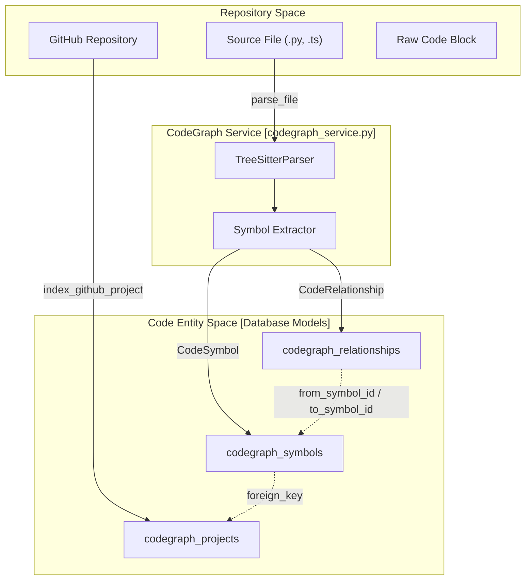
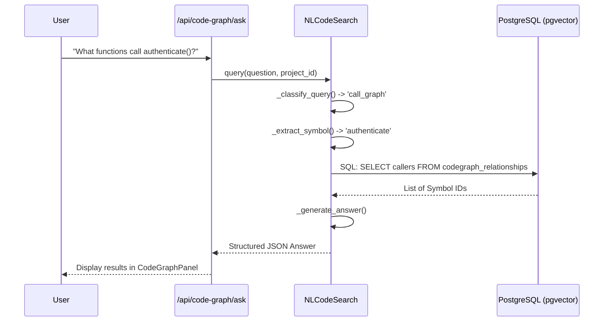

# CodeGraph — Code Repository Indexing

Relevant source files

The following files were used as context for generating this wiki page:

- [frontend/components/knowledge/CodeGraphPanel.tsx](frontend/components/knowledge/CodeGraphPanel.tsx)
- [frontend/components/knowledge/CodeGraphVisualization.tsx](frontend/components/knowledge/CodeGraphVisualization.tsx)
- [orchestrator/api/codegraph.py](orchestrator/api/codegraph.py)
- [orchestrator/api/system.py](orchestrator/api/system.py)
- [orchestrator/modules/codegraph/analysis/__init__.py](orchestrator/modules/codegraph/analysis/__init__.py)
- [orchestrator/modules/codegraph/analysis/architecture_analyzer.py](orchestrator/modules/codegraph/analysis/architecture_analyzer.py)
- [orchestrator/modules/codegraph/codegraph_service.py](orchestrator/modules/codegraph/codegraph_service.py)
- [orchestrator/modules/codegraph/ranking/__init__.py](orchestrator/modules/codegraph/ranking/__init__.py)
- [orchestrator/modules/codegraph/ranking/pagerank_ranker.py](orchestrator/modules/codegraph/ranking/pagerank_ranker.py)
- [orchestrator/modules/codegraph/search/__init__.py](orchestrator/modules/codegraph/search/__init__.py)
- [orchestrator/modules/codegraph/search/nl_code_search.py](orchestrator/modules/codegraph/search/nl_code_search.py)

The CodeGraph service provides a sophisticated system for indexing, analyzing, and searching code repositories. It bridges the gap between raw source code and semantic understanding by extracting code symbols (functions, classes, variables), building relationship graphs (calls, imports, inheritance), and enabling natural language queries over the codebase structure.

## Overview and Core Architecture

The `CodeGraphService` is the central orchestrator for repository indexing [orchestrator/modules/codegraph/codegraph_service.py:66-72](). It manages the lifecycle of a code project from initial cloning to symbol extraction and semantic embedding generation. The service utilizes a multi-layered parsing strategy, primarily leveraging tree-sitter for robust multi-language support (14+ languages) while maintaining legacy fallback parsers for basic Python and JavaScript support [orchestrator/modules/codegraph/codegraph_service.py:93-120]().

### Data Flow: From Repository to Graph

The indexing process follows a structured pipeline:
1.  **Cloning**: Shallow clones the GitHub repository into a temporary directory [orchestrator/modules/codegraph/codegraph_service.py:228-232]().
2.  **Parsing**: Iterates through files, skipping excluded patterns (e.g., `node_modules`, `.git`) [orchestrator/modules/codegraph/codegraph_service.py:270-285]().
3.  **Extraction**: Uses `TreeSitterParser` to identify `CodeSymbol` entities and `CodeRelationship` links [orchestrator/modules/codegraph/codegraph_service.py:34-60]().
4.  **Embedding**: Generates vector embeddings for each symbol using the centralized `embedding_manager` [orchestrator/modules/codegraph/codegraph_service.py:75-77]().
5.  **Storage**: Persists data into `codegraph_symbols` and `codegraph_relationships` tables, utilizing `EnhancedVectorStore` for semantic search capabilities [orchestrator/modules/codegraph/codegraph_service.py:80-88]().

### Code Entity Space Mapping
The following diagram illustrates how the system maps physical repository structures to the internal `CodeGraph` entity space.

**System Entity Mapping: Repository to CodeGraph**

Sources: [orchestrator/modules/codegraph/codegraph_service.py:33-65](), [orchestrator/modules/codegraph/codegraph_service.py:129-150]()

## Intelligent Search and Natural Language Interface

CodeGraph provides two primary search modalities: standard semantic search and structured Natural Language (NL) code search.

### NL Code Search Implementation
The `NLCodeSearch` class translates user questions into specific graph queries [orchestrator/modules/codegraph/search/nl_code_search.py:19-21](). It employs a pattern-matching strategy to classify the intent of a query into four categories:
*   **Call Graph**: Queries about invocations (e.g., "What calls X?") [orchestrator/modules/codegraph/search/nl_code_search.py:23-31]().
*   **Dependency**: Queries about imports and usage (e.g., "What depends on Y?") [orchestrator/modules/codegraph/search/nl_code_search.py:33-42]().
*   **Inheritance**: Queries about class hierarchies (e.g., "Who implements Z?") [orchestrator/modules/codegraph/search/nl_code_search.py:44-54]().
*   **Semantic Search**: General queries that fall back to vector similarity [orchestrator/modules/codegraph/search/nl_code_search.py:126]().

**Logic Flow: NL Question to Code Result**

Sources: [orchestrator/modules/codegraph/search/nl_code_search.py:59-109](), [orchestrator/api/codegraph.py:192-215]()

## Ranking and Architecture Analysis

To optimize LLM context and provide developer insights, CodeGraph includes advanced analysis modules.

### PageRank Importance Ranking
The `PageRankRanker` uses the `networkx` library to build a directed graph of symbol dependencies [orchestrator/modules/codegraph/ranking/pagerank_ranker.py:17-18](). By running the PageRank algorithm, it identifies the most "important" symbols—those referenced most frequently across the codebase [orchestrator/modules/codegraph/ranking/pagerank_ranker.py:65-73](). This allows the system to fit the most relevant code structure within a specific token budget for LLM prompts [orchestrator/modules/codegraph/ranking/pagerank_ranker.py:84-95]().

### Architecture Analyzer
The `ArchitectureAnalyzer` identifies structural patterns such as:
*   **Communities**: Using Louvain community detection to find modular clusters [orchestrator/modules/codegraph/analysis/architecture_analyzer.py:122-133]().
*   **Hotspots**: Identifying high-risk nodes with high fan-out and high betweenness centrality [orchestrator/modules/codegraph/analysis/architecture_analyzer.py:190-205]().
*   **Cycles**: Detecting circular dependencies that may indicate architectural debt [orchestrator/modules/codegraph/analysis/architecture_analyzer.py:69]().

Sources: [orchestrator/modules/codegraph/ranking/pagerank_ranker.py:1-44](), [orchestrator/modules/codegraph/analysis/architecture_analyzer.py:31-81]()

## API Reference and Frontend Visualization

### Key Endpoints
The CodeGraph API is served via `/api/code-graph` [orchestrator/api/codegraph.py:24]().

| Endpoint | Method | Description |
| :--- | :--- | :--- |
| `/index/github` | POST | Trigger background indexing of a repository [orchestrator/api/codegraph.py:112]() |
| `/projects` | GET | List all indexed projects in the current workspace [orchestrator/api/codegraph.py:240]() |
| `/search/semantic` | GET | Semantic search using vector embeddings [orchestrator/api/codegraph.py:284]() |
| `/ask` | POST | Natural language query interface [orchestrator/api/codegraph.py:382]() |
| `/architecture/{id}` | GET | Retrieve architectural metrics and clusters [orchestrator/api/codegraph.py:446]() |

### CodeGraphPanel Visualization
The frontend provides a rich interactive interface through the `CodeGraphPanel` and `CodeGraphVisualization` components [frontend/components/knowledge/CodeGraphPanel.tsx:49](). It uses `reactflow` to render the symbol relationship graph [frontend/components/knowledge/CodeGraphVisualization.tsx:5-15]().

Features include:
*   **View Modes**: Toggle between 'default', 'clusters', and 'heatmap' (risk-based) [frontend/components/knowledge/CodeGraphVisualization.tsx:97]().
*   **Relationship Depth**: Control the traversal depth of the call graph [frontend/components/knowledge/CodeGraphVisualization.tsx:92]().
*   **Code Preview**: Integrated panel to view code snippets of selected symbols [frontend/components/knowledge/CodeGraphVisualization.tsx:101-103]().

Sources: [orchestrator/api/codegraph.py:24-55](), [frontend/components/knowledge/CodeGraphVisualization.tsx:86-113](), [frontend/components/knowledge/CodeGraphPanel.tsx:162-197]()

---