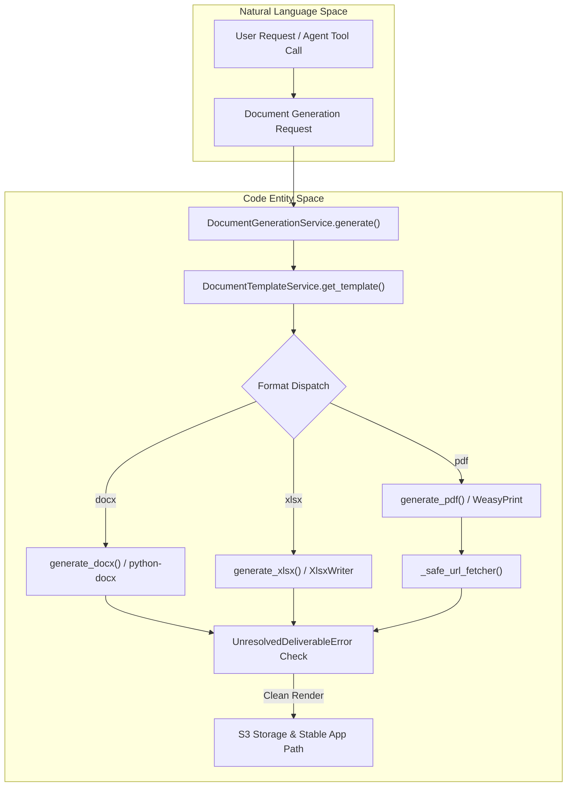
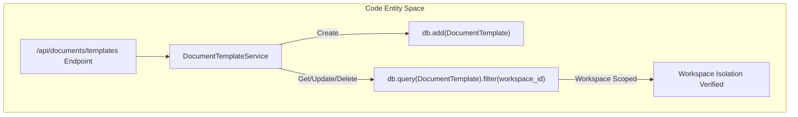
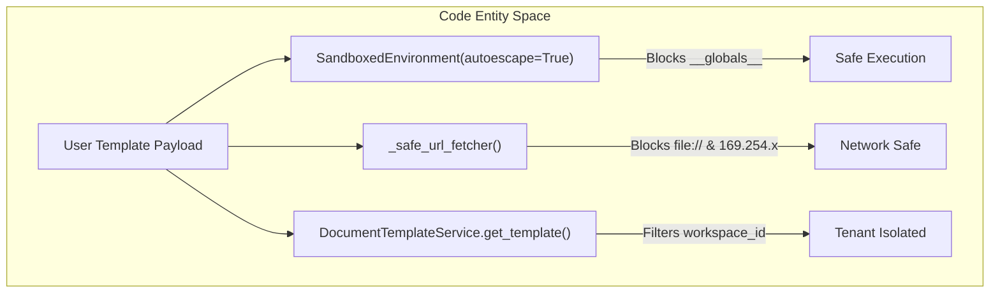
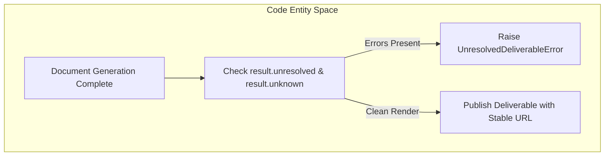

# Document Generation & Deliverables Rendering

Relevant source files

The following files were used as context for generating this wiki page:

- [orchestrator/api/document_generation.py](orchestrator/api/document_generation.py)
- [orchestrator/modules/documents/generation_service.py](orchestrator/modules/documents/generation_service.py)
- [orchestrator/modules/documents/models.py](orchestrator/modules/documents/models.py)
- [orchestrator/modules/documents/seed_templates.py](orchestrator/modules/documents/seed_templates.py)
- [orchestrator/modules/documents/template_service.py](orchestrator/modules/documents/template_service.py)
- [orchestrator/modules/documents/templates/basic_report.html](orchestrator/modules/documents/templates/basic_report.html)
- [orchestrator/modules/documents/templates/executive_summary.html](orchestrator/modules/documents/templates/executive_summary.html)
- [orchestrator/modules/documents/templates/invoice.html](orchestrator/modules/documents/templates/invoice.html)
- [orchestrator/tests/security/test_template_security.py](orchestrator/tests/security/test_template_security.py)
- [orchestrator/tests/test_prd190_deliverables.py](orchestrator/tests/test_prd190_deliverables.py)

This section documents the document generation and deliverables rendering subsystem of Automatos AI. It covers the core generation service (`DocumentGenerationService`), template CRUD operations (`DocumentTemplateService`), built-in professional HTML/CSS templates, rendering engines (WeasyPrint/Gotenberg), security hardening against SSTI, SSRF, and IDOR vulnerabilities, and the strict finalization gates that prevent unresolved deliverables from reaching users.

---

## 1. Document Generation Service Architecture

The document generation pipeline is anchored by `DocumentGenerationService`, which accepts structured data and templates, renders them into PDF, DOCX, or XLSX formats, persists output files locally or in S3, and enforces strict finalization checks.

*Sources: [orchestrator/modules/documents/generation_service.py:85-169](), [orchestrator/modules/documents/template_service.py:17-61]()*

`DocumentGenerationService` coordinates template resolution, normalizes section keys, and invokes format-specific renderers [orchestrator/modules/documents/generation_service.py:100-149](). If template rendering results in missing or unknown variables, generation fails fast via `UnresolvedDeliverableError` [orchestrator/modules/documents/generation_service.py:157-164]().

Sources:
- [orchestrator/modules/documents/generation_service.py:85-169]()
- [orchestrator/modules/documents/template_service.py:17-61]()

---

## 2. Template Management & CRUD

Templates are managed via `DocumentTemplateService`, exposing CRUD operations that enforce workspace scoping to prevent cross-tenant data leaks [orchestrator/modules/documents/template_service.py:17-127](). REST endpoints are exposed under `/api/documents/templates` [orchestrator/api/document_generation.py:27-201]().

*Sources: [orchestrator/api/document_generation.py:116-180](), [orchestrator/modules/documents/template_service.py:23-127]()*

The request lifecycle for creating templates validates block schemas up-front and returns HTTP 422 errors on validation failures rather than silently swallowing errors [orchestrator/api/document_generation.py:98-142]().

Sources:
- [orchestrator/api/document_generation.py:36-149]()
- [orchestrator/modules/documents/template_service.py:17-127]()

---

## 3. Built-in HTML Templates & Rendering

Built-in starter templates are seeded into the database for immediate professional use, supporting reports, invoices, and executive summaries [orchestrator/modules/documents/seed_templates.py:1-142]().

| Template Name | Format | Category | Description |
| :--- | :--- | :--- | :--- |
| **Basic Report** | PDF | report | General-purpose report featuring section dividers, metrics cards, and header styling [orchestrator/modules/documents/seed_templates.py:18-57]() |
| **Invoice** | PDF | invoice | Professional invoice structure including bill-to blocks, line item tables, and calculated totals [orchestrator/modules/documents/seed_templates.py:58-112]() |
| **Executive Summary** | PDF | report | Executive summary layout with highlight lists, metrics grid, and numbered recommendations [orchestrator/modules/documents/seed_templates.py:113-142]() |

HTML templates leverage Jinja2 syntax referencing brand variables (`brand.primary_color`, `brand.accent_color`) and structured data payloads [orchestrator/modules/documents/templates/basic_report.html:1-52](), [orchestrator/modules/documents/templates/invoice.html:1-79](), [orchestrator/modules/documents/templates/executive_summary.html:1-74]().

Sources:
- [orchestrator/modules/documents/seed_templates.py:1-142]()
- [orchestrator/modules/documents/templates/basic_report.html:1-52]()
- [orchestrator/modules/documents/templates/invoice.html:1-79]()
- [orchestrator/modules/documents/templates/executive_summary.html:1-74]()

---

## 4. Template Security: SSTI, SSRF & IDOR Hardening

The document rendering subsystem includes strict security guardrails against Server-Side Template Injection (SSTI), Server-Side Request Forgery (SSRF), and Insecure Direct Object References (IDOR) [orchestrator/tests/security/test_template_security.py:1-100]().

*Sources: [orchestrator/modules/documents/generation_service.py:31-57,94](), [orchestrator/modules/documents/template_service.py:63-74](), [orchestrator/tests/security/test_template_security.py:40-100]()*

- **SSTI Mitigation**: Jinja2 rendering uses `SandboxedEnvironment(autoescape=True)` which intercepts attempts to traverse class hierarchies via `__globals__` and raises `SecurityError` [orchestrator/modules/documents/generation_service.py:94](), [orchestrator/tests/security/test_template_security.py:40-48]().
- **SSRF Mitigation**: WeasyPrint's URL fetcher is wrapped by `_safe_url_fetcher` to block `file://` schemes, loopback interfaces (`127.0.0.1`), private networks (`10.x`), and cloud metadata services (`169.254.169.254`) [orchestrator/modules/documents/generation_service.py:31-57](), [orchestrator/tests/security/test_template_security.py:57-72]().
- **IDOR Mitigation**: Template lookup queries explicitly filter by `workspace_id`, ensuring callers cannot access or modify resources belonging to other tenants [orchestrator/modules/documents/template_service.py:63-74](), [orchestrator/tests/security/test_template_security.py:76-100]().

Sources:
- [orchestrator/modules/documents/generation_service.py:31-57,94]()
- [orchestrator/modules/documents/template_service.py:63-74]()
- [orchestrator/tests/security/test_template_security.py:1-100]()

---

## 5. Deliverables & Finalization Gate

To prevent client-facing artifacts from containing raw placeholder strings (e.g., `[[variable]]`), `DocumentGenerationService.generate()` runs a finalization validation check [orchestrator/modules/documents/generation_service.py:151-164]().

*Sources: [orchestrator/modules/documents/generation_service.py:151-168](), [orchestrator/modules/documents/models.py:9-32]()*

- **Unresolved Deliverables**: If required variables resolve empty or contain unknown schema paths, `UnresolvedDeliverableError` is raised, blocking the deliverable from being published [orchestrator/modules/documents/generation_service.py:157-164](), [orchestrator/modules/documents/models.py:9-32]().
- **Stable URLs**: Persisted deliverables record stable internal paths (`/api/documents/generated/{filename}`) rather than expiring pre-signed S3 links, avoiding link-rot in client UI applications [orchestrator/tests/test_prd190_deliverables.py:128-176]().

Sources:
- [orchestrator/modules/documents/generation_service.py:151-168]()
- [orchestrator/modules/documents/models.py:9-54]()
- [orchestrator/tests/test_prd190_deliverables.py:1-177]()

---