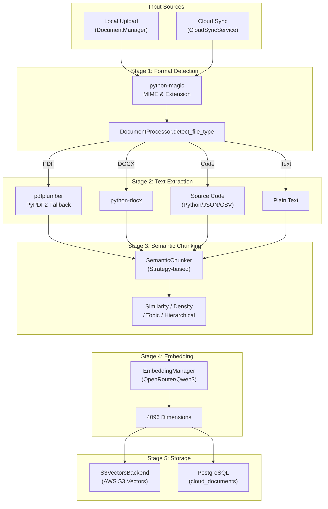
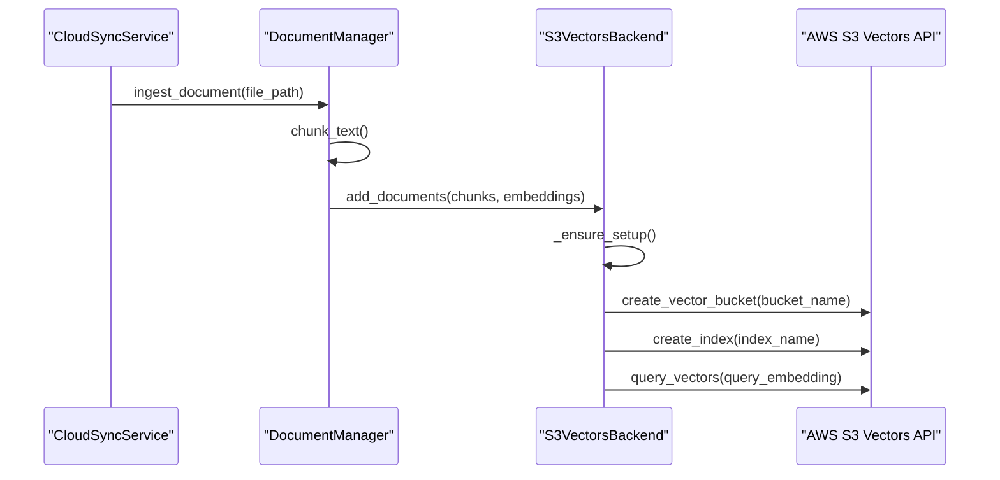

# Document Ingestion Pipeline

Relevant source files

The following files were used as context for generating this wiki page:

- [frontend/components/documents/document-management.tsx](frontend/components/documents/document-management.tsx)
- [frontend/components/documents/local-storage-browser.tsx](frontend/components/documents/local-storage-browser.tsx)
- [orchestrator/api/documents.py](orchestrator/api/documents.py)
- [orchestrator/api/knowledge_multimodal.py](orchestrator/api/knowledge_multimodal.py)
- [orchestrator/api/widgets/docs.py](orchestrator/api/widgets/docs.py)
- [orchestrator/core/database/migrations/010_vector_dimensions_4096.sql](orchestrator/core/database/migrations/010_vector_dimensions_4096.sql)
- [orchestrator/core/models/cloud_sync.py](orchestrator/core/models/cloud_sync.py)
- [orchestrator/core/team_access.py](orchestrator/core/team_access.py)
- [orchestrator/modules/agents/services/agent_platform_tools.py](orchestrator/modules/agents/services/agent_platform_tools.py)
- [orchestrator/modules/rag/chunking/semantic_chunker.py](orchestrator/modules/rag/chunking/semantic_chunker.py)
- [orchestrator/modules/rag/ingestion/manager.py](orchestrator/modules/rag/ingestion/manager.py)
- [orchestrator/modules/rag/service.py](orchestrator/modules/rag/service.py)
- [orchestrator/modules/rag/services/cloud_file_downloader.py](orchestrator/modules/rag/services/cloud_file_downloader.py)
- [orchestrator/modules/rag/services/cloud_sync_service.py](orchestrator/modules/rag/services/cloud_sync_service.py)
- [orchestrator/modules/search/services/entity_extractor.py](orchestrator/modules/search/services/entity_extractor.py)
- [orchestrator/modules/search/vector_store/__init__.py](orchestrator/modules/search/vector_store/__init__.py)
- [orchestrator/modules/search/vector_store/backends/s3_vectors_backend.py](orchestrator/modules/search/vector_store/backends/s3_vectors_backend.py)
- [orchestrator/modules/tools/formatting/result_formatter.py](orchestrator/modules/tools/formatting/result_formatter.py)
- [orchestrator/scripts/recreate_s3_index.py](orchestrator/scripts/recreate_s3_index.py)

## Purpose and Scope

The Document Ingestion Pipeline transforms raw documents from multiple sources into searchable, semantically-indexed content that agents can query through RAG (Retrieval-Augmented Generation). This pipeline handles text extraction, chunking, embedding generation, and storage in high-performance vector databases.

The system supports local file uploads via `DocumentManager` [orchestrator/modules/rag/ingestion/manager.py:81]() and automated synchronization with cloud providers (Google Drive, Dropbox, OneDrive, Box) via the `CloudSyncService` and `Composio` integration layer [orchestrator/modules/rag/services/cloud_file_downloader.py:29-35]().

---

## Pipeline Architecture

The ingestion pipeline consists of five sequential stages: **source retrieval → format detection → text extraction → semantic chunking → embedding & storage**.

### System Data Flow
This diagram illustrates the flow from raw data to the "Code Entity Space" where specific services process the information.

**Sources:** [orchestrator/modules/rag/ingestion/manager.py:6-12](), [orchestrator/modules/rag/services/cloud_sync_service.py:5-9](), [orchestrator/modules/rag/service.py:187-195]()

---

## Stage 1: Format Detection

The `DocumentProcessor` uses `python-magic` and file extensions to categorize documents into `DocumentType` enums [orchestrator/modules/rag/ingestion/manager.py:131-155]().

| Format | DocumentType | Detection Method |
|--------|--------------|------------------|
| PDF | `PDF` | `application/pdf` or `.pdf` [orchestrator/modules/rag/ingestion/manager.py:137-138]() |
| Word | `DOCX` | OpenXML MIME or `.docx` [orchestrator/modules/rag/ingestion/manager.py:139-140]() |
| Markdown | `MARKDOWN` | `.md`, `.markdown` [orchestrator/modules/rag/ingestion/manager.py:141-142]() |
| Python | `PYTHON` | `.py` [orchestrator/modules/rag/ingestion/manager.py:143-144]() |
| Spreadsheet | `XLSX` / `CSV` | OpenXML Spreadsheet / `text/csv` [orchestrator/modules/rag/ingestion/manager.py:147-150]() |

**Sources:** [orchestrator/modules/rag/ingestion/manager.py:62-71](), [orchestrator/modules/rag/ingestion/manager.py:131-155]()

---

## Stage 2: Text Extraction

Extraction is handled by the `DocumentProcessor` with specific logic for each format to ensure high-fidelity text recovery.

### PDF Extraction
The system uses a prioritized dual-parser approach [orchestrator/modules/rag/ingestion/manager.py:157-194]():
1.  **pdfplumber**: Primary extractor used for high-quality text and layout preservation. It includes cleaning logic to remove null characters and fix double-character extraction artifacts [orchestrator/modules/rag/ingestion/manager.py:162-171]().
2.  **PyPDF2**: Fallback parser used if `pdfplumber` fails to initialize or extract content [orchestrator/modules/rag/ingestion/manager.py:178-186]().

### DOCX & Code Extraction
-   **DOCX**: Uses `python-docx` to iterate through paragraph objects [orchestrator/modules/rag/ingestion/manager.py:196-203]().
-   **Code/Structured**: Specialized handling for `.py`, `.json`, and `.csv` files to preserve structural semantics [orchestrator/modules/rag/ingestion/manager.py:143-150]().

---

## Stage 3: Semantic Chunking

Unlike basic character-count splitters, the `SemanticChunker` implements multiple advanced strategies to preserve context boundaries [orchestrator/modules/rag/service.py:187-195]().

### Chunking Strategies
The `SemanticChunker` (imported in [orchestrator/modules/rag/ingestion/manager.py:45]()) supports:
- **Adaptive**: Dynamically adjusts based on content density.
- **Hierarchical**: Preserves document structure (H1, H2, H3) to maintain parent-child context.
- **Similarity**: Groups sentences based on embedding proximity.

### Context Expansion
Chunks are enriched with `parent_content` and `headers` metadata to allow for context expansion during retrieval [orchestrator/modules/rag/ingestion/manager.py:100-101]().

**Sources:** [orchestrator/modules/rag/ingestion/manager.py:94-111](), [orchestrator/modules/rag/service.py:187-195]()

---

## Stage 4: Embedding Generation

The pipeline has been migrated to a high-dimension embedding standard (4096 dimensions) using OpenRouter's Qwen3-8B model [orchestrator/core/database/migrations/010_vector_dimensions_4096.sql:11-13]().

-   **Provider**: `openrouter` [orchestrator/core/database/migrations/010_vector_dimensions_4096.sql:76-77]()
-   **Model**: `qwen/qwen3-embedding-8b` [orchestrator/core/database/migrations/010_vector_dimensions_4096.sql:79-80]()
-   **Dimension**: `4096` [orchestrator/core/database/migrations/010_vector_dimensions_4096.sql:71-73]()

---

## Stage 5: Vector Storage (S3 Vectors)

The system utilizes `S3VectorsBackend` for large-scale document storage. Each workspace receives its own isolated bucket: `automatos-vectors-{workspace_id}` [orchestrator/modules/search/vector_store/backends/s3_vectors_backend.py:8-9]().

### Storage Logic and Entity Association
This diagram bridges the Natural Language concept of "Cloud Sync" to the specific code entities that handle the vector storage.

**Sources:** [orchestrator/modules/search/vector_store/backends/s3_vectors_backend.py:24-37](), [orchestrator/modules/search/vector_store/backends/s3_vectors_backend.py:177-181]()

---

## Cloud Sync Orchestration

The `CloudSyncService` manages the lifecycle of documents from external providers like Google Drive [orchestrator/modules/rag/services/cloud_sync_service.py:38-48]().

### Download Layers
The `CloudFileDownloader` implements a two-layer strategy to handle provider-specific limitations [orchestrator/modules/rag/services/cloud_file_downloader.py:60-66]():
1.  **Layer 1 (REST API)**: Primary method for Dropbox, OneDrive, and Box using the `Composio` v3 API [orchestrator/modules/rag/services/cloud_file_downloader.py:95-96]().
2.  **Layer 2 (SDK Fallback)**: Specifically for Google Drive, which often truncates REST API content. The SDK saves the full file to the container disk [orchestrator/modules/rag/services/cloud_file_downloader.py:99-107]().

### Sync Metadata Tracking
The `CloudDocument` model tracks the relationship between cloud IDs and the internal vector store [orchestrator/modules/rag/services/cloud_sync_service.py:167-177]().

| Field | Purpose |
|-------|---------|
| `external_file_id` | Unique ID from provider (e.g., Google Drive ID) [orchestrator/modules/rag/services/cloud_sync_service.py:168](). |
| `sync_status` | Status of ingestion (`pending`, `syncing`, `synced`, `error`) [orchestrator/modules/rag/services/cloud_sync_service.py:183](). |
| `chunk_count` | Number of chunks generated from the document [orchestrator/modules/rag/services/cloud_sync_service.py:184](). |

**Sources:** [orchestrator/modules/rag/services/cloud_sync_service.py:167-192](), [orchestrator/modules/rag/services/cloud_file_downloader.py:60-143]()

---

## Team-Scoped Retrieval

Document access is governed by the `team_access` system, ensuring that agents only retrieve information relevant to their assigned team [orchestrator/api/widgets/docs.py:5-8]().

- **Filtering**: All queries to the `documents` table apply a `TEAM_FILTER_CLAUSE` [orchestrator/api/widgets/docs.py:72-80]().
- **Search**: The `/api/widgets/docs/search` endpoint performs ILIKE matching on titles and content while enforcing workspace and team isolation [orchestrator/api/widgets/docs.py:87-116]().
- **Result Formatting**: The `ToolResultFormatter` cleans filenames and extracts snippets for consistent display in the UI [orchestrator/modules/tools/formatting/result_formatter.py:18-67]().

**Sources:** [orchestrator/api/widgets/docs.py:87-128](), [orchestrator/modules/tools/formatting/result_formatter.py:18-67]()

---