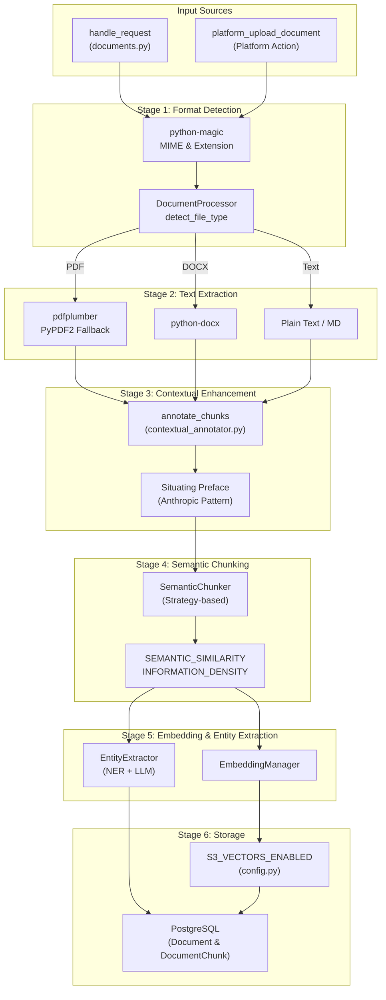
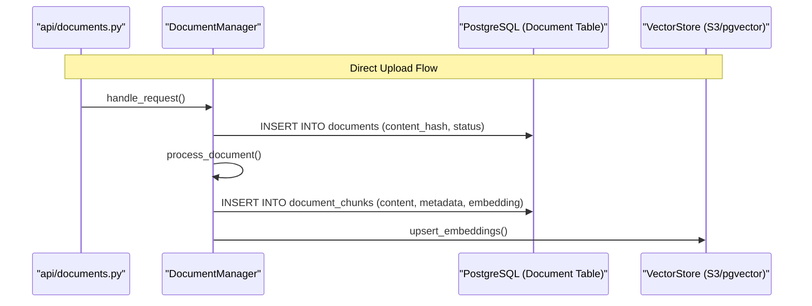

# Document Ingestion Pipeline

Relevant source files

The following files were used as context for generating this wiki page:

- [orchestrator/api/context.py](orchestrator/api/context.py)
- [orchestrator/api/documents.py](orchestrator/api/documents.py)
- [orchestrator/api/github_webhooks.py](orchestrator/api/github_webhooks.py)
- [orchestrator/api/system.py](orchestrator/api/system.py)
- [orchestrator/modules/rag/ingestion/contextual_annotator.py](orchestrator/modules/rag/ingestion/contextual_annotator.py)
- [orchestrator/modules/rag/ingestion/manager.py](orchestrator/modules/rag/ingestion/manager.py)
- [orchestrator/modules/rag/service.py](orchestrator/modules/rag/service.py)
- [orchestrator/modules/search/services/entity_extractor.py](orchestrator/modules/search/services/entity_extractor.py)
- [orchestrator/tests/security/test_s5_closures.py](orchestrator/tests/security/test_s5_closures.py)
- [orchestrator/tests/test_entity_extractor_no_vendor_key.py](orchestrator/tests/test_entity_extractor_no_vendor_key.py)
- [orchestrator/tests/test_p2w1_contextual_annotations.py](orchestrator/tests/test_p2w1_contextual_annotations.py)

## Purpose and Scope

The Document Ingestion Pipeline transforms raw documents from multiple sources into searchable, semantically-indexed content that agents can query through RAG (Retrieval-Augmented Generation). This pipeline handles text extraction, chunking, situating context (annotation), embedding generation, and storage in high-performance vector databases.

The system supports local file uploads via the `DocumentManager` [orchestrator/modules/rag/ingestion/manager.py:77-87](), automated synchronization with cloud providers via `CloudSyncService`, and advanced multimodal extraction.

Sources: [orchestrator/modules/rag/ingestion/manager.py:77-87]()

---

## Pipeline Architecture

The ingestion pipeline consists of six sequential stages: **source retrieval → format detection → text extraction → contextual annotation → semantic chunking → embedding & storage**.

### System Data Flow
This diagram illustrates the flow from raw data to the "Code Entity Space" where specific services process the information.

Sources: [orchestrator/api/documents.py:111-122](), [orchestrator/modules/rag/ingestion/manager.py:113-130](), [orchestrator/modules/rag/ingestion/contextual_annotator.py:111-136]()

---

## Stage 1: Format Detection

The `DocumentProcessor` uses `python-magic` and file extensions to categorize documents into `DocumentType` enums [orchestrator/modules/rag/ingestion/manager.py:131-155](). The API layer enforces a strict `ALLOWED_MIME_TYPES` allowlist [orchestrator/api/documents.py:89-105]().

| Format | DocumentType | Detection Method |
|--------|--------------|------------------|
| PDF | `PDF` | `application/pdf` or `.pdf` |
| Word | `DOCX` | OpenXML MIME or `.docx` |
| Markdown | `MARKDOWN` | `.md`, `.markdown` |
| Python | `PYTHON` | `.py` |
| Spreadsheet | `XLSX` / `CSV` | OpenXML Spreadsheet / `text/csv` |

Sources: [orchestrator/modules/rag/ingestion/manager.py:62-71](), [orchestrator/api/documents.py:89-104]()

---

## Stage 2: Text Extraction

Extraction is handled by the `DocumentProcessor` with specific logic for each format.

### PDF Extraction
The system uses a prioritized dual-parser approach [orchestrator/modules/rag/ingestion/manager.py:157-194]():
1.  **pdfplumber**: Primary extractor. Includes cleaning logic to remove null characters and fix double-character artifacts [orchestrator/modules/rag/ingestion/manager.py:162-171]().
2.  **PyPDF2**: Fallback parser used if `pdfplumber` fails [orchestrator/modules/rag/ingestion/manager.py:178-186]().

### DOCX and Text
- **DOCX**: Uses `python-docx` to iterate through paragraphs [orchestrator/modules/rag/ingestion/manager.py:196-203]().
- **Text/MD**: Direct read with encoding detection.

Sources: [orchestrator/modules/rag/ingestion/manager.py:157-194]()

---

## Stage 3: Contextual Annotation

Implemented in `contextual_annotator.py`, this stage prepends a ~50-100 token situating preface to each chunk before embedding [orchestrator/modules/rag/ingestion/contextual_annotator.py:3-9]().

- **Mechanism**: A cheap LLM reads the `parent_text` and the `chunk_text` to generate context [orchestrator/modules/rag/ingestion/contextual_annotator.py:51-58]().
- **Persistence**: The annotation is stored in `DocumentChunk.metadata` under the `contextual_annotation` key [orchestrator/modules/rag/ingestion/contextual_annotator.py:36-37]().
- **Robustness**: If annotation fails, the system logs a warning and falls back to raw text, ensuring ingestion completes [orchestrator/modules/rag/ingestion/contextual_annotator.py:90-95]().

Sources: [orchestrator/modules/rag/ingestion/contextual_annotator.py:76-109](), [orchestrator/tests/test_p2w1_contextual_annotations.py:65-83]()

---

## Stage 4: Semantic Chunking

The `SemanticChunker` splits documents based on mathematical optimization and structural boundaries [orchestrator/modules/rag/chunking/semantic_chunker.py:52-70]().

### Chunking Strategies
| Strategy | Implementation Logic |
|----------|----------------------|
| `SEMANTIC_SIMILARITY` | Groups sentences based on cosine similarity thresholds using `VectorOperations`. |
| `INFORMATION_DENSITY` | Uses `InformationTheory` to finalize chunks when entropy reaches a threshold. |
| `HIERARCHICAL` | Preserves document structure (h1, h2, h3) in `DocumentChunk.headers` [orchestrator/modules/rag/ingestion/manager.py:101](). |

Sources: [orchestrator/modules/rag/ingestion/manager.py:94-111](), [orchestrator/modules/rag/service.py:7-9]()

---

## Stage 5: Embedding and Entity Extraction

- **Embedding Generation**: Managed by `DocumentManager`. Vectors are generated for the *annotated* content, ensuring the vector representation includes the situating context [orchestrator/modules/rag/ingestion/contextual_annotator.py:5-6]().
- **Entity Extraction**: The `EntityExtractor` uses a hybrid approach of regex patterns [orchestrator/modules/search/services/entity_extractor.py:90-121]() and LLM analysis [orchestrator/modules/search/services/entity_extractor.py:123-146]() to identify technologies, organizations, and concepts for the Knowledge Graph.

Sources: [orchestrator/modules/search/services/entity_extractor.py:90-146]()

---

## Stage 6: Storage and Vector Databases

The system utilizes PostgreSQL for metadata and pluggable vector backends (pgvector or S3).

### Storage Entity Association
This diagram bridges the Natural Language concept of "Knowledge Storage" to specific code entities.

Sources: [orchestrator/api/documents.py:158-170](), [orchestrator/modules/rag/ingestion/manager.py:94-111](), [orchestrator/tests/security/test_s5_closures.py:34-42]()

---

## Security and Multi-Tenancy

- **Workspace Scoping**: Every `DocumentManager` instance is initialized with a `workspace_id` [orchestrator/api/documents.py:78-87]().
- **Content Access**: The `GET /api/documents/content` route requires `RequestContext` to ensure users only access documents within their authorized workspace [orchestrator/api/documents.py:21-24]().
- **Analytics Isolation**: `document_usage` tracking attributes every read/write to a `workspace_id` in the metadata JSONB [orchestrator/tests/security/test_s5_closures.py:34-50]().

Sources: [orchestrator/api/documents.py:111-113](), [orchestrator/api/context.py:94-100]()

---