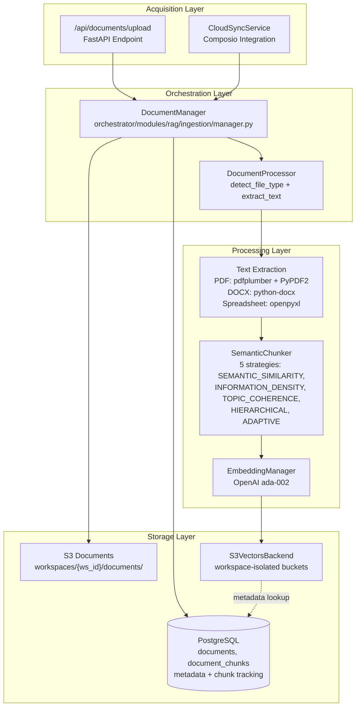
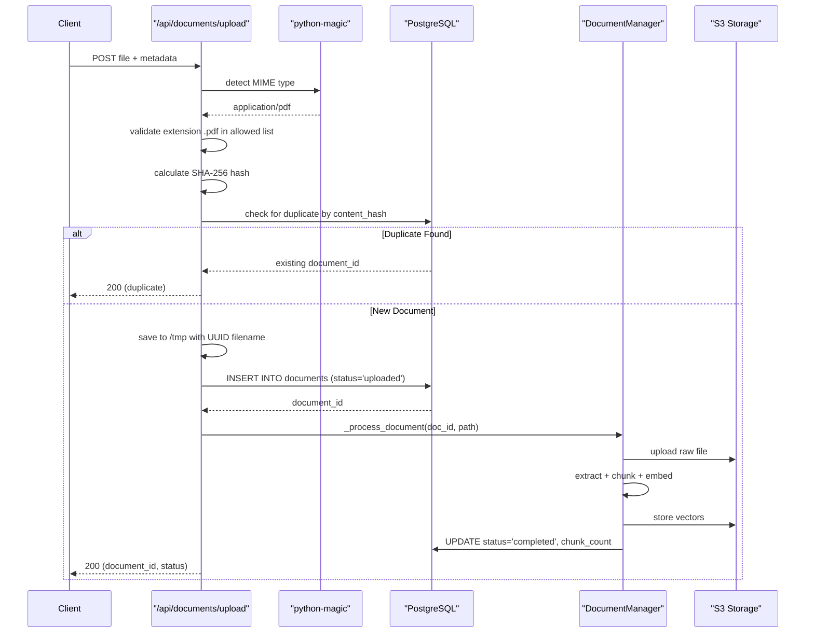
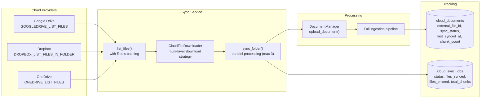
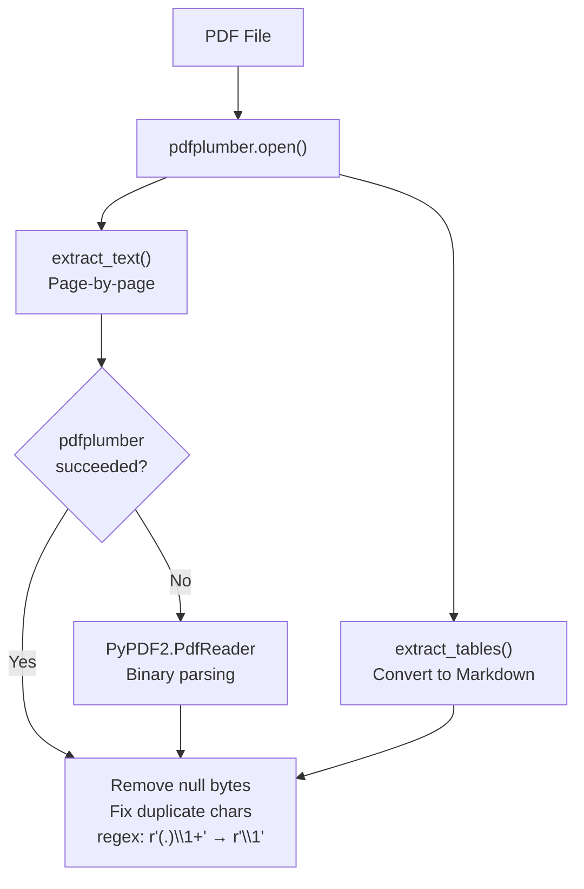
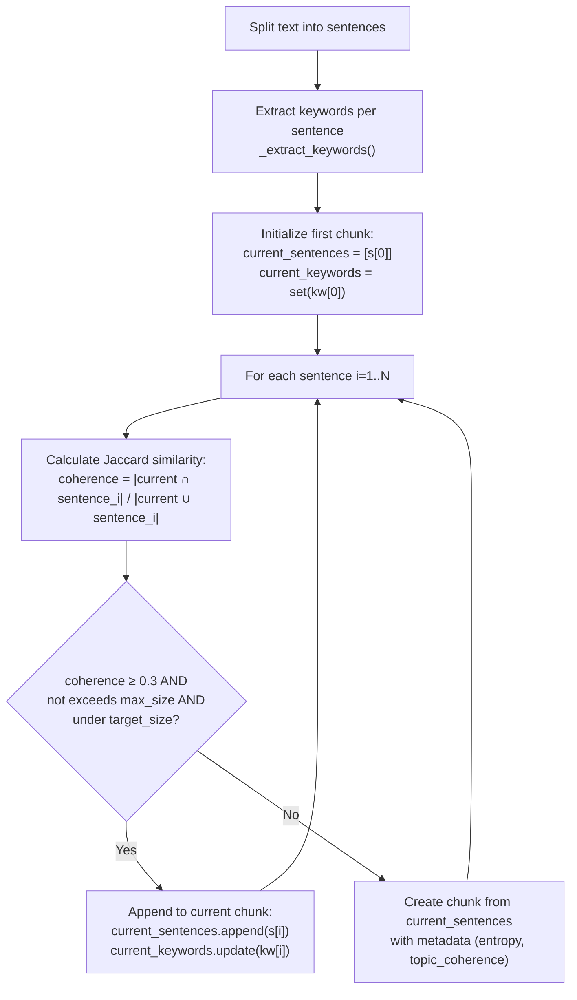
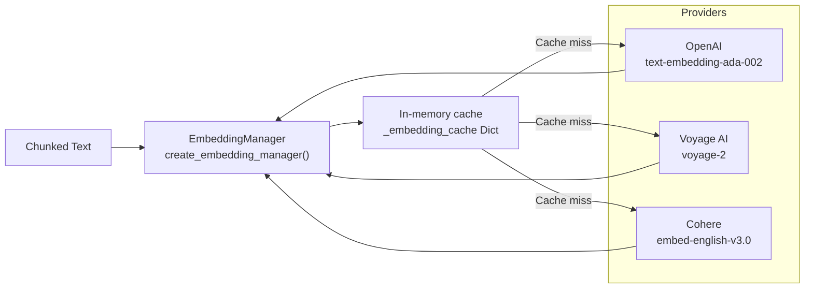
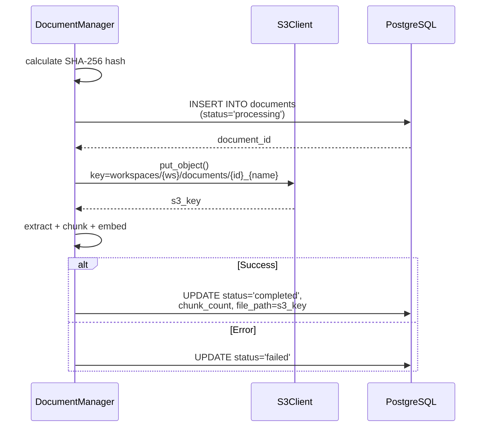
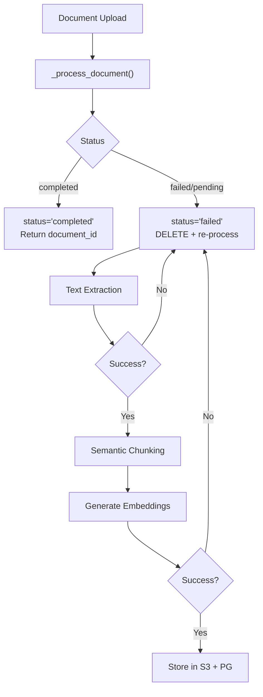

# Document Ingestion Pipeline

<details>
<summary>Relevant source files</summary>

The following files were used as context for generating this wiki page:

- [orchestrator/api/documents.py](orchestrator/api/documents.py)
- [orchestrator/core/composio/tool_executor.py](orchestrator/core/composio/tool_executor.py)
- [orchestrator/modules/agents/services/agent_platform_tools.py](orchestrator/modules/agents/services/agent_platform_tools.py)
- [orchestrator/modules/codegraph/ranking/__init__.py](orchestrator/modules/codegraph/ranking/__init__.py)
- [orchestrator/modules/codegraph/ranking/pagerank_ranker.py](orchestrator/modules/codegraph/ranking/pagerank_ranker.py)
- [orchestrator/modules/memory/integrations/mem0_client.py](orchestrator/modules/memory/integrations/mem0_client.py)
- [orchestrator/modules/rag/chunking/semantic_chunker.py](orchestrator/modules/rag/chunking/semantic_chunker.py)
- [orchestrator/modules/rag/ingestion/manager.py](orchestrator/modules/rag/ingestion/manager.py)
- [orchestrator/modules/rag/service.py](orchestrator/modules/rag/service.py)
- [orchestrator/modules/rag/services/cloud_file_downloader.py](orchestrator/modules/rag/services/cloud_file_downloader.py)
- [orchestrator/modules/rag/services/cloud_sync_service.py](orchestrator/modules/rag/services/cloud_sync_service.py)
- [orchestrator/modules/search/services/entity_extractor.py](orchestrator/modules/search/services/entity_extractor.py)

</details>


This page describes the complete document ingestion flow from upload/sync through text extraction, chunking, embedding generation, and storage. The pipeline processes documents into searchable vector chunks stored in S3 Vectors with metadata tracked in PostgreSQL.

For document search and retrieval, see [RAG Retrieval System](#5.4). For cloud storage configuration, see [Cloud Storage Integration](#5.5). For chunking algorithm details, see [Semantic Chunking Strategies](#5.3).

---

## Pipeline Overview

The ingestion pipeline transforms raw documents into semantically searchable chunks through five stages: **acquisition**, **extraction**, **chunking**, **embedding**, and **storage**. Each stage is optimized for specific file types and includes fallback mechanisms for robustness.



**Sources:** [orchestrator/modules/rag/ingestion/manager.py:402-750](), [orchestrator/api/documents.py:106-262](), [orchestrator/modules/rag/services/cloud_sync_service.py:38-290]()

---

## Entry Points

### Direct Upload via API

The `/api/documents/upload` endpoint accepts multipart form data with MIME type validation using `python-magic` to detect actual file content (not just extension checking). This prevents malicious files disguised with fake extensions.

| Validation Layer | Implementation | Purpose |
|-----------------|----------------|---------|
| MIME Detection | `magic.from_buffer(content, mime=True)` | Detect actual file type from binary content |
| Extension Mapping | `ALLOWED_MIME_TYPES` dict | Verify extension matches detected MIME |
| Size Limit | 50MB cap | Prevent resource exhaustion |
| Content Hash | SHA-256 deduplication | Skip re-processing identical files |

**Supported Formats:**
- **Documents**: PDF, DOCX, TXT, Markdown
- **Code**: Python, JSON
- **Spreadsheets**: XLSX, CSV

**Processing Flow:**



**Sources:** [orchestrator/api/documents.py:106-262](), [orchestrator/api/documents.py:88-104]()

### Cloud Storage Sync

The `CloudSyncService` orchestrates batch syncing from Google Drive, Dropbox, OneDrive, and Box via Composio actions. It maintains sync state in the `cloud_documents` table to track which files have been processed and their modification timestamps.

**Sync Architecture:**



**Key Features:**
- **Incremental Sync**: Compares `cloud_modified_at` to skip unchanged files
- **Parallel Processing**: `asyncio.Semaphore(3)` limits concurrent downloads
- **File Type Filtering**: Skips unsupported extensions (`.ttf`, `.png`, etc.)
- **Redis Caching**: Stores folder/file listings to reduce Composio API calls

**Sources:** [orchestrator/modules/rag/services/cloud_sync_service.py:197-402](), [orchestrator/modules/rag/services/cloud_file_downloader.py:60-144]()

---

## Text Extraction

The `DocumentProcessor` class implements multimodal extraction with format-specific parsers and fallback strategies.

### PDF Extraction

PDFs use a two-tier extraction strategy to handle both standard and malformed documents:

1. **Primary**: `pdfplumber` with table extraction (tables converted to Markdown)
2. **Fallback**: `PyPDF2` for PDFs that crash pdfplumber



**Table Extraction Example:**
PDFs with embedded tables are converted to Markdown for better LLM comprehension:

```markdown
[Table 1, Page 3]
| Header1 | Header2 | Header3 |
| ------- | ------- | ------- |
| Data1   | Data2   | Data3   |
```

**Sources:** [orchestrator/modules/rag/ingestion/manager.py:157-194](), [orchestrator/modules/rag/ingestion/manager.py:480-514]()

### Spreadsheet Extraction

XLSX and CSV files are converted to Markdown tables per sheet:

| Format | Library | Processing |
|--------|---------|------------|
| XLSX | `openpyxl` | Load workbook → iterate sheets → convert each sheet to Markdown table |
| CSV | `csv.reader` | Read rows → convert to single Markdown table |
| Encoding | UTF-8 with latin-1 fallback | Handles international characters |

**Sources:** [orchestrator/modules/rag/ingestion/manager.py:208-273]()

### DOCX and Plain Text

- **DOCX**: `python-docx` extracts paragraph text sequentially
- **Markdown/TXT/JSON/Python**: Direct UTF-8 read with latin-1 fallback
- **Character Cleaning**: All extracted text has null bytes (`\x00`, `\x01`, `\x02`) stripped

**Sources:** [orchestrator/modules/rag/ingestion/manager.py:196-207](), [orchestrator/modules/rag/ingestion/manager.py:261-287]()

---

## Semantic Chunking

The `SemanticChunker` implements five strategies based on information theory and semantic similarity. The default strategy is `TOPIC_COHERENCE` for fast, keyword-based chunking without local model dependencies.

### Chunking Strategies

| Strategy | Method | Use Case | Performance |
|----------|--------|----------|-------------|
| `SEMANTIC_SIMILARITY` | Embedding-based cosine similarity | High-quality semantic boundaries | Slow (embedding calls) |
| `INFORMATION_DENSITY` | Shannon entropy calculations | Technical documents with varying density | Medium |
| `TOPIC_COHERENCE` | Keyword overlap (Jaccard similarity) | **Default** - Fast, no embeddings required | Fast |
| `HIERARCHICAL` | Parent-child chunk relationships | Long documents needing context expansion | Medium |
| `ADAPTIVE` | Runs all 3 strategies, picks best | Unknown document types | Slow |

**Chunk Size Constraints:**

```python
target_chunk_size = 500   # Target tokens
min_chunk_size = 100      # Minimum viable chunk
max_chunk_size = 1500     # Hard limit
overlap_ratio = 0.1       # 10% overlap between chunks
similarity_threshold = 0.7 # For semantic strategies
```

### TOPIC_COHERENCE Strategy (Default)

This strategy uses keyword extraction and Jaccard similarity to maintain topic continuity without requiring embeddings:



**Metadata Captured:**

Each chunk includes these mathematical metrics:

```python
@dataclass
class ChunkMetadata:
    entropy: float              # Shannon entropy (information density)
    topic_coherence: float      # Keyword overlap score
    semantic_density: float     # Calculated by SemanticChunker
    importance_score: float     # Combined relevance score
```

**Sources:** [orchestrator/modules/rag/ingestion/manager.py:289-400](), [orchestrator/modules/rag/chunking/semantic_chunker.py:200-252]()

### Chunk Quality Filters

The pipeline applies post-processing filters to remove low-quality chunks:

```python
# Filter criteria (manager.py:365-398)
- Minimum length: 50 characters
- Skip separator chunks: '---', '```', '```python', etc.
- Skip mostly whitespace: strip separators (-=_#`*), require 30+ chars
- Skip header-only chunks: single line starting with '#'
- Require meaningful content: at least 5 words
```

**Sources:** [orchestrator/modules/rag/ingestion/manager.py:357-400]()

---

## Embedding Generation

Embeddings are generated using the centralized `EmbeddingManager` which abstracts multiple providers:



**Batch Processing:**

The pipeline generates embeddings in batches to optimize API usage:

```python
# DocumentManager._process_document (line ~740-850)
for i, chunk in enumerate(chunks):
    embedding = await embedding_manager.generate_embedding(chunk.content)
    chunk.embedding = embedding
    # Store in S3 Vectors or PostgreSQL
```

**Provider Selection:**

The system uses a 6-level credential resolution strategy (see [Agent Factory & Runtime](#3.5)):

1. Workspace-level provider override
2. Agent-specific credentials
3. User credentials
4. Workspace default
5. System default
6. Hardcoded fallback

**Sources:** [orchestrator/modules/rag/ingestion/manager.py:402-450]()

---

## Storage Architecture

The ingestion pipeline uses a dual-storage model: **S3 for large blobs** (raw files, vectors) and **PostgreSQL for metadata** (document records, chunk tracking).

### Document Storage

Raw uploaded files are stored in S3 with workspace isolation:

```
S3 Bucket Structure:
automatos-documents/
  workspaces/
    {workspace_id}/
      documents/
        {document_id}_{original_filename}
```

**Upload Flow:**



**Sources:** [orchestrator/modules/rag/ingestion/manager.py:652-687]()

### Vector Storage

Embeddings are stored in **S3 Vectors** (dedicated workspace buckets) rather than PostgreSQL `pgvector` for scalability:

| Storage Type | Use Case | Trade-offs |
|--------------|----------|------------|
| **S3 Vectors** (default) | Production deployment, unlimited scale | Slightly higher latency (~100-200ms) |
| **PostgreSQL pgvector** | Development, low-volume | Fast queries, storage limits |

**S3 Vectors Schema:**

```json
{
  "key": "chunk_{chunk_id}",
  "embedding": [0.123, -0.456, ...],  // 1536 dimensions
  "content": "chunk text (full)",
  "file_name": "original_filename.pdf",
  "chunk_index": 0,
  "metadata": {
    "document_id": 123,
    "entropy": 4.2,
    "topic_coherence": 0.85
  }
}
```

**Bucket Isolation:**

Each workspace gets a dedicated S3 bucket:

```
Bucket naming: automatos-vectors-{workspace_id}
Example: automatos-vectors-550e8400-e29b-41d4-a716-446655440000
```

**Sources:** [orchestrator/modules/rag/ingestion/manager.py:405-445](), [orchestrator/modules/rag/service.py:808-821]()

### PostgreSQL Metadata

The database tracks document lifecycle and chunk metadata for fast querying:

**Schema Overview:**

```sql
-- documents table (line 585-601)
CREATE TABLE documents (
    id SERIAL PRIMARY KEY,
    workspace_id TEXT NOT NULL,
    filename VARCHAR(255) NOT NULL,
    file_type VARCHAR(50) NOT NULL,
    file_size INTEGER NOT NULL,
    status VARCHAR(50) DEFAULT 'pending',
    chunk_count INTEGER DEFAULT 0,
    file_hash VARCHAR(64) UNIQUE,      -- SHA-256 for deduplication
    upload_date TIMESTAMP DEFAULT NOW(),
    processed_date TIMESTAMP
);

-- document_chunks table (line 605-618)
CREATE TABLE document_chunks (
    id SERIAL PRIMARY KEY,
    document_id INTEGER REFERENCES documents(id) ON DELETE CASCADE,
    workspace_id TEXT NOT NULL,
    chunk_index INTEGER NOT NULL,
    content TEXT NOT NULL,
    embedding TEXT,                     -- Deprecated (now in S3)
    metadata JSONB DEFAULT '{}',
    parent_content TEXT,                -- For context expansion
    headers JSONB DEFAULT '{}'          -- Markdown header hierarchy
);

-- cloud_documents table (cloud_sync_service.py)
CREATE TABLE cloud_documents (
    id SERIAL PRIMARY KEY,
    workspace_id UUID NOT NULL,
    connection_id INTEGER REFERENCES composio_connections(id),
    app_name VARCHAR(50),              -- GOOGLEDRIVE, DROPBOX, etc.
    external_file_id TEXT NOT NULL,    -- Provider's file ID
    document_id INTEGER REFERENCES documents(id),
    sync_status VARCHAR(20),           -- pending, synced, error
    last_synced_at TIMESTAMP,
    cloud_modified_at TIMESTAMP,
    chunk_count INTEGER DEFAULT 0,
    sync_error TEXT
);
```

**Indexes for Performance:**

```sql
CREATE INDEX idx_document_chunks_document_id ON document_chunks(document_id);
CREATE INDEX idx_documents_status ON documents(status);
CREATE INDEX idx_documents_workspace_id ON documents(workspace_id);
```

**Sources:** [orchestrator/modules/rag/ingestion/manager.py:578-643]()

---

## Error Handling and Retry Logic

The pipeline implements multi-layer error handling to ensure robustness:

### Document-Level Retry



**Deduplication Strategy:**

```python
# manager.py:709-728
existing = db.query(Document).filter(
    Document.file_hash == content_hash,
    Document.workspace_id == workspace_id
).first()

if existing and existing.status == "completed":
    return existing.id  # Skip re-processing
elif existing:
    # Failed/pending document exists → delete and retry
    db.delete_chunks_for_document(existing.id)
    db.delete(existing)
```

**Sources:** [orchestrator/modules/rag/ingestion/manager.py:688-728]()

### Cloud Download Fallback

The `CloudFileDownloader` implements a 2-layer download strategy for Google Drive (which truncates inline responses):

```mermaid
graph TB
    Request["Download Request"]
    
    Layer1["Layer 1: Composio v3 REST API<br/>POST /api/v3/tools/execute/{action}"]
    Extract["_extract_binary()<br/>Check URL keys (s3url, downloadUrl)<br/>Check content keys (file_content_bytes)"]
    
    Check{Size ≥ 2KB?}
    
    Layer2["Layer 2: Composio SDK Fallback<br/>client.execute_action()<br/>Saves full file to disk"]
    
    Success["Return temp file path"]
    
    Request --> Layer1
    Layer1 --> Extract
    Extract --> Check
    
    Check -->|Yes| Success
    Check -->|No (Google Drive)| Layer2
    
    Layer2 --> Success
```

**Provider-Specific Actions:**

```python
# cloud_file_downloader.py:30-35
_DOWNLOAD_ACTIONS = {
    "GOOGLEDRIVE": "GOOGLEDRIVE_DOWNLOAD_FILE",
    "DROPBOX": "DROPBOX_READ_FILE",
    "ONEDRIVE": "ONEDRIVE_DOWNLOAD_FILE",
    "BOX": "BOX_DOWNLOAD_FILE",
}
```

**Sources:** [orchestrator/modules/rag/services/cloud_file_downloader.py:60-143](), [orchestrator/modules/rag/services/cloud_file_downloader.py:341-423]()

---

## Performance Considerations

### Token Efficiency

The semantic chunker achieves **80-90% token savings** compared to naive fixed-size splitting by:

1. **Intelligent Boundaries**: Splits at semantic breaks (sentence/paragraph) rather than arbitrary character counts
2. **Quality Filters**: Removes separator-only chunks and low-information fragments
3. **Overlap Management**: Uses 10% overlap only where semantically beneficial

### Parallel Processing

Cloud sync uses `asyncio.Semaphore(3)` for concurrent downloads:

```python
# cloud_sync_service.py:293-295
MAX_CONCURRENT = 3
semaphore = asyncio.Semaphore(MAX_CONCURRENT)

async def _process_one_file(cf):
    async with semaphore:
        # Download, extract, chunk, embed
```

**Throughput:** Processes ~3 files simultaneously, reducing sync time by 70% for large folders.

**Sources:** [orchestrator/modules/rag/services/cloud_sync_service.py:290-384]()

### Embedding Cache

The `SemanticChunker` maintains an in-memory embedding cache with FIFO eviction:

```python
# semantic_chunker.py:78-82, 372-381
_embedding_cache: Dict[str, List[float]] = {}
_embedding_cache_max_size: int = 1000

# Cache key: first 200 chars of text
cache_key = text[:200]

# FIFO eviction when cache full
if len(cache) >= max_size:
    evict_count = max(1, max_size // 10)  # Remove oldest 10%
```

**Sources:** [orchestrator/modules/rag/chunking/semantic_chunker.py:78-82](), [orchestrator/modules/rag/chunking/semantic_chunker.py:372-381]()

---

## Configuration

Key configuration parameters from `config.py`:

| Variable | Default | Purpose |
|----------|---------|---------|
| `S3_DOCUMENTS_BUCKET` | `automatos-documents` | Raw file storage bucket |
| `S3_VECTORS_ENABLED` | `true` | Use S3 Vectors vs PostgreSQL pgvector |
| `CHUNK_SIZE` | `500` | Target chunk size in tokens |
| `MIN_CHUNK_SIZE` | `100` | Minimum viable chunk |
| `MAX_CHUNK_SIZE` | `1500` | Hard limit per chunk |
| `DIVERSITY_FACTOR` | `0.3` | MMR diversity in retrieval |
| `MIN_SIMILARITY` | `0.5` | Minimum cosine similarity for RAG results |

**System Settings Integration:**

The RAG module reads from `system_settings` table for runtime tuning:

```python
# rag/service.py:47-96
def _get_rag_setting_int(key: str, default: int) -> int:
    setting = db.query(SystemSetting).filter(SystemSetting.key == key).first()
    return int(setting.value) if setting else default

# Used in RAGConfig
chunk_size = _get_rag_setting_int("chunk_size", 500)
max_tokens = _get_rag_setting_int("max_tokens", 2000)
```

**Sources:** [orchestrator/modules/rag/service.py:47-140]()

---

## Related Components

The ingestion pipeline integrates with several other subsystems:

- **[RAG Retrieval System](#5.4)**: Uses ingested chunks for semantic search
- **[Knowledge Graph & Entity Extraction](#5.6)**: Extracts entities from chunks for graph-based retrieval
- **[Document Management](#5.1)**: UI layer for upload, browsing, and deletion
- **[Cloud Storage Integration](#5.5)**: OAuth flow and connection management
- **[Tools & Integrations](#6)**: Composio actions for cloud provider APIs

**Sources:** [orchestrator/modules/rag/service.py:210-295](), [orchestrator/modules/search/services/entity_extractor.py:40-88]()

---