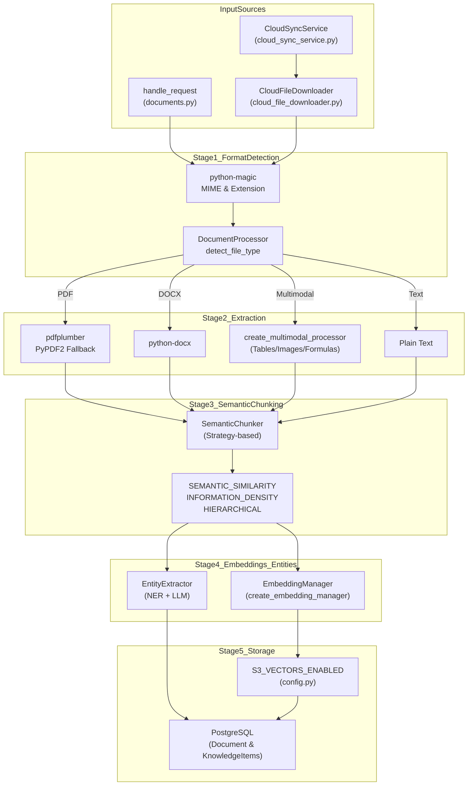
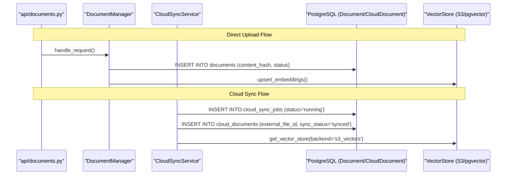

# Document Ingestion Pipeline

Relevant source files

The following files were used as context for generating this wiki page:

- [frontend/components/documents/local-storage-browser.tsx](frontend/components/documents/local-storage-browser.tsx)
- [orchestrator/api/documents.py](orchestrator/api/documents.py)
- [orchestrator/api/knowledge_multimodal.py](orchestrator/api/knowledge_multimodal.py)
- [orchestrator/modules/agents/services/agent_platform_tools.py](orchestrator/modules/agents/services/agent_platform_tools.py)
- [orchestrator/modules/rag/chunking/semantic_chunker.py](orchestrator/modules/rag/chunking/semantic_chunker.py)
- [orchestrator/modules/rag/ingestion/manager.py](orchestrator/modules/rag/ingestion/manager.py)
- [orchestrator/modules/rag/service.py](orchestrator/modules/rag/service.py)
- [orchestrator/modules/rag/services/cloud_file_downloader.py](orchestrator/modules/rag/services/cloud_file_downloader.py)
- [orchestrator/modules/rag/services/cloud_sync_service.py](orchestrator/modules/rag/services/cloud_sync_service.py)
- [orchestrator/modules/search/services/entity_extractor.py](orchestrator/modules/search/services/entity_extractor.py)
- [orchestrator/modules/tools/formatting/result_formatter.py](orchestrator/modules/tools/formatting/result_formatter.py)

## Purpose and Scope

The Document Ingestion Pipeline transforms raw documents from multiple sources into searchable, semantically-indexed content that agents can query through RAG (Retrieval-Augmented Generation). This pipeline handles text extraction, chunking, embedding generation, and storage in high-performance vector databases.

The system supports local file uploads via the `DocumentManager` [orchestrator/modules/rag/ingestion/manager.py:77-86](), automated synchronization with cloud providers via `CloudSyncService` [orchestrator/modules/rag/services/cloud_sync_service.py:38-48](), and advanced multimodal extraction including tables, images, and formulas [orchestrator/api/knowledge_multimodal.py:1-22]().

---

## Pipeline Architecture

The ingestion pipeline consists of five sequential stages: **source retrieval → format detection → text extraction → semantic chunking → embedding & storage**.

### System Data Flow
This diagram illustrates the flow from raw data to the "Code Entity Space" where specific services process the information.

**Sources:** [orchestrator/api/documents.py:106-116](), [orchestrator/modules/rag/ingestion/manager.py:113-130](), [orchestrator/modules/rag/services/cloud_file_downloader.py:60-84](), [orchestrator/api/knowledge_multimodal.py:37-43]()

---

## Stage 1: Format Detection

The `DocumentProcessor` uses `python-magic` and file extensions to categorize documents into `DocumentType` enums [orchestrator/modules/rag/ingestion/manager.py:131-155](). The API layer also enforces a strict `ALLOWED_MIME_TYPES` allowlist to prevent malicious uploads [orchestrator/api/documents.py:89-104]().

| Format | DocumentType | Detection Method |
|--------|--------------|------------------|
| PDF | `PDF` | `application/pdf` or `.pdf` |
| Word | `DOCX` | OpenXML MIME or `.docx` |
| Markdown | `MARKDOWN` | `.md`, `.markdown` |
| Python | `PYTHON` | `.py` |
| Spreadsheet | `XLSX` / `CSV` | OpenXML Spreadsheet / `text/csv` |

**Sources:** [orchestrator/modules/rag/ingestion/manager.py:62-71](), [orchestrator/api/documents.py:89-104]()

---

## Stage 2: Text and Multimodal Extraction

Extraction is handled by the `DocumentProcessor` with specific logic for each format, augmented by a multimodal pipeline for complex documents.

### PDF Extraction
The system uses a prioritized dual-parser approach [orchestrator/modules/rag/ingestion/manager.py:157-194]():
1.  **pdfplumber**: Primary extractor for high-quality text and layout preservation. Includes cleaning logic to remove null characters and fix double-character artifacts [orchestrator/modules/rag/ingestion/manager.py:162-171]().
2.  **PyPDF2**: Fallback parser used if `pdfplumber` fails [orchestrator/modules/rag/ingestion/manager.py:178-186]().

### Multimodal Processing
The `create_multimodal_processor` handles non-text elements within documents [orchestrator/api/knowledge_multimodal.py:37-43]():
- **Tables**: `TableExtraction` recovers structured data from PDFs and DOCX [orchestrator/api/knowledge_multimodal.py:40]().
- **Images**: `ImageExtraction` generates AI descriptions for embedded visuals [orchestrator/api/knowledge_multimodal.py:41]().
- **Formulas**: `FormulaExtraction` converts mathematical notation to LaTeX [orchestrator/api/knowledge_multimodal.py:42]().

---

## Stage 3: Semantic Chunking

The `SemanticChunker` splits documents based on mathematical optimization and structural boundaries [orchestrator/modules/rag/chunking/semantic_chunker.py:52-70]().

### Chunking Strategies
| Strategy | Implementation Logic |
|----------|----------------------|
| `SEMANTIC_SIMILARITY` | Groups sentences based on cosine similarity thresholds using `VectorOperations` [orchestrator/modules/rag/chunking/semantic_chunker.py:107-130](). |
| `INFORMATION_DENSITY` | Uses `InformationTheory` to finalize chunks when entropy reaches a specific threshold [orchestrator/modules/rag/chunking/semantic_chunker.py:154-182](). |
| `HIERARCHICAL` | Preserves document structure (H1, H2, H3) to maintain parent-child context expansion [orchestrator/modules/rag/ingestion/manager.py:101-111](). |

**Sources:** [orchestrator/modules/rag/chunking/semantic_chunker.py:22-29](), [orchestrator/modules/rag/chunking/semantic_chunker.py:71-75]()

---

## Stage 4: Embedding and Entity Extraction

The pipeline generates both vector embeddings and structured entity metadata.

- **Embedding Generation**: Managed by the `DocumentManager` which calculates vectors for each `DocumentChunk` [orchestrator/modules/rag/ingestion/manager.py:94-111]().
- **Entity Extraction**: The `EntityExtractor` uses a hybrid approach of regex patterns and LLM analysis to identify technologies, organizations, and concepts [orchestrator/modules/search/services/entity_extractor.py:40-63](). It generates `ExtractedEntity` and `ExtractedRelationship` objects for the Knowledge Graph [orchestrator/modules/search/services/entity_extractor.py:18-38]().

**Sources:** [orchestrator/modules/search/services/entity_extractor.py:123-146](), [orchestrator/modules/search/services/entity_extractor.py:185-190]()

---

## Stage 5: Storage and Vector Databases

The system utilizes a dual-storage strategy: PostgreSQL for metadata/relational data and pluggable vector backends.

### Storage Logic and Entity Association
This diagram bridges the Natural Language concept of "Knowledge Storage" to the specific code entities and database tables used.

**Sources:** [orchestrator/api/documents.py:158-166](), [orchestrator/modules/rag/services/cloud_sync_service.py:167-191](), [orchestrator/modules/rag/ingestion/manager.py:77-86]()

---

## Cloud Storage Integration

The `CloudSyncService` orchestrates document retrieval from external providers via the Composio API [orchestrator/modules/rag/services/cloud_sync_service.py:38-48]().

- **Discovery**: `list_folders` and `list_files` use `ComposioToolExecutor` to browse remote filesystems [orchestrator/modules/rag/services/cloud_sync_service.py:59-95]().
- **Downloading**: `CloudFileDownloader` implements a multi-layer strategy (REST API with SDK fallback) to handle large files and provider-specific truncation (e.g., Google Drive) [orchestrator/modules/rag/services/cloud_file_downloader.py:60-118]().
- **S3 Vectors**: Cloud-synced documents often bypass local storage, pointing directly to `S3VectorsBackend` for vector indexing [orchestrator/modules/rag/services/cloud_sync_service.py:25]().

**Sources:** [orchestrator/modules/rag/services/cloud_sync_service.py:116-153](), [orchestrator/modules/rag/services/cloud_file_downloader.py:30-45]()

---

## Security and Multi-Tenancy

The pipeline strictly enforces workspace isolation.

- **Workspace Scoping**: Every `DocumentManager` and `CloudSyncService` instance is scoped to a specific `workspace_id` [orchestrator/api/documents.py:77-86](), [orchestrator/modules/rag/services/cloud_sync_service.py:80-81]().
- **Data Isolation**: Database operations for documents and knowledge items include `workspace_id` filters to ensure multi-tenant safety [orchestrator/api/documents.py:158](), [orchestrator/api/knowledge_multimodal.py:160]().
- **Access Control**: The pipeline utilizes `get_request_context_hybrid` to validate JWT or API Key credentials before any ingestion begins [orchestrator/api/documents.py:108](), [orchestrator/api/knowledge_multimodal.py:135]().

**Sources:** [orchestrator/api/documents.py:77-86](), [orchestrator/api/knowledge_multimodal.py:143-160]()

---