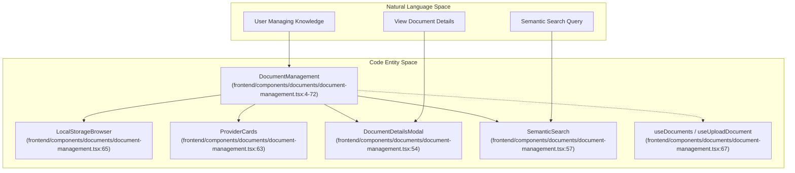
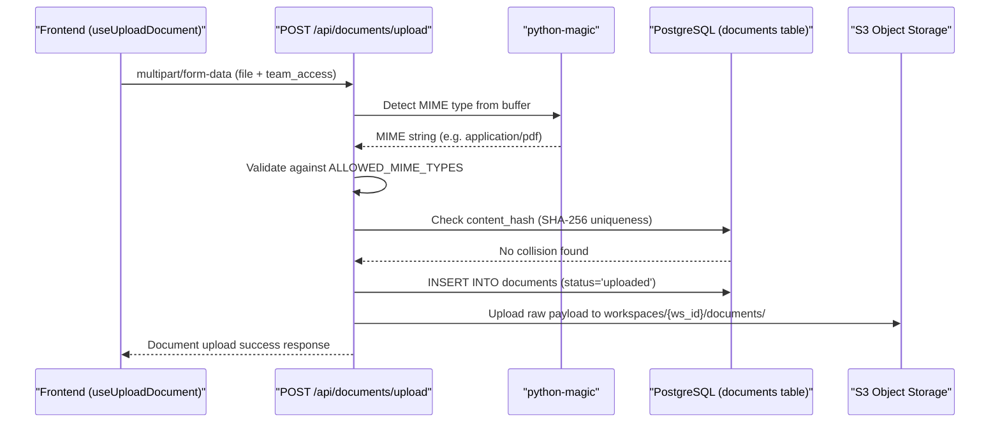
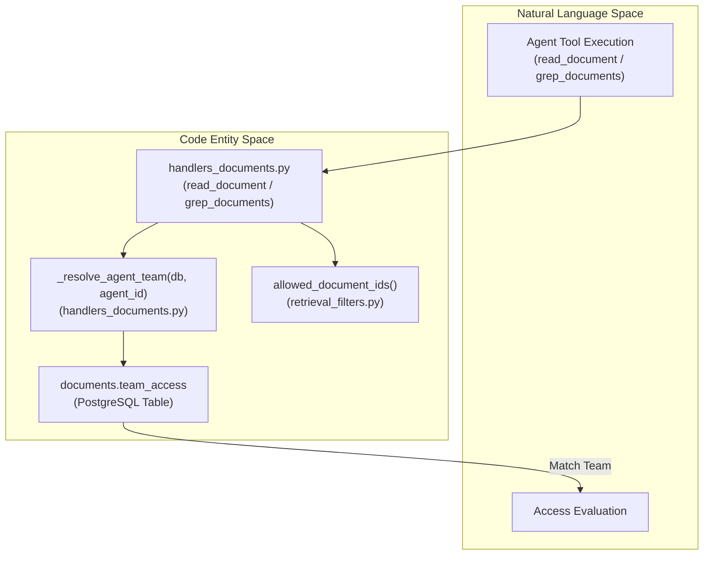
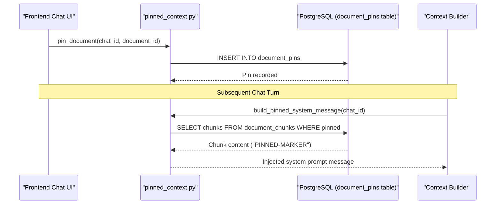
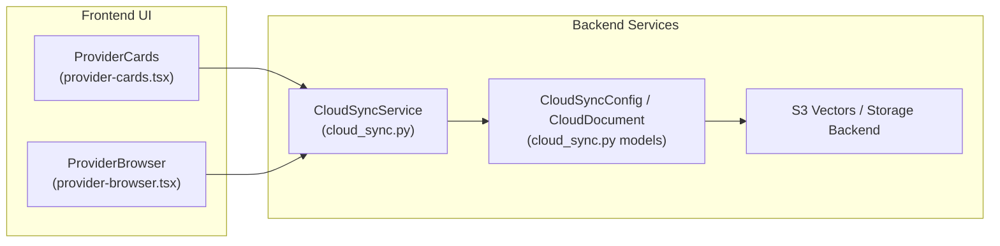

# Document Management

Relevant source files

The following files were used as context for generating this wiki page:

- [frontend/components/activity/activity-page.tsx](frontend/components/activity/activity-page.tsx)
- [frontend/components/agents/agent-management.tsx](frontend/components/agents/agent-management.tsx)
- [frontend/components/documents/document-management.tsx](frontend/components/documents/document-management.tsx)
- [frontend/components/marketplace/marketplace-homepage.tsx](frontend/components/marketplace/marketplace-homepage.tsx)
- [frontend/components/tools/tools-dashboard.tsx](frontend/components/tools/tools-dashboard.tsx)
- [frontend/components/workflows/active-workflows-panel.tsx](frontend/components/workflows/active-workflows-panel.tsx)
- [frontend/components/workflows/workflow-management.tsx](frontend/components/workflows/workflow-management.tsx)
- [orchestrator/conftest.py](orchestrator/conftest.py)
- [orchestrator/core/database/migrations/044_pinned_documents.sql](orchestrator/core/database/migrations/044_pinned_documents.sql)
- [orchestrator/modules/codegraph/tests/conftest.py](orchestrator/modules/codegraph/tests/conftest.py)
- [orchestrator/modules/learning/tests/conftest.py](orchestrator/modules/learning/tests/conftest.py)
- [orchestrator/modules/rag/pinned_context.py](orchestrator/modules/rag/pinned_context.py)
- [orchestrator/modules/rag/retrieval_filters.py](orchestrator/modules/rag/retrieval_filters.py)
- [orchestrator/modules/search/tests/conftest.py](orchestrator/modules/search/tests/conftest.py)
- [orchestrator/modules/search/tests/test_math_foundations.py](orchestrator/modules/search/tests/test_math_foundations.py)
- [orchestrator/modules/tools/discovery/actions_documents.py](orchestrator/modules/tools/discovery/actions_documents.py)
- [orchestrator/modules/tools/discovery/handlers_documents.py](orchestrator/modules/tools/discovery/handlers_documents.py)
- [orchestrator/scripts/init_test_db.py](orchestrator/scripts/init_test_db.py)
- [orchestrator/tests/test_document_pinning.py](orchestrator/tests/test_document_pinning.py)
- [orchestrator/tests/test_read_document_tool.py](orchestrator/tests/test_read_document_tool.py)
- [orchestrator/tests/test_retrieval_filters.py](orchestrator/tests/test_retrieval_filters.py)

Document Management provides the interface for uploading, processing, and managing documents that feed into the RAG system, team-scoped knowledge bases, and agent tools. It coordinates file uploads via REST API, validates MIME types and content hashes, stores raw files in object storage, tracks chunk metadata in PostgreSQL, and handles advanced features like team access scoping and document pinning.

**Scope**: This page covers the `DocumentManagement` React component, upload workflows, provider cards, document details modal, team scoping constraints, and pinned documents infrastructure. For text extraction and embedding generation, see [Document Ingestion Pipeline (7.2)](). For semantic chunking strategies, see [Semantic Chunking Strategies (7.3)]().

---

## Document Management Frontend Component & Layout

The user interface for managing documents is anchored by the `DocumentManagement` component located in `frontend/components/documents/document-management.tsx`. It orchestrates multiple tabs and dialogs for local storage browsing, cloud provider synchronization, schema exploration, and semantic search.

**Sources**: [frontend/components/documents/document-management.tsx:4-72](), [frontend/components/documents/document-management.tsx:54-67]()

- **`DocumentManagement`**: The parent component managing local storage, cloud providers, and analytics tabs [frontend/components/documents/document-management.tsx:4-72]().
- **`LocalStorageBrowser`**: Renders list and grid views for workspace files stored in Automatos [frontend/components/documents/document-management.tsx:65]().
- **`ProviderCards`**: Displays integrated cloud storage providers (e.g., Google Drive, Dropbox) and connection health [frontend/components/documents/document-management.tsx:63]().
- **`DocumentDetailsModal`**: Displays document metadata, processing status, chunk counts, and team access permissions [frontend/components/documents/document-management.tsx:54]().
- **`SchemaBrowser`**: An inline tool for exploring database table metadata and column structures for connected data sources [frontend/components/documents/document-management.tsx:109-188]().

**Sources**: [frontend/components/documents/document-management.tsx:54-188]()

---

## Upload Flow & Validation Pipeline

Documents enter the system via multipart form requests processed by backend endpoints and managed on the frontend by `useUploadDocument`.

**Sources**: [frontend/components/documents/document-management.tsx:67](), [orchestrator/scripts/init_test_db.py:63-72]()

### Validation and Deduplication Rules
- **File Size Caps**: Enforced at the FastAPI ingestion boundary to reject oversized payloads.
- **MIME Verification**: Content-based detection prevents extension spoofing.
- **SHA-256 Deduplication**: Computes a cryptographic hash of the raw stream to prevent duplicate ingestion within a workspace [orchestrator/scripts/init_test_db.py:120-125]().

**Sources**: [orchestrator/scripts/init_test_db.py:63-125]()

---

## Team Scoping & Access Control

Documents can be restricted to specific teams within a workspace via the `team_access` field in the database. Agent tools such as `read_document` and `grep_documents` enforce fail-closed team scoping to prevent unauthorized access.

**Sources**: [orchestrator/tests/test_read_document_tool.py:127-143](), [orchestrator/modules/rag/retrieval_filters.py]()

### Implementation Details
- **`team_access` Array**: PostgreSQL column storing team identifiers (e.g. `'{sales}'`) permitted to read the document [orchestrator/tests/test_read_document_tool.py:79-103]().
- **Agent Team Resolution**: `_resolve_agent_team` maps the executing `agent_id` to its assigned organizational team [orchestrator/tests/test_read_document_tool.py:134]().
- **Fail-Closed Filtering**: If an agent belongs to a non-matching team (e.g. `support` attempting to read a `sales`-restricted document), execution returns a failure result [orchestrator/tests/test_read_document_tool.py:135-136]().

**Sources**: [orchestrator/tests/test_read_document_tool.py:79-143]()

---

## Pinned Documents & Context Injection

During chat sessions, users can pin specific documents to guarantee their inclusion in the agent's prompt context across conversation turns.

**Sources**: [orchestrator/tests/test_document_pinning.py:112-158]()

### Key Functions
- **`pin_document` / `unpin_document`**: Manages association between chat sessions and document IDs [orchestrator/tests/test_document_pinning.py:114-117]()
- **`build_pinned_system_message`**: Assembles pinned document chunks into a formatted system prompt injection [orchestrator/tests/test_document_pinning.py:118]()
- **`_filter_frontend_docs_by_scope`**: Validates frontend document widget links against workspace and team scopes, dropping out-of-scope references [orchestrator/tests/test_document_pinning.py:30-43]()

**Sources**: [orchestrator/tests/test_document_pinning.py:30-158]()

---

## Cloud Storage Integration & Provider Cards

Cloud storage synchronization allows Automatos to ingest documents automatically from external providers like Google Drive and Dropbox (PRD-42).

**Sources**: [frontend/components/documents/document-management.tsx:63-64](), [orchestrator/scripts/init_test_db.py:15]()

- **`ProviderCards`**: Component rendering connection status, sync frequency, and trigger actions for external storage integrations [frontend/components/documents/document-management.tsx:63]()
- **`CloudSyncConfig`**: Database model tracking authentication tokens, root folders, and sync intervals [orchestrator/scripts/init_test_db.py:15]()
- **`CloudDocument`**: Model mapping external file IDs to internal document ingestion records [orchestrator/scripts/init_test_db.py:15]()

**Sources**: [frontend/components/documents/document-management.tsx:63](), [orchestrator/scripts/init_test_db.py:15]()

---

## Document API Reference

- **`POST /api/documents/upload`**: Ingests multipart form files, validates MIME types, checks SHA-256 deduplication hashes, and triggers background processing.
- **`GET /api/documents/`**: Lists workspace documents with pagination, status filters, and search queries.
- **`DELETE /api/documents/{id}`**: Deletes a document and cascades removal to associated chunks and vector indices.
- **`POST /api/rag/pin`**: Pins a document to a specific chat session for persistent prompt context inclusion.

**Sources**: [orchestrator/tests/test_read_document_tool.py:79-103](), [orchestrator/tests/test_document_pinning.py:112-158]()

---