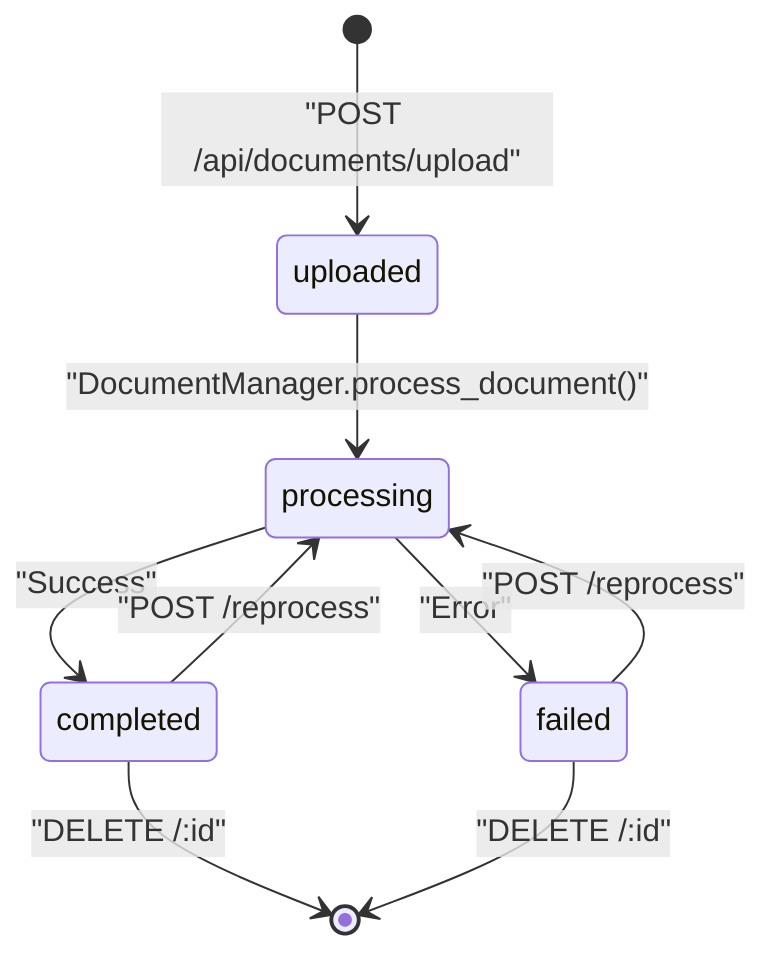
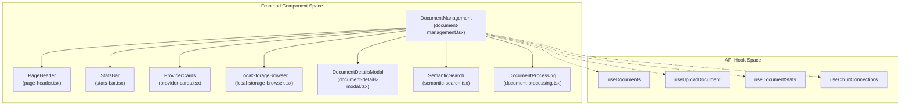
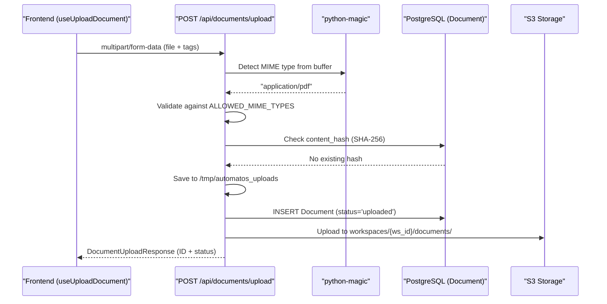
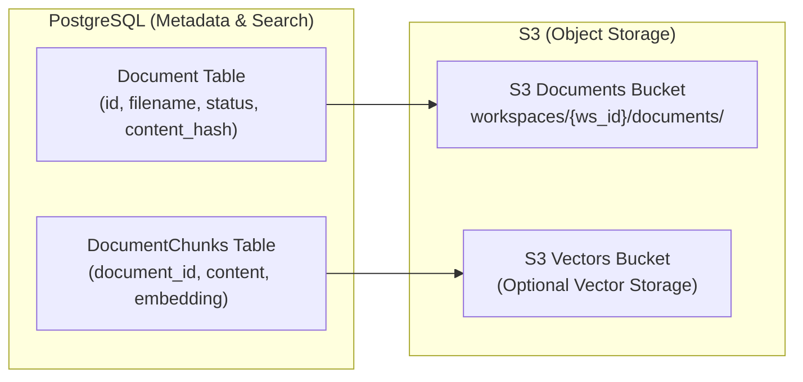

# Document Management

<details>
<summary>Relevant source files</summary>

The following files were used as context for generating this wiki page:

- [frontend/components/agents/agent-management.tsx](frontend/components/agents/agent-management.tsx)
- [frontend/components/agents/skills/skill-editor-modal.tsx](frontend/components/agents/skills/skill-editor-modal.tsx)
- [frontend/components/agents/skills/workspace-skills-tab.tsx](frontend/components/agents/skills/workspace-skills-tab.tsx)
- [frontend/components/documents/document-management.tsx](frontend/components/documents/document-management.tsx)
- [frontend/components/documents/local-storage-browser.tsx](frontend/components/documents/local-storage-browser.tsx)
- [frontend/components/knowledge/memory-tab.tsx](frontend/components/knowledge/memory-tab.tsx)
- [frontend/components/tools/tools-dashboard.tsx](frontend/components/tools/tools-dashboard.tsx)
- [frontend/hooks/use-skills-api.ts](frontend/hooks/use-skills-api.ts)
- [orchestrator/api/documents.py](orchestrator/api/documents.py)
- [orchestrator/api/knowledge_multimodal.py](orchestrator/api/knowledge_multimodal.py)
- [orchestrator/api/workspace_skills.py](orchestrator/api/workspace_skills.py)
- [orchestrator/modules/agents/services/agent_platform_tools.py](orchestrator/modules/agents/services/agent_platform_tools.py)
- [orchestrator/modules/rag/chunking/semantic_chunker.py](orchestrator/modules/rag/chunking/semantic_chunker.py)
- [orchestrator/modules/rag/ingestion/manager.py](orchestrator/modules/rag/ingestion/manager.py)
- [orchestrator/modules/rag/service.py](orchestrator/modules/rag/service.py)
- [orchestrator/modules/rag/services/cloud_file_downloader.py](orchestrator/modules/rag/services/cloud_file_downloader.py)
- [orchestrator/modules/rag/services/cloud_sync_service.py](orchestrator/modules/rag/services/cloud_sync_service.py)
- [orchestrator/modules/search/services/entity_extractor.py](orchestrator/modules/search/services/entity_extractor.py)
- [orchestrator/modules/tools/formatting/result_formatter.py](orchestrator/modules/tools/formatting/result_formatter.py)

</details>


Document Management provides the interface for uploading, processing, and managing documents that feed into the RAG system. It handles file uploads via REST API, validates content types, stores documents in S3, and tracks metadata in PostgreSQL. Documents can be uploaded directly or synced automatically from cloud storage providers.

**Scope**: This page covers document upload, storage, metadata management, and cloud sync orchestration. For details on how documents are processed and chunked, see [Document Ingestion Pipeline (7.2)](). For using documents in retrieval, see [RAG Retrieval System (7.4)]().

---

## Document Lifecycle

Documents move through a defined lifecycle from upload to completion. The `DocumentManager` and API endpoints coordinate state transitions.

### Document States



**Sources**: [orchestrator/api/documents.py:106-115](), [orchestrator/modules/rag/ingestion/manager.py:56-60]()

| State | Description | Database Field |
|-------|-------------|----------------|
| `uploaded` | File received, awaiting processing | `status='uploaded'` |
| `processing` | Extraction and chunking in progress | `status='processing'` |
| `completed` | Successfully processed and indexed | `status='completed'` |
| `failed` | Processing encountered an error | `status='failed'` |
| `duplicate` | Identical content hash already exists | `status='duplicate'` |

The `Document` model in PostgreSQL tracks this lifecycle with fields: `id`, `filename`, `file_type`, `file_size`, `upload_date`, `processed_date`, `status`, `chunk_count`, `content_hash`, and `workspace_id`.

**Sources**: [orchestrator/api/documents.py:154-164](), [frontend/components/documents/document-management.tsx:71-82](), [orchestrator/modules/rag/ingestion/manager.py:72-83]()

---

## Frontend Components

The document management interface is primarily handled by the `DocumentManagement` component, which utilizes a tabbed interface to separate local storage, cloud providers, and semantic search.

### Document Management UI Structure



**Sources**: [frontend/components/documents/document-management.tsx:4-69]()

- **`DocumentManagement`**: The main container managing tabs for Local Storage, Cloud Storage, and Knowledge Graphs (Code/Business) [frontend/components/documents/document-management.tsx:4-69]().
- **`LocalStorageBrowser`**: Handles the list and grid views for documents stored directly in the Automatos filesystem, including status badges and action menus [frontend/components/documents/document-management.tsx:63]().
- **`ProviderCards`**: Displays connected cloud providers (Google Drive, Dropbox, etc.) and their sync status [frontend/components/documents/document-management.tsx:61]().
- **`DocumentDetailsModal`**: Shows metadata, processing status, and chunk information for a specific document [frontend/components/documents/document-management.tsx:52]().
- **`SchemaBrowser`**: An inline component within the document view that allows exploring database table metadata and column types for connected data sources [frontend/components/documents/document-management.tsx:105-188]().
- **`DocumentProcessing`**: Visualizes the ingestion pipeline progress, including text extraction and vector indexing status [frontend/components/documents/document-management.tsx:58]().

---

## Upload Methods

### Direct Upload via API

The primary upload endpoint accepts multipart form data with file validation.



**Sources**: [orchestrator/api/documents.py:106-154](), [orchestrator/api/documents.py:166-175]()

**Key Validations**:
- **File Size**: Maximum 50MB enforced at [orchestrator/api/documents.py:126-127]().
- **MIME Type Detection**: Uses `python-magic` for content-based detection at [orchestrator/api/documents.py:131-131]().
- **Deduplication**: SHA-256 hash prevents duplicate uploads within a workspace at [orchestrator/api/documents.py:155-158]().

**Supported File Types**:
The system maps MIME types to allowed extensions to prevent extension spoofing.

```python
ALLOWED_MIME_TYPES = {
    "application/pdf": [".pdf"],
    "application/vnd.openxmlformats-officedocument.wordprocessingml.document": [".docx"],
    "text/plain": [".txt", ".md", ".csv"],
    "text/markdown": [".md"],
    "text/html": [".md", ".html"],
    "text/csv": [".csv"],
    "application/json": [".json"],
    "application/vnd.openxmlformats-officedocument.spreadsheetml.sheet": [".xlsx"],
}
```

**Sources**: [orchestrator/api/documents.py:89-104]()

---

## Cloud Storage Integration (PRD-42)

The system integrates with major cloud providers via Composio to ingest external data.

### Cloud File Downloader
The `CloudFileDownloader` service implements a multi-layered strategy for retrieving files:
1.  **Layer 1 (REST API)**: Primary attempt using Composio v3 REST API [orchestrator/modules/rag/services/cloud_file_downloader.py:94-97]().
2.  **Layer 2 (SDK Fallback)**: Specifically for Google Drive, which often truncates REST responses. The SDK is used to pull the full binary to the container disk [orchestrator/modules/rag/services/cloud_file_downloader.py:101-111]().

### Supported Providers
- **Google Drive**: `GOOGLEDRIVE_DOWNLOAD_FILE` [orchestrator/modules/rag/services/cloud_file_downloader.py:30]().
- **Dropbox**: `DROPBOX_READ_FILE` [orchestrator/modules/rag/services/cloud_file_downloader.py:31]().
- **OneDrive**: `ONEDRIVE_DOWNLOAD_FILE` [orchestrator/modules/rag/services/cloud_file_downloader.py:32]().
- **Box**: `BOX_DOWNLOAD_FILE` [orchestrator/modules/rag/services/cloud_file_downloader.py:33]().

**Sources**: [orchestrator/modules/rag/services/cloud_file_downloader.py:28-34](), [orchestrator/modules/rag/services/cloud_file_downloader.py:59-65]()

---

## Storage & Retrieval Architecture

Documents use a dual-storage model: metadata and chunks in PostgreSQL, and original files in S3.

### Storage Components



**Sources**: [orchestrator/api/documents.py:77-86](), [orchestrator/modules/rag/ingestion/manager.py:94-111]()

### Document Processor
The `DocumentProcessor` handles extraction logic for various formats:
- **PDF**: Uses `pdfplumber` with a `PyPDF2` fallback for robust extraction [orchestrator/modules/rag/ingestion/manager.py:157-194]().
- **DOCX**: Uses `python-docx` [orchestrator/modules/rag/ingestion/manager.py:196-203]().
- **Markdown/Code**: Uses specialized LangChain splitters (`MarkdownTextSplitter`, `PythonCodeTextSplitter`) [orchestrator/modules/rag/ingestion/manager.py:116-130]().

---

## Unified Result Formatting

To ensure consistent document presentation across the platform, the `ToolResultFormatter` provides static methods for cleaning filenames and extracting useful excerpts.

### Formatting Logic
- **Filename Cleaning**: Removes 32-64 character hexadecimal hash prefixes from stored filenames [orchestrator/modules/tools/formatting/result_formatter.py:25-42]().
- **Content Extraction**: Smartly truncates document chunks at sentence or paragraph boundaries, defaulting to an 800-character limit [orchestrator/modules/tools/formatting/result_formatter.py:45-67]().
- **Database Fallback**: If the original file is missing from S3, the formatter reassembles the document from `document_chunks` ordered by `chunk_index` [orchestrator/modules/tools/formatting/result_formatter.py:152-168]().

**Sources**: [orchestrator/modules/tools/formatting/result_formatter.py:18-171]()

---

## Document API Endpoints

### Document Management
- **POST `/api/documents/upload`**: Upload and process a document [orchestrator/api/documents.py:106]().
- **GET `/api/documents/`**: List workspace documents [orchestrator/api/documents.py:29]().
- **DELETE `/api/documents/{document_id}`**: Delete a document and its associated vector chunks [frontend/components/documents/document-management.tsx:65]().

### Platform Integration
- **search_knowledge**: Agent-facing tool to search the internal knowledge base [orchestrator/modules/agents/services/agent_platform_tools.py:59-77]().
- **semantic_search**: Agent-facing tool to find similar content across platform documents [orchestrator/modules/agents/services/agent_platform_tools.py:78-96]().

---

## Configuration

| Variable | Purpose |
|----------|---------|
| `S3_DOCUMENTS_BUCKET` | S3 bucket for original document storage [orchestrator/api/documents.py:80](). |
| `S3_VECTORS_ENABLED` | Toggle for using S3 as the vector backend [orchestrator/api/documents.py:79](). |
| `DATABASE_URL` | Primary PostgreSQL connection string [orchestrator/api/documents.py:50](). |
| `COMPOSIO_API_KEY` | Required for cloud storage downloads [orchestrator/modules/rag/services/cloud_file_downloader.py:151-154](). |

**Sources**: [orchestrator/api/documents.py:50-86](), [orchestrator/modules/rag/services/cloud_file_downloader.py:151-154]()

---