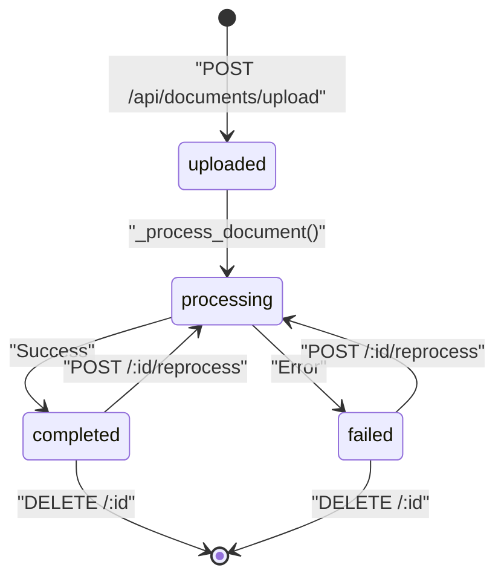
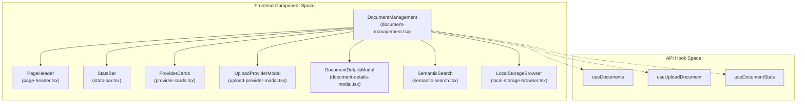
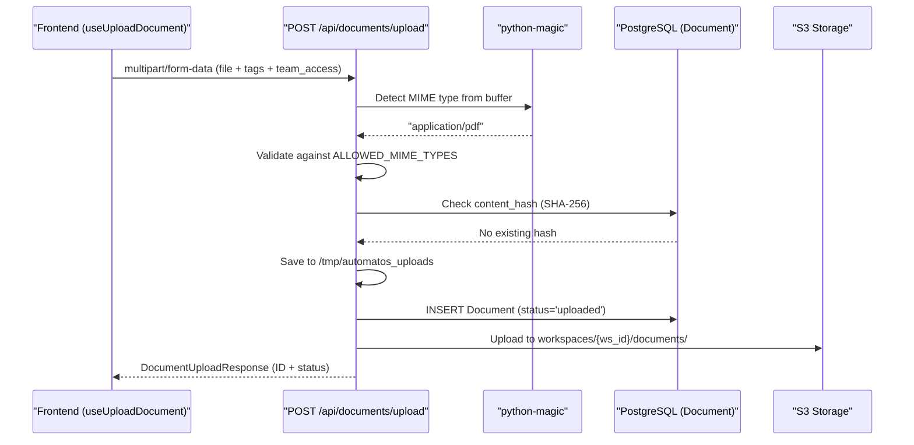
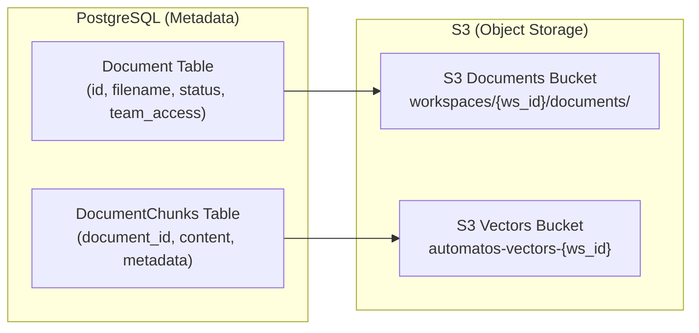

# Document Management

Relevant source files

The following files were used as context for generating this wiki page:

- [frontend/app/api-diagnostics/page.tsx](frontend/app/api-diagnostics/page.tsx)
- [frontend/app/marketplace/widgets/page.tsx](frontend/app/marketplace/widgets/page.tsx)
- [frontend/components/chatbot/citation-badge.tsx](frontend/components/chatbot/citation-badge.tsx)
- [frontend/components/context/rag-context-builder.tsx](frontend/components/context/rag-context-builder.tsx)
- [frontend/components/documents/document-analytics.tsx](frontend/components/documents/document-analytics.tsx)
- [frontend/components/documents/document-library.tsx](frontend/components/documents/document-library.tsx)
- [frontend/components/documents/document-management.tsx](frontend/components/documents/document-management.tsx)
- [frontend/components/documents/document-processing.tsx](frontend/components/documents/document-processing.tsx)
- [frontend/components/documents/document-upload.tsx](frontend/components/documents/document-upload.tsx)
- [frontend/components/documents/local-storage-browser.tsx](frontend/components/documents/local-storage-browser.tsx)
- [frontend/components/documents/processing/live-indicator.tsx](frontend/components/documents/processing/live-indicator.tsx)
- [frontend/components/documents/processing/live-progress-bar.tsx](frontend/components/documents/processing/live-progress-bar.tsx)
- [frontend/components/documents/provider-cards.tsx](frontend/components/documents/provider-cards.tsx)
- [frontend/components/documents/semantic-search.tsx](frontend/components/documents/semantic-search.tsx)
- [frontend/components/workspace/TemplateGallery.tsx](frontend/components/workspace/TemplateGallery.tsx)
- [frontend/hooks/use-rag-api.ts](frontend/hooks/use-rag-api.ts)
- [frontend/hooks/use-rag-feedback.ts](frontend/hooks/use-rag-feedback.ts)
- [frontend/hooks/use-semantic-search-api.ts](frontend/hooks/use-semantic-search-api.ts)
- [orchestrator/alembic/versions/20260218_rag_v3_entity_graph.py](orchestrator/alembic/versions/20260218_rag_v3_entity_graph.py)
- [orchestrator/alembic/versions/20260218_rag_v3_hybrid_search_and_feedback.py](orchestrator/alembic/versions/20260218_rag_v3_hybrid_search_and_feedback.py)
- [orchestrator/api/documents.py](orchestrator/api/documents.py)
- [orchestrator/api/widgets/docs.py](orchestrator/api/widgets/docs.py)
- [orchestrator/core/team_access.py](orchestrator/core/team_access.py)
- [orchestrator/modules/agents/services/agent_platform_tools.py](orchestrator/modules/agents/services/agent_platform_tools.py)
- [orchestrator/modules/rag/service.py](orchestrator/modules/rag/service.py)
- [orchestrator/modules/tools/formatting/result_formatter.py](orchestrator/modules/tools/formatting/result_formatter.py)

Document Management provides the interface for uploading, processing, and managing documents that feed into the RAG system. It handles file uploads via REST API, validates content types, stores documents in S3, and tracks metadata in PostgreSQL. Documents can be uploaded directly or synced automatically from cloud storage providers like Google Drive and Dropbox.

**Scope**: This page covers document upload, storage, metadata management, and team-based access control. For details on how documents are processed and chunked, see [Document Ingestion Pipeline](7.2). For retrieval algorithms, see [RAG Retrieval System](7.4).

---

## Document Lifecycle

Documents move through a defined lifecycle from upload to completion. The `DocumentManager` and API endpoints coordinate state transitions.

### Document States

**Sources**: [orchestrator/api/documents.py:106-115](), [orchestrator/api/documents.py:624-630]()

| State | Description | Database Field |
|-------|-------------|----------------|
| `uploaded` | File received, awaiting processing | `status='uploaded'` |
| `processing` | Extraction and chunking in progress | `status='processing'` |
| `completed` | Successfully processed and indexed | `status='completed'` |
| `failed` | Processing encountered an error | `status='failed'` |
| `duplicate` | Identical content hash already exists | `status='duplicate'` |

The `Document` model in PostgreSQL tracks this lifecycle with fields: `id`, `filename`, `file_type`, `file_size`, `upload_date`, `processed_date`, `status`, `chunk_count`, `content_hash`, and `workspace_id`.

**Sources**: [orchestrator/api/documents.py:154-164](), [frontend/components/documents/document-management.tsx:71-82]()

---

## Frontend Components

The document management interface is primarily handled by the `DocumentManagement` component, which utilizes a tabbed interface to separate local storage, cloud providers, and semantic search.

### Document Management UI Structure

**Sources**: [frontend/components/documents/document-management.tsx:4-65]()

- **`DocumentManagement`**: The main container managing tabs for Local Storage, Cloud Storage, and Semantic Search [frontend/components/documents/document-management.tsx:42-65]().
- **`LocalStorageBrowser`**: Handles the display and filtering of files stored directly in Automatos, supporting list and grid view modes [frontend/components/documents/local-storage-browser.tsx:62-70]().
- **`ProviderCards`**: Displays connected cloud providers (Google Drive, Dropbox, etc.) and their sync status [frontend/components/documents/document-management.tsx:62]().
- **`DocumentDetailsModal`**: Shows metadata, processing status, and chunk information for a specific document [frontend/components/documents/document-management.tsx:52]().
- **`SemanticSearch`**: A specialized search interface that uses the `useSemanticSearch` hook to find documents based on meaning rather than keywords [frontend/components/documents/semantic-search.tsx:38-46]().
- **`SchemaBrowser`**: An inline component within the document view that allows exploring database table metadata and column types [frontend/components/documents/document-management.tsx:106-188]().

---

## Upload and Processing Flow

### Direct Upload via API

The primary upload endpoint accepts multipart form data with file validation.

**Sources**: [orchestrator/api/documents.py:106-154](), [orchestrator/api/documents.py:166-175]()

**Key Validations**:
- **File Size**: Maximum 50MB enforced at [orchestrator/api/documents.py:126-127]().
- **MIME Type Detection**: Uses `python-magic` for content-based detection at [orchestrator/api/documents.py:130-131]().
- **Deduplication**: SHA-256 hash prevents duplicate uploads within a workspace at [orchestrator/api/documents.py:154-158]().
- **Team Access**: Documents can be tagged with specific teams (e.g., "Engineering", "HR") for scoped access [orchestrator/api/documents.py:113]().

### Document Content Retrieval
The `ToolResultFormatter` provides a unified way to fetch document content for agent use. It attempts to download the original text from S3 (for `.md`, `.txt`, etc.) before falling back to reassembling chunks from the `document_chunks` table [orchestrator/modules/tools/formatting/result_formatter.py:118-164]().

---

## Storage Architecture

Documents use a dual-storage model: metadata in PostgreSQL for queries, and files in S3 for cost-effective bulk storage.

### Storage Components

**Sources**: [orchestrator/api/documents.py:79-86](), [orchestrator/api/documents.py:170-175]()

**Table: documents**

| Column | Type | Purpose |
|--------|------|---------|
| `id` | SERIAL | Primary key [frontend/components/documents/document-management.tsx:72](). |
| `workspace_id` | UUID | Multi-tenant isolation [orchestrator/api/documents.py:157](). |
| `filename` | VARCHAR | Original filename [frontend/components/documents/document-management.tsx:73](). |
| `team_access` | JSONB/ARRAY | List of teams allowed to access this document [orchestrator/api/documents.py:113](). |
| `content_hash` | VARCHAR | SHA-256 for deduplication [orchestrator/api/documents.py:154](). |

---

## Team-Based Access Control (PRD-124)

The system implements strict team-based scoping for documents. Every query against documents must respect the `team_access` column.

- **Normalization**: Team names are normalized (lowercase, stripped) using `normalize_team()` to ensure consistency [orchestrator/core/team_access.py:14-20]().
- **Widget Scoping**: The `/api/widgets/docs` endpoints use a `TEAM_FILTER_CLAUSE` to ensure agents and widgets only see documents tagged for their specific team [orchestrator/api/widgets/docs.py:93-111]().
- **Effective Team**: The `effective_team()` helper resolves the team context by prioritizing API key (auth) team over request-level parameters [orchestrator/core/team_access.py:32-43]().

**Sources**: [orchestrator/core/team_access.py:1-47](), [orchestrator/api/widgets/docs.py:72-82]()

---

## Document API Reference

### Core Document API
| Endpoint | Method | Description |
|----------|--------|-------------|
| `/api/documents/upload` | `POST` | Upload and process a document [orchestrator/api/documents.py:106](). |
| `/api/documents/` | `GET` | List documents with workspace context [orchestrator/api/documents.py:29](). |
| `/api/documents/{id}/reprocess` | `POST` | Trigger re-extraction and chunking [orchestrator/api/documents.py:624](). |

### Widget Document API (Team-Scoped)
| Endpoint | Method | Description |
|----------|--------|-------------|
| `/api/widgets/docs/search` | `POST` | Search documents filtered by team access [orchestrator/api/widgets/docs.py:87](). |
| `/api/widgets/docs/{id}` | `GET` | Retrieve a single document, 404 if team-blocked [orchestrator/api/widgets/docs.py:135](). |
| `/api/widgets/docs/categories` | `GET` | Return distinct tags from team-scoped documents [orchestrator/api/widgets/docs.py:176](). |

**Sources**: [orchestrator/api/documents.py:29-106](), [orchestrator/api/widgets/docs.py:28-176]()

---