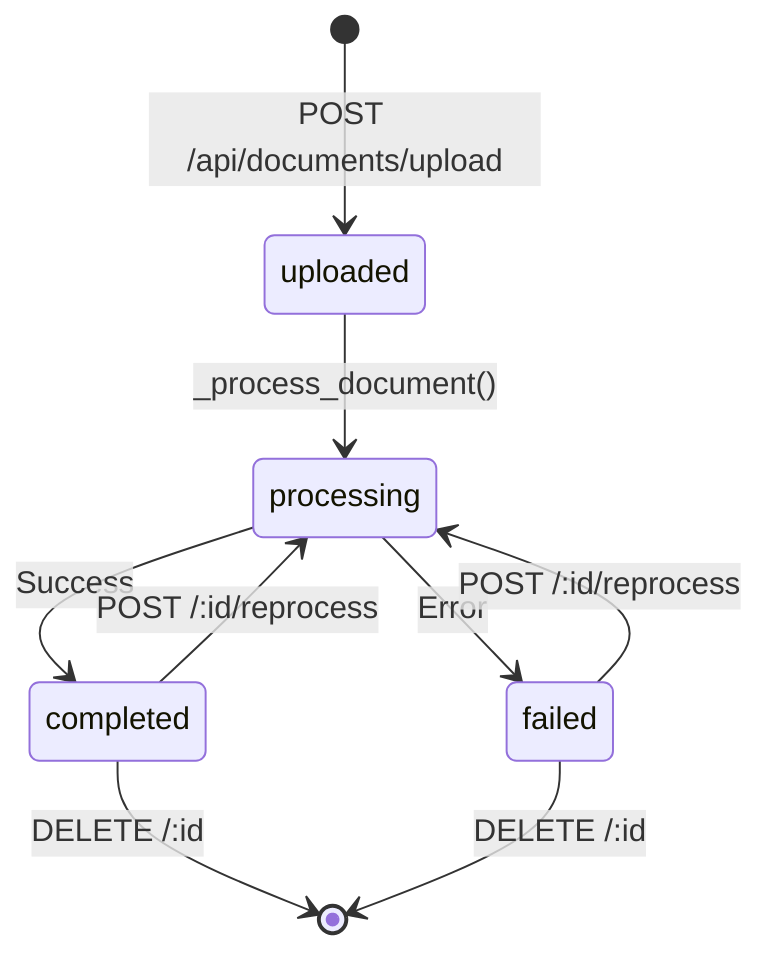
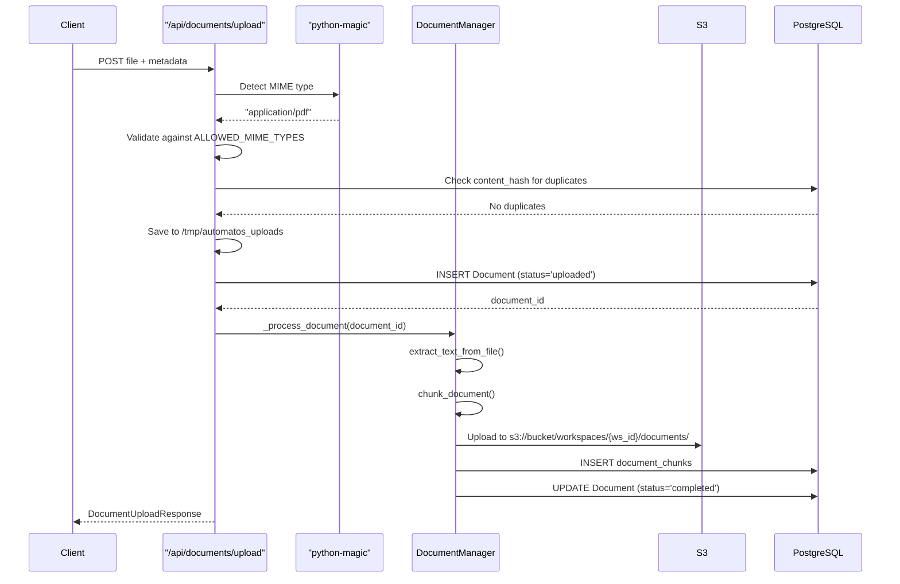
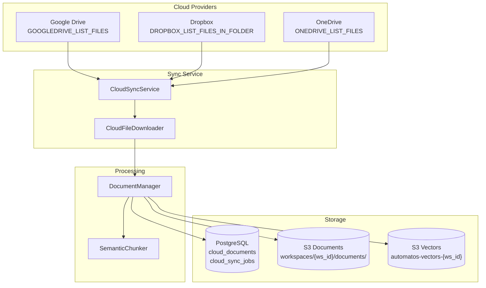
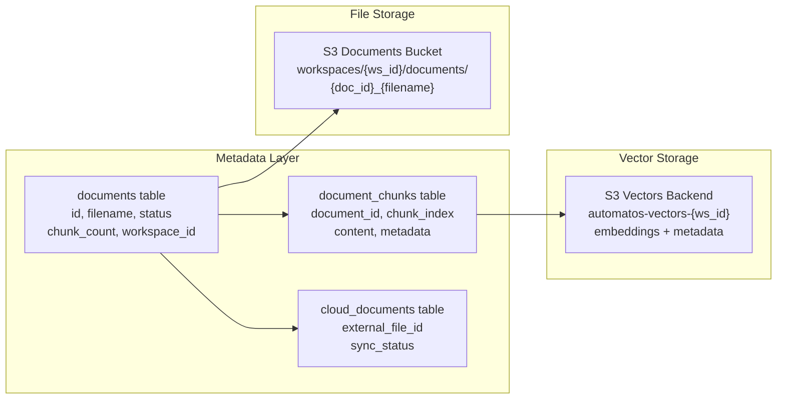
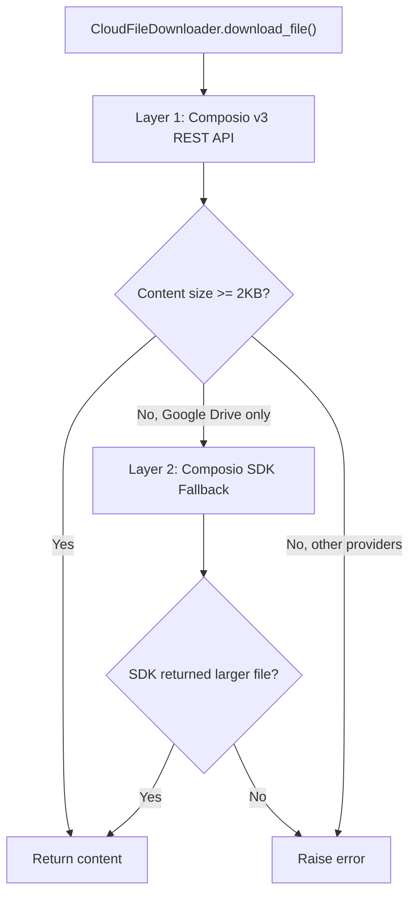
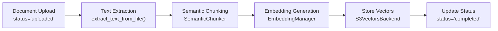

# Document Management

<details>
<summary>Relevant source files</summary>

The following files were used as context for generating this wiki page:

- [orchestrator/api/documents.py](orchestrator/api/documents.py)
- [orchestrator/core/composio/tool_executor.py](orchestrator/core/composio/tool_executor.py)
- [orchestrator/modules/agents/services/agent_platform_tools.py](orchestrator/modules/agents/services/agent_platform_tools.py)
- [orchestrator/modules/codegraph/ranking/__init__.py](orchestrator/modules/codegraph/ranking/__init__.py)
- [orchestrator/modules/codegraph/ranking/pagerank_ranker.py](orchestrator/modules/codegraph/ranking/pagerank_ranker.py)
- [orchestrator/modules/memory/integrations/mem0_client.py](orchestrator/modules/memory/integrations/mem0_client.py)
- [orchestrator/modules/rag/chunking/semantic_chunker.py](orchestrator/modules/rag/chunking/semantic_chunker.py)
- [orchestrator/modules/rag/ingestion/manager.py](orchestrator/modules/rag/ingestion/manager.py)
- [orchestrator/modules/rag/service.py](orchestrator/modules/rag/service.py)
- [orchestrator/modules/rag/services/cloud_file_downloader.py](orchestrator/modules/rag/services/cloud_file_downloader.py)
- [orchestrator/modules/rag/services/cloud_sync_service.py](orchestrator/modules/rag/services/cloud_sync_service.py)
- [orchestrator/modules/search/services/entity_extractor.py](orchestrator/modules/search/services/entity_extractor.py)

</details>


Document Management provides the interface for uploading, processing, and managing documents that feed into the RAG system. It handles file uploads via REST API, validates content types, stores documents in S3, and tracks metadata in PostgreSQL. Documents can be uploaded directly or synced automatically from cloud storage providers like Google Drive and Dropbox.

**Scope**: This page covers document upload, storage, metadata management, and cloud sync orchestration. For details on how documents are processed and chunked, see [Document Ingestion Pipeline](#5.2). For chunking algorithms, see [Semantic Chunking Strategies](#5.3). For using documents in retrieval, see [RAG Retrieval System](#5.4).

---

## Document Lifecycle

Documents move through a defined lifecycle from upload to completion. The `DocumentManager` and API endpoints coordinate state transitions.

### Document States



**Sources**: [orchestrator/api/documents.py:106-262](), [orchestrator/modules/rag/ingestion/manager.py:56-61]()

| State | Description | Database Field |
|-------|-------------|----------------|
| `uploaded` | File received, awaiting processing | `status='uploaded'` |
| `processing` | Extraction and chunking in progress | `status='processing'` |
| `completed` | Successfully processed and indexed | `status='completed'` |
| `failed` | Processing encountered an error | `status='failed'` |

The `Document` model in PostgreSQL tracks this lifecycle with fields: `id`, `filename`, `file_type`, `file_size`, `upload_date`, `processed_date`, `status`, `chunk_count`, `content_hash`, and `workspace_id`.

**Sources**: [orchestrator/modules/rag/ingestion/manager.py:585-601]()

---

## Upload Methods

### Direct Upload via API

The primary upload endpoint accepts multipart form data with file validation.



**Sources**: [orchestrator/api/documents.py:106-262]()

**Key Validations**:
- **File Size**: Maximum 50MB enforced at [orchestrator/api/documents.py:121-127]()
- **MIME Type Detection**: Uses `python-magic` for content-based detection (not just extension) at [orchestrator/api/documents.py:130-148]()
- **Deduplication**: SHA-256 hash prevents duplicate uploads at [orchestrator/api/documents.py:154-164]()

**Supported File Types**:

```python
ALLOWED_MIME_TYPES = {
    "application/pdf": [".pdf"],
    "application/vnd.openxmlformats-officedocument.wordprocessingml.document": [".docx"],
    "text/plain": [".txt", ".md", ".csv"],
    "text/markdown": [".md"],
    "text/csv": [".csv"],
    "application/json": [".json"],
    "application/vnd.openxmlformats-officedocument.spreadsheetml.sheet": [".xlsx"],
}
```

**Sources**: [orchestrator/api/documents.py:89-104]()

### Cloud Sync

Documents can be automatically synced from connected cloud storage providers. The `CloudSyncService` orchestrates folder scanning and batch processing.



**Sources**: [orchestrator/modules/rag/services/cloud_sync_service.py:38-48](), [orchestrator/modules/rag/services/cloud_file_downloader.py:60-143]()

For details on cloud sync implementation, see [Cloud Storage Integration](#5.5).

---

## Storage Architecture

Documents use a dual-storage model: metadata in PostgreSQL for queries, files in S3 for cost-effective bulk storage.

### Storage Components



**Sources**: [orchestrator/modules/rag/ingestion/manager.py:652-677]()

**Table: documents**

| Column | Type | Purpose |
|--------|------|---------|
| `id` | SERIAL | Primary key |
| `workspace_id` | TEXT | Multi-tenant isolation |
| `filename` | VARCHAR(255) | Original filename |
| `file_type` | VARCHAR(50) | Detected type (pdf, docx, etc.) |
| `file_size` | INTEGER | Bytes |
| `upload_date` | TIMESTAMP | Upload time |
| `processed_date` | TIMESTAMP | Processing completion time |
| `status` | VARCHAR(50) | uploaded/processing/completed/failed |
| `chunk_count` | INTEGER | Number of chunks generated |
| `content_hash` | VARCHAR(64) | SHA-256 for deduplication |
| `file_path` | TEXT | S3 key or local path (deprecated) |

**Sources**: [orchestrator/modules/rag/ingestion/manager.py:585-601]()

### S3 Document Upload Flow

The `DocumentManager._upload_to_s3()` method handles workspace-isolated storage:

```python
# S3 key structure: workspaces/{workspace_id}/documents/{document_id}_{filename}
s3_key = f"workspaces/{self.workspace_id}/documents/{document_id}_{filename}"
```

**Sources**: [orchestrator/modules/rag/ingestion/manager.py:652-677]()

**Bucket Configuration**:
- Document storage: `S3_DOCUMENTS_BUCKET` (default: `automatos-documents`)
- Vector storage: `automatos-vectors-{workspace_id}` (per-workspace buckets)
- Region: Configured via `AWS_REGION`

**Sources**: [orchestrator/modules/rag/ingestion/manager.py:420-434]()

---

## Document API Endpoints

### POST /api/documents/upload

Upload a document with validation and automatic processing.

**Request**:
```http
POST /api/documents/upload
Content-Type: multipart/form-data
X-Workspace-ID: {workspace_uuid}

file: <binary data>
description: "Q3 Financial Report"
tags: "finance,quarterly"
```

**Response**:
```json
{
  "document_id": 42,
  "filename": "q3-report.pdf",
  "status": "processing",
  "message": "Document uploaded successfully"
}
```

**Sources**: [orchestrator/api/documents.py:106-262]()

### GET /api/documents/

List documents with filtering and pagination.

**Query Parameters**:
- `skip`: Pagination offset (default: 0)
- `limit`: Max results (default: 100, max: 1000)
- `status`: Filter by status (uploaded/processing/completed/failed)
- `file_type`: Filter by type (pdf/docx/markdown/text)
- `search`: Search filename and description (case-insensitive)

**Example**:
```http
GET /api/documents/?status=completed&file_type=pdf&limit=20
X-Workspace-ID: {workspace_uuid}
```

**Sources**: [orchestrator/api/documents.py:442-491]()

### GET /api/documents/{document_id}

Retrieve document metadata.

**Response**:
```json
{
  "id": 42,
  "filename": "q3-report.pdf",
  "original_filename": "q3-report.pdf",
  "file_type": "pdf",
  "file_size": 2457600,
  "status": "completed",
  "chunk_count": 47,
  "tags": ["finance", "quarterly"],
  "description": "Q3 Financial Report",
  "upload_date": "2024-01-15T10:30:00Z",
  "processed_date": "2024-01-15T10:31:23Z",
  "created_by": "user@example.com"
}
```

**Sources**: [orchestrator/api/documents.py:493-524]()

### GET /api/documents/{document_id}/content

Retrieve reconstructed document content from chunks with optional highlighting.

**Query Parameters**:
- `highlight_chunk_ids`: Comma-separated chunk IDs to wrap in `<mark>` tags

**Response**:
```json
{
  "document_id": 42,
  "filename": "q3-report.pdf",
  "file_type": "pdf",
  "content": "Full reconstructed text...",
  "chunk_count": 47,
  "chunks": [
    {
      "chunk_id": 123,
      "chunk_index": 0,
      "content": "First chunk text...",
      "has_embedding": true,
      "metadata": {"entropy": 4.2, "topic_coherence": 0.85}
    }
  ]
}
```

**Sources**: [orchestrator/api/documents.py:699-768]()

### POST /api/documents/search

Semantic search across all document chunks using vector similarity.

**Request**:
```json
{
  "query": "revenue growth strategy",
  "limit": 10,
  "min_similarity": 0.70,
  "document_ids": [42, 43]
}
```

**Process**:
1. Generate query embedding via `EmbeddingManager`
2. Search S3 Vectors backend with `S3VectorsBackend.search()`
3. Look up document metadata from PostgreSQL
4. Group results by document, rank by similarity
5. Fetch preview chunks with context window

**Sources**: [orchestrator/api/documents.py:776-895]()

### DELETE /api/documents/{document_id}

Delete document and all associated chunks. Removes file from S3 and all database records.

**Impact Analysis**:
```http
GET /api/documents/{document_id}/delete-impact
```

Returns:
```json
{
  "vector_chunks": 47,
  "embeddings": 47,
  "references": 12,
  "storage_freed": "2.34 MB",
  "workflows_affected": []
}
```

**Sources**: [orchestrator/api/documents.py:526-622]()

### POST /api/documents/{document_id}/reprocess

Reprocess a failed or outdated document. Re-runs extraction and chunking with current settings.

**Requirements**:
- Original file must exist (either in S3 or local path)
- Status will temporarily change to `processing`

**Sources**: [orchestrator/api/documents.py:624-697]()

### GET /api/documents/analytics

Aggregate statistics across workspace documents.

**Response**:
```json
{
  "total_documents": 142,
  "status_distribution": {
    "completed": 135,
    "processing": 2,
    "failed": 5
  },
  "total_storage_bytes": 524288000,
  "total_storage_mb": 500.0,
  "file_type_distribution": {
    "pdf": 87,
    "docx": 32,
    "markdown": 23
  },
  "total_chunks": 6847,
  "average_chunks_per_document": 48.21,
  "recent_uploads_24h": 7,
  "processing_success_rate": 96.43,
  "last_updated": "2024-01-15T10:45:00Z"
}
```

**Sources**: [orchestrator/api/documents.py:362-440]()

---

## Cloud Integration

### Supported Providers

The `CloudFileDownloader` and `CloudSyncService` support multiple cloud storage providers via Composio actions.

| Provider | List Action | Download Action | Notes |
|----------|-------------|-----------------|-------|
| Google Drive | `GOOGLEDRIVE_LIST_FILES` | `GOOGLEDRIVE_DOWNLOAD_FILE` | Uses SDK fallback for large files |
| Dropbox | `DROPBOX_LIST_FILES_IN_FOLDER` | `DROPBOX_READ_FILE` | Full content in API response |
| OneDrive | `ONEDRIVE_LIST_FILES` | `ONEDRIVE_DOWNLOAD_FILE` | Standard REST API |
| Box | `BOX_LIST_FOLDER_ITEMS` | `BOX_DOWNLOAD_FILE` | Standard REST API |

**Sources**: [orchestrator/modules/rag/services/cloud_file_downloader.py:29-35](), [orchestrator/modules/rag/services/cloud_sync_service.py:30-35]()

### Download Strategy (PRD-42)

Cloud file downloads use a layered fallback approach to handle provider-specific quirks:



**Why Two Layers?**

Google Drive's v3 REST API truncates inline content to ~500 bytes. The SDK saves full files to disk on the container, which the downloader then reads.

**Content Extraction Priority** ([orchestrator/modules/rag/services/cloud_file_downloader.py:264-303]()):

1. **URL keys** (`s3url`, `downloadUrl`, `webContentLink`) — Composio hosts full file on R2/S3
2. **Content keys** (`file_content_bytes`, `downloaded_file_content`, `content`) — inline content
3. **Deep search** — any large string/bytes value in response

**Sources**: [orchestrator/modules/rag/services/cloud_file_downloader.py:72-143]()

### Sync Orchestration

The `CloudSyncService.sync_folder()` method coordinates batch syncing:

**Workflow**:
1. Query `cloud_sync_configs` for root folder path
2. Create `CloudSyncJob` (status='running')
3. List all files recursively via `list_files()`
4. Filter by supported extensions (`.pdf`, `.docx`, `.md`, etc.)
5. Check existing `cloud_documents` records for modification timestamps
6. Download changed files in parallel (max 3 concurrent)
7. Process via `DocumentManager.upload_document()`
8. Update `cloud_documents` with sync status and chunk count
9. Mark `CloudSyncJob` as completed with statistics

**Sources**: [orchestrator/modules/rag/services/cloud_sync_service.py:198-402]()

---

## Security & Validation

### MIME Type Detection

The upload endpoint uses `python-magic` to detect actual file content, not just the extension:

```python
detected_mime = magic.from_buffer(content, mime=True)
file_extension = Path(file.filename).suffix.lower()

if detected_mime not in ALLOWED_MIME_TYPES:
    raise HTTPException(status_code=400, detail=f"File type not allowed: {detected_mime}")

allowed_extensions = ALLOWED_MIME_TYPES[detected_mime]
if file_extension not in allowed_extensions:
    raise HTTPException(status_code=400, detail="Extension mismatch")
```

This prevents attackers from uploading malicious files with fake extensions (e.g., `malware.exe` renamed to `document.pdf`).

**Sources**: [orchestrator/api/documents.py:129-148]()

### Path Safety

Document download endpoints validate paths to prevent directory traversal attacks:

```python
allowed_base = Path("/var/automatos/documents").resolve()
requested_path = Path(path).resolve()

try:
    requested_path.relative_to(allowed_base)
except ValueError:
    raise HTTPException(status_code=403, detail="Access denied: Invalid path")
```

**Sources**: [orchestrator/api/documents.py:274-282]()

### Workspace Isolation

All API endpoints enforce workspace context via the `get_request_context_hybrid` dependency, which extracts `workspace_id` from the `X-Workspace-ID` header or Clerk JWT.

Database queries filter by `workspace_id`:

```python
documents = db.query(Document).filter(
    Document.workspace_id == ctx.workspace_id
).all()
```

S3 keys include workspace prefix:

```python
s3_key = f"workspaces/{workspace_id}/documents/{document_id}_{filename}"
```

**Sources**: [orchestrator/api/documents.py:107-113](), [orchestrator/modules/rag/ingestion/manager.py:663]()

---

## Document Processing Integration

Once uploaded, documents flow through the ingestion pipeline for text extraction and chunking. The `DocumentManager._process_document()` method coordinates this:



**Key Classes**:
- `DocumentProcessor`: Detects file type, extracts text from PDF/DOCX/XLSX/CSV
- `SemanticChunker`: Splits text into chunks using information-theoretic metrics
- `EmbeddingManager`: Generates OpenAI embeddings for each chunk
- `S3VectorsBackend`: Stores embeddings with metadata for retrieval

For implementation details, see [Document Ingestion Pipeline](#5.2) and [Semantic Chunking Strategies](#5.3).

**Sources**: [orchestrator/modules/rag/ingestion/manager.py:688-769]()

---

## Error Handling

### Failed Processing

When processing fails, the document status is set to `failed` and the error is logged. Users can retry via the reprocess endpoint.

Common failure scenarios:
- **Corrupted files**: PDF extraction fails
- **Unsupported content**: Scanned PDFs without OCR
- **Empty documents**: No text extracted
- **Timeout**: Processing exceeds time limit

**Sources**: [orchestrator/api/documents.py:245-248]()

### Duplicate Detection

The upload endpoint computes SHA-256 hash and checks `content_hash` before processing:

```python
content_hash = hashlib.sha256(content).hexdigest()
existing = db.query(Document).filter(
    Document.content_hash == content_hash,
    Document.workspace_id == ctx.workspace_id
).first()

if existing:
    return DocumentUploadResponse(
        document_id=existing.id,
        filename=existing.filename,
        status="duplicate",
        message="Document already exists"
    )
```

**Sources**: [orchestrator/api/documents.py:154-164]()

---

## Configuration

Document management behavior is controlled by environment variables and system settings:

| Variable | Default | Purpose |
|----------|---------|---------|
| `S3_DOCUMENTS_BUCKET` | `automatos-documents` | S3 bucket for document storage |
| `S3_VECTORS_ENABLED` | `false` | Use S3 for vector storage vs PostgreSQL |
| `AWS_REGION` | `us-east-1` | S3 region |
| `AWS_ACCESS_KEY_ID` | (required) | S3 credentials |
| `AWS_SECRET_ACCESS_KEY` | (required) | S3 credentials |
| `POSTGRES_*` | Various | Database connection |

**Sources**: [orchestrator/modules/rag/ingestion/manager.py:405-445]()

---

## Usage Examples

### Upload and Process Document

```python
from modules.rag.ingestion.manager import DocumentManager

# Initialize with workspace isolation
doc_manager = DocumentManager(
    db_config={
        'host': 'localhost',
        'port': 5432,
        'database': 'automatos',
        'user': 'postgres',
        'password': 'password'
    },
    workspace_id='ws_abc123',
    use_s3_vectors=True,
    s3_bucket='automatos-documents'
)

# Upload document
document_id = await doc_manager.upload_document(
    file_path='/tmp/report.pdf',
    filename='Q3-Report.pdf',
    tags=['finance', 'quarterly'],
    description='Q3 Financial Report',
    created_by='user@example.com'
)

print(f"Document uploaded with ID: {document_id}")
```

**Sources**: [orchestrator/modules/rag/ingestion/manager.py:688-769]()

### Sync Cloud Documents

```python
from modules.rag.services.cloud_sync_service import CloudSyncService

service = CloudSyncService(db)

# List folders
folders = await service.list_folders(connection_id=1, path="/")

# Sync all files in a folder
job = await service.sync_folder(
    connection_id=1,
    workspace_id=workspace_uuid
)

print(f"Synced {job.files_synced} files, {job.total_chunks} chunks")
```

**Sources**: [orchestrator/modules/rag/services/cloud_sync_service.py:59-193]()

---

**Summary**: Document Management provides the entry point for knowledge into the RAG system, handling uploads, cloud sync, storage, and metadata tracking. Documents flow through validation, storage in S3, and handoff to the ingestion pipeline for processing. The REST API enables programmatic document management with workspace isolation and comprehensive analytics.

---