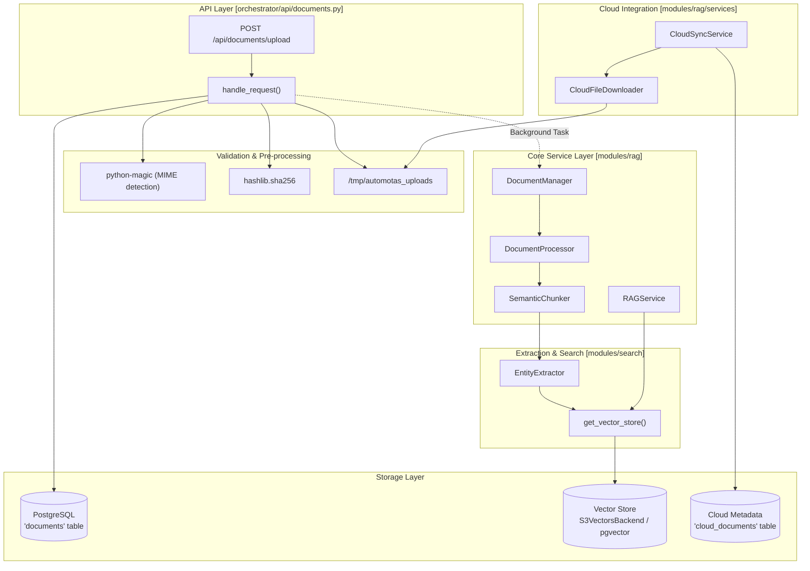
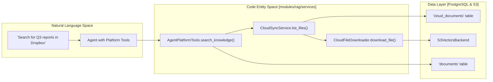

# Documents API Reference

Relevant source files

The following files were used as context for generating this wiki page:

- [docker-compose.yml](docker-compose.yml)
- [frontend/.dockerignore](frontend/.dockerignore)
- [frontend/Dockerfile](frontend/Dockerfile)
- [frontend/components/documents/local-storage-browser.tsx](frontend/components/documents/local-storage-browser.tsx)
- [orchestrator/Dockerfile](orchestrator/Dockerfile)
- [orchestrator/api/cloud_documents.py](orchestrator/api/cloud_documents.py)
- [orchestrator/api/documents.py](orchestrator/api/documents.py)
- [orchestrator/api/knowledge_multimodal.py](orchestrator/api/knowledge_multimodal.py)
- [orchestrator/core/redis/client.py](orchestrator/core/redis/client.py)
- [orchestrator/modules/agents/services/agent_platform_tools.py](orchestrator/modules/agents/services/agent_platform_tools.py)
- [orchestrator/modules/rag/chunking/semantic_chunker.py](orchestrator/modules/rag/chunking/semantic_chunker.py)
- [orchestrator/modules/rag/ingestion/manager.py](orchestrator/modules/rag/ingestion/manager.py)
- [orchestrator/modules/rag/service.py](orchestrator/modules/rag/service.py)
- [orchestrator/modules/rag/services/cloud_file_downloader.py](orchestrator/modules/rag/services/cloud_file_downloader.py)
- [orchestrator/modules/rag/services/cloud_sync_service.py](orchestrator/modules/rag/services/cloud_sync_service.py)
- [orchestrator/modules/search/services/entity_extractor.py](orchestrator/modules/search/services/entity_extractor.py)
- [orchestrator/modules/tools/formatting/result_formatter.py](orchestrator/modules/tools/formatting/result_formatter.py)
- [orchestrator/requirements.txt](orchestrator/requirements.txt)

## Purpose and Scope

The Documents API provides a high-performance REST interface for document lifecycle management within the Automatos AI knowledge base. It handles the transition of raw files, cloud storage objects, and database schemas into structured, searchable data through a multi-stage ingestion pipeline. This pipeline encompasses validation, text extraction, semantic chunking, embedding generation, and multi-tier vector storage.

The API is designed for technical integration, supporting manual user uploads, automated synchronization from cloud storage providers (PRD-42), and knowledge graph extraction (PRD-21/126). It enforces strict workspace isolation and team-based access control to ensure data privacy in multi-tenant environments.

**Sources:** [orchestrator/api/documents.py:1-7](), [orchestrator/modules/rag/ingestion/manager.py:1-12](), [orchestrator/api/knowledge_multimodal.py:1-22]()

---

## System Architecture & Data Flow

The Documents API acts as the gateway to the RAG (Retrieval-Augmented Generation) and Knowledge Graph subsystems. It coordinates between the FastAPI web layer, the PostgreSQL metadata store, and the vector storage backends.

### Document Ingestion & RAG Pipeline

The following diagram illustrates the flow from a client request to the final vector and graph representations in "Code Entity Space".

**Document Ingestion Pipeline**

**Sources:** [orchestrator/api/documents.py:106-261](), [orchestrator/modules/rag/ingestion/manager.py:113-203](), [orchestrator/modules/rag/services/cloud_sync_service.py:38-48](), [orchestrator/modules/rag/service.py:142-162]()

---

## API Reference

### 1. Document Upload
**Endpoint:** `POST /api/documents/upload`

Uploads a file for processing. The system uses `python-magic` to inspect the file buffer and determine the true MIME type, regardless of the provided file extension [orchestrator/api/documents.py:131-140]().

| Parameter | Type | Required | Description |
|---|---|---|---|
| `file` | `UploadFile` | Yes | The document file (max 50MB) [orchestrator/api/documents.py:127-128](). |
| `description` | `str` | No | Optional metadata description. |
| `tags` | `str` | No | Comma-separated string of tags. |
| `team_access` | `str` | No | JSON string of teams allowed to access. |

**Allowed MIME Types:**
The system maintains a strict allowlist in `ALLOWED_MIME_TYPES` [orchestrator/api/documents.py:89-104]().
- **PDF:** `application/pdf`
- **Word:** `application/vnd.openxmlformats-officedocument.wordprocessingml.document`
- **Text/Markdown:** `text/plain`, `text/markdown`, `text/html`
- **Data:** `text/csv`, `application/json`, `application/vnd.openxmlformats-officedocument.spreadsheetml.sheet`

**Sources:** [orchestrator/api/documents.py:89-104](), [orchestrator/api/documents.py:121-148]()

### 2. Cloud Synchronization (PRD-42)
**Service:** `CloudSyncService`

Orchestrates the synchronization of documents from external cloud providers (Google Drive, Dropbox, OneDrive, Box) via Composio [orchestrator/modules/rag/services/cloud_sync_service.py:30-35]().

- **List Folders/Files:** `list_folders` and `list_files` use `ComposioToolExecutor` to navigate remote storage and cache results in `Redis` to reduce API calls [orchestrator/modules/rag/services/cloud_sync_service.py:59-135]().
- **Download:** `CloudFileDownloader` implements a multi-layer strategy, using the Composio v3 REST API with an SDK fallback specifically for Google Drive to prevent content truncation (~500 byte limit in standard API) [orchestrator/modules/rag/services/cloud_file_downloader.py:95-120]().

**Sources:** [orchestrator/modules/rag/services/cloud_sync_service.py:11-27](), [orchestrator/modules/rag/services/cloud_file_downloader.py:72-120]()

### 3. Multimodal Knowledge API
**Endpoint:** `GET /api/knowledge/types`

Provides a unified interface for all knowledge base types, including documents, code, tables, images, and formulas [orchestrator/api/knowledge_multimodal.py:6-14](). It returns metadata and item counts per type for the current workspace [orchestrator/api/knowledge_multimodal.py:133-175]().

**Sources:** [orchestrator/api/knowledge_multimodal.py:51-175]()

---

## Implementation Details

### Multi-Layer Extraction & Chunking
The `DocumentProcessor` handles multiple file formats, delegating to specialized libraries:
- **PDF:** Uses `pdfplumber` with a `PyPDF2` fallback for robust text extraction. It includes logic to remove null characters and fix common PDF extraction double-character issues [orchestrator/modules/rag/ingestion/manager.py:157-194]().
- **DOCX:** Uses `docx.Document` [orchestrator/modules/rag/ingestion/manager.py:196-203]().
- **Semantic Chunking:** The `SemanticChunker` implements advanced strategies including `ADAPTIVE` (default), `SEMANTIC_SIMILARITY` (embedding-based boundaries), and `TOPIC_COHERENCE` [orchestrator/modules/rag/chunking/semantic_chunker.py:22-29]().

### RAG Retrieval System
The `RAGService` wraps the `ContextOptimizer` to provide optimized retrieval using:
- **Knapsack Optimization:** Fitting the most relevant content into token budgets [orchestrator/modules/rag/service.py:172-174]().
- **MMR (Maximal Marginal Relevance):** Balancing relevance and diversity [orchestrator/modules/rag/service.py:132-133]().
- **Hybrid Search:** Combines vector similarity (70% weight) and keyword matching (30% weight) [orchestrator/modules/rag/service.py:115-117]().

### Entity & Relationship Extraction
The `EntityExtractor` (PRD-21) processes text to build the Knowledge Graph:
- **Regex Extraction:** Fast identification of technology names and acronyms [orchestrator/modules/search/services/entity_extractor.py:90-121]().
- **LLM Extraction:** High-accuracy extraction of Organizations, People, and Products using `gpt-4o-mini` by default [orchestrator/modules/search/services/entity_extractor.py:123-184]().

### Vector Storage Backends
The system supports pluggable backends via the `get_vector_store` factory [orchestrator/modules/search/vector_store/__init__.py:22-39]():
- **pgvector:** Local PostgreSQL storage using the `pgvector` extension [orchestrator/Dockerfile:11]().
- **S3 Vectors:** Distributed storage for high-scale document sets using `S3VectorsBackend` [orchestrator/modules/rag/services/cloud_sync_service.py:25]().

**Cloud Sync Logic**

**Sources:** [orchestrator/modules/rag/services/cloud_sync_service.py:116-167](), [orchestrator/modules/rag/services/cloud_file_downloader.py:72-84](), [orchestrator/modules/agents/services/agent_platform_tools.py:60-77]()

---

## Storage & Security

### Metadata and Sync Tracking
- **Cloud Metadata:** The `CloudDocument` model tracks external file IDs, S3 vector pointers, and sync status (`pending`, `syncing`, `synced`, `error`) [orchestrator/modules/rag/services/cloud_sync_service.py:168-192]().
- **Sync Jobs:** `CloudSyncJob` records the results of synchronization runs, including counts of files synced, skipped, or errored [orchestrator/modules/rag/services/cloud_sync_service.py:8-9]().

### Security Measures
- **Path Sanitization:** Uploaded files are saved to `/tmp/automotas_uploads` using random hex UUIDs to prevent directory traversal attacks [orchestrator/api/documents.py:168-172]().
- **Hash Verification:** SHA256 content hashes are used to detect and prevent duplicate document processing within a workspace [orchestrator/api/documents.py:155-165]().
- **Size Limits:** A 50MB hard limit is enforced on all uploads [orchestrator/api/documents.py:127-128]().
- **MIME Validation:** Uses `python-magic` for server-side content inspection rather than trusting the `Content-Type` header [orchestrator/api/documents.py:131-133]().

**Sources:** [orchestrator/api/documents.py:127-172](), [orchestrator/modules/rag/ingestion/manager.py:15-22](), [orchestrator/requirements.txt:31]()

---