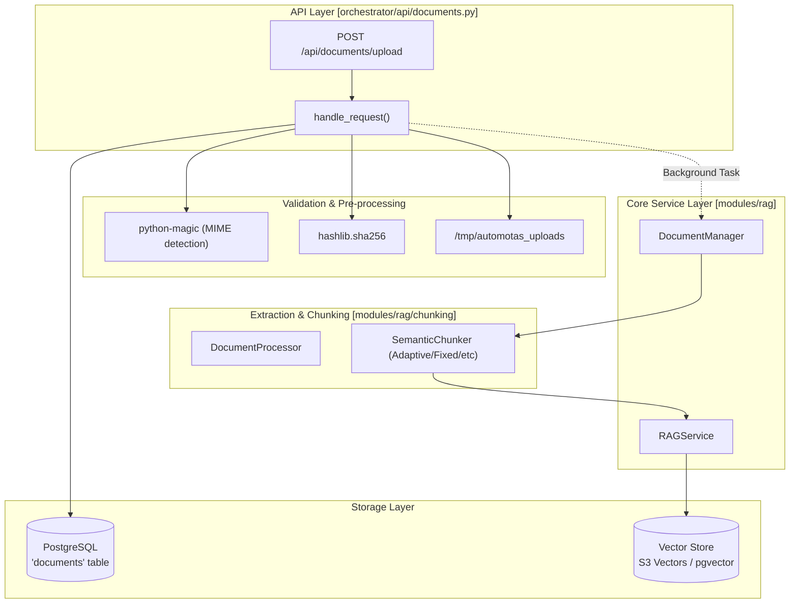
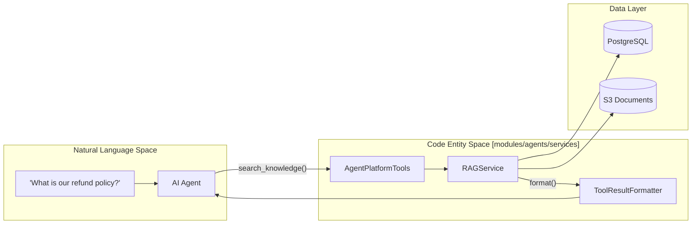

# Documents API Reference

Relevant source files

The following files were used as context for generating this wiki page:

- [frontend/components/documents/document-management.tsx](frontend/components/documents/document-management.tsx)
- [frontend/components/documents/local-storage-browser.tsx](frontend/components/documents/local-storage-browser.tsx)
- [orchestrator/api/documents.py](orchestrator/api/documents.py)
- [orchestrator/api/widgets/docs.py](orchestrator/api/widgets/docs.py)
- [orchestrator/core/team_access.py](orchestrator/core/team_access.py)
- [orchestrator/modules/agents/services/agent_platform_tools.py](orchestrator/modules/agents/services/agent_platform_tools.py)
- [orchestrator/modules/rag/service.py](orchestrator/modules/rag/service.py)
- [orchestrator/modules/tools/formatting/result_formatter.py](orchestrator/modules/tools/formatting/result_formatter.py)

## Purpose and Scope

The Documents API provides a high-performance REST interface for document lifecycle management within the Automatos AI knowledge base. It handles the transition of raw files, cloud-stored assets, and database schemas into structured, searchable data through a multi-stage ingestion pipeline. This pipeline encompasses validation, text extraction, semantic chunking (using 5 distinct strategies), embedding generation, and multi-tier vector storage.

The API supports manual user uploads, automated synchronization from cloud storage providers (PRD-42) via the `CloudSyncService`, and team-scoped document access (PRD-124). It enforces strict workspace isolation to ensure data privacy in multi-tenant environments.

**Sources:** [orchestrator/api/documents.py:2-7](), [orchestrator/modules/rag/service.py:1-10](), [orchestrator/api/widgets/docs.py:2-10]()

---

## System Architecture & Data Flow

The Documents API acts as the gateway to the RAG (Retrieval-Augmented Generation) subsystem. It coordinates between the FastAPI web layer, the PostgreSQL metadata store, and the vector storage backends.

### Document Ingestion Pipeline

The following diagram illustrates the flow from a client request to the final vector representation, mapping API handlers to the core service entities.

**Sources:** [orchestrator/api/documents.py:106-261](), [orchestrator/api/documents.py:77-86](), [orchestrator/modules/rag/service.py:142-162](), [orchestrator/modules/rag/service.py:187-195]()

---

## API Reference

### 1. Document Upload
**Endpoint:** `POST /api/documents/upload`

Uploads a file for processing. The system uses `python-magic` to inspect the file buffer and determine the true MIME type, regardless of the provided file extension.

| Parameter | Type | Required | Description |
|---|---|---|---|
| `file` | `UploadFile` | Yes | The document file (max 50MB). |
| `description` | `str` | No | Optional metadata description. |
| `tags` | `str` | No | Comma-separated string of tags. |
| `team_access` | `str` | No | Comma-separated list of teams for PRD-124 scoping. |

**Allowed MIME Types:**
The system maintains a strict allowlist in `ALLOWED_MIME_TYPES`.
- **PDF:** `application/pdf`
- **Word:** `application/vnd.openxmlformats-officedocument.wordprocessingml.document`
- **Text/Markdown:** `text/plain`, `text/markdown`, `text/html`
- **Data:** `text/csv`, `application/json`, `application/vnd.openxmlformats-officedocument.spreadsheetml.sheet`

**Sources:** [orchestrator/api/documents.py:89-104](), [orchestrator/api/documents.py:121-148](), [orchestrator/api/documents.py:107-115]()

### 2. Semantic Search
**Endpoint:** `GET /api/documents/search`

Performs semantic search across the workspace knowledge base. This endpoint leverages the `RAGService` to convert natural language queries into vector space searches using `ContextOptimizer` (Knapsack, MMR, and Entropy strategies).

| Query Param | Type | Default | Description |
|---|---|---|---|
| `query` | `str` | Required | The search string. |
| `limit` | `int` | 5 | Number of chunks to return. |
| `min_similarity` | `float` | 0.5 | Cosine similarity threshold. |

**Sources:** [orchestrator/api/documents.py:533-550](), [orchestrator/modules/rag/service.py:170-174]()

### 3. Widget & Team-Scoped Docs
**Endpoint:** `POST /api/widgets/docs/search`

A specialized endpoint for team-based document retrieval. It applies the `TEAM_FILTER_CLAUSE` to ensure agents and widgets only see documents tagged for their specific team.

| Field | Type | Description |
|---|---|---|
| `query` | `str` | Search query. |
| `team` | `str` | Optional team filter override (normalized via `normalize_team`). |
| `limit` | `int` | Max results (default 10). |

**Sources:** [orchestrator/api/widgets/docs.py:35-39](), [orchestrator/api/widgets/docs.py:87-116](), [orchestrator/core/team_access.py:14-20]()

### 4. Cloud Storage Integration (PRD-42)
**Endpoint:** `POST /api/cloud-storage/sync`

Triggers a background synchronization job with external providers (Google Drive, OneDrive, S3). It uses `CloudSyncService` to traverse folders and ingest new or updated documents into the platform's vector store.

**Sources:** [frontend/components/documents/document-management.tsx:68](), [orchestrator/api/documents.py:79-81]()

---

## Implementation Details

### Multi-Tenancy & Team Access
Every request is intercepted by `get_request_context_hybrid`. The `workspace_id` is injected into the `DocumentManager` factory. For team-based security, `effective_team` resolves the identity from the API key or request context, ensuring "Support" and "support" are treated as the same domain via `normalize_team`.

**Sources:** [orchestrator/api/documents.py:108](), [orchestrator/api/documents.py:77-86](), [orchestrator/core/team_access.py:32-43]()

### Agent Research Tools
Agents access the knowledge base via `AgentPlatformTools`, which provides function-calling definitions for `search_knowledge` and `semantic_search`.

**Sources:** [orchestrator/modules/agents/services/agent_platform_tools.py:26-44](), [orchestrator/modules/agents/services/agent_platform_tools.py:56-77](), [orchestrator/modules/tools/formatting/result_formatter.py:18-22]()

### Storage Strategy
The system supports two primary vector backends, toggled via `config.S3_VECTORS_ENABLED`:
1. **Local (pgvector):** Vectors are stored in the PostgreSQL database using the `pgvector` extension.
2. **Cloud (S3 Vectors):** Vectors are stored in an S3 bucket (`S3_DOCUMENTS_BUCKET`), enabling horizontal scaling.

**Sources:** [orchestrator/api/documents.py:79-85](), [orchestrator/api/documents.py:68-74]()

---

## Error Handling and Security

| Category | Implementation |
|---|---|
| **Path Safety** | Uses `pathlib.Path` and strict prefix checks to prevent directory traversal. |
| **File Integrity** | Computes SHA256 hashes to detect duplicates and prevent redundant processing. |
| **MIME Validation** | Rejects uploads where extension does not match `python-magic` detected type. |
| **Result Formatting** | `ToolResultFormatter` cleans hash prefixes from filenames and truncates excerpts at sentence boundaries. |

**Sources:** [orchestrator/api/documents.py:153-164](), [orchestrator/api/documents.py:130-148](), [orchestrator/modules/tools/formatting/result_formatter.py:25-42](), [orchestrator/modules/tools/formatting/result_formatter.py:45-67]()

---