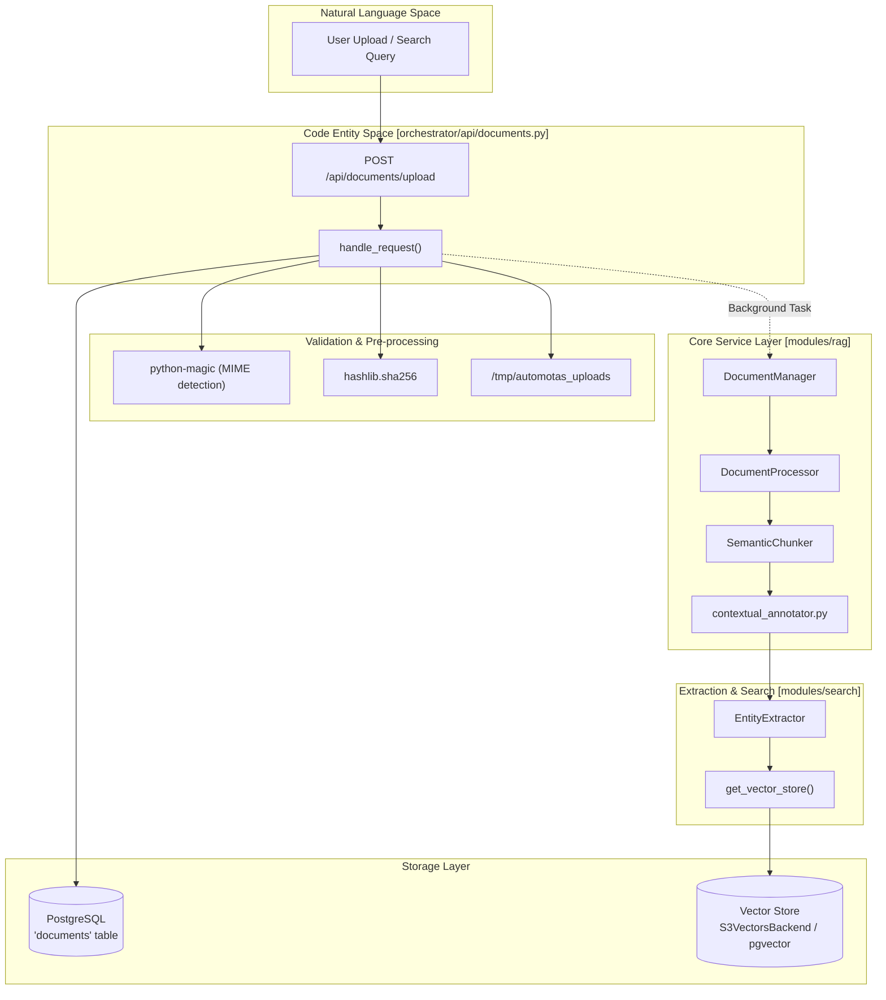
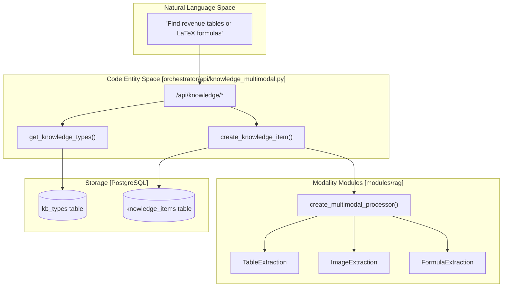

# Documents API Reference

Relevant source files

The following files were used as context for generating this wiki page:

- [orchestrator/alembic/versions/prd158_teams_table.py](orchestrator/alembic/versions/prd158_teams_table.py)
- [orchestrator/api/context.py](orchestrator/api/context.py)
- [orchestrator/api/documents.py](orchestrator/api/documents.py)
- [orchestrator/api/github_webhooks.py](orchestrator/api/github_webhooks.py)
- [orchestrator/api/knowledge_multimodal.py](orchestrator/api/knowledge_multimodal.py)
- [orchestrator/api/system.py](orchestrator/api/system.py)
- [orchestrator/api/teams.py](orchestrator/api/teams.py)
- [orchestrator/api/widgets/__init__.py](orchestrator/api/widgets/__init__.py)
- [orchestrator/api/widgets/data.py](orchestrator/api/widgets/data.py)
- [orchestrator/api/widgets/documents.py](orchestrator/api/widgets/documents.py)
- [orchestrator/core/team_access.py](orchestrator/core/team_access.py)
- [orchestrator/modules/rag/ingestion/contextual_annotator.py](orchestrator/modules/rag/ingestion/contextual_annotator.py)
- [orchestrator/modules/rag/ingestion/manager.py](orchestrator/modules/rag/ingestion/manager.py)
- [orchestrator/modules/rag/service.py](orchestrator/modules/rag/service.py)
- [orchestrator/modules/rag/services/multimodal_knowledge_tools.py](orchestrator/modules/rag/services/multimodal_knowledge_tools.py)
- [orchestrator/modules/search/services/entity_extractor.py](orchestrator/modules/search/services/entity_extractor.py)
- [orchestrator/modules/tools/execution/exec_multimodal.py](orchestrator/modules/tools/execution/exec_multimodal.py)
- [orchestrator/tests/security/test_s5_closures.py](orchestrator/tests/security/test_s5_closures.py)
- [orchestrator/tests/security/test_tenancy_matrix.py](orchestrator/tests/security/test_tenancy_matrix.py)
- [orchestrator/tests/test_documents_team_filter.py](orchestrator/tests/test_documents_team_filter.py)
- [orchestrator/tests/test_entity_extractor_no_vendor_key.py](orchestrator/tests/test_entity_extractor_no_vendor_key.py)
- [orchestrator/tests/test_p2w1_contextual_annotations.py](orchestrator/tests/test_p2w1_contextual_annotations.py)
- [orchestrator/tests/test_teams_api.py](orchestrator/tests/test_teams_api.py)
- [orchestrator/tests/test_widget_docs_schema.py](orchestrator/tests/test_widget_docs_schema.py)

## Purpose and Scope

The Documents API provides a high-performance REST interface for document lifecycle management within the Automatos AI knowledge base. It handles the transition of raw files, cloud storage objects, and database schemas into structured, searchable data through a multi-stage ingestion pipeline. This pipeline encompasses validation, text extraction, semantic chunking, contextual annotation (PRD-188), embedding generation, and multi-tier vector storage.

The API is designed for technical integration, supporting manual user uploads, automated synchronization from cloud storage providers, and knowledge graph extraction. It enforces strict workspace isolation and team-based access control to ensure data privacy in multi-tenant environments.

Sources: `[orchestrator/api/documents.py:1-7]()`, `[orchestrator/modules/rag/ingestion/manager.py:1-12]`, `[orchestrator/modules/rag/service.py:1-10]()`

---

## System Architecture & Data Flow

The Documents API acts as the gateway to the RAG (Retrieval-Augmented Generation) and Knowledge Graph subsystems. It coordinates between the FastAPI web layer, the PostgreSQL metadata store, and the vector storage backends.

### Document Ingestion & RAG Pipeline

The following diagram illustrates the flow from a natural language user request to the underlying code entity space during document ingestion and search execution.

Sources: `[orchestrator/api/documents.py:106-261]`, `[orchestrator/modules/rag/ingestion/manager.py:113-203]`, `[orchestrator/modules/rag/ingestion/contextual_annotator.py:111-136]`, `[orchestrator/modules/search/vector_store/__init__.py:22-55]()`

---

## API Endpoints Reference

### 1. Document Upload
**Endpoint:** `POST /api/documents/upload`

Uploads and processes a document. The system inspects the file buffer via `python-magic` to determine the actual MIME type regardless of extension `[orchestrator/api/documents.py:131-140]()`.

| Parameter | Type | Required | Description |
|---|---|---|---|
| `file` | `UploadFile` | Yes | Target document file (max 50MB) `[orchestrator/api/documents.py:109-115]()`. |
| `description` | `str` | No | Optional description metadata `[orchestrator/api/documents.py:116]()`. |
| `tags` | `str` | No | Comma-separated tag list `[orchestrator/api/documents.py:117]()`. |
| `team_access` | `str` | No | Target team access control JSON `[orchestrator/api/documents.py:118]()`. |

**Allowed MIME Types:**
Enforced via `ALLOWED_MIME_TYPES` mapping `[orchestrator/api/documents.py:89-104]()`:
- **PDF:** `application/pdf`
- **Word:** `application/vnd.openxmlformats-officedocument.wordprocessingml.document`
- **Text/Markdown:** `text/plain`, `text/markdown`, `text/html`
- **Data:** `text/csv`, `application/json`, `application/vnd.openxmlformats-officedocument.spreadsheetml.sheet`

Sources: `[orchestrator/api/documents.py:89-155]()`

### 2. Document Search & Context Analytics
**Endpoint:** `GET /api/context/stats`

Returns real-time context engineering and RAG performance statistics, strictly scoped to the workspace of the requesting entity unless admin privileges are present `[orchestrator/api/context.py:88-112]()`.

Sources: `[orchestrator/api/context.py:88-112]`, `[orchestrator/modules/rag/service.py:54-65]()`

### 3. Document Content Access & Download
**Endpoint:** `GET /api/documents/content`

Fetches raw document content or triggers file streaming via `FileResponse`. Requires hybrid authentication (`get_request_context_hybrid`) to secure tenant boundaries `[orchestrator/api/documents.py:270-280]()`.

Sources: `[orchestrator/api/documents.py:270-280]`, `[orchestrator/tests/security/test_s5_closures.py:19-24]()`

---

## Multimodal Knowledge API Integration

The multimodal knowledge API routes under `/api/knowledge` provide unified management for heterogeneous knowledge elements including documents, extracted tables, images, formulas, and knowledge graph entities `[orchestrator/api/knowledge_multimodal.py:1-22]()`.

Sources: `[orchestrator/api/knowledge_multimodal.py:1-180]`, `[orchestrator/modules/rag/__init__.py:1-44]()`

---

## Implementation Details & Core Services

### Contextual Chunk Annotation (PRD-188)
To maximize retrieval performance, chunks undergo contextual augmentation `[orchestrator/modules/rag/ingestion/contextual_annotator.py:1-10]()`:
- **Execution:** An internal LLM evaluates the parent document to generate a brief contextual situating prefix `[orchestrator/modules/rag/ingestion/contextual_annotator.py:49-58]()`.
- **Persistence:** Injected directly into `DocumentChunk.content` and logged in metadata `[orchestrator/modules/rag/ingestion/contextual_annotator.py:104-108]()`.
- **Resilience:** Errors degrade safely to raw text ingestion without interrupting the pipeline `[orchestrator/modules/rag/ingestion/contextual_annotator.py:90-95]()`.

### Semantic Retrieval & Optimization
Managed via `RAGService` and configured through `RAGConfig` `[orchestrator/modules/rag/service.py:128-158]()`:
- **Hybrid Search:** Combines dense vectors with BM25 sparse legs via Reciprocal Rank Fusion (RRF) `[orchestrator/modules/rag/service.py:144-155]()`.
- **Reranking:** Post-processes candidate rankings to ensure precision `[orchestrator/modules/rag/service.py:187-191]()`.
- **Parent-Child Expansion:** Expands target chunks to parent sections during context assembly `[orchestrator/modules/rag/service.py:156-157]()`.

Sources: `[orchestrator/modules/rag/service.py:128-200]`, `[orchestrator/modules/rag/ingestion/contextual_annotator.py:29-47]()`

---

## Storage & Security

### Security & Multi-Tenancy Controls
- **Workspace Scoping:** All reads, writes, and analytics metrics query with explicit `workspace_id` parameters `[orchestrator/tests/security/test_s5_closures.py:34-50]()`.
- **Path Sanitization:** Upload files utilize UUID hex naming schemes in `/tmp/automotas_uploads` to block traversal exploits `[orchestrator/api/documents.py:173-176]()`.
- **Content Deduping:** SHA256 hashes prevent duplicate document ingestion within the same workspace `[orchestrator/api/documents.py:159-170]()`.

Sources: `[orchestrator/api/documents.py:109-176]`, `[orchestrator/tests/security/test_s5_closures.py:34-51]`, `[orchestrator/modules/rag/ingestion/manager.py:15-22]()`

---