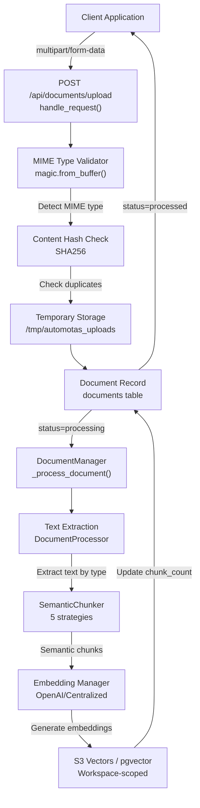
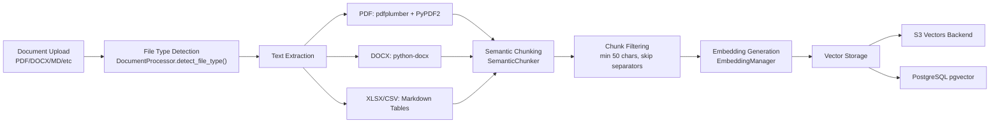
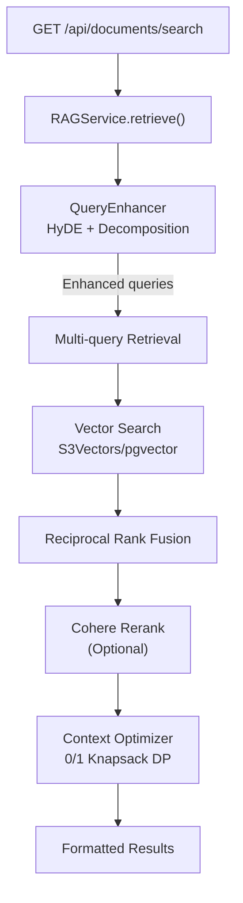
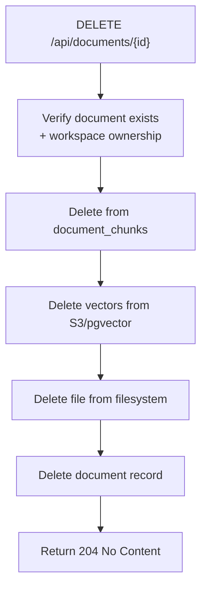
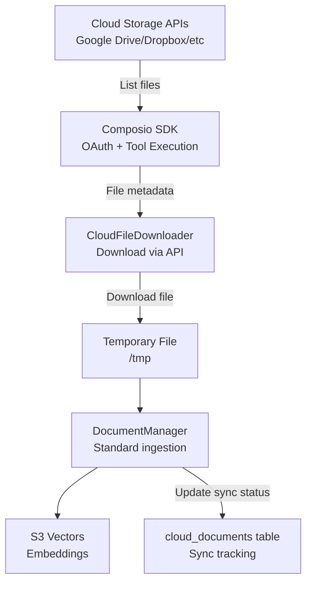
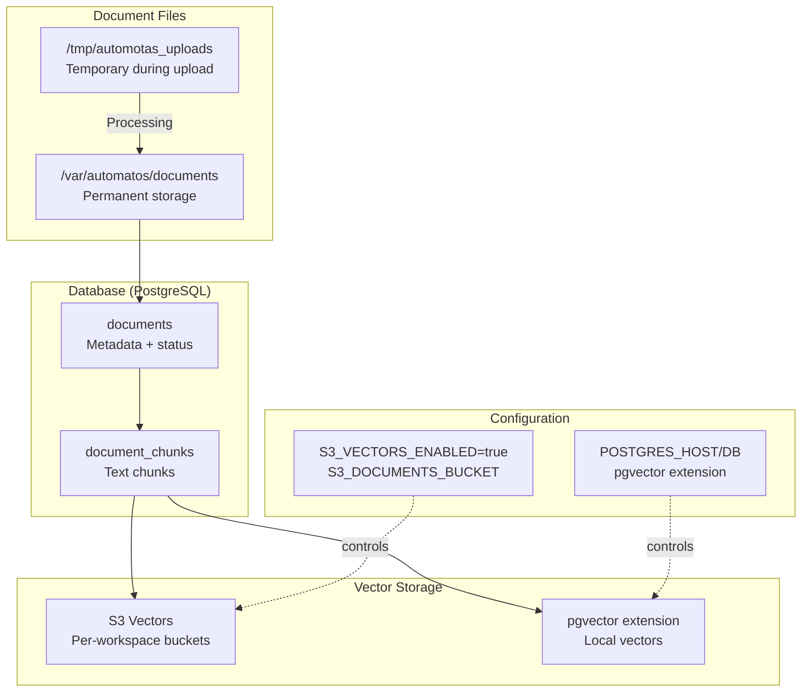

# Documents API Reference

<details>
<summary>Relevant source files</summary>

The following files were used as context for generating this wiki page:

- [frontend/app/admin/plugins/page.tsx](frontend/app/admin/plugins/page.tsx)
- [frontend/lib/api-client.ts](frontend/lib/api-client.ts)
- [orchestrator/.env.example](orchestrator/.env.example)
- [orchestrator/api/agent_plugins.py](orchestrator/api/agent_plugins.py)
- [orchestrator/api/documents.py](orchestrator/api/documents.py)
- [orchestrator/config.py](orchestrator/config.py)
- [orchestrator/core/composio/tool_executor.py](orchestrator/core/composio/tool_executor.py)
- [orchestrator/core/database/load_seed_data.py](orchestrator/core/database/load_seed_data.py)
- [orchestrator/core/seeds/seed_personas.py](orchestrator/core/seeds/seed_personas.py)
- [orchestrator/core/seeds/seed_plugin_categories.py](orchestrator/core/seeds/seed_plugin_categories.py)
- [orchestrator/core/services/plugin_cache.py](orchestrator/core/services/plugin_cache.py)
- [orchestrator/main.py](orchestrator/main.py)
- [orchestrator/modules/agents/services/agent_platform_tools.py](orchestrator/modules/agents/services/agent_platform_tools.py)
- [orchestrator/modules/codegraph/ranking/__init__.py](orchestrator/modules/codegraph/ranking/__init__.py)
- [orchestrator/modules/codegraph/ranking/pagerank_ranker.py](orchestrator/modules/codegraph/ranking/pagerank_ranker.py)
- [orchestrator/modules/memory/integrations/mem0_client.py](orchestrator/modules/memory/integrations/mem0_client.py)
- [orchestrator/modules/rag/chunking/semantic_chunker.py](orchestrator/modules/rag/chunking/semantic_chunker.py)
- [orchestrator/modules/rag/ingestion/manager.py](orchestrator/modules/rag/ingestion/manager.py)
- [orchestrator/modules/rag/service.py](orchestrator/modules/rag/service.py)
- [orchestrator/modules/rag/services/cloud_file_downloader.py](orchestrator/modules/rag/services/cloud_file_downloader.py)
- [orchestrator/modules/rag/services/cloud_sync_service.py](orchestrator/modules/rag/services/cloud_sync_service.py)
- [orchestrator/modules/search/services/entity_extractor.py](orchestrator/modules/search/services/entity_extractor.py)
- [scripts/ralph/prd.json](scripts/ralph/prd.json)

</details>


## Purpose and Scope

This page documents the REST API endpoints for document management in Automatos AI. The Documents API provides capabilities for uploading, processing, searching, and managing documents across the platform's knowledge base. Documents are ingested through a multi-stage pipeline that extracts text, generates semantic chunks, creates embeddings, and stores vectors for RAG retrieval.

For information about the RAG retrieval system that queries these documents, see [RAG Retrieval System](#5.4). For details on semantic chunking strategies used during ingestion, see [Semantic Chunking Strategies](#5.3). For cloud storage integration (Google Drive, Dropbox, etc.), see [Cloud Storage Integration](#5.5).

**Sources:** [orchestrator/api/documents.py:1-50](), [orchestrator/main.py:36-42]()

---

## API Endpoint Overview

The Documents API is mounted at `/api/documents` and provides the following endpoint groups:

| Endpoint Group | Purpose | Authentication |
|---|---|---|
| Upload | Upload and process documents | Required (Clerk JWT + Workspace) |
| Retrieval | Download and view documents | Required |
| Search | Semantic and keyword search | Required |
| Analytics | Document statistics and metrics | Required |
| Management | Delete, reprocess, list | Required |
| Cloud Sync | Sync from Google Drive, Dropbox, etc. | Required |

All endpoints require workspace isolation via the `X-Workspace-ID` header, which is automatically injected by the `get_request_context_hybrid` dependency.

**Sources:** [orchestrator/api/documents.py:29-30](), [orchestrator/core/auth/hybrid.py:1-50]()

---

## Document Upload Flow



**Sources:** [orchestrator/api/documents.py:106-261](), [orchestrator/modules/rag/ingestion/manager.py:402-600]()

---

## Upload Endpoint

### POST /api/documents/upload

Uploads a document, validates file type, checks for duplicates, and triggers asynchronous processing.

**Parameters:**

| Parameter | Type | Location | Required | Description |
|---|---|---|---|---|
| `file` | UploadFile | Form | Yes | Document file (PDF, DOCX, TXT, MD, CSV, XLSX, JSON) |
| `description` | string | Form | No | Human-readable description |
| `tags` | string | Form | No | Comma-separated tags (temporarily disabled due to SQLAlchemy bug) |

**Request Example:**

```bash
curl -X POST https://api.automatos.ai/api/documents/upload \
  -H "Authorization: Bearer $CLERK_JWT" \
  -H "X-Workspace-ID: $WORKSPACE_ID" \
  -F "file=@report.pdf" \
  -F "description=Q3 Financial Report" \
  -F "tags=finance,quarterly"
```

**Security Validations:**

1. **MIME Type Detection**: Uses `python-magic` to detect actual content type (not just extension)
2. **Extension Matching**: Ensures file extension matches detected MIME type
3. **Allowlist Enforcement**: Only permits predefined MIME types
4. **Size Limit**: Maximum 50MB per file
5. **Duplicate Detection**: SHA256 hash check prevents redundant storage

The allowlist is defined in `ALLOWED_MIME_TYPES` dictionary, which maps MIME types to valid extensions:

| MIME Type | Allowed Extensions |
|---|---|
| `application/pdf` | `.pdf` |
| `application/vnd.openxmlformats-officedocument.wordprocessingml.document` | `.docx` |
| `text/plain` | `.txt`, `.md`, `.csv` |
| `text/markdown` | `.md` |
| `text/csv` | `.csv` |
| `application/json` | `.json` |
| `application/vnd.openxmlformats-officedocument.spreadsheetml.sheet` | `.xlsx` |

**Response:**

```typescript
{
  "document_id": number,
  "filename": string,
  "status": "duplicate" | "processing" | "processed" | "failed",
  "message": string
}
```

**Processing Flow:**

1. Client uploads file → API validates MIME type
2. Hash calculated (SHA256) → Check for duplicates in DB
3. File saved to `/tmp/automotas_uploads/{uuid}.ext`
4. Document record created in `documents` table with `status=processing`
5. Background task triggers `DocumentManager._process_document()`
6. Text extracted → Semantic chunking → Embeddings generated
7. Chunks stored in `document_chunks` table
8. Vectors stored in S3 Vectors or pgvector
9. Document status updated to `processed` with `chunk_count`

**Sources:** [orchestrator/api/documents.py:106-261](), [orchestrator/api/documents.py:88-104]()

---

## Document Processing Pipeline



**Text Extraction Methods:**

- **PDF**: Primary extraction with `pdfplumber`, fallback to `PyPDF2` for difficult PDFs
- **DOCX**: `python-docx` paragraph extraction
- **XLSX**: `openpyxl` → Markdown tables for LLM consumption
- **CSV**: Standard `csv` module → Markdown tables
- **TXT/MD/JSON**: Direct UTF-8 read with `latin-1` fallback

**Chunking Strategy:**

The system uses `SemanticChunker` from [modules/rag/chunking/semantic_chunker.py:52-91]() with `TOPIC_COHERENCE` strategy by default:

- **Target chunk size**: 500 characters
- **Min/Max bounds**: 100-1500 characters
- **Overlap ratio**: 10%
- **Post-processing**: Filters out separators, code fences, and chunks <50 chars
- **Metrics preserved**: Entropy, topic coherence, semantic density, importance score

**Sources:** [orchestrator/modules/rag/ingestion/manager.py:113-194](), [orchestrator/modules/rag/ingestion/manager.py:289-400]()

---

## Document Retrieval Endpoints

### GET /api/documents/

List documents with filtering and pagination.

**Query Parameters:**

| Parameter | Type | Default | Description |
|---|---|---|---|
| `skip` | integer | 0 | Number of records to skip |
| `limit` | integer | 100 | Max records to return (1-1000) |
| `status` | string | null | Filter by status: `uploaded`, `processing`, `processed`, `failed` |
| `file_type` | string | null | Filter by type: `pdf`, `docx`, `markdown`, `text`, `json` |
| `search` | string | null | Search in filename or description (case-insensitive) |

**Response:**

```typescript
[
  {
    "id": number,
    "filename": string,
    "original_filename": string,
    "file_type": string,
    "file_size": number,
    "status": string,
    "chunk_count": number,
    "tags": string[],
    "description": string,
    "upload_date": string,
    "processed_date": string | null,
    "created_by": string
  }
]
```

**Sources:** [orchestrator/api/documents.py:442-491]()

---

### GET /api/documents/{document_id}

Get detailed information about a single document.

**Path Parameters:**

| Parameter | Type | Description |
|---|---|---|
| `document_id` | integer | Document ID |

**Response:**

```typescript
{
  "id": number,
  "filename": string,
  "file_type": string,
  "file_size": number,
  "status": string,
  "chunk_count": number,
  "tags": string[],
  "description": string,
  "upload_date": string,
  "processed_date": string | null,
  "file_path": string,
  "content_hash": string
}
```

**Sources:** [orchestrator/api/documents.py:493-531]()

---

### GET /api/documents/download

Download a document file from storage.

**Query Parameters:**

| Parameter | Type | Required | Description |
|---|---|---|---|
| `path` | string | Yes | Full path to document (e.g., `/var/automatos/documents/filename.md`) |

**Security:**

- Path safety validation using `pathlib.resolve()`
- Restricted to `/var/automatos/documents/` directory
- Prevents directory traversal attacks (`..`, symlinks)

**Response:** Binary file with appropriate `Content-Type` header

**Sources:** [orchestrator/api/documents.py:263-314]()

---

### GET /api/documents/content

Get document content as text (for artifact viewer).

**Query Parameters:**

| Parameter | Type | Required | Description |
|---|---|---|---|
| `path` | string | Yes | Full path to document |

**Response:**

```typescript
{
  "filename": string,
  "content": string,
  "path": string
}
```

**Sources:** [orchestrator/api/documents.py:316-358]()

---

## Document Search Endpoints

### GET /api/documents/search

Semantic search across all documents in workspace.

**Query Parameters:**

| Parameter | Type | Default | Description |
|---|---|---|---|
| `query` | string | Required | Search query |
| `limit` | integer | 5 | Max results to return |
| `min_similarity` | float | 0.5 | Minimum cosine similarity threshold |

**Search Flow:**



**Response:**

```typescript
{
  "results": [
    {
      "document_id": number,
      "document_name": string,
      "chunk_content": string,
      "similarity": float,
      "chunk_index": number,
      "metadata": {
        "file_type": string,
        "chunk_size": number,
        "entropy": float,
        "topic_coherence": float
      }
    }
  ],
  "total_results": number,
  "query": string
}
```

The search uses `RAGService.retrieve()` which implements:
1. **Query Enhancement**: HyDE (Hypothetical Document Embeddings) + query decomposition
2. **Multi-query Retrieval**: Searches with multiple query variations
3. **RRF Fusion**: Reciprocal Rank Fusion to merge results (k=60)
4. **Optional Reranking**: Cohere cross-encoder for precision
5. **Context Optimization**: 0/1 knapsack DP algorithm for token budget

**Sources:** [orchestrator/api/documents.py:533-610](), [orchestrator/modules/rag/service.py:210-294]()

---

## Analytics Endpoints

### GET /api/documents/analytics

Get comprehensive document analytics for the workspace.

**Response:**

```typescript
{
  "total_documents": number,
  "status_distribution": {
    "uploaded": number,
    "processing": number,
    "processed": number,
    "failed": number
  },
  "total_storage_bytes": number,
  "total_storage_mb": float,
  "file_type_distribution": {
    "pdf": number,
    "docx": number,
    "markdown": number,
    "text": number
  },
  "total_chunks": number,
  "average_chunks_per_document": float,
  "recent_uploads_24h": number,
  "processing_success_rate": float,
  "last_updated": string
}
```

**Metrics Calculated:**

- Total documents count by status
- Total storage used (bytes and MB)
- File type distribution
- Chunk statistics (total, average per document)
- Recent activity (last 24 hours)
- Processing success rate (processed / (processed + failed) * 100)

**Sources:** [orchestrator/api/documents.py:362-440]()

---

## Document Management Endpoints

### DELETE /api/documents/{document_id}

Delete a document and all associated chunks/embeddings.

**Deletion Flow:**



**Response:** `204 No Content` on success

**Sources:** [orchestrator/api/documents.py:612-651]()

---

### POST /api/documents/{document_id}/reprocess

Reprocess a document (re-extract text, re-chunk, re-embed).

**Use Cases:**

- Document failed processing initially
- Chunking strategy changed
- Embedding model upgraded
- Document metadata needs updating

**Process:**

1. Fetch document record from DB
2. Verify file still exists at `file_path`
3. Delete existing chunks and vectors
4. Trigger `DocumentManager._process_document()` again
5. Update status to `processing` → `processed`

**Response:**

```typescript
{
  "message": "Document reprocessing started",
  "document_id": number,
  "status": "processing"
}
```

**Sources:** [orchestrator/api/documents.py:653-710]()

---

## Cloud Sync Integration

### Cloud Document Sync Flow



The cloud sync system uses `CloudFileDownloader` which implements a three-tier download strategy:

1. **Composio v3 REST API** (primary)
2. **Composio Python SDK** (fallback for Google Drive truncation)
3. **Direct URL download** (when API returns S3 presigned URLs)

**Supported Providers:**

| Provider | Action | Download Strategy |
|---|---|---|
| Google Drive | `GOOGLEDRIVE_DOWNLOAD_FILE` | REST → SDK fallback (truncation fix) |
| Dropbox | `DROPBOX_READ_FILE` | REST API (full content) |
| OneDrive | `ONEDRIVE_DOWNLOAD_FILE` | REST API |
| Box | `BOX_DOWNLOAD_FILE` | REST API |

**Cloud Sync Tables:**

- `cloud_documents`: Tracks synced files (external_file_id, sync_status, chunk_count)
- `cloud_sync_jobs`: Sync job history (connection_id, status, files_synced)
- `cloud_sync_config`: Per-connection sync settings (root_folder, schedule)

**Sources:** [orchestrator/modules/rag/services/cloud_file_downloader.py:60-143](), [orchestrator/modules/rag/services/cloud_sync_service.py:38-48]()

---

## Storage Architecture



**Storage Decision Logic:**

The `DocumentManager` constructor accepts `use_s3_vectors` parameter:

- `True`: Store embeddings in S3 Vectors (separate bucket per workspace)
- `False`: Store embeddings in PostgreSQL `pgvector` extension

The choice is controlled by `S3_VECTORS_ENABLED` environment variable and passed through the `get_document_manager()` factory function.

**Workspace Isolation:**

All document operations are scoped to `workspace_id`:
- Database queries filter by `workspace_id` column
- S3 paths use prefix: `workspaces/{workspace_id}/`
- Vector buckets: `automatos-vectors-{workspace_id}`

**Sources:** [orchestrator/api/documents.py:76-86](), [orchestrator/modules/rag/ingestion/manager.py:402-420]()

---

## Configuration Reference

### Environment Variables

| Variable | Default | Description |
|---|---|---|
| `S3_VECTORS_ENABLED` | `false` | Use S3 for vector storage (vs pgvector) |
| `S3_DOCUMENTS_BUCKET` | `automatos-ai` | S3 bucket for document files |
| `S3_VECTORS_BUCKET` | None | S3 bucket for embeddings (if enabled) |
| `S3_VECTORS_DIMENSION` | `2048` | Embedding vector dimension |
| `S3_VECTORS_METRIC` | `cosine` | Distance metric for similarity |
| `DOCUMENT_STORAGE_DIR` | `documents` | Local filesystem directory |
| `COMPOSIO_API_KEY` | None | Composio API key for cloud sync |
| `AWS_ACCESS_KEY_ID` | None | AWS credentials for S3 |
| `AWS_SECRET_ACCESS_KEY` | None | AWS credentials for S3 |
| `AWS_REGION` | `us-east-1` | AWS region |

### Database Configuration

The documents API uses `db_config` dictionary constructed from environment variables:

```python
{
  "database": config.POSTGRES_DB,
  "user": config.POSTGRES_USER,
  "password": config.POSTGRES_PASSWORD,
  "host": config.POSTGRES_HOST,
  "port": config.POSTGRES_PORT
}
```

This config is passed to `DocumentManager` for direct database access (bypasses SQLAlchemy for performance).

**Sources:** [orchestrator/api/documents.py:38-74](), [orchestrator/config.py:245-260]()

---

## Error Handling

### Upload Errors

| Error | Status Code | Cause |
|---|---|---|
| `File too large (max 50MB)` | 400 | File exceeds 50MB limit |
| `File type not allowed` | 400 | MIME type not in allowlist |
| `File extension does not match detected content type` | 400 | Extension mismatch (security) |
| `Document already exists` | 200 (duplicate) | SHA256 hash collision |
| `Internal server error` | 500 | Processing failure |

### Processing Errors

When document processing fails:
1. Status set to `failed` in database
2. Error logged with document ID
3. Reprocessing endpoint available for retry

**Graceful Degradation:**

- If Redis unavailable → processing continues (no cache)
- If S3 unavailable → falls back to local filesystem
- If embedding fails → document stored without vectors (searchable by metadata)

**Sources:** [orchestrator/api/documents.py:257-261](), [orchestrator/modules/rag/ingestion/manager.py:582-600]()

---

## Integration with Other Systems

### RAG Service Integration

Documents are consumed by `RAGService` for semantic search:

```python
# Example: Agent searches knowledge base
from modules.rag import RAGService

rag = RAGService(workspace_id=workspace_id)
result = await rag.retrieve(
    query="How do I configure authentication?",
    max_chunks=8,
    max_tokens=2000
)
```

The RAG service:
1. Enhances query with HyDE + decomposition
2. Searches document chunks by vector similarity
3. Re-ranks results with Cohere
4. Optimizes context with 0/1 knapsack algorithm
5. Returns formatted chunks with source attribution

### Agent Tool Integration

Agents can search documents via `AgentPlatformTools`:

```python
tools = AgentPlatformTools(db_session)
result = await tools.execute_tool(
    tool_name="search_knowledge",
    parameters={"query": "database setup", "limit": 5},
    agent_id=agent_id
)
```

This provides agents with access to workspace knowledge during execution.

**Sources:** [orchestrator/modules/agents/services/agent_platform_tools.py:56-95](), [orchestrator/modules/rag/service.py:142-294]()

---

## Database Schema

### documents Table

| Column | Type | Constraints | Description |
|---|---|---|---|
| `id` | INTEGER | PRIMARY KEY | Unique document ID |
| `workspace_id` | UUID | NOT NULL, FK | Workspace isolation |
| `filename` | VARCHAR(255) | NOT NULL | Display filename |
| `original_filename` | VARCHAR(255) | - | Original upload name |
| `file_type` | VARCHAR(50) | NOT NULL | Type: pdf, docx, etc. |
| `file_size` | BIGINT | NOT NULL | Size in bytes |
| `file_path` | TEXT | NOT NULL | Filesystem path |
| `content_hash` | VARCHAR(64) | NOT NULL | SHA256 hash |
| `status` | VARCHAR(50) | NOT NULL | Status: uploaded, processing, processed, failed |
| `chunk_count` | INTEGER | DEFAULT 0 | Number of chunks created |
| `description` | TEXT | - | User description |
| `upload_date` | TIMESTAMP | DEFAULT NOW() | Upload timestamp |
| `processed_date` | TIMESTAMP | - | Processing completion |
| `created_by` | VARCHAR(100) | - | User identifier |

### document_chunks Table

| Column | Type | Constraints | Description |
|---|---|---|---|
| `id` | INTEGER | PRIMARY KEY | Unique chunk ID |
| `document_id` | INTEGER | NOT NULL, FK | Parent document |
| `chunk_index` | INTEGER | NOT NULL | Position in document |
| `content` | TEXT | NOT NULL | Chunk text content |
| `metadata` | JSONB | - | Entropy, coherence, etc. |
| `parent_content` | TEXT | - | Parent section context |
| `headers` | JSONB | - | Header hierarchy (h1, h2, h3) |
| `embedding` | VECTOR(2048) | - | Vector embedding (if pgvector) |

**Indexes:**

- `idx_documents_workspace_id` on `workspace_id`
- `idx_documents_status` on `status`
- `idx_documents_hash` on `content_hash`
- `idx_chunks_document_id` on `document_id`

**Sources:** [orchestrator/core/models/core.py:1-100]() (Document model), [orchestrator/modules/rag/ingestion/manager.py:93-111]() (DocumentChunk dataclass)

---