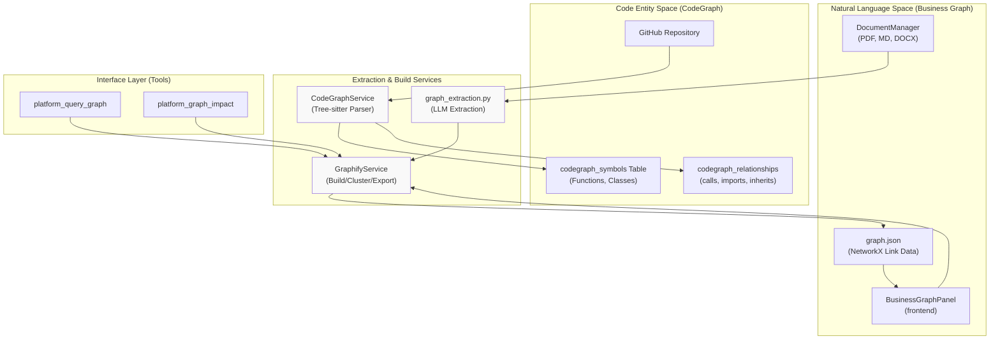

# Knowledge Graph & Entity Extraction

Relevant source files

The following files were used as context for generating this wiki page:

- [.env.example](.env.example)
- [frontend/components/knowledge/BusinessGraphPanel.tsx](frontend/components/knowledge/BusinessGraphPanel.tsx)
- [frontend/components/knowledge/BusinessGraphVisualization.tsx](frontend/components/knowledge/BusinessGraphVisualization.tsx)
- [frontend/components/knowledge/CodeGraphPanel.tsx](frontend/components/knowledge/CodeGraphPanel.tsx)
- [frontend/components/knowledge/CodeGraphVisualization.tsx](frontend/components/knowledge/CodeGraphVisualization.tsx)
- [frontend/components/knowledge/GraphDiffBanner.tsx](frontend/components/knowledge/GraphDiffBanner.tsx)
- [frontend/lib/api-client.ts](frontend/lib/api-client.ts)
- [orchestrator/api/codegraph.py](orchestrator/api/codegraph.py)
- [orchestrator/api/knowledge_graph.py](orchestrator/api/knowledge_graph.py)
- [orchestrator/api/system.py](orchestrator/api/system.py)
- [orchestrator/modules/codegraph/analysis/__init__.py](orchestrator/modules/codegraph/analysis/__init__.py)
- [orchestrator/modules/codegraph/analysis/architecture_analyzer.py](orchestrator/modules/codegraph/analysis/architecture_analyzer.py)
- [orchestrator/modules/codegraph/codegraph_service.py](orchestrator/modules/codegraph/codegraph_service.py)
- [orchestrator/modules/codegraph/ranking/__init__.py](orchestrator/modules/codegraph/ranking/__init__.py)
- [orchestrator/modules/codegraph/ranking/pagerank_ranker.py](orchestrator/modules/codegraph/ranking/pagerank_ranker.py)
- [orchestrator/modules/codegraph/search/__init__.py](orchestrator/modules/codegraph/search/__init__.py)
- [orchestrator/modules/codegraph/search/nl_code_search.py](orchestrator/modules/codegraph/search/nl_code_search.py)
- [orchestrator/modules/context/sections/graph_context.py](orchestrator/modules/context/sections/graph_context.py)
- [orchestrator/modules/knowledge/__init__.py](orchestrator/modules/knowledge/__init__.py)
- [orchestrator/modules/knowledge/graph_extraction.py](orchestrator/modules/knowledge/graph_extraction.py)
- [orchestrator/modules/knowledge/graph_service.py](orchestrator/modules/knowledge/graph_service.py)
- [orchestrator/modules/tools/discovery/actions_graph.py](orchestrator/modules/tools/discovery/actions_graph.py)
- [orchestrator/modules/tools/discovery/handlers_graph.py](orchestrator/modules/tools/discovery/handlers_graph.py)

## Purpose and Scope

The Knowledge Graph & Entity Extraction system provides structured intelligence across two primary domains: unstructured documentation and structured codebases. It extracts entities (technologies, concepts, symbols) and identifies semantic or structural relationships to enable advanced retrieval, architecture analysis, and context-aware suggestions.

Key capabilities include:
- **Business Knowledge Graph**: Automated extraction of concepts, processes, metrics, and rules from workspace documents using `GraphifyService` [orchestrator/modules/knowledge/graph_service.py:1-24]().
- **CodeGraph Indexing**: Static analysis of repositories using `tree-sitter` to build a structural graph of functions, classes, and imports [orchestrator/modules/codegraph/codegraph_service.py:93-105]().
- **Multi-Layer Extraction**: Hybrid approach combining deterministic regex, deterministic mappers, and LLM-based extraction for high-fidelity graphs [orchestrator/modules/knowledge/graph_extraction.py:5-10]().
- **Structural Ranking & Analysis**: PageRank-based importance scoring and automated detection of hotspots and modular clusters [orchestrator/modules/codegraph/codegraph_service.py:79-89]().
- **Team-Scoped Security**: Visibility filtering (PRD-124) ensuring agents only see graph nodes authorized for their specific team [orchestrator/modules/knowledge/graph_service.py:85-102]().

---

## System Architecture

The system bridges the "Natural Language Space" (documentation and chat) with the "Code Entity Space" (source code and symbols).

### Unified Extraction & Search Flow

**Sources**: [orchestrator/modules/knowledge/graph_service.py:9-21](), [orchestrator/modules/codegraph/codegraph_service.py:66-105](), [frontend/components/knowledge/BusinessGraphPanel.tsx:191-217]()

---

## Business Knowledge Graph

The `GraphifyService` manages the lifecycle of the business knowledge graph, turning workspace documents into a navigable network of ideas.

### Pipeline and Implementation
The pipeline follows a strict sequence: collect sources → extract → merge → build → cluster → analyze → export [orchestrator/modules/knowledge/graph_service.py:9-12]().

| Component | Role | File Reference |
|-----------|------|----------------|
| `GraphifyService` | Main orchestrator for graph lifecycle and caching | [orchestrator/modules/knowledge/graph_service.py:126-136]() |
| `graph_extraction` | LLM-powered extraction of concepts, rules, and metrics | [orchestrator/modules/knowledge/graph_extraction.py:90-134]() |
| `build_graph` | Executes the full pipeline and generates NetworkX artifacts | [orchestrator/modules/knowledge/graph_service.py:145-194]() |
| `team_filtered_view`| Filters the graph based on `team_access` attributes | [orchestrator/modules/knowledge/graph_service.py:105-118]() |

### Artifact Storage
Graphs are exported to the workspace filesystem under `/graph/` as several JSON files:
- `graph.json`: The core NetworkX node-link data [orchestrator/modules/knowledge/graph_service.py:66]().
- `meta.json`: Summary statistics (node/edge counts) [orchestrator/modules/knowledge/graph_service.py:67]().
- `communities.json`: Community labels and member lists [orchestrator/modules/knowledge/graph_service.py:68]().

**Sources**: [orchestrator/modules/knowledge/graph_service.py:65-74](), [orchestrator/modules/knowledge/graph_extraction.py:101-112]()

---

## CodeGraph: Structural Knowledge Graph

The `CodeGraphService` indexes GitHub repositories by parsing source code into a graph of symbols and relationships.

### Multi-Language Parsing (PRD-62)
The service utilizes a `TreeSitterParser` to support 14+ languages, extracting `CodeSymbol` (functions, classes) and `CodeRelationship` (calls, imports) objects.

- **`CodeSymbol`**: Represents a specific code entity with its signature, docstring, and snippet [orchestrator/modules/codegraph/codegraph_service.py:34-45]().
- **`CodeRelationship`**: Tracks how symbols interact (calls, imports, extends) [orchestrator/modules/codegraph/codegraph_service.py:48-53]().
- **`EnhancedVectorStore`**: Provides centralized semantic search across indexed symbols [orchestrator/modules/codegraph/codegraph_service.py:79-89]().

**Sources**: [orchestrator/modules/codegraph/codegraph_service.py:66-127]()

---

## Graph-Based Platform Actions

Agents interact with the knowledge graph through specialized platform tools defined in the `ActionRegistry`.

| Action Name | Purpose | Implementation Handler |
|-------------|---------|------------------------|
| `platform_query_graph` | Natural language traversal (BFS/DFS) of the graph | `handle_query_graph` [orchestrator/modules/tools/discovery/handlers_graph.py:98]() |
| `platform_graph_neighbors` | Finds direct connections for a specific concept | `handle_graph_neighbors` [orchestrator/modules/tools/discovery/handlers_graph.py:184]() |
| `platform_graph_impact` | Analyzes downstream dependency ripple effects | `handle_graph_impact` [orchestrator/modules/tools/discovery/handlers_graph.py:270]() |
| `platform_graph_communities`| Lists auto-detected business domain clusters | `handle_graph_communities` [orchestrator/modules/tools/discovery/handlers_graph.py:233]() |

**Sources**: [orchestrator/modules/tools/discovery/actions_graph.py:9-160](), [orchestrator/modules/tools/discovery/handlers_graph.py:1-30]()

---

## Visualization and UI

The system provides interactive visualizations for both business and code graphs.

### Business Graph Visualization
The `BusinessGraphPanel` fetches graph data from the workspace files using the `apiClient`.
- **Querying**: Uses `useQuery` with keys like `business-graph`, `data`, and `wsId` [frontend/components/knowledge/BusinessGraphPanel.tsx:52-55]().
- **Interaction**: Allows filtering by confidence scores and selecting specific communities [frontend/components/knowledge/BusinessGraphPanel.tsx:64-72]().

### CodeGraph Visualization
The `CodeGraphVisualization` component uses `reactflow` to render structural code dependencies.
- **View Modes**: Supports `default` (calls), `clusters` (modules), and `heatmap` (risk/hotspots) [frontend/components/knowledge/CodeGraphVisualization.tsx:97-99]().
- **Hotspots**: High-risk nodes are identified by `fan_out` and `betweenness` metrics [frontend/components/knowledge/CodeGraphVisualization.tsx:40-46]().

**Sources**: [frontend/components/knowledge/BusinessGraphPanel.tsx:190-217](), [frontend/components/knowledge/CodeGraphVisualization.tsx:86-113]()

---

## API Reference

| Endpoint | Method | Purpose |
|----------|--------|---------|
| `/api/knowledge/graph/import` | POST | Upload a JSON graph file to a workspace | [frontend/components/knowledge/BusinessGraphPanel.tsx:102]() |
| `/api/code-graph/index/github`| POST | Trigger background indexing of a repository | [orchestrator/api/codegraph.py:112]() |
| `/api/code-graph/search/semantic`| GET | Semantic search across code symbols | [orchestrator/api/codegraph.py:181]() |
| `/api/knowledge/entities` | GET | List all extracted entities with importance scores | [orchestrator/api/knowledge_graph.py:84]() |

**Sources**: [orchestrator/api/codegraph.py:24-215](), [orchestrator/api/knowledge_graph.py:1-140](), [frontend/lib/api-client.ts:25-36]()

---