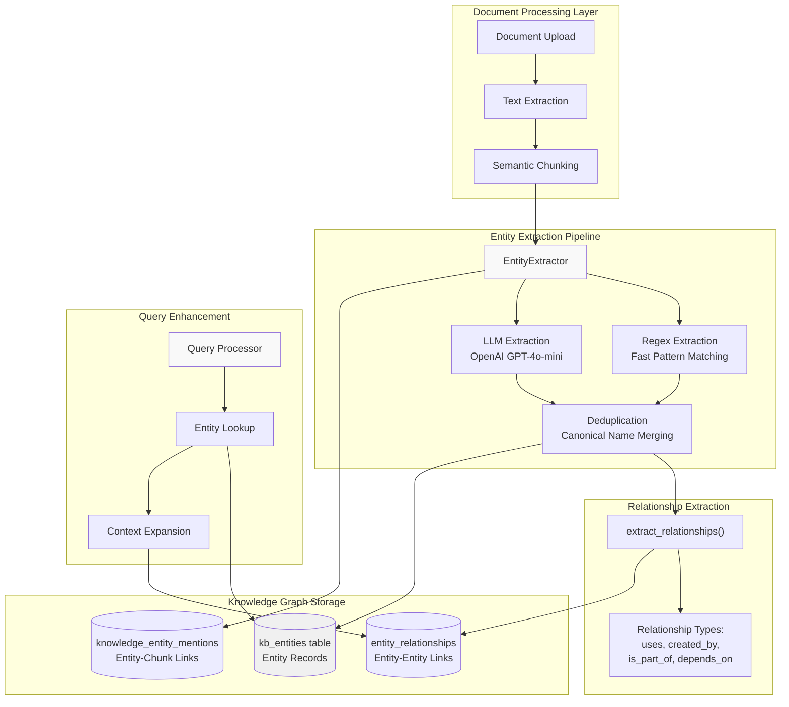
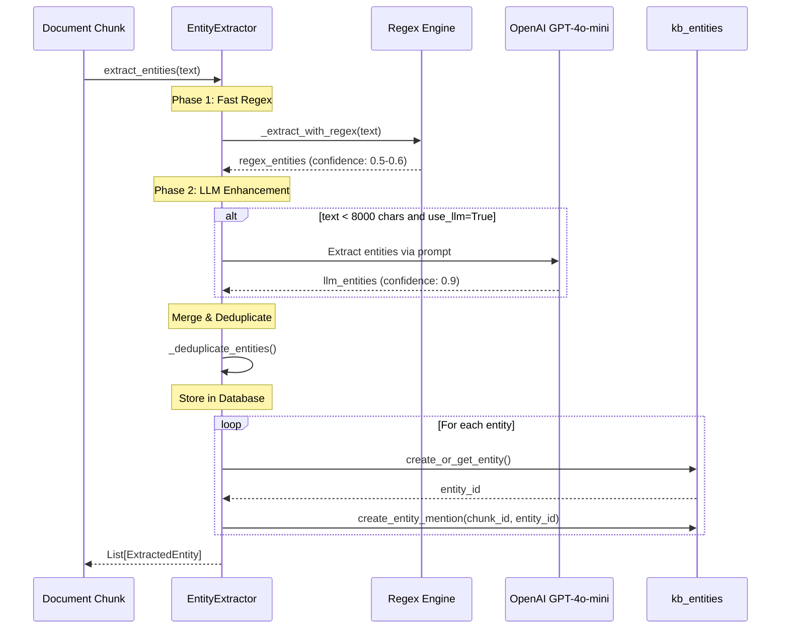
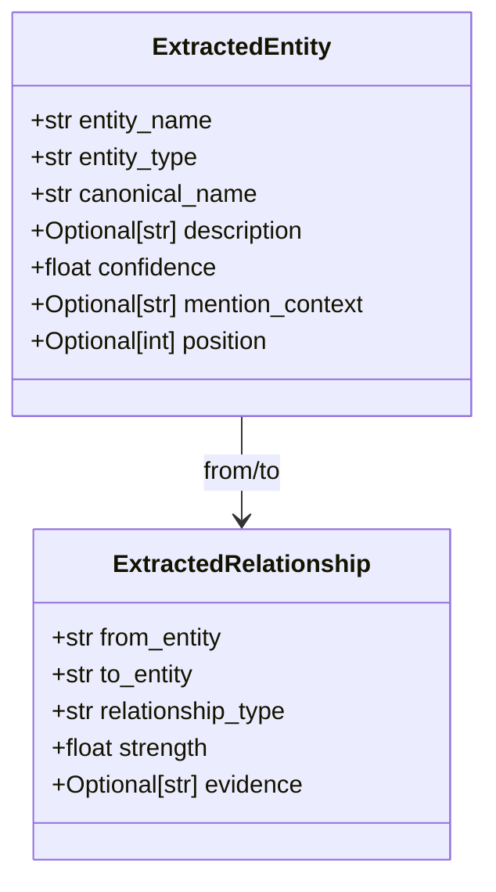
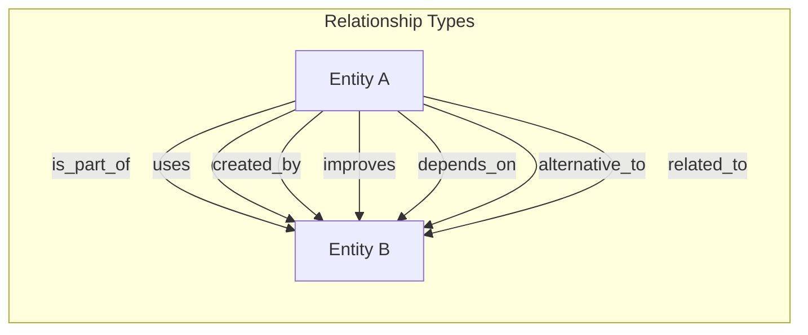
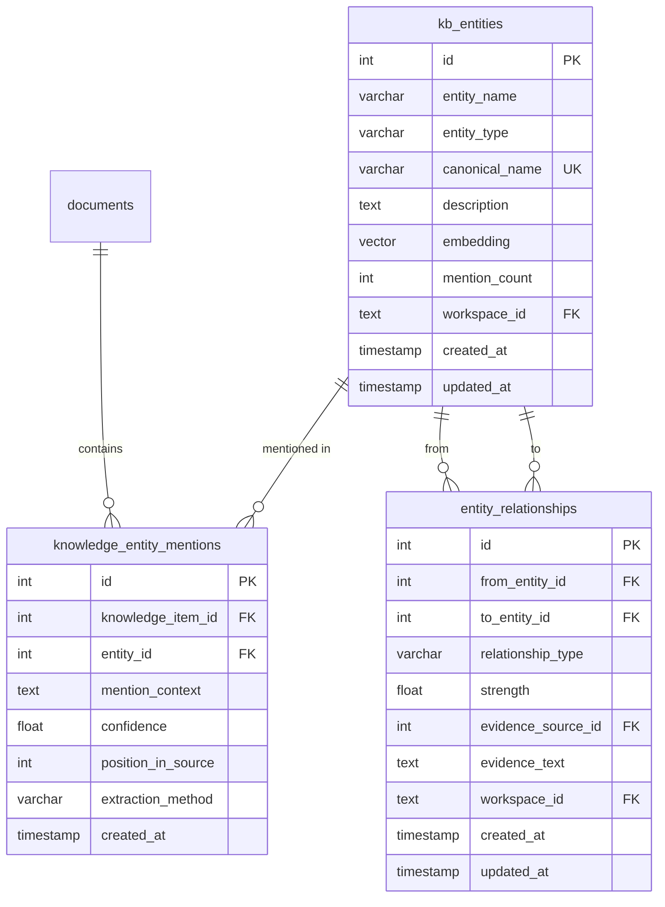
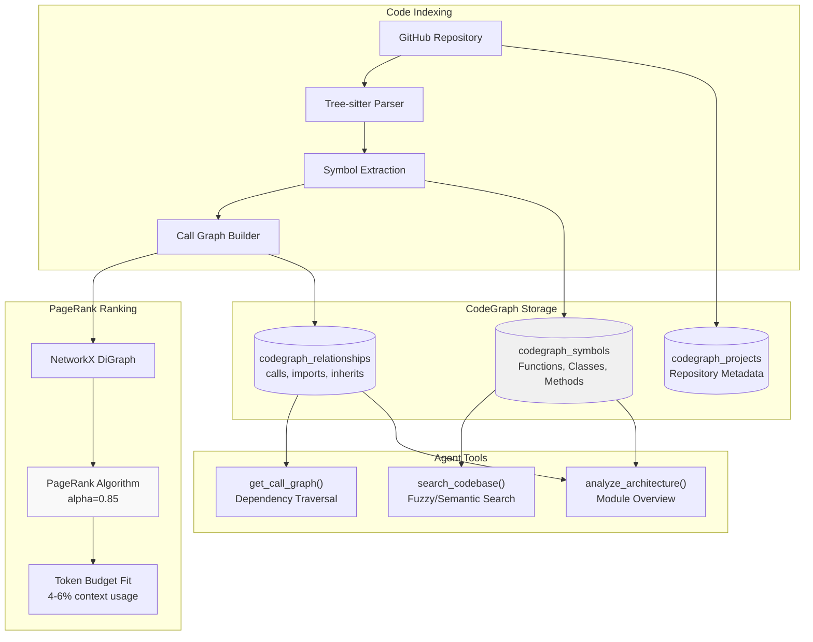

# Knowledge Graph & Entity Extraction

<details>
<summary>Relevant source files</summary>

The following files were used as context for generating this wiki page:

- [orchestrator/api/documents.py](orchestrator/api/documents.py)
- [orchestrator/core/composio/tool_executor.py](orchestrator/core/composio/tool_executor.py)
- [orchestrator/modules/agents/services/agent_platform_tools.py](orchestrator/modules/agents/services/agent_platform_tools.py)
- [orchestrator/modules/codegraph/ranking/__init__.py](orchestrator/modules/codegraph/ranking/__init__.py)
- [orchestrator/modules/codegraph/ranking/pagerank_ranker.py](orchestrator/modules/codegraph/ranking/pagerank_ranker.py)
- [orchestrator/modules/memory/integrations/mem0_client.py](orchestrator/modules/memory/integrations/mem0_client.py)
- [orchestrator/modules/rag/chunking/semantic_chunker.py](orchestrator/modules/rag/chunking/semantic_chunker.py)
- [orchestrator/modules/rag/ingestion/manager.py](orchestrator/modules/rag/ingestion/manager.py)
- [orchestrator/modules/rag/service.py](orchestrator/modules/rag/service.py)
- [orchestrator/modules/rag/services/cloud_file_downloader.py](orchestrator/modules/rag/services/cloud_file_downloader.py)
- [orchestrator/modules/rag/services/cloud_sync_service.py](orchestrator/modules/rag/services/cloud_sync_service.py)
- [orchestrator/modules/search/services/entity_extractor.py](orchestrator/modules/search/services/entity_extractor.py)

</details>


## Purpose and Scope

The Knowledge Graph & Entity Extraction system extracts structured entities and relationships from unstructured documents, enabling semantic search, query understanding, and intelligent retrieval beyond simple keyword matching. This page covers:

- **Document Entity Extraction**: Extracting entities (technologies, concepts, people, organizations) from uploaded documents using regex and LLM methods
- **Relationship Mapping**: Identifying relationships between entities (uses, created_by, is_part_of, etc.)
- **Knowledge Graph Storage**: Database schema for storing entities, mentions, and relationships
- **CodeGraph Integration**: Code-specific knowledge graph for structural analysis (see [Workspace Execution](#9) for code execution context)

For document ingestion and chunking, see [Document Ingestion Pipeline](#5.2). For semantic retrieval using extracted entities, see [RAG Retrieval System](#5.4).

---

## System Architecture

The knowledge graph system operates as a post-processing layer on top of document ingestion, enriching chunks with structured metadata for improved query understanding.



**Sources**: [orchestrator/modules/search/services/entity_extractor.py:1-403]()

---

## Entity Extraction Pipeline

### EntityExtractor Class

The `EntityExtractor` class orchestrates a two-phase extraction process combining fast regex patterns with accurate LLM-based extraction.

**Core Methods**:

| Method | Purpose | Performance |
|--------|---------|-------------|
| `extract_entities()` | Main entry point, orchestrates regex + LLM | ~2-5s per document |
| `_extract_with_regex()` | Fast pattern matching for common entities | <100ms |
| `_extract_with_llm()` | Accurate extraction using GPT-4o-mini | ~2-4s |
| `extract_relationships()` | Identify entity-entity relationships | ~2-3s |
| `_deduplicate_entities()` | Merge duplicates by canonical name | <10ms |

**Sources**: [orchestrator/modules/search/services/entity_extractor.py:40-88]()

---

### Two-Phase Extraction Strategy



**Phase 1: Regex-Based Extraction**

Fast pattern matching for common entity types:

- **Technology names**: Capitalized words with optional versions (e.g., "React 18", "PostgreSQL")
- **Acronyms**: 2-5 capital letters (e.g., "RAG", "API", "LLM")
- **Filtering**: Excludes common words ("The", "This", "When")

Regex patterns achieve **0.5-0.6 confidence** scores due to higher false positive rates.

**Sources**: [orchestrator/modules/search/services/entity_extractor.py:90-121]()

**Phase 2: LLM-Based Extraction**

For documents under 8,000 characters, uses GPT-4o-mini with a structured prompt:

```python
prompt = f"""Extract named entities from this text. Focus on:
- Technologies (software, frameworks, tools, AI models)
- Concepts (algorithms, methodologies, techniques)
- Organizations (companies, institutions)
- People (researchers, developers, leaders)
- Products (specific products or services)

Return ONLY a JSON array with this exact format:
[
  {{"name": "GPT-4", "type": "technology", "description": "OpenAI language model"}},
  {{"name": "Neural Networks", "type": "concept", "description": "Machine learning architecture"}}
]
"""
```

LLM extraction achieves **0.9 confidence** with lower false positive rates and better entity type classification.

**Sources**: [orchestrator/modules/search/services/entity_extractor.py:123-183]()

---

### Entity Data Model



**Entity Types**:

| Type | Description | Examples |
|------|-------------|----------|
| `technology` | Software, frameworks, tools | "React", "PostgreSQL", "Docker" |
| `concept` | Algorithms, methodologies | "Machine Learning", "RAG", "Semantic Search" |
| `organization` | Companies, institutions | "OpenAI", "Google", "MIT" |
| `person` | Individuals | "John Doe", "Researcher Name" |
| `location` | Physical locations | "San Francisco", "USA" |
| `event` | Conferences, launches | "NeurIPS 2024", "Product Launch" |

**Sources**: [orchestrator/modules/search/services/entity_extractor.py:18-38]()

---

## Relationship Extraction

The `extract_relationships()` method identifies semantic connections between entities using LLM analysis.

### Relationship Types



**Relationship Type Definitions**:

| Type | Semantic Meaning | Example |
|------|------------------|---------|
| `is_part_of` | Component or subset relationship | "Neural Networks" → "Machine Learning" |
| `uses` | Dependency or usage | "React" → "JavaScript" |
| `created_by` | Authorship or development | "GPT-4" → "OpenAI" |
| `improves` | Enhancement or optimization | "GPT-4" → "GPT-3.5" |
| `depends_on` | Required dependency | "Frontend" → "API" |
| `alternative_to` | Competing or substitute | "PostgreSQL" → "MySQL" |
| `related_to` | General semantic connection | "Docker" → "Kubernetes" |

**Sources**: [orchestrator/modules/search/services/entity_extractor.py:185-270]()

---

### Relationship Extraction Process

```python
async def extract_relationships(
    self,
    text: str,
    entities: List[ExtractedEntity],
    max_relationships: int = 30
) -> List[ExtractedRelationship]
```

**Algorithm**:

1. **Entity Filtering**: Limit to top 20 entities (avoid token limits)
2. **LLM Prompt**: Send entity list + text to GPT-4o-mini
3. **JSON Parsing**: Extract structured relationships from response
4. **Evidence Capture**: Store supporting text snippets (max 500 chars)
5. **Strength Assignment**: Default 0.8 strength for LLM-identified relationships

**Sources**: [orchestrator/modules/search/services/entity_extractor.py:185-270]()

---

## Knowledge Graph Storage Schema

The knowledge graph uses three PostgreSQL tables with workspace isolation.



### Table Descriptions

**kb_entities**: Core entity records with deduplication by canonical name

- **Unique constraint**: `canonical_name` (normalized lowercase)
- **Mention count**: Incremented on each new mention (PageRank-like frequency signal)
- **Embedding**: Optional vector for semantic entity search
- **Workspace isolation**: `workspace_id` for multi-tenancy

**knowledge_entity_mentions**: Links entities to document chunks

- **Position tracking**: `position_in_source` for entity location
- **Context window**: Surrounding text for disambiguation
- **Extraction method**: "llm" or "regex" for quality tracking
- **Composite unique**: `(knowledge_item_id, entity_id, position_in_source)`

**entity_relationships**: Entity-to-entity connections

- **Strength**: 0.0-1.0 confidence score
- **Evidence**: Text snippet supporting the relationship
- **Upsert logic**: On conflict, keep stronger relationship and merge evidence

**Sources**: [orchestrator/modules/search/services/entity_extractor.py:304-402]()

---

## Database Operations

### Helper Functions

```python
async def create_or_get_entity(
    cursor,
    entity_name: str,
    entity_type: str,
    canonical_name: str,
    description: Optional[str] = None,
    embedding: Optional[List[float]] = None,
    workspace_id: Optional[str] = None
) -> int
```

**Upsert Logic**:
1. Query by `canonical_name` (case-insensitive)
2. If exists: increment `mention_count`, return existing `id`
3. If new: insert entity, return new `id`

**Deduplication Strategy**: All variations map to a single canonical form (e.g., "react", "React", "REACT" → "react").

---

```python
async def create_entity_mention(
    cursor,
    knowledge_item_id: int,
    entity_id: int,
    mention_context: Optional[str] = None,
    confidence: float = 1.0,
    position: Optional[int] = None,
    extraction_method: str = "llm"
)
```

**Links entity to document chunk** with:
- Surrounding context (150 char window)
- Confidence score from extraction method
- Position for ordered mentions
- Extraction method for provenance

**Conflict handling**: `ON CONFLICT DO NOTHING` prevents duplicate mention records.

---

```python
async def create_entity_relationship(
    cursor,
    from_entity_name: str,
    to_entity_name: str,
    relationship_type: str,
    strength: float = 1.0,
    evidence_source_id: Optional[int] = None,
    evidence_text: Optional[str] = None,
    workspace_id: Optional[str] = None
)
```

**Creates/updates relationships**:
- Resolves entity names to IDs via canonical name lookup
- On conflict: keeps stronger relationship, merges evidence text
- Workspace-scoped for multi-tenancy

**Sources**: [orchestrator/modules/search/services/entity_extractor.py:304-402]()

---

## CodeGraph: Code-Specific Knowledge Graph

While document entity extraction focuses on concepts and technologies, **CodeGraph** builds a structural knowledge graph of code symbols using static analysis and PageRank ranking.

### CodeGraph vs Document Entities

| Aspect | Document Entities | CodeGraph |
|--------|-------------------|-----------|
| **Source** | Uploaded documents (PDF, MD, DOCX) | Indexed codebases (GitHub repos) |
| **Entities** | Concepts, technologies, people, orgs | Functions, classes, methods, interfaces |
| **Relationships** | Semantic (uses, created_by, related_to) | Structural (calls, imports, inherits) |
| **Ranking** | Mention count | PageRank on call graph |
| **Storage** | `kb_entities`, `entity_relationships` | `codegraph_symbols`, `codegraph_relationships` |
| **Tools** | `search_knowledge`, `semantic_search` | `search_codebase`, `get_call_graph` |

**Sources**: [orchestrator/modules/codegraph/ranking/pagerank_ranker.py:1-117]()

---

### CodeGraph Architecture



**Sources**: [orchestrator/modules/codegraph/ranking/pagerank_ranker.py:1-117](), [orchestrator/modules/agents/services/agent_platform_tools.py:98-206]()

---

### PageRankRanker Class

The `PageRankRanker` implements Aider-inspired structural importance ranking, achieving **4-6% context usage** vs 54-70% with naive approaches.

```python
class PageRankRanker:
    def rank_symbols(
        self,
        symbols: List[Dict[str, Any]],
        relationships: List[Dict[str, Any]],
        token_budget: int = 2048,
    ) -> List[Dict[str, Any]]
```

**Algorithm**:

1. **Build DiGraph**: Create NetworkX directed graph from call/import relationships
2. **Run PageRank**: Standard algorithm with damping factor α=0.85
3. **Sort by Rank**: Order symbols by importance score (descending)
4. **Fit Budget**: Iteratively add symbols until token budget exhausted
5. **Return Top-K**: Most structurally important symbols within budget

**Token Estimation**: `~4 chars per token` heuristic for signatures + docstrings.

**Sources**: [orchestrator/modules/codegraph/ranking/pagerank_ranker.py:20-116]()

---

## Integration with RAG System

Entity extraction enhances retrieval through three mechanisms:

### 1. Query Enhancement

When users query the knowledge base, entity lookup expands queries:

```
User Query: "How does React rendering work?"
↓
Entity Recognition: ["React", "rendering"]
↓
Graph Expansion: ["React", "Virtual DOM", "Reconciliation", "Fiber"]
↓
Enhanced Retrieval: Search with expanded concepts
```

### 2. Semantic Filtering

Document chunks tagged with entities enable precise filtering:

```sql
-- Find chunks mentioning specific entities
SELECT dc.* 
FROM document_chunks dc
JOIN knowledge_entity_mentions kem ON kem.knowledge_item_id = dc.id
JOIN kb_entities e ON e.id = kem.entity_id
WHERE e.canonical_name IN ('react', 'redux', 'webpack')
AND dc.workspace_id = :workspace_id
```

### 3. Relationship-Based Context

When retrieving a chunk about "React", automatically pull related entities:

```sql
-- Get related entities via relationships
SELECT e2.entity_name, er.relationship_type
FROM entity_relationships er
JOIN kb_entities e1 ON e1.id = er.from_entity_id
JOIN kb_entities e2 ON e2.id = er.to_entity_id
WHERE e1.canonical_name = 'react'
AND er.workspace_id = :workspace_id
ORDER BY er.strength DESC
```

**Sources**: [orchestrator/modules/rag/service.py:210-294]()

---

## Agent Platform Tools

Agents access knowledge graphs via the `AgentPlatformTools` service.

### Document Knowledge Graph Tools

```python
{
    "name": "search_knowledge",
    "description": "Search the Automatos knowledge base for documentation, guides, and information about the platform",
    "parameters": {
        "query": {"type": "string"},
        "limit": {"type": "integer", "default": 5}
    }
}
```

Uses RAG service with entity-enhanced retrieval.

**Sources**: [orchestrator/modules/agents/services/agent_platform_tools.py:60-76]()

---

### CodeGraph Tools

**search_codebase**: Fuzzy/semantic symbol search with PageRank ranking

```python
{
    "name": "search_codebase",
    "description": "Search indexed codebase for symbols (functions, classes, methods) by name or semantic similarity",
    "parameters": {
        "query": {"type": "string"},
        "project_name": {"type": "string"},
        "search_type": {"enum": ["fuzzy", "semantic"], "default": "fuzzy"},
        "symbol_type": {"enum": ["function", "class", "method", "interface", "all"]},
        "limit": {"type": "integer", "default": 10}
    }
}
```

**get_call_graph**: Traverse dependencies in both directions

```python
{
    "name": "get_call_graph",
    "parameters": {
        "symbol": {"type": "string"},
        "project_name": {"type": "string"},
        "depth": {"type": "integer", "default": 2, "description": "Max 5 levels"},
        "direction": {"enum": ["outgoing", "incoming", "both"], "default": "both"}
    }
}
```

**analyze_architecture**: High-level codebase overview with PageRank

```python
{
    "name": "analyze_architecture",
    "parameters": {
        "project_name": {"type": "string"},
        "focus_path": {"type": "string", "description": "Optional directory to focus on"}
    }
}
```

Returns module structure, key classes, dependency patterns, and top-referenced symbols.

**Sources**: [orchestrator/modules/agents/services/agent_platform_tools.py:98-206]()

---

## Usage Examples

### Extracting Entities from a Document

```python
from modules.search.services.entity_extractor import EntityExtractor

# Initialize extractor
extractor = EntityExtractor()

# Extract entities
text = """
React is a JavaScript library developed by Meta for building user interfaces.
It uses a Virtual DOM for efficient rendering and supports component-based architecture.
"""

entities = await extractor.extract_entities(
    text=text,
    use_llm=True,
    max_entities=50
)

# Results:
# [
#   ExtractedEntity(name="React", type="technology", canonical_name="react", confidence=0.9),
#   ExtractedEntity(name="JavaScript", type="technology", canonical_name="javascript", confidence=0.9),
#   ExtractedEntity(name="Meta", type="organization", canonical_name="meta", confidence=0.9),
#   ExtractedEntity(name="Virtual DOM", type="concept", canonical_name="virtual dom", confidence=0.9)
# ]
```

---

### Extracting Relationships

```python
# Extract relationships between entities
relationships = await extractor.extract_relationships(
    text=text,
    entities=entities,
    max_relationships=30
)

# Results:
# [
#   ExtractedRelationship(
#       from_entity="React",
#       to_entity="Meta",
#       relationship_type="created_by",
#       evidence="React...developed by Meta..."
#   ),
#   ExtractedRelationship(
#       from_entity="React",
#       to_entity="JavaScript",
#       relationship_type="uses",
#       evidence="React is a JavaScript library..."
#   ),
#   ExtractedRelationship(
#       from_entity="Virtual DOM",
#       to_entity="React",
#       relationship_type="is_part_of",
#       evidence="It uses a Virtual DOM..."
#   )
# ]
```

---

### Storing in Database

```python
import psycopg2

# Connect to database
conn = psycopg2.connect(**db_config)
cursor = conn.cursor()

# Store entities
entity_ids = {}
for entity in entities:
    entity_id = await create_or_get_entity(
        cursor,
        entity_name=entity.entity_name,
        entity_type=entity.entity_type,
        canonical_name=entity.canonical_name,
        description=entity.description,
        workspace_id=workspace_id
    )
    entity_ids[entity.canonical_name] = entity_id

# Create mentions
for entity in entities:
    await create_entity_mention(
        cursor,
        knowledge_item_id=chunk_id,
        entity_id=entity_ids[entity.canonical_name],
        mention_context=entity.mention_context,
        confidence=entity.confidence,
        position=entity.position,
        extraction_method="llm" if entity.confidence > 0.8 else "regex"
    )

# Store relationships
for rel in relationships:
    await create_entity_relationship(
        cursor,
        from_entity_name=rel.from_entity,
        to_entity_name=rel.to_entity,
        relationship_type=rel.relationship_type,
        strength=rel.strength,
        evidence_text=rel.evidence,
        workspace_id=workspace_id
    )

conn.commit()
```

---

### Querying the Knowledge Graph

```python
# Find all entities of a specific type
cursor.execute("""
    SELECT entity_name, mention_count, description
    FROM kb_entities
    WHERE entity_type = 'technology'
    AND workspace_id = %s
    ORDER BY mention_count DESC
    LIMIT 10
""", [workspace_id])

# Find relationships for an entity
cursor.execute("""
    SELECT e2.entity_name, er.relationship_type, er.strength
    FROM entity_relationships er
    JOIN kb_entities e1 ON e1.id = er.from_entity_id
    JOIN kb_entities e2 ON e2.id = er.to_entity_id
    WHERE e1.canonical_name = %s
    AND er.workspace_id = %s
    ORDER BY er.strength DESC
""", ['react', workspace_id])
```

---

## Performance Characteristics

### Extraction Performance

| Operation | Avg Time | Bottleneck |
|-----------|----------|------------|
| Regex extraction | <100ms | Regex engine |
| LLM entity extraction | 2-4s | OpenAI API latency |
| LLM relationship extraction | 2-3s | OpenAI API latency |
| Database upsert (batch) | 50-200ms | PostgreSQL writes |
| **Total per document** | **4-8s** | LLM calls |

### Scalability Considerations

1. **LLM Rate Limits**: OpenAI API has rate limits; batch processing recommended
2. **Text Truncation**: LLM methods only process first 6,000-8,000 chars
3. **Deduplication**: Canonical name matching prevents entity explosion
4. **Workspace Isolation**: All queries filtered by `workspace_id` for multi-tenancy

**Sources**: [orchestrator/modules/search/services/entity_extractor.py:47-88]()

---

## Future Enhancements

1. **Entity Embeddings**: Store vector representations for semantic entity search
2. **Graph Algorithms**: Implement centrality measures (betweenness, eigenvector) for entity importance
3. **Query Expansion**: Auto-expand user queries with related entities
4. **Entity Disambiguation**: Handle homonyms (e.g., "React" as library vs. "react" as verb)
5. **Cross-Workspace Entities**: Shared marketplace entities for common technologies
6. **Temporal Tracking**: Track entity evolution across document versions

---

**Sources**: 
- [orchestrator/modules/search/services/entity_extractor.py:1-403]()
- [orchestrator/modules/codegraph/ranking/pagerank_ranker.py:1-117]()
- [orchestrator/modules/agents/services/agent_platform_tools.py:1-650]()
- [orchestrator/modules/rag/service.py:1-800]()

---