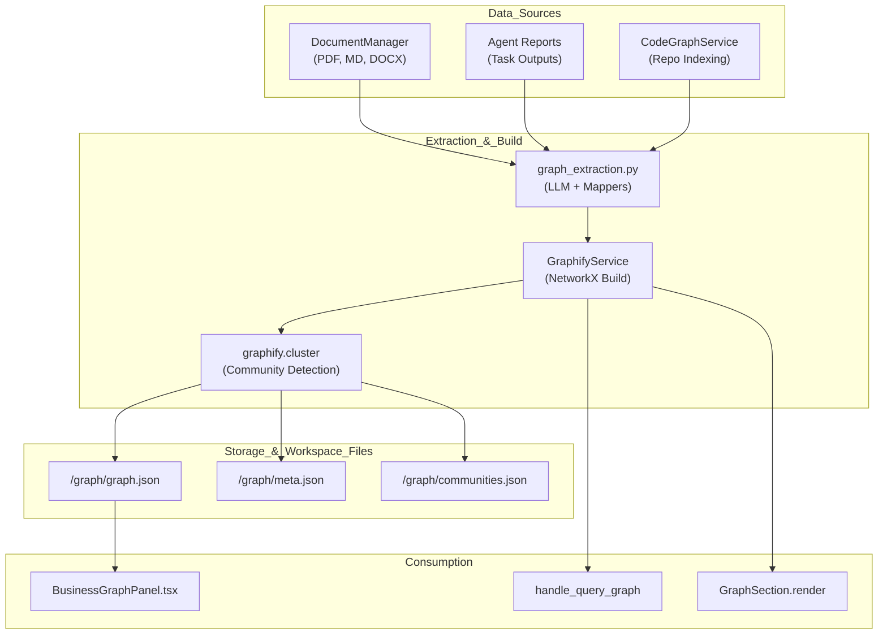
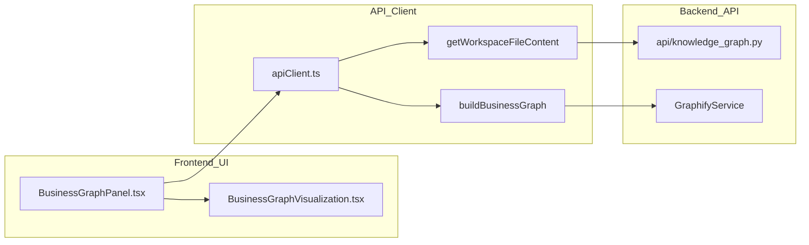

# Knowledge Graph & Entity Extraction

Relevant source files

The following files were used as context for generating this wiki page:

- [frontend/components/knowledge/BusinessGraphPanel.tsx](frontend/components/knowledge/BusinessGraphPanel.tsx)
- [frontend/components/workflows/execution-kitchen.tsx](frontend/components/workflows/execution-kitchen.tsx)
- [frontend/lib/api-client.ts](frontend/lib/api-client.ts)
- [orchestrator/api/knowledge_graph.py](orchestrator/api/knowledge_graph.py)
- [orchestrator/api/workflows.py](orchestrator/api/workflows.py)
- [orchestrator/modules/context/sections/graph_context.py](orchestrator/modules/context/sections/graph_context.py)
- [orchestrator/modules/knowledge/graph_extraction.py](orchestrator/modules/knowledge/graph_extraction.py)
- [orchestrator/modules/knowledge/graph_service.py](orchestrator/modules/knowledge/graph_service.py)
- [orchestrator/modules/tools/discovery/actions_graph.py](orchestrator/modules/tools/discovery/actions_graph.py)
- [orchestrator/modules/tools/discovery/handlers_graph.py](orchestrator/modules/tools/discovery/handlers_graph.py)

## Purpose and Scope

The Knowledge Graph & Entity Extraction system provides structured intelligence across three primary domains: unstructured documentation, agent-generated reports, and structured codebases. It extracts entities (concepts, processes, metrics, symbols) and identifies semantic, structural, or causal relationships to enable advanced retrieval, impact analysis, and context-aware reasoning.

Key capabilities include:
- **Business Graph Extraction**: LLM-powered extraction of concepts, entities, and processes from business documents and agent reports. [orchestrator/modules/knowledge/graph_extraction.py:99-185]()
- **Graphify Pipeline**: A multi-stage lifecycle (collect → extract → merge → cluster → export) that builds NetworkX graphs for each workspace. [orchestrator/modules/knowledge/graph_service.py:9-22]()
- **Team-Scoped Filtering**: PRD-124 compliant visibility rules ensuring agents only see graph nodes they have permission to access. [orchestrator/modules/knowledge/graph_service.py:85-118]()
- **CodeGraph Indexing**: Static analysis of repositories to build a structural graph of functions, classes, and imports for technical reasoning. [orchestrator/modules/agents/services/agent_platform_tools.py:98-100]()
- **Interactive Visualization**: Real-time graph exploration via the `BusinessGraphPanel` and `BusinessGraphVisualization`. [frontend/components/knowledge/BusinessGraphPanel.tsx:59-73]()

---

## System Architecture

The architecture bridges "Natural Language Space" (documentation) with "Code Entity Space" (source code) through a unified `GraphifyService` layer and `PlatformActionExecutor` handlers.

### Knowledge Graph Lifecycle

**Sources**: [orchestrator/modules/knowledge/graph_service.py:9-22](), [orchestrator/modules/knowledge/graph_extraction.py:5-10](), [frontend/components/knowledge/BusinessGraphPanel.tsx:190-217](), [orchestrator/modules/context/sections/graph_context.py:39-44]()

---

## Business Graph Extraction

The system uses `graph_extraction.py` to convert unstructured text into a formal graph schema consisting of nodes, edges, and hyperedges.

### LLM Extraction Prompts
The system employs specialized prompts for different source types:
- **Document Extraction**: Focuses on Concepts, Entities, Processes, Metrics, and Rules. [orchestrator/modules/knowledge/graph_extraction.py:99-143]()
- **Report Extraction**: Focuses on Entities, Actions, Outcomes, and Issues generated during agent execution. [orchestrator/modules/knowledge/graph_extraction.py:145-185]()

### Data Schema
| Entity Type | Description | Confidence Levels |
| :--- | :--- | :--- |
| **Nodes** | Unique entities with `snake_case` IDs and labels. | `EXTRACTED` |
| **Edges** | Directed relationships between two nodes. | `EXTRACTED`, `INFERRED`, `AMBIGUOUS` |
| **Hyperedges** | Relationships where 3+ nodes participate in a shared pattern. | `EXTRACTED`, `INFERRED` |

**Sources**: [orchestrator/modules/knowledge/graph_extraction.py:38-83](), [orchestrator/modules/knowledge/graph_extraction.py:112-121]()

---

## Graphify Service Implementation

The `GraphifyService` acts as the singleton manager for workspace graphs, handling caching via an `LRUCache` and incremental builds. [orchestrator/modules/knowledge/graph_service.py:128-143]()

### Pipeline Stages
1. **Build Pipeline**: Initiated via `build_graph`, it executes an unlocked build process with a 10-minute timeout. [orchestrator/modules/knowledge/graph_service.py:171-183]()
2. **Clustering**: Uses `graphify.cluster` to identify communities (modules) within the graph. [orchestrator/modules/knowledge/graph_service.py:46]()
3. **Analysis**: Runs `god_nodes` (centrality) and `surprising_connections` detection to find non-obvious insights. [orchestrator/modules/knowledge/graph_service.py:44]()
4. **Export**: Saves artifacts to the workspace `/graph/` directory, including `graph.json`, `meta.json`, and `communities.json`. [orchestrator/modules/knowledge/graph_service.py:66-70]()

### Team Filtering (PRD-124)
Visibility is strictly enforced at the service level via `node_is_visible`. [orchestrator/modules/knowledge/graph_service.py:87-104]()
- **team_access == []**: Visible to all.
- **agent_team is None**: Agent sees everything (e.g. System Admin).
- **agent_team in team_access**: Visible to specific team.

**Sources**: [orchestrator/modules/knowledge/graph_service.py:126-160](), [orchestrator/modules/knowledge/graph_service.py:105-118]()

---

## Platform Actions & Context Injection

The system exposes graph intelligence to agents through both explicit tools and implicit prompt context.

### Graph Platform Actions
Defined in `actions_graph.py` and handled in `handlers_graph.py`.

| Action Name | Purpose | Implementation |
| :--- | :--- | :--- |
| `platform_query_graph` | Natural language querying of the Business Graph using BFS/DFS. | [orchestrator/modules/tools/discovery/handlers_graph.py:98-177]() |
| `platform_graph_neighbors` | Retrieve direct connections for a specific concept. | [orchestrator/modules/tools/discovery/handlers_graph.py:184-210]() |
| `platform_graph_communities` | List auto-detected business domains and clusters. | [orchestrator/modules/tools/discovery/actions_graph.py:105-136]() |
| `platform_graph_impact` | Analyze ripple effects of changing a concept (dependency tracing). | [orchestrator/modules/tools/discovery/actions_graph.py:138-164]() |

### Automated Context: GraphSection
The `GraphSection` (Priority 45) automatically injects relevant subgraphs into agent prompts. [orchestrator/modules/context/sections/graph_context.py:35-37]()
1. **Message Extraction**: Identifies the latest user intent. [orchestrator/modules/context/sections/graph_context.py:102-111]()
2. **Relevance Scoring**: Scores nodes by term overlap with the message. [orchestrator/modules/context/sections/graph_context.py:114-135]()
3. **Subgraph Expansion**: Performs a BFS (depth=2) from top-scoring nodes. [orchestrator/modules/context/sections/graph_context.py:80-88]()
4. **Prompt Injection**: Appends the formatted subgraph to the "Business Context" section. [orchestrator/modules/context/sections/graph_context.py:100]()

**Sources**: [orchestrator/modules/tools/discovery/handlers_graph.py:122-172](), [orchestrator/modules/context/sections/graph_context.py:28-44]()

---

## Visualization & UI

The frontend provides an interactive environment for exploring the extracted knowledge structure.

### Business Graph Panel
The `BusinessGraphPanel` manages the visualization state and data fetching.
- **Data Loading**: Uses `useQuery` to fetch `graph/graph.json` via `apiClient.getWorkspaceFileContent`. [frontend/components/knowledge/BusinessGraphPanel.tsx:208-223]()
- **Build Trigger**: Users can manually trigger a graph rebuild via `apiClient.buildBusinessGraph()`. [frontend/components/knowledge/BusinessGraphPanel.tsx:174-186]()
- **Import**: Supports manual JSON graph imports to `/api/knowledge/graph/import`. [frontend/components/knowledge/BusinessGraphPanel.tsx:102]()

### Component Interaction

**Sources**: [frontend/components/knowledge/BusinessGraphPanel.tsx:190-217](), [frontend/lib/api-client.ts:179](), [orchestrator/api/knowledge_graph.py:22]()

---

## Data Models

### GraphNode
Used in frontend visualization and backend extraction. [frontend/components/knowledge/BusinessGraphPanel.tsx:20-29]()
- `id`: Unique identifier (snake_case).
- `label`: Display name.
- `file_type`: Category (concept, entity, process, metric, rule, action, outcome, issue).
- `source_file`: Originating document path.
- `community`: Cluster ID assigned by community detection.

### GraphEdge
Represents a relationship between two nodes. [frontend/components/knowledge/BusinessGraphPanel.tsx:30-36]()
- `source`: Originating node ID.
- `target`: Destination node ID.
- `relation`: Relationship type (e.g., `depends_on`, `triggers`).
- `confidence_score`: Float (0.0 - 1.0) representing extraction certainty.

**Sources**: [frontend/components/knowledge/BusinessGraphPanel.tsx:20-41](), [orchestrator/modules/knowledge/graph_extraction.py:49-94]()

---