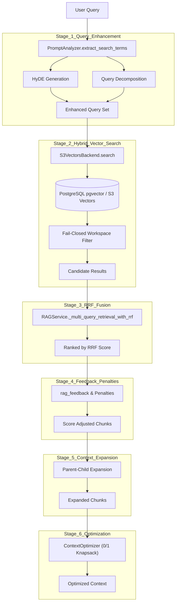
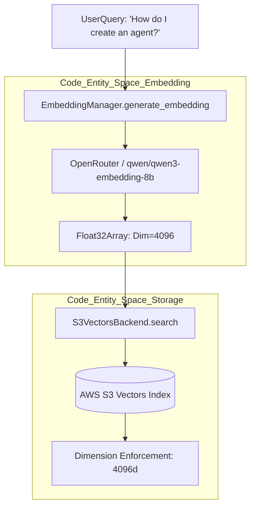
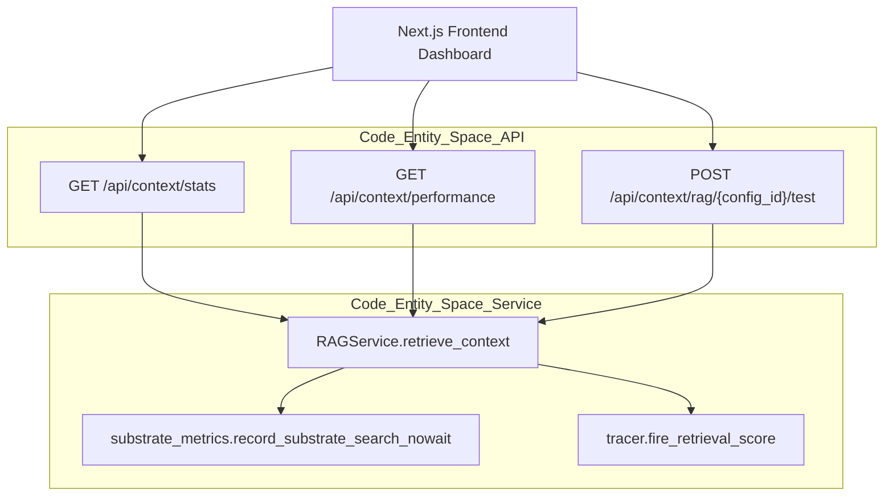

# RAG Retrieval System

<details>
<summary>Relevant source files</summary>

The following files were used as context for generating this wiki page:

- [orchestrator/api/cloud_documents.py](orchestrator/api/cloud_documents.py)
- [orchestrator/api/context.py](orchestrator/api/context.py)
- [orchestrator/api/documents.py](orchestrator/api/documents.py)
- [orchestrator/api/github_webhooks.py](orchestrator/api/github_webhooks.py)
- [orchestrator/api/system.py](orchestrator/api/system.py)
- [orchestrator/core/database/migrations/010_vector_dimensions_4096.sql](orchestrator/core/database/migrations/010_vector_dimensions_4096.sql)
- [orchestrator/evals/retrieval_recall.py](orchestrator/evals/retrieval_recall.py)
- [orchestrator/modules/rag/ingestion/contextual_annotator.py](orchestrator/modules/rag/ingestion/contextual_annotator.py)
- [orchestrator/modules/rag/ingestion/manager.py](orchestrator/modules/rag/ingestion/manager.py)
- [orchestrator/modules/rag/ingestion/pipeline.py](orchestrator/modules/rag/ingestion/pipeline.py)
- [orchestrator/modules/rag/ingestion/processor.py](orchestrator/modules/rag/ingestion/processor.py)
- [orchestrator/modules/rag/service.py](orchestrator/modules/rag/service.py)
- [orchestrator/modules/search/__init__.py](orchestrator/modules/search/__init__.py)
- [orchestrator/modules/search/services/entity_extractor.py](orchestrator/modules/search/services/entity_extractor.py)
- [orchestrator/modules/search/vector_store/__init__.py](orchestrator/modules/search/vector_store/__init__.py)
- [orchestrator/modules/search/vector_store/backends/pgvector_local_backend.py](orchestrator/modules/search/vector_store/backends/pgvector_local_backend.py)
- [orchestrator/modules/search/vector_store/backends/s3_vectors_backend.py](orchestrator/modules/search/vector_store/backends/s3_vectors_backend.py)
- [orchestrator/scripts/eval/retrieval_recall/corpus.jsonl](orchestrator/scripts/eval/retrieval_recall/corpus.jsonl)
- [orchestrator/scripts/eval/retrieval_recall/gold_set.jsonl](orchestrator/scripts/eval/retrieval_recall/gold_set.jsonl)
- [orchestrator/scripts/recreate_s3_index.py](orchestrator/scripts/recreate_s3_index.py)
- [orchestrator/scripts/test_cloud_sync.py](orchestrator/scripts/test_cloud_sync.py)
- [orchestrator/tests/security/test_s5_closures.py](orchestrator/tests/security/test_s5_closures.py)
- [orchestrator/tests/test_entity_extractor_no_vendor_key.py](orchestrator/tests/test_entity_extractor_no_vendor_key.py)
- [orchestrator/tests/test_p2w1_contextual_annotations.py](orchestrator/tests/test_p2w1_contextual_annotations.py)
- [orchestrator/tests/test_p2w1_retrieval_recall.py](orchestrator/tests/test_p2w1_retrieval_recall.py)

</details>


This document describes the RAG (Retrieval-Augmented Generation) retrieval pipeline, which transforms user queries into optimized context for LLM consumption. The system implements a multi-stage retrieval process featuring hybrid dense/sparse search, Reciprocal Rank Fusion (RRF), fail-closed workspace and team scoping, feedback penalties, and mathematical knapsack optimization.

**Scope**: This page covers the retrieval pipeline only. For document ingestion and processing, see [Document Ingestion Pipeline](7.2). For chunking strategies, see [Semantic Chunking Strategies](7.3). For cloud storage and S3 Vectors sync, see [Cloud Storage Integration](7.5). For the API surface, see [Documents API Reference](7.6).

---

## Architecture Overview

The RAG retrieval system follows a multi-stage pipeline that progressively refines search results to maximize information value within token constraints while enforcing tenant and team isolation.

**RAG Retrieval Pipeline Flow**


**Sources**: [orchestrator/modules/rag/service.py:142-294](), [orchestrator/modules/search/vector_store/backends/s3_vectors_backend.py:36-67]()

---

## RAGService Class & RAGConfig Configuration

The `RAGService` class orchestrates the entire retrieval pipeline, integrating mathematical optimization components with backend storage.

| Component | Source | Purpose |
|-----------|--------|---------|
| `ContextOptimizer` | [orchestrator/modules/rag/service.py:171-174]() | 0/1 knapsack, MMR, and entropy optimization |
| `SemanticChunker` | [orchestrator/modules/rag/service.py:187-193]() | Adaptive, parent-child, and structural chunking |
| `S3VectorsBackend` | [orchestrator/modules/search/vector_store/backends/s3_vectors_backend.py:36-50]() | SaaS document plane vector storage and retrieval |
| `RAGConfig` | [orchestrator/modules/rag/service.py:128-158]() | Dynamic configuration reader from `system_settings` |

Configuration is dynamically loaded from the `SystemSetting` table in the database and memoized to eliminate per-request database round-trips [orchestrator/modules/rag/service.py:71-98]().

```python
@dataclass
class RAGConfig:
    chunk_size: int = None               # From system_settings.chunk_size
    min_chunk_size: int = None           # From system_settings.min_chunk_size
    max_tokens: int = None               # From system_settings.max_tokens
    diversity: float = None              # From system_settings.diversity_factor
    min_similarity: float = None         # From system_settings.min_similarity
    
    enable_reranking: Optional[bool] = None
    rrf_k: int = 60                      # Standard RRF constant
    
    hybrid_search_enabled: Optional[bool] = None
    hybrid_vector_weight: float = 0.7
    hybrid_keyword_weight: float = 0.3
```

| Setting Key | Default | Description |
|------------|---------|-------------|
| `chunk_size` | 500 | Target chunk size in characters [orchestrator/modules/rag/service.py:162-162]() |
| `max_tokens` | 2000 | Maximum tokens in final context [orchestrator/modules/rag/service.py:168-168]() |
| `diversity_factor` | 0.3 | MMR diversity parameter [orchestrator/modules/rag/service.py:170-170]() |
| `min_similarity` | 0.5 | Minimum cosine similarity threshold [orchestrator/modules/rag/service.py:172-172]() |
| `hybrid_vector_weight`| 0.7 | Weight for dense vector results in RRF fusion [orchestrator/modules/rag/service.py:154-154]() |
| `hybrid_keyword_weight`| 0.3 | Weight for sparse keyword results in RRF fusion [orchestrator/modules/rag/service.py:155-155]() |

**Sources**: [orchestrator/modules/rag/service.py:71-180](), [orchestrator/modules/rag/service.py:128-158]()

---

## Hybrid Search & Vector Space Mapping

The retrieval layer supports both local PostgreSQL `pgvector` and the AWS S3 Vectors backend (`S3VectorsBackend`). 

**Natural Language to Vector Space Mapping**


### Fail-Closed Workspace & Team Scoping
Tenant isolation is strictly enforced at query time. The `S3VectorsBackend` is fail-closed: it discards any search hit whose metadata `workspace_id` does not match the backend's configured tenant ID, preventing cross-tenant data leaks [orchestrator/modules/search/vector_store/backends/s3_vectors_backend.py:54-67](). Similarly, database queries over document usage and retrieval metrics scope results by `metadata->>'workspace_id'` and team access controls [orchestrator/api/documents.py:163-164](), [orchestrator/tests/security/test_s5_closures.py:43-50]().

**Sources**: [orchestrator/modules/search/vector_store/backends/s3_vectors_backend.py:36-67](), [orchestrator/core/database/migrations/010_vector_dimensions_4096.sql:1-15]()

---

## RRF Fusion & Retrieval Filters

The system implements hybrid search by combining dense vector retrieval with sparse keyword retrieval (BM25 or PostgreSQL ts_vector). Reciprocal Rank Fusion (RRF) aggregates these distinct ranking lists.

### Fusion Constants & Logic
*   **Vector Weight**: `0.7` [orchestrator/evals/retrieval_recall.py:83-83]()
*   **Keyword Weight**: `0.3` [orchestrator/evals/retrieval_recall.py:84-84]()
*   **RRF Constant ($k$)**: `60` [orchestrator/evals/retrieval_recall.py:82-82]()

```python
# orchestrator/modules/rag/service.py:296-348
async def _multi_query_retrieval_with_rrf(self, queries, limit_per_query=20, workspace_id=None):
    all_results = {} # doc_id -> score
    k = self.config.rrf_k # 60
    
    for query in queries:
        results = await self._get_candidates(query, limit_per_query, ...)
        for rank, doc in enumerate(results):
            doc_id = doc['key']
            all_results[doc_id] = all_results.get(doc_id, 0) + (1.0 / (k + rank))
```

### Feedback Penalties
The retrieval subsystem checks historical retrieval feedback (`rag_feedback` table) to dynamically apply score penalties to chunks that previously received negative feedback or proved unhelpful in agent execution loops [orchestrator/core/database/migrations/010_vector_dimensions_4096.sql:22-26]().

**Sources**: [orchestrator/modules/rag/service.py:296-348](), [orchestrator/evals/retrieval_recall.py:80-85]()

---

## Retrieval Recall & Evaluation Suite

Retrieval quality is measured empirically using the `retrieval_recall` evaluation harness [orchestrator/evals/retrieval_recall.py:1-25](). It computes Recall@k and Mean Reciprocal Rank (MRR) across labelled tenant corpora.

### Evaluation Variants
1.  **dense_proxy**: Bag-of-words cosine similarity proxy for dense vector search [orchestrator/evals/retrieval_recall.py:30-31]().
2.  **bm25**: Pure-Python Okapi BM25 implementation representing the sparse text leg [orchestrator/evals/retrieval_recall.py:32-34]().
3.  **hybrid_rrf**: Weighted reciprocal rank fusion combining dense and sparse legs [orchestrator/evals/retrieval_recall.py:35-40]().

### Metrics & Phrasing Sensitivity
*   **Recall@5 Target**: `0.70` mean recall across tenants [orchestrator/evals/retrieval_recall.py:75-75]().
*   **Phrasing Sensitivity**: Measures performance deltas between natural language queries and keyword queries to prevent zero-hit failures on conversational prompts [orchestrator/evals/retrieval_recall.py:20-27]().

**Sources**: [orchestrator/evals/retrieval_recall.py:1-100](), [orchestrator/tests/test_p2w1_retrieval_recall.py:68-80]()

---

## API Endpoints & Monitoring

Retrieval operations and health metrics are exposed through dedicated API routers and recorded in platform substrate telemetry.

**RAG Monitoring Bridge**


### Key API Routes
*   `GET /api/context/stats`: Retrieves workspace-scoped RAG statistics including total queries, success rates, and vector embedding counts [orchestrator/api/context.py:88-112]().
*   `POST /api/context/rag/{config_id}/test`: Executes a test retrieval run using a specific RAG configuration [orchestrator/api/context.py:173-185]().
*   `GET /api/context/performance`: Returns time-series performance data for UI analytics dashboards [orchestrator/api/context.py:114-129]().

**Sources**: [orchestrator/api/context.py:88-185](), [orchestrator/modules/rag/service.py:34-51]()

---