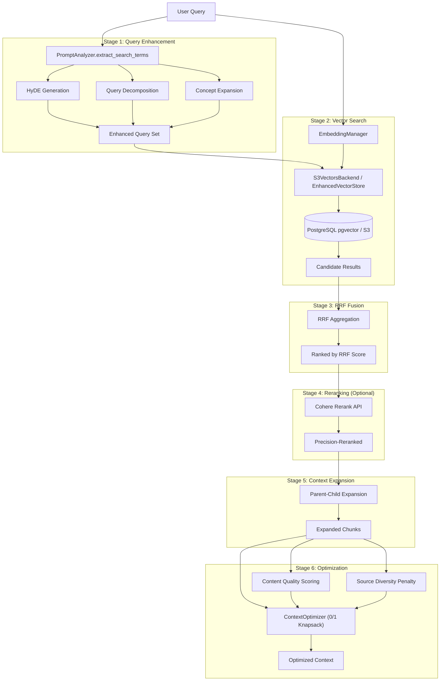
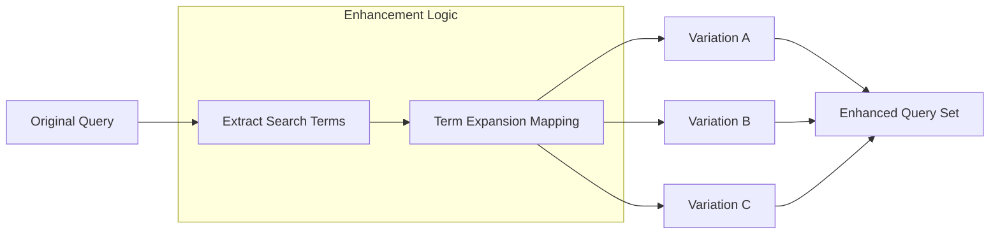
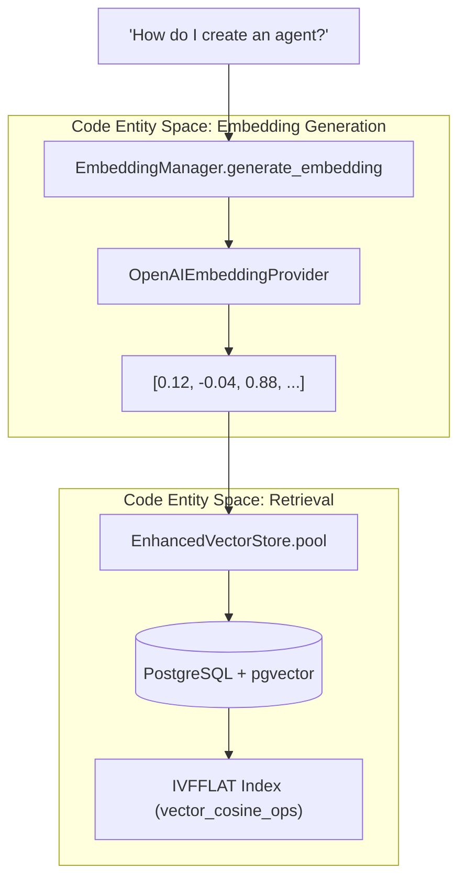
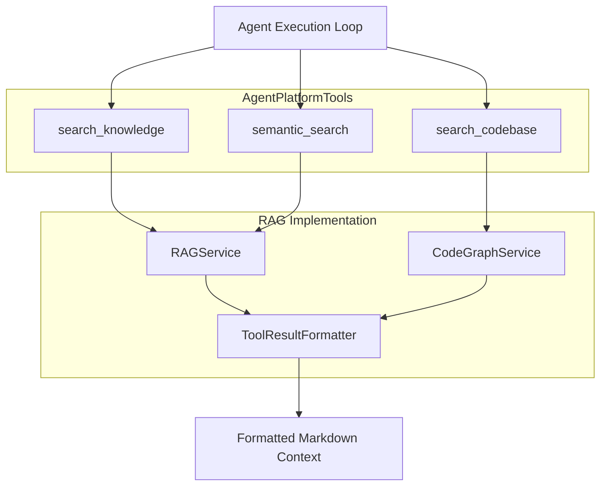

# RAG Retrieval System

<details>
<summary>Relevant source files</summary>

The following files were used as context for generating this wiki page:

- [frontend/components/documents/local-storage-browser.tsx](frontend/components/documents/local-storage-browser.tsx)
- [orchestrator/api/documents.py](orchestrator/api/documents.py)
- [orchestrator/api/knowledge_multimodal.py](orchestrator/api/knowledge_multimodal.py)
- [orchestrator/core/llm/embedding_manager.py](orchestrator/core/llm/embedding_manager.py)
- [orchestrator/modules/agents/services/agent_platform_tools.py](orchestrator/modules/agents/services/agent_platform_tools.py)
- [orchestrator/modules/memory/__init__.py](orchestrator/modules/memory/__init__.py)
- [orchestrator/modules/memory/operations/augmentation.py](orchestrator/modules/memory/operations/augmentation.py)
- [orchestrator/modules/rag/chunking/semantic_chunker.py](orchestrator/modules/rag/chunking/semantic_chunker.py)
- [orchestrator/modules/rag/config.py](orchestrator/modules/rag/config.py)
- [orchestrator/modules/rag/ingestion/manager.py](orchestrator/modules/rag/ingestion/manager.py)
- [orchestrator/modules/rag/service.py](orchestrator/modules/rag/service.py)
- [orchestrator/modules/rag/services/cloud_file_downloader.py](orchestrator/modules/rag/services/cloud_file_downloader.py)
- [orchestrator/modules/rag/services/cloud_sync_service.py](orchestrator/modules/rag/services/cloud_sync_service.py)
- [orchestrator/modules/search/config.py](orchestrator/modules/search/config.py)
- [orchestrator/modules/search/optimization/context_optimizer.py](orchestrator/modules/search/optimization/context_optimizer.py)
- [orchestrator/modules/search/services/entity_extractor.py](orchestrator/modules/search/services/entity_extractor.py)
- [orchestrator/modules/search/tests/conftest.py](orchestrator/modules/search/tests/conftest.py)
- [orchestrator/modules/search/vector_store/backends/s3_vectors_mock.py](orchestrator/modules/search/vector_store/backends/s3_vectors_mock.py)
- [orchestrator/modules/search/vector_store/store.py](orchestrator/modules/search/vector_store/store.py)
- [orchestrator/modules/tools/formatting/result_formatter.py](orchestrator/modules/tools/formatting/result_formatter.py)

</details>


This document describes the RAG (Retrieval-Augmented Generation) retrieval pipeline, which transforms user queries into optimized context for LLM consumption. The system implements a multi-stage retrieval process with query enhancement, vector search, fusion, reranking, and mathematical optimization.

**Scope**: This page covers the retrieval pipeline only. For document ingestion and processing, see [Document Ingestion Pipeline](7.2). For chunking strategies, see [Semantic Chunking Strategies](7.3). For the API surface, see [Documents API Reference](7.8).

---

## Architecture Overview

The RAG retrieval system follows a six-stage pipeline that progressively refines search results to maximize information value within token constraints.

**RAG Retrieval Pipeline Flow**


**Sources**: [orchestrator/modules/rag/service.py:142-208](), [orchestrator/modules/rag/service.py:210-294]()

---

## RAGService Class

The `RAGService` class orchestrates the entire retrieval pipeline. It integrates with existing optimization components rather than reimplementing them.

| Component | Source | Purpose |
|-----------|--------|---------|
| `ContextOptimizer` | [orchestrator/modules/rag/service.py:171-174]() | 0/1 knapsack, MMR, entropy |
| `SemanticChunker` | [orchestrator/modules/rag/service.py:187-193]() | Adaptive, Parent-Child, and Multi-modal strategies |
| `EmbeddingManager` | [orchestrator/core/llm/embedding_manager.py:54-62]() | Centralized provider management (OpenAI, OpenRouter, Local) |
| `EnhancedVectorStore` | [orchestrator/modules/search/vector_store/store.py:102-132]() | Advanced vector storage and retrieval with pgvector |

**Key Methods**:

*   `_ensure_initialized()`: Performs lazy loading of `ContextOptimizer`, `EmbeddingManager`, and `SemanticChunker` [orchestrator/modules/rag/service.py:164-197]().
*   `retrieve_context()`: The main entry point that executes the pipeline from enhancement to knapsack optimization [orchestrator/modules/rag/service.py:210-240]().

**Sources**: [orchestrator/modules/rag/service.py:142-208](), [orchestrator/modules/rag/service.py:210-240](), [orchestrator/core/llm/embedding_manager.py:54-62](), [orchestrator/modules/search/vector_store/store.py:102-132]()

---

## Configuration: RAGConfig

Configuration is dynamically loaded from the `SystemSetting` table in the database [orchestrator/modules/rag/service.py:47-95]().

```python
@dataclass
class RAGConfig:
    chunk_size: int = None               # From system_settings.chunk_size
    min_chunk_size: int = None           # From system_settings.min_chunk_size
    max_tokens: int = None               # From system_settings.max_tokens
    diversity: float = None              # From system_settings.diversity_factor
    min_similarity: float = None         # From system_settings.min_similarity
    
    enable_reranking: bool = False       # From system_settings.rag_rerank_enabled
    rrf_k: int = 60                      # Standard RRF constant
    
    hybrid_search_enabled: bool = True
    hybrid_vector_weight: float = 0.7
    hybrid_keyword_weight: float = 0.3
```

| Setting Key | Default | Description |
|------------|---------|-------------|
| `chunk_size` | 500 | Target chunk size in characters [orchestrator/modules/rag/service.py:124-124]() |
| `max_tokens` | 2000 | Maximum tokens in final context [orchestrator/modules/rag/service.py:130-130]() |
| `diversity_factor` | 0.3 | MMR diversity parameter [orchestrator/modules/rag/service.py:132-132]() |
| `min_similarity` | 0.5 | Minimum cosine similarity threshold [orchestrator/modules/rag/service.py:134-134]() |
| `rag_rerank_enabled` | `"false"` | Enable precision reranking via `RerankManager` [orchestrator/modules/rag/service.py:137-137]() |

**Sources**: [orchestrator/modules/rag/service.py:47-140]()

---

## Stage 1: Query Enhancement

Query enhancement generates multiple query variations to improve recall. The system utilizes strategies such as query decomposition and concept expansion to ensure high coverage across document indices [orchestrator/modules/rag/service.py:109-110]().

**Query Enhancement Strategy**


**Sources**: [orchestrator/modules/rag/service.py:109-110]()

---

## Stage 2: Vector Search & Embedding Management

The `EmbeddingManager` provides a unified interface for generating vectors, supporting multiple providers like OpenAI, OpenRouter, and local HuggingFace models [orchestrator/core/llm/embedding_manager.py:142-155]().

**Natural Language to Vector Space Mapping**


### Multi-Tenant Isolation
The `EnhancedVectorStore` and `DocumentManager` utilize `workspace_id` to filter documents. The `get_document_manager` factory ensures that every manager instance is scoped to a specific workspace, preventing cross-tenant data leakage [orchestrator/api/documents.py:77-86]().

**Sources**: [orchestrator/core/llm/embedding_manager.py:54-155](), [orchestrator/modules/search/vector_store/store.py:102-172](), [orchestrator/api/documents.py:77-86]()

---

## Stage 3: Reciprocal Rank Fusion (RRF)

When using query enhancement, multiple query variations produce overlapping results. RRF aggregates these results by scoring documents based on their ranks across all queries.

**Implementation Logic**:
The system aggregates candidate documents by calculating scores based on the rank in each sub-query result set. The standard RRF constant `k=60` is used to smooth the ranking impact of individual results [orchestrator/modules/rag/service.py:112-112]().

**Sources**: [orchestrator/modules/rag/service.py:110-112]()

---

## Stage 4: Reranking

Optional precision reranking using cross-encoder models. This stage is enabled via `system_settings.rag_rerank_enabled = "true"` [orchestrator/modules/rag/service.py:137-137](). Reranking improves precision by evaluating the actual semantic relevance of candidates against the original query before final selection.

**Sources**: [orchestrator/modules/rag/service.py:137-140]()

---

## Stage 6: Context Optimization (0/1 Knapsack)

The final stage uses a **0/1 knapsack dynamic programming algorithm** to select chunks that maximize information value within the token budget. This ensures that the most relevant information is included without exceeding LLM context windows.

### Content Quality Scoring
Chunks are evaluated based on content quality to ensure that the final context is clean and informative.

### Knapsack DP Algorithm
The algorithm selects the optimal subset of chunks where `weights` are token counts and `capacity` is the `max_tokens` budget.

**Sources**: [orchestrator/modules/rag/service.py:129-132](), [orchestrator/modules/rag/service.py:158-158]()

---

## Platform Tool Integration

Agents access the RAG system through `AgentPlatformTools` [orchestrator/modules/agents/services/agent_platform_tools.py:26-30]().

**Agent to Platform Research Bridge**


### Tool Definitions

| Tool | Purpose | Source |
|------|---------|--------|
| `search_knowledge` | Search Automatos knowledge base for platform documentation | [orchestrator/modules/agents/services/agent_platform_tools.py:60-77]() |
| `semantic_search` | Find semantically similar content across all platform documents | [orchestrator/modules/agents/services/agent_platform_tools.py:79-96]() |
| `search_codebase` | Search indexed codebase for symbols (functions, classes) | [orchestrator/modules/agents/services/agent_platform_tools.py:98-135]() |

### Result Formatting
The `ToolResultFormatter` ensures consistent output for agents by cleaning filenames, extracting useful excerpts, and reassembling chunks from the database if necessary [orchestrator/modules/tools/formatting/result_formatter.py:18-42](). It can reassemble full document content by fetching chunks from `document_chunks` table or downloading original files from S3 [orchestrator/modules/tools/formatting/result_formatter.py:118-171]().

### Cloud Storage Integration
The `CloudSyncService` orchestrates the synchronization of documents from cloud providers like Google Drive and Dropbox via Composio [orchestrator/modules/rag/services/cloud_sync_service.py:38-48](). Files are downloaded using the `CloudFileDownloader`, which handles provider-specific issues like Google Drive truncation by falling back to SDK-based downloads [orchestrator/modules/rag/services/cloud_file_downloader.py:59-124]().

**Sources**: [orchestrator/modules/agents/services/agent_platform_tools.py:56-135](), [orchestrator/modules/tools/formatting/result_formatter.py:18-171](), [orchestrator/modules/rag/services/cloud_sync_service.py:38-48](), [orchestrator/modules/rag/services/cloud_file_downloader.py:59-124]()

---