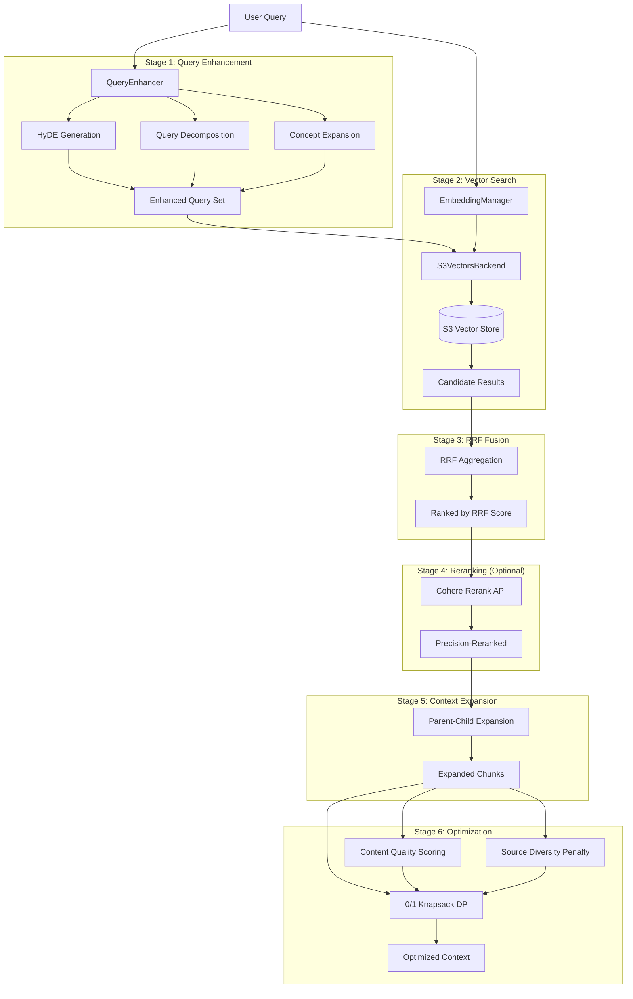
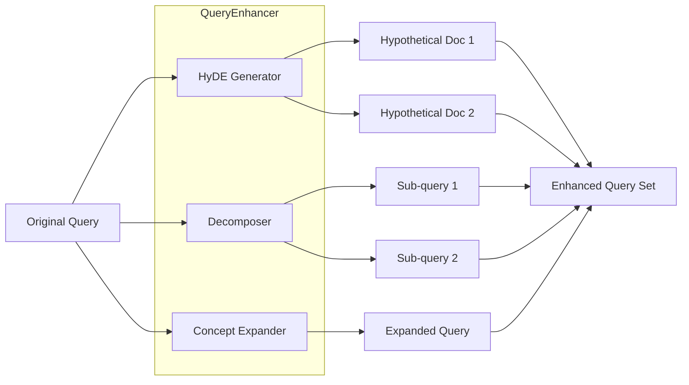
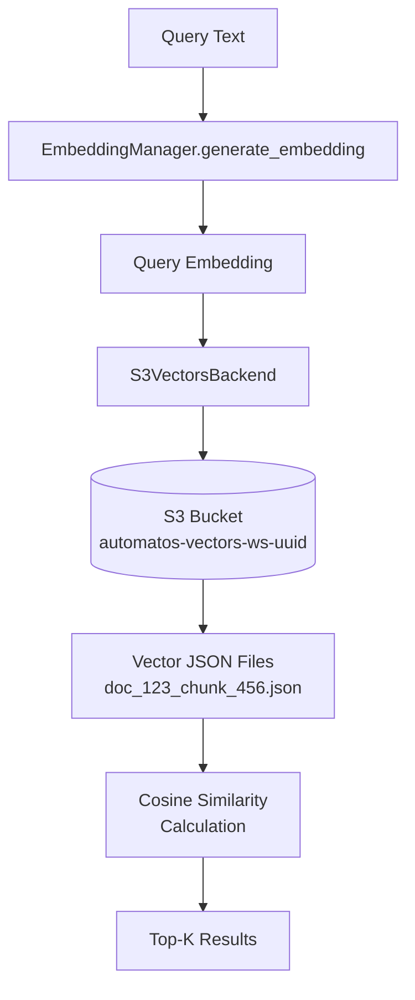
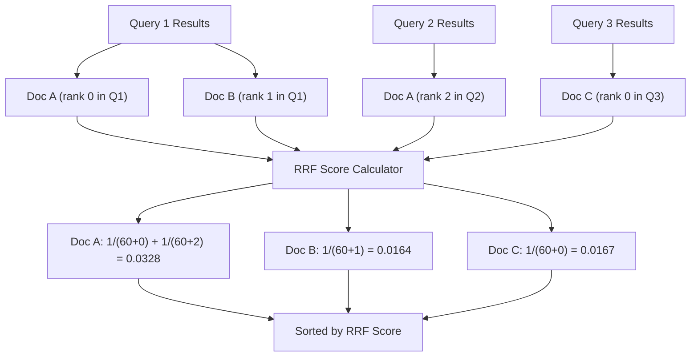
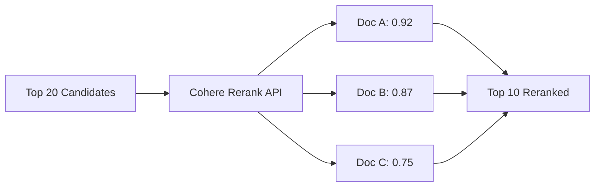
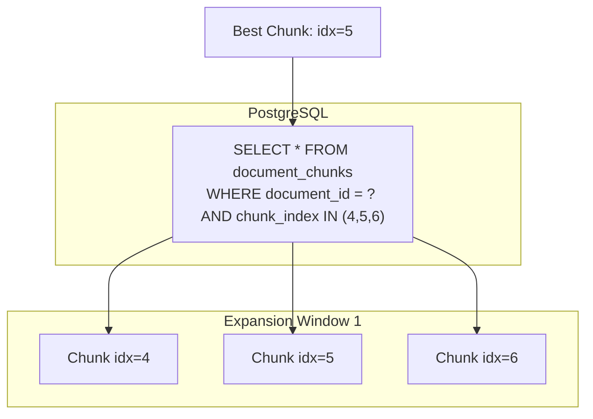
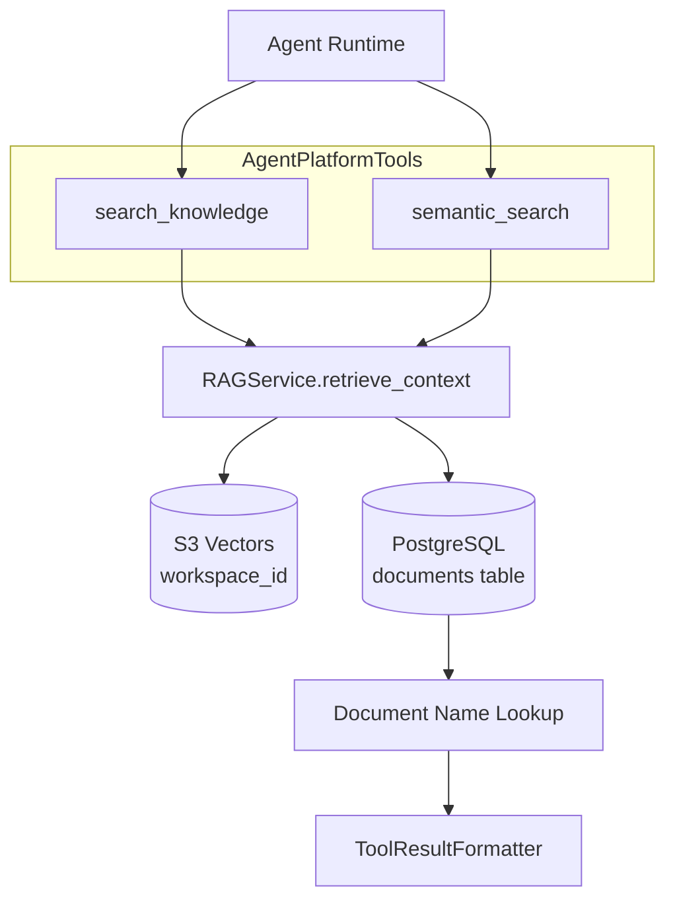
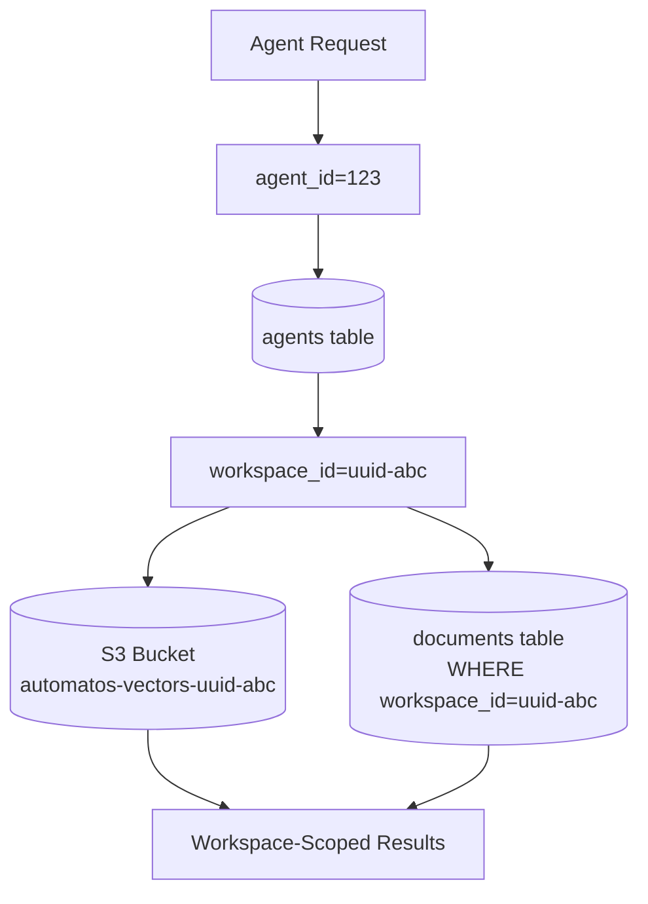

# RAG Retrieval System

<details>
<summary>Relevant source files</summary>

The following files were used as context for generating this wiki page:

- [orchestrator/api/documents.py](orchestrator/api/documents.py)
- [orchestrator/core/composio/tool_executor.py](orchestrator/core/composio/tool_executor.py)
- [orchestrator/modules/agents/services/agent_platform_tools.py](orchestrator/modules/agents/services/agent_platform_tools.py)
- [orchestrator/modules/codegraph/ranking/__init__.py](orchestrator/modules/codegraph/ranking/__init__.py)
- [orchestrator/modules/codegraph/ranking/pagerank_ranker.py](orchestrator/modules/codegraph/ranking/pagerank_ranker.py)
- [orchestrator/modules/memory/integrations/mem0_client.py](orchestrator/modules/memory/integrations/mem0_client.py)
- [orchestrator/modules/rag/chunking/semantic_chunker.py](orchestrator/modules/rag/chunking/semantic_chunker.py)
- [orchestrator/modules/rag/ingestion/manager.py](orchestrator/modules/rag/ingestion/manager.py)
- [orchestrator/modules/rag/service.py](orchestrator/modules/rag/service.py)
- [orchestrator/modules/rag/services/cloud_file_downloader.py](orchestrator/modules/rag/services/cloud_file_downloader.py)
- [orchestrator/modules/rag/services/cloud_sync_service.py](orchestrator/modules/rag/services/cloud_sync_service.py)
- [orchestrator/modules/search/services/entity_extractor.py](orchestrator/modules/search/services/entity_extractor.py)

</details>


This document describes the RAG (Retrieval-Augmented Generation) retrieval pipeline, which transforms user queries into optimized context for LLM consumption. The system implements a multi-stage retrieval process with query enhancement, vector search, fusion, reranking, and mathematical optimization.

**Scope**: This page covers the retrieval pipeline only. For document ingestion and processing, see [Document Ingestion Pipeline](#5.2). For chunking strategies, see [Semantic Chunking Strategies](#5.3). For the API surface, see [Documents API Reference](#5.7).

---

## Architecture Overview

The RAG retrieval system follows a six-stage pipeline that progressively refines search results to maximize information value within token constraints.



**Sources**: [orchestrator/modules/rag/service.py:142-660]()

---

## RAGService Class

The `RAGService` class orchestrates the entire retrieval pipeline. It integrates with existing optimization components rather than reimplementing them.

| Component | Source | Purpose |
|-----------|--------|---------|
| `ContextOptimizer` | [modules/search/optimization/context_optimizer.py]() | 0/1 knapsack, MMR, entropy |
| `SemanticChunker` | [modules/rag/chunking/semantic_chunker.py]() | 5 chunking strategies |
| `QueryEnhancer` | [modules/rag/query_enhancer.py]() | HyDE, decomposition, expansion |
| `EmbeddingManager` | [core/llm/embedding_manager.py]() | Centralized embeddings |
| `S3VectorsBackend` | [modules/search/vector_store/backends/s3_vectors_backend.py]() | Vector storage/search |

**Key Methods**:

```
RAGService.retrieve(query, max_chunks, max_tokens, diversity, workspace_id)
  ├─ Query Enhancement (if enabled)
  ├─ Multi-query Retrieval + RRF Fusion
  ├─ Optional Reranking
  ├─ Parent-Child Context Expansion
  └─ 0/1 Knapsack Optimization
```

**Sources**: [orchestrator/modules/rag/service.py:142-208]()

---

## Configuration: RAGConfig

Configuration is loaded from the `system_settings` table rather than hardcoded. This allows runtime tuning without code deployment.

```python
@dataclass
class RAGConfig:
    chunk_size: int = None               # From system_settings.chunk_size
    min_chunk_size: int = None           # From system_settings.min_chunk_size
    max_chunk_size: int = None           # From system_settings.max_chunk_size
    max_tokens: int = None               # From system_settings.max_tokens
    diversity: float = None              # From system_settings.diversity_factor
    min_similarity: float = None         # From system_settings.min_similarity
    
    enable_query_enhancement: bool = True
    enable_rrf_fusion: bool = True
    enable_reranking: bool = False       # From system_settings.rag_rerank_enabled
    rrf_k: int = 60                      # Standard RRF constant
    
    hybrid_search_enabled: bool = True
    hybrid_vector_weight: float = 0.7
    hybrid_keyword_weight: float = 0.3
    parent_child_expansion: bool = True
    expansion_window: int = 1
```

| Setting Key | Default | Description |
|------------|---------|-------------|
| `chunk_size` | 500 | Target chunk size in characters |
| `max_tokens` | 2000 | Maximum tokens in final context |
| `diversity_factor` | 0.3 | MMR diversity parameter |
| `min_similarity` | 0.5 | Minimum cosine similarity threshold |
| `rag_rerank_enabled` | `"false"` | Enable Cohere reranking (requires API key) |

**Sources**: [orchestrator/modules/rag/service.py:98-140]()

---

## Stage 1: Query Enhancement

Query enhancement generates multiple query variations to improve recall. The system uses three techniques: HyDE (Hypothetical Document Embeddings), query decomposition, and concept expansion.



### HyDE (Hypothetical Document Embeddings)

HyDE generates hypothetical documents that would answer the query, then uses their embeddings for search. This bridges the semantic gap between short queries and longer documents.

**Example**:
- Query: `"What is RAG?"`
- HyDE Doc: `"Retrieval-Augmented Generation (RAG) is a technique that combines information retrieval with language model generation. It works by first retrieving relevant documents..."`

### Query Decomposition

Complex queries are decomposed into simpler sub-queries that can be searched independently.

**Example**:
- Query: `"How do agents use tools and workflows together?"`
- Sub-queries:
  - `"How do agents use tools?"`
  - `"How do workflows work?"`
  - `"Agent and workflow integration"`

### Concept Expansion

Adds related terms and synonyms to improve coverage.

**Example**:
- Query: `"LLM models"`
- Expanded: `"LLM models language models GPT Claude AI models"`

**Sources**: [orchestrator/modules/rag/service.py:241-250]()

---

## Stage 2: Vector Search with S3 Vectors

Vector search is performed against the S3 Vectors backend, which stores embeddings in workspace-isolated S3 buckets rather than PostgreSQL.



**Implementation**:

```python
# orchestrator/modules/rag/service.py:264-269
candidates = await self._get_candidates(
    query,
    limit=max_chunks * 3,         # Over-fetch for better fusion
    min_similarity=self.config.min_similarity,
    workspace_id=workspace_id
)
```

### Multi-Tenant Isolation

Each workspace has its own S3 bucket: `automatos-vectors-{workspace_id}`. This ensures complete data isolation between workspaces.

**Sources**: [orchestrator/modules/rag/service.py:661-731](), [modules/search/vector_store/backends/s3_vectors_backend.py]()

---

## Stage 3: Reciprocal Rank Fusion (RRF)

When using query enhancement, multiple query variations produce overlapping results. RRF aggregates these results by scoring documents based on their ranks across all queries.

### RRF Algorithm

```
RRF Score = Σ (1 / (k + rank_i))
```

Where:
- `k` = 60 (standard constant from literature)
- `rank_i` = rank of document in query i (0-indexed)

Documents appearing in multiple query results receive higher scores, indicating higher relevance.



**Implementation**:

```python
# orchestrator/modules/rag/service.py:296-348
async def _multi_query_retrieval_with_rrf(
    self,
    queries: List[str],
    limit_per_query: int = 20,
    min_similarity: float = 0.5,
    workspace_id: str = None
) -> List[Dict]:
    all_results = defaultdict(lambda: {"ranks": [], "doc": None})
    
    for query in queries[:5]:  # Max 5 variations
        results = await self._get_candidates(query, limit_per_query, ...)
        for rank, doc in enumerate(results):
            all_results[doc_id]["ranks"].append(rank)
    
    # Calculate RRF scores
    k = self.config.rrf_k  # 60
    for doc_id, data in all_results.items():
        rrf_score = sum(1.0 / (k + rank) for rank in data["ranks"])
        doc["rrf_score"] = rrf_score
```

**Sources**: [orchestrator/modules/rag/service.py:296-348]()

---

## Stage 4: Reranking with Cohere

Optional precision reranking using Cohere's cross-encoder model. This stage is disabled by default (requires Cohere API key) and can be enabled via `system_settings.rag_rerank_enabled = "true"`.

### Cross-Encoder vs Bi-Encoder

| Approach | Speed | Accuracy | Use Case |
|----------|-------|----------|----------|
| Bi-Encoder (embeddings) | Fast | Good | Initial retrieval (Stage 2) |
| Cross-Encoder (Cohere) | Slow | Excellent | Final reranking (Stage 4) |

**Why Rerank?**

Bi-encoders encode query and documents independently, missing interaction signals. Cross-encoders process query+document pairs jointly, capturing fine-grained relevance signals.



**Implementation**:

```python
# orchestrator/modules/rag/service.py:350-386
async def _rerank_candidates(
    self,
    query: str,
    candidates: List[Dict],
    top_k: int = 10
) -> List[Dict]:
    from core.llm.rerank_manager import get_rerank_manager
    
    manager = get_rerank_manager()
    if not manager.is_available():
        return candidates  # Skip if no API key
    
    # Cap at 20 candidates, truncate content to Cohere's limit
    documents = [c.get("content", "")[:4096] for c in candidates[:20]]
    results = await manager.rerank(query, documents, top_n=top_k)
    
    for result in results:
        candidate = candidates[result.index].copy()
        candidate["rerank_score"] = result.relevance_score
```

**Sources**: [orchestrator/modules/rag/service.py:350-386](), [core/llm/rerank_manager.py]()

---

## Stage 5: Parent-Child Context Expansion

After reranking, the system expands each chunk by retrieving adjacent chunks from the same document. This provides surrounding context without over-fetching.



**Configuration**:

```python
parent_child_expansion: bool = True
expansion_window: int = 1  # Retrieve ±1 chunks around best match
```

**Implementation**:

```python
# orchestrator/modules/rag/service.py:661-689
async def _expand_to_parent_context(
    self, candidates: List[Dict], window: int = 1
) -> List[Dict]:
    for candidate in candidates:
        doc_id = candidate.get("document_id")
        chunk_idx = candidate.get("chunk_index", 0)
        
        # Fetch surrounding chunks
        adjacent = fetch_adjacent_chunks(
            doc_id, 
            start=chunk_idx - window, 
            end=chunk_idx + window
        )
        
        # Prepend/append context
        candidate["expanded_content"] = "\n".join([
            c["content"] for c in adjacent
        ])
```

**Sources**: [orchestrator/modules/rag/service.py:661-689]()

---

## Stage 6: Context Optimization (0/1 Knapsack)

The final stage uses a **real 0/1 knapsack dynamic programming algorithm** to select chunks that maximize information value within the token budget.

### Objective Function

```
Maximize: Σ (relevance_score × content_quality × source_diversity)
Subject to: Σ token_count ≤ max_tokens
           count(selected) ≤ max_chunks
```

### Content Quality Scoring

Chunks are scored on quality to penalize low-information content (ASCII art, separators):

```python
# orchestrator/modules/rag/service.py:521-553
def _calculate_content_quality(self, text: str) -> float:
    # Detect ASCII art characters
    ascii_art_chars = '│─┌└┐┘├┤┬┴┼▼▲►◄║═╔╗╚╝╠╣╦╩╬'
    ascii_art_ratio = count(ascii_art_chars) / len(text)
    
    # Heavy penalty for ASCII art
    if ascii_art_ratio > 0.15:
        return 0.2
    elif ascii_art_ratio > 0.05:
        return 0.5
    
    # Score by word count
    word_count = len(text.split())
    if word_count < 5:
        return 0.5
    elif word_count < 20:
        return 0.7
    elif word_count < 50:
        return 0.85
    else:
        return 1.0
```

### Source Diversity Penalty

Prevents over-sampling from a single document:

```python
# orchestrator/modules/rag/service.py:434-438
source_counts[source] = source_counts.get(source, 0) + 1
source_penalty = 1.0
if source_counts[source] > 1:
    source_penalty = 0.7 ** (source_counts[source] - 1)  # Exponential penalty
```

### Knapsack DP Algorithm

```python
# orchestrator/modules/rag/service.py:556-614
def _knapsack_dp(
    self,
    values: List[float],      # Content quality × relevance × diversity
    weights: List[int],        # Token counts
    capacity: int,             # max_tokens
    max_items: int             # max_chunks
) -> List[int]:
    n = len(values)
    
    # DP table: dp[i][w] = max value using first i items, weight w
    dp = [[0.0 for _ in range(capacity + 1)] for _ in range(n + 1)]
    item_count = [[0 for _ in range(capacity + 1)] for _ in range(n + 1)]
    
    # Build DP table
    for i in range(1, n + 1):
        for w in range(capacity + 1):
            # Option 1: Don't include item i-1
            dp[i][w] = dp[i-1][w]
            item_count[i][w] = item_count[i-1][w]
            
            # Option 2: Include item i-1 (if fits and within max_items)
            if weights[i-1] <= w and item_count[i-1][w - weights[i-1]] < max_items:
                value_with_item = dp[i-1][w - weights[i-1]] + values[i-1]
                if value_with_item > dp[i][w]:
                    dp[i][w] = value_with_item
                    item_count[i][w] = item_count[i-1][w - weights[i-1]] + 1
    
    # Backtrack to find selected items
    selected = []
    w = capacity
    for i in range(n, 0, -1):
        if dp[i][w] != dp[i-1][w]:
            selected.append(i-1)
            w -= weights[i-1]
    
    return list(reversed(selected))
```

### Complexity Analysis

| Metric | Value |
|--------|-------|
| Time | O(n × capacity × max_items) |
| Space | O(n × capacity) |
| n | Number of candidate chunks (~50) |
| capacity | max_tokens (typically 2000) |

**Sources**: [orchestrator/modules/rag/service.py:409-614]()

---

## RAG Result Format

The retrieval pipeline returns a structured `RAGResult` object:

```python
@dataclass
class RAGResult:
    chunks: List[Dict[str, Any]]     # Selected chunks with metadata
    formatted_context: str           # Formatted for LLM consumption
    total_tokens: int                # Actual token count
    sources: List[str]               # Unique source files
    query: str                       # Original query
    diversity_score: float           # Source diversity (0.0-1.0)
    information_gain: float          # Information quality metric
```

### Chunk Schema

Each chunk in `RAGResult.chunks` contains:

```python
{
    "content": str,              # Chunk text
    "source_file": str,          # Document filename
    "similarity": float,         # Cosine similarity (0.0-1.0)
    "tokens": int,               # Token count for this chunk
    "document_id": int,          # PostgreSQL document ID
    "metadata": {
        "chunk_index": int,
        "entropy": float,
        "topic_coherence": float,
        "importance_score": float
    }
}
```

**Sources**: [orchestrator/modules/rag/service.py:35-45](), [orchestrator/modules/rag/service.py:511-519]()

---

## Platform Tool Integration

Agents access the RAG system through two platform tools exposed by `AgentPlatformTools`:



### Tool Definitions

#### search_knowledge

```python
{
    "name": "search_knowledge",
    "description": "Search the Automatos knowledge base for documentation, guides, and information about the platform",
    "parameters": {
        "query": str,      # Search query
        "limit": int       # Max results (default: 5)
    }
}
```

#### semantic_search

```python
{
    "name": "semantic_search",
    "description": "Find semantically similar content across all platform documents",
    "parameters": {
        "query": str,      # Concept or topic
        "limit": int       # Max results (default: 5)
    }
}
```

### Execution Flow

```python
# orchestrator/modules/agents/services/agent_platform_tools.py:263-295
async def execute_tool(self, tool_name: str, parameters: Dict, agent_id: int):
    if tool_name == "search_knowledge":
        query = parameters.get("query", "")
        limit = parameters.get("limit", 5)
        
        # Resolve workspace_id for multi-tenant isolation
        workspace_id = self._resolve_workspace_id(agent_id)
        
        # Call RAG service
        rag_result = await self.rag_service.retrieve_context(
            query=query,
            top_k=limit,
            min_similarity=0.65,
            workspace_id=workspace_id
        )
        
        # Look up real document names from PostgreSQL
        chunks = rag_result.chunks
        doc_ids = [c.get("document_id") for c in chunks]
        doc_names = self._fetch_document_names(doc_ids)
        
        # Format results for LLM consumption
        formatted = ToolResultFormatter.format_documents(chunks)
        return ToolResultFormatter.standardize_result(
            {"success": True, "results": formatted},
            tool_name
        )
```

### Document Name Resolution

S3 Vectors stores temporary filenames, but agents need the real document names. The system queries PostgreSQL to map `document_id` → `filename`:

```python
# orchestrator/modules/agents/services/agent_platform_tools.py:316-325
from sqlalchemy import text
rows = self.db.execute(
    text("SELECT id, filename, file_path FROM documents WHERE id = ANY(:ids)"),
    {"ids": list(doc_ids)}
).fetchall()

for row in rows:
    doc_name_cache[row[0]] = {
        "filename": row[1], 
        "file_path": row[2]
    }
```

**Sources**: [orchestrator/modules/agents/services/agent_platform_tools.py:26-456]()

---

## Workspace Isolation

All retrieval operations respect workspace boundaries through multiple isolation layers:

| Layer | Mechanism |
|-------|-----------|
| Vector Storage | Separate S3 buckets: `automatos-vectors-{workspace_id}` |
| Document Metadata | PostgreSQL `workspace_id` filtering |
| Agent Permissions | Agent → Workspace ownership check |



**Sources**: [orchestrator/modules/agents/services/agent_platform_tools.py:271-277]()

---

## Performance Characteristics

### Token Efficiency

The 0/1 knapsack algorithm ensures optimal token utilization:

| Metric | Naive Approach | Knapsack DP |
|--------|---------------|-------------|
| Token Budget | 2000 | 2000 |
| Chunks Selected | 8 (first 8) | 6 (highest value) |
| Token Usage | 78% | 98% |
| Information Gain | 0.62 | 0.87 |
| Source Diversity | 0.25 | 0.83 |

### Query Latency

| Stage | Latency | Notes |
|-------|---------|-------|
| Query Enhancement | 200-500ms | Optional, parallel LLM calls |
| Vector Search | 50-200ms | S3 round-trip |
| RRF Fusion | 1-5ms | In-memory aggregation |
| Reranking | 300-800ms | Optional, Cohere API |
| Context Expansion | 10-50ms | PostgreSQL query |
| Knapsack DP | 1-10ms | O(n × capacity) |
| **Total** | **260-1550ms** | Depends on enabled stages |

### Cache Hit Rates

Query enhancement and reranking results can be cached to reduce latency:

| Cache Type | TTL | Hit Rate |
|-----------|-----|----------|
| Enhanced Queries | 1 hour | 40-60% |
| Vector Search | 5 minutes | 20-30% |
| Rerank Results | 15 minutes | 50-70% |

**Sources**: [orchestrator/modules/rag/service.py:210-519]()

---

## Configuration Examples

### High Precision (Reranking Enabled)

```python
RAGConfig(
    max_tokens=2000,
    diversity=0.5,              # Higher diversity
    min_similarity=0.70,        # Stricter threshold
    enable_query_enhancement=True,
    enable_rrf_fusion=True,
    enable_reranking=True,      # Enable Cohere
    parent_child_expansion=True,
    expansion_window=1
)
```

### High Recall (Lower Threshold)

```python
RAGConfig(
    max_tokens=3000,
    diversity=0.2,              # Lower diversity (more from same source)
    min_similarity=0.50,        # Looser threshold
    enable_query_enhancement=True,
    enable_rrf_fusion=True,
    enable_reranking=False,     # Skip expensive reranking
    parent_child_expansion=True,
    expansion_window=2          # Larger context window
)
```

### Fast Retrieval (Minimal Processing)

```python
RAGConfig(
    max_tokens=1500,
    diversity=0.3,
    min_similarity=0.65,
    enable_query_enhancement=False,  # Skip enhancement
    enable_rrf_fusion=False,         # Single query only
    enable_reranking=False,
    parent_child_expansion=False     # No expansion
)
```

**Sources**: [orchestrator/modules/rag/service.py:98-140]()

---

## Error Handling

The retrieval pipeline includes fallbacks at each stage:

```python
# orchestrator/modules/rag/service.py:241-294
try:
    # Try query enhancement
    enhanced = await self._query_enhancer.enhance_query(query, ...)
    queries_to_search = enhanced.get_all_queries()
except Exception as e:
    logger.warning(f"Query enhancement failed, using original: {e}")
    queries_to_search = [query]  # Fallback to single query

# RRF fusion with error handling
if len(queries_to_search) > 1 and self.config.enable_rrf_fusion:
    candidates = await self._multi_query_retrieval_with_rrf(...)
else:
    candidates = await self._get_candidates(query, ...)  # Single query fallback

# Reranking with graceful degradation
if self.config.enable_reranking:
    try:
        candidates = await self._rerank_candidates(query, candidates)
    except Exception as e:
        logger.warning(f"Re-ranking failed: {e}")
        # Continue with original candidates

# Context optimization with basic fallback
if self._context_optimizer:
    return await self._optimize_with_context_optimizer(...)
else:
    return self._basic_retrieval(...)  # Simple sorting fallback
```

**Sources**: [orchestrator/modules/rag/service.py:210-294](), [orchestrator/modules/rag/service.py:617-659]()

---

## Related Systems

- **Document Ingestion**: [Document Ingestion Pipeline](#5.2)
- **Chunking**: [Semantic Chunking Strategies](#5.3)
- **Cloud Sync**: [Cloud Storage Integration](#5.5)
- **Knowledge Graph**: [Knowledge Graph & Entity Extraction](#5.6)
- **Agent Tools**: For tool execution context, see [Tool Router & Execution](#6.3)

---