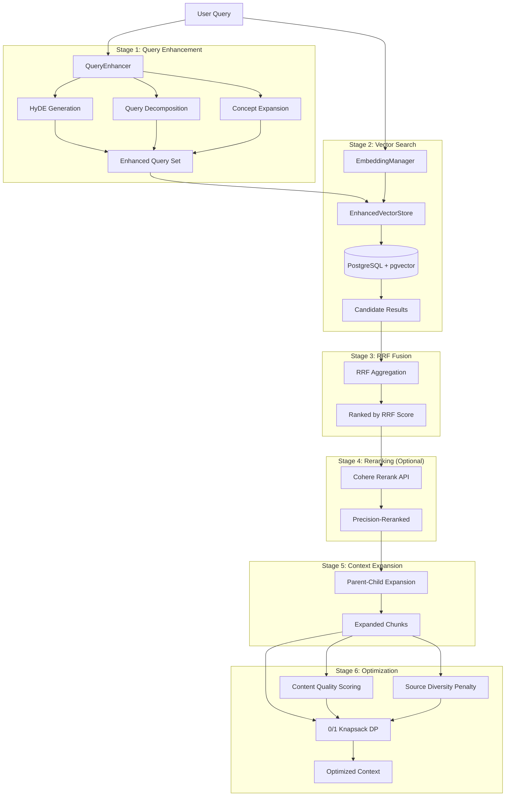
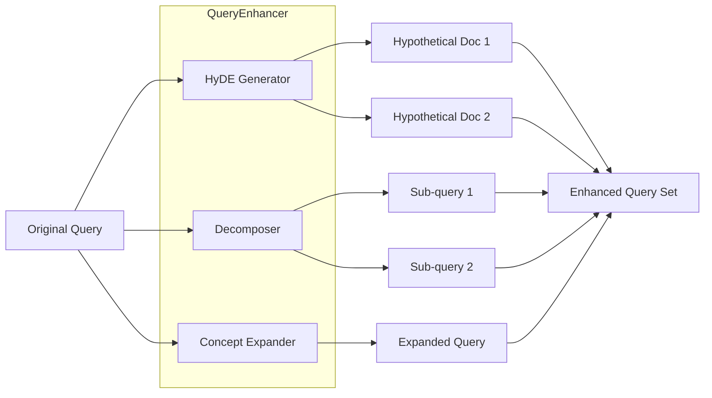
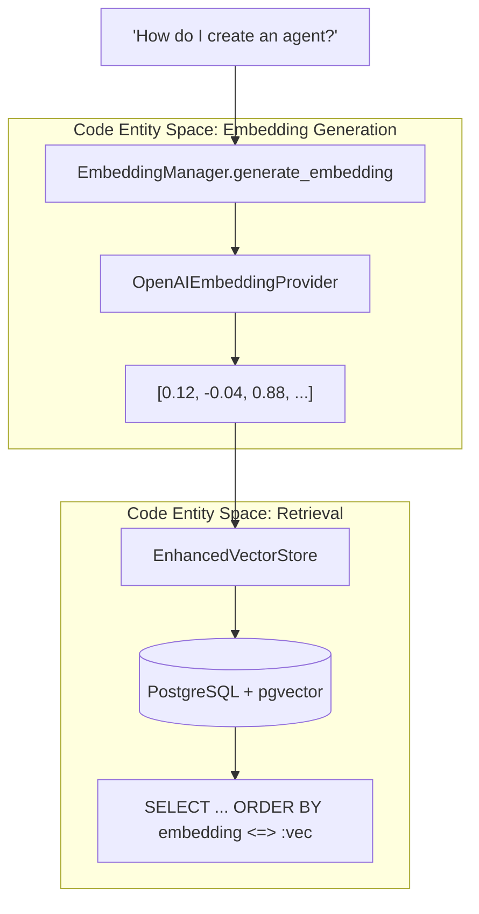
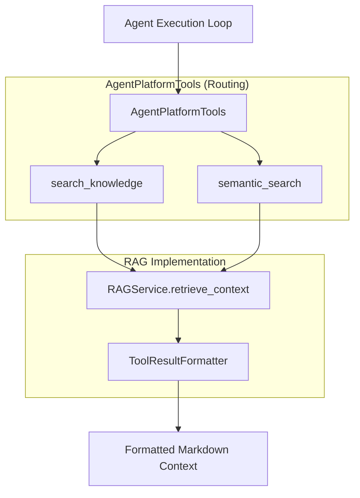

# RAG Retrieval System

<details>
<summary>Relevant source files</summary>

The following files were used as context for generating this wiki page:

- [frontend/components/documents/document-management.tsx](frontend/components/documents/document-management.tsx)
- [frontend/components/documents/local-storage-browser.tsx](frontend/components/documents/local-storage-browser.tsx)
- [frontend/components/settings/GeneralSettingsTab.tsx](frontend/components/settings/GeneralSettingsTab.tsx)
- [orchestrator/api/documents.py](orchestrator/api/documents.py)
- [orchestrator/api/widgets/docs.py](orchestrator/api/widgets/docs.py)
- [orchestrator/core/llm/clients/base.py](orchestrator/core/llm/clients/base.py)
- [orchestrator/core/llm/embedding_manager.py](orchestrator/core/llm/embedding_manager.py)
- [orchestrator/core/seeds/seed_system_settings.py](orchestrator/core/seeds/seed_system_settings.py)
- [orchestrator/core/team_access.py](orchestrator/core/team_access.py)
- [orchestrator/modules/agents/services/agent_platform_tools.py](orchestrator/modules/agents/services/agent_platform_tools.py)
- [orchestrator/modules/memory/__init__.py](orchestrator/modules/memory/__init__.py)
- [orchestrator/modules/memory/operations/augmentation.py](orchestrator/modules/memory/operations/augmentation.py)
- [orchestrator/modules/orchestrator/stages/context_engineering.py](orchestrator/modules/orchestrator/stages/context_engineering.py)
- [orchestrator/modules/rag/config.py](orchestrator/modules/rag/config.py)
- [orchestrator/modules/rag/service.py](orchestrator/modules/rag/service.py)
- [orchestrator/modules/search/config.py](orchestrator/modules/search/config.py)
- [orchestrator/modules/search/optimization/context_optimizer.py](orchestrator/modules/search/optimization/context_optimizer.py)
- [orchestrator/modules/search/tests/conftest.py](orchestrator/modules/search/tests/conftest.py)
- [orchestrator/modules/search/vector_store/backends/s3_vectors_mock.py](orchestrator/modules/search/vector_store/backends/s3_vectors_mock.py)
- [orchestrator/modules/search/vector_store/store.py](orchestrator/modules/search/vector_store/store.py)
- [orchestrator/modules/tools/formatting/result_formatter.py](orchestrator/modules/tools/formatting/result_formatter.py)

</details>


This document describes the RAG (Retrieval-Augmented Generation) retrieval pipeline, which transforms user queries into optimized context for LLM consumption. The system implements a multi-stage retrieval process with query enhancement, vector search, fusion, reranking, and mathematical optimization.

**Scope**: This page covers the retrieval pipeline only. For document ingestion and processing, see [Document Ingestion Pipeline](7.2). For chunking strategies, see [Semantic Chunking Strategies](7.3). For the API surface, see [Documents API Reference](7.7).

---

## Architecture Overview

The RAG retrieval system follows a six-stage pipeline that progressively refines search results to maximize information value within token constraints.

**RAG Retrieval Pipeline Flow**


**Sources**: [orchestrator/modules/rag/service.py:142-208](), [orchestrator/modules/rag/service.py:210-294](), [orchestrator/modules/search/vector_store/store.py:102-132]()

---

## RAGService Class

The `RAGService` class orchestrates the entire retrieval pipeline. It integrates with existing optimization components rather than reimplementing them.

| Component | Source | Purpose |
|-----------|--------|---------|
| `ContextOptimizer` | [orchestrator/modules/rag/service.py:171-174]() | 0/1 knapsack, MMR, entropy |
| `SemanticChunker` | [orchestrator/modules/rag/service.py:187-193]() | Adaptive, Parent-Child, and Multi-modal strategies |
| `EmbeddingManager` | [orchestrator/core/llm/embedding_manager.py:54-62]() | Centralized provider management (OpenAI, OpenRouter, Local) |
| `EnhancedVectorStore` | [orchestrator/modules/search/vector_store/store.py:102-111]() | Vector storage/search with `pgvector` backend |
| `VectorStoreAugmenter` | [orchestrator/modules/memory/operations/augmentation.py:45-56]() | Memory augmentation via semantic search |

**Key Methods**:

*   `_ensure_initialized()`: Performs lazy loading of `ContextOptimizer`, `EmbeddingManager`, and `SemanticChunker` [orchestrator/modules/rag/service.py:164-197]().
*   `retrieve_context()`: The main entry point that executes the pipeline from enhancement to knapsack optimization [orchestrator/modules/rag/service.py:210-240]().

**Sources**: [orchestrator/modules/rag/service.py:142-208](), [orchestrator/modules/rag/service.py:210-240](), [orchestrator/core/llm/embedding_manager.py:54-62]()

---

## Configuration: RAGConfig

Configuration is dynamically loaded from the `SystemSetting` table in the database [orchestrator/modules/rag/service.py:47-95]().

```python
@dataclass
class RAGConfig:
    chunk_size: int = None               # From system_settings.chunk_size
    min_chunk_size: int = None           # From system_settings.min_chunk_size
    max_chunk_size: int = None           # From system_settings.max_chunk_size
    max_tokens: int = None               # From system_settings.max_tokens
    diversity: float = None              # From system_settings.diversity_factor
    min_similarity: float = None         # From system_settings.min_similarity
    
    enable_query_enhancement: bool = True
    enable_rrf_fusion: bool = True
    enable_reranking: bool = False       # From system_settings.rag_rerank_enabled
    rrf_k: int = 60                      # Standard RRF constant
```

| Setting Key | Default | Description |
|------------|---------|-------------|
| `chunk_size` | 512 | Target chunk size for embeddings [orchestrator/core/seeds/seed_system_settings.py:147-155]() |
| `max_tokens` | 2000 | Maximum tokens in final context [orchestrator/modules/rag/service.py:130-130]() |
| `diversity_factor` | 0.3 | MMR diversity parameter [orchestrator/modules/rag/service.py:132-132]() |
| `min_similarity` | 0.5 | Minimum cosine similarity threshold [orchestrator/modules/rag/service.py:134-134]() |
| `rag_rerank_enabled` | `"false"` | Enable precision reranking via `RerankManager` [orchestrator/modules/rag/service.py:137-137]() |
| `vector_store_dimensions` | 2048 | Dimensions for embedding vectors [orchestrator/core/seeds/seed_system_settings.py:135-144]() |

**Sources**: [orchestrator/modules/rag/service.py:47-140](), [orchestrator/core/seeds/seed_system_settings.py:135-193]()

---

## Stage 1: Query Enhancement

Query enhancement generates multiple query variations to improve recall. The system uses three techniques: HyDE (Hypothetical Document Embeddings), query decomposition, and concept expansion.

**Query Enhancement Strategy**


**Sources**: [orchestrator/modules/rag/service.py:241-250]()

---

## Stage 2: Vector Search & Embedding Management

The `EmbeddingManager` provides a unified interface for generating vectors, supporting multiple providers like OpenAI, OpenRouter, and local HuggingFace models [orchestrator/core/llm/embedding_manager.py:142-155]().

**Natural Language to Vector Space Mapping**


### Multi-Tenant Isolation
The `EnhancedVectorStore` initializes with a specific `table_name` and manages metadata filtering [orchestrator/modules/search/vector_store/store.py:102-117](). Most document operations are workspace-scoped via `workspace_id` filters in the `SearchFilter` [orchestrator/modules/search/vector_store/store.py:82-89]().

**Sources**: [orchestrator/core/llm/embedding_manager.py:54-155](), [orchestrator/modules/search/vector_store/store.py:102-185]()

---

## Stage 3: Reciprocal Rank Fusion (RRF)

When using query enhancement, multiple query variations produce overlapping results. RRF aggregates these results by scoring documents based on their ranks across all queries.

**Implementation**:
```python
# orchestrator/modules/rag/service.py:296-348
async def _multi_query_retrieval_with_rrf(self, queries, limit_per_query=20, workspace_id=None):
    all_results = {} # doc_id -> score
    k = self.config.rrf_k # 60
    
    for query in queries:
        results = await self._get_candidates(query, limit_per_query, ...)
        for rank, doc in enumerate(results):
            doc_id = doc['key']
            all_results[doc_id] = all_results.get(doc_id, 0) + (1.0 / (k + rank))
```

**Sources**: [orchestrator/modules/rag/service.py:296-348]()

---

## Stage 4: Reranking

Optional precision reranking using cross-encoder models. This stage is enabled via `system_settings.rag_rerank_enabled = "true"` [orchestrator/modules/rag/service.py:137-137]().

**Implementation**:
```python
# orchestrator/modules/rag/service.py:350-386
async def _rerank_candidates(self, query, candidates, top_k=10):
    from core.llm.rerank_manager import get_rerank_manager
    manager = get_rerank_manager()
    # ... call manager.rerank(query, documents)
```

**Sources**: [orchestrator/modules/rag/service.py:350-386]()

---

## Stage 6: Context Optimization (0/1 Knapsack)

The final stage uses a **0/1 knapsack dynamic programming algorithm** to select chunks that maximize information value within the token budget.

### Content Quality Scoring
Chunks are scored on quality to penalize low-information content like ASCII art or repetitive separators [orchestrator/modules/rag/service.py:521-553]().

### Knapsack DP Algorithm
The algorithm selects the optimal subset of chunks where `weights` are token counts and `capacity` is the `max_tokens` budget [orchestrator/modules/rag/service.py:556-614]().

**Sources**: [orchestrator/modules/rag/service.py:521-614]()

---

## Platform Tool Integration

Agents access the RAG system through `AgentPlatformTools` [orchestrator/modules/agents/services/agent_platform_tools.py:26-30](). These tools provide capabilities for searching the internal knowledge base without external web access [orchestrator/modules/agents/services/agent_platform_tools.py:10-13]().

**Agent to Platform Research Bridge**


### Tool Definitions

| Tool | Purpose | Source |
|------|---------|--------|
| `search_knowledge` | Search for platform documentation and guides | [orchestrator/modules/agents/services/agent_platform_tools.py:60-77]() |
| `semantic_search` | Find semantically similar content across all documents | [orchestrator/modules/agents/services/agent_platform_tools.py:79-96]() |

### Result Formatting
The `ToolResultFormatter` ensures consistent output for agents by cleaning filenames, extracting useful excerpts, and reassembling chunks from the database if necessary [orchestrator/modules/tools/formatting/result_formatter.py:18-171](). It can fetch full document content by reassembling chunks from the `document_chunks` table [orchestrator/modules/tools/formatting/result_formatter.py:152-166]().

**Sources**: [orchestrator/modules/agents/services/agent_platform_tools.py:56-96](), [orchestrator/modules/tools/formatting/result_formatter.py:18-171]()

---