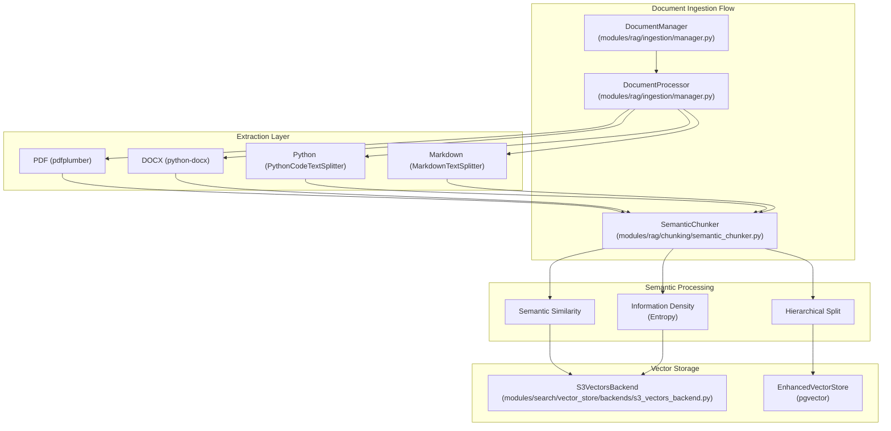
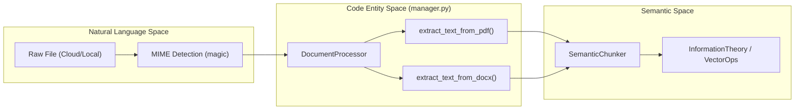
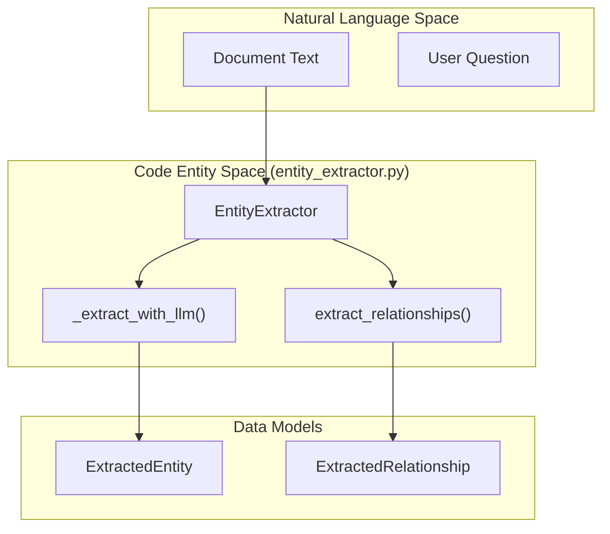

# Semantic Chunking Strategies

Relevant source files

The following files were used as context for generating this wiki page:

- [frontend/components/documents/local-storage-browser.tsx](frontend/components/documents/local-storage-browser.tsx)
- [orchestrator/api/documents.py](orchestrator/api/documents.py)
- [orchestrator/api/knowledge_multimodal.py](orchestrator/api/knowledge_multimodal.py)
- [orchestrator/modules/agents/services/agent_platform_tools.py](orchestrator/modules/agents/services/agent_platform_tools.py)
- [orchestrator/modules/rag/chunking/semantic_chunker.py](orchestrator/modules/rag/chunking/semantic_chunker.py)
- [orchestrator/modules/rag/ingestion/manager.py](orchestrator/modules/rag/ingestion/manager.py)
- [orchestrator/modules/rag/service.py](orchestrator/modules/rag/service.py)
- [orchestrator/modules/rag/services/cloud_file_downloader.py](orchestrator/modules/rag/services/cloud_file_downloader.py)
- [orchestrator/modules/rag/services/cloud_sync_service.py](orchestrator/modules/rag/services/cloud_sync_service.py)
- [orchestrator/modules/search/services/entity_extractor.py](orchestrator/modules/search/services/entity_extractor.py)
- [orchestrator/modules/tools/formatting/result_formatter.py](orchestrator/modules/tools/formatting/result_formatter.py)

## Purpose and Scope

This page documents the semantic chunking strategies used in Automatos AI's document ingestion pipeline. Chunking is the process of splitting large documents into smaller, semantically meaningful units for vector embedding and retrieval. This page covers the `SemanticChunker` implementation, mathematical foundations for entropy-based splitting, multi-modal strategies for different file types (PDF, DOCX, MD, PY), and the parent-child expansion mechanism for context retrieval.

For information about the overall RAG retrieval system and similarity search, see [RAG Retrieval System](). For the end-to-end document ingestion flow, see [Document Ingestion Pipeline]().

---

## Chunking Architecture Overview

The ingestion pipeline transforms raw files into vectorized chunks using a layered architecture that transitions from physical file formats to semantic vector space. The `DocumentManager` coordinates this process per workspace, utilizing `DocumentProcessor` for extraction and `SemanticChunker` for splitting.

### Document Ingestion Flow

**Sources:**
- [orchestrator/modules/rag/ingestion/manager.py:113-130]()
- [orchestrator/modules/rag/chunking/semantic_chunker.py:52-89]()
- [orchestrator/modules/search/vector_store/backends/s3_vectors_backend.py:24-37]()

---

## Semantic Chunking Strategies

The `SemanticChunker` class supports multiple advanced strategies defined in the `ChunkingStrategy` enum [orchestrator/modules/rag/chunking/semantic_chunker.py:22-28]().

### 1. Semantic Similarity
This strategy splits text based on the cosine similarity between consecutive sentences. If the similarity falls below a defined `similarity_threshold` (default 0.7), a new chunk is started [orchestrator/modules/rag/chunking/semantic_chunker.py:62-69](). The implementation uses `VectorOperations` to calculate similarity scores [orchestrator/modules/rag/chunking/semantic_chunker.py:73-74]() and [orchestrator/modules/rag/chunking/semantic_chunker.py:122-128]().

### 2. Information Density (Entropy-based)
Utilizes `InformationTheory` to calculate the Shannon entropy of sentences [orchestrator/modules/rag/chunking/semantic_chunker.py:72](). Boundaries are placed where information density shifts significantly, ensuring that high-entropy (fact-dense) sections are not diluted by low-entropy transitions [orchestrator/modules/rag/chunking/semantic_chunker.py:154-181]().

### 3. Hierarchical Strategy
Creates a parent-child relationship between chunks. Large "parent" chunks provide broad context, while smaller "child" chunks allow for high-precision vector matches. This is reflected in the `DocumentChunk` dataclass which includes a `parent_content` field [orchestrator/modules/rag/ingestion/manager.py:100-101]().

### 4. Code-Aware Chunking
For Python files, the system uses the `PythonCodeTextSplitter` [orchestrator/modules/rag/ingestion/manager.py:35-36](). This splitter respects class and function boundaries, preventing logic from being severed mid-definition [orchestrator/modules/rag/ingestion/manager.py:126-129]().

### 5. Adaptive Strategy
The system balances target chunk size, min size, and max size constraints dynamically based on content flow. The `SemanticChunker` initialization sets these parameters: `target_chunk_size` (default 1000), `min_chunk_size` (100), and `max_chunk_size` (2000) [orchestrator/modules/rag/chunking/semantic_chunker.py:58-60]().

**Sources:**
- [orchestrator/modules/rag/chunking/semantic_chunker.py:93-106]()
- [orchestrator/modules/rag/ingestion/manager.py:94-111]()
- [orchestrator/modules/rag/chunking/semantic_chunker.py:52-75]()

---

## Multi-Modal Extraction Logic

The `DocumentProcessor` handles format-specific extraction before passing text to the chunker. It supports a wide array of MIME types including PDF, DOCX, Markdown, and various code formats [orchestrator/api/documents.py:89-104]().

| Format | Library | Strategy |
| :--- | :--- | :--- |
| **PDF** | `pdfplumber` / `PyPDF2` | Primary extraction via `pdfplumber` with a `PyPDF2` fallback for robust text recovery [orchestrator/modules/rag/ingestion/manager.py:157-194](). |
| **DOCX** | `python-docx` | Iterates through `doc.paragraphs` to maintain structural flow [orchestrator/modules/rag/ingestion/manager.py:196-203](). |
| **Markdown** | `MarkdownTextSplitter` | Splits based on header hierarchy (h1, h2, h3) [orchestrator/modules/rag/ingestion/manager.py:33-34](). |
| **Cloud Files** | `CloudFileDownloader` | Downloads from Composio (Dropbox, OneDrive, GDrive, Box) before local processing [orchestrator/modules/rag/services/cloud_file_downloader.py:30-35](). |

### Extraction Data Flow

**Sources:**
- [orchestrator/modules/rag/ingestion/manager.py:131-155]()
- [orchestrator/api/documents.py:131-149]()
- [orchestrator/modules/rag/services/cloud_file_downloader.py:72-84]()
- [orchestrator/modules/rag/chunking/semantic_chunker.py:71-75]()

---

## Parent-Child Expansion & Metadata

The system uses a `DocumentChunk` dataclass to track context expansion data.

### Metadata Schema
Chunks include the following fields to facilitate retrieval expansion:
- `chunk_index`: The sequence number within the document [orchestrator/modules/rag/ingestion/manager.py:96]().
- `parent_content`: Stores the text of the larger section for context injection [orchestrator/modules/rag/ingestion/manager.py:100]().
- `headers`: A dictionary mapping the header hierarchy (h1, h2, h3) to the chunk [orchestrator/modules/rag/ingestion/manager.py:101]().

### Multimodal Knowledge Base
The `knowledge_multimodal.py` API allows for advanced management of extracted elements like tables, images (with AI descriptions), and formulas [orchestrator/api/knowledge_multimodal.py:7-14](). The `KnowledgeItemResponse` tracks the `multimodal_count` and `relationship_count` for each item [orchestrator/api/knowledge_multimodal.py:92-93]().

**Sources:**
- [orchestrator/modules/rag/ingestion/manager.py:94-111]()
- [orchestrator/api/knowledge_multimodal.py:81-94]()

---

## Entity Extraction and Knowledge Graph

The `EntityExtractor` service performs Named Entity Recognition (NER) and relationship mapping to build a knowledge graph, augmenting the basic chunking strategy.

1. **Regex-Based Extraction**: Fast extraction for technology names and acronyms [orchestrator/modules/search/services/entity_extractor.py:90-121]().
2. **LLM Extraction**: Uses an LLM (e.g., `gpt-4o-mini`) to identify Technologies, Concepts, Organizations, People, and Products [orchestrator/modules/search/services/entity_extractor.py:123-146]().
3. **Relationship Mapping**: Identifies links like `is_part_of`, `uses`, `created_by`, and `depends_on` [orchestrator/modules/search/services/entity_extractor.py:31-37]().

### Graph Knowledge Architecture

**Sources:**
- [orchestrator/modules/search/services/entity_extractor.py:40-63]()
- [orchestrator/modules/search/services/entity_extractor.py:123-155]()
- [orchestrator/modules/search/services/entity_extractor.py:185-190]()

---