# Semantic Chunking Strategies

<details>
<summary>Relevant source files</summary>

The following files were used as context for generating this wiki page:

- [orchestrator/api/documents.py](orchestrator/api/documents.py)
- [orchestrator/core/composio/tool_executor.py](orchestrator/core/composio/tool_executor.py)
- [orchestrator/modules/agents/services/agent_platform_tools.py](orchestrator/modules/agents/services/agent_platform_tools.py)
- [orchestrator/modules/codegraph/ranking/__init__.py](orchestrator/modules/codegraph/ranking/__init__.py)
- [orchestrator/modules/codegraph/ranking/pagerank_ranker.py](orchestrator/modules/codegraph/ranking/pagerank_ranker.py)
- [orchestrator/modules/memory/integrations/mem0_client.py](orchestrator/modules/memory/integrations/mem0_client.py)
- [orchestrator/modules/rag/chunking/semantic_chunker.py](orchestrator/modules/rag/chunking/semantic_chunker.py)
- [orchestrator/modules/rag/ingestion/manager.py](orchestrator/modules/rag/ingestion/manager.py)
- [orchestrator/modules/rag/service.py](orchestrator/modules/rag/service.py)
- [orchestrator/modules/rag/services/cloud_file_downloader.py](orchestrator/modules/rag/services/cloud_file_downloader.py)
- [orchestrator/modules/rag/services/cloud_sync_service.py](orchestrator/modules/rag/services/cloud_sync_service.py)
- [orchestrator/modules/search/services/entity_extractor.py](orchestrator/modules/search/services/entity_extractor.py)

</details>


## Purpose and Scope

This document describes the semantic chunking system used to divide documents into coherent, contextually meaningful segments for vector embedding and retrieval. Unlike naive fixed-size chunking, semantic chunking preserves semantic boundaries, topic coherence, and information density to maximize RAG retrieval quality.

The chunking system implements five distinct strategies, each optimized for different document types and retrieval scenarios. For information about the overall document ingestion pipeline, see [Document Ingestion Pipeline](#5.2). For details on how chunked documents are retrieved during RAG queries, see [RAG Retrieval System](#5.4).

**Sources:** [orchestrator/modules/rag/chunking/semantic_chunker.py:1-465]()

---

## Chunking Strategy Overview

The `ChunkingStrategy` enum defines five available strategies, each with different trade-offs between computational cost, semantic preservation, and retrieval effectiveness.

### Strategy Comparison

| Strategy | Computation Cost | Best For | Semantic Quality | Typical Chunk Size |
|----------|-----------------|----------|------------------|-------------------|
| `SEMANTIC_SIMILARITY` | High (embeddings) | Technical docs, code | Excellent | Variable (500-2000) |
| `INFORMATION_DENSITY` | Medium (entropy) | Dense reference material | Very Good | Variable (300-1500) |
| `TOPIC_COHERENCE` | Low (keywords) | General documents | Good | Variable (400-1200) |
| `HIERARCHICAL` | High (recursive) | Long documents, books | Excellent | Multi-level |
| `ADAPTIVE` | Very High (ensemble) | Mixed content | Excellent | Variable |

### When to Use Each Strategy

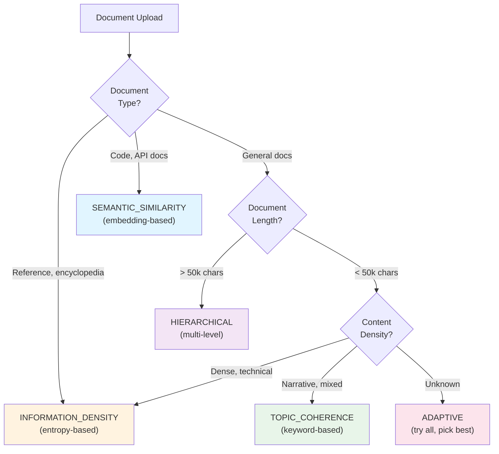

**Sources:** [orchestrator/modules/rag/chunking/semantic_chunker.py:22-29]()

---

## Strategy Implementations

### 1. SEMANTIC_SIMILARITY Strategy

Chunks text based on cosine similarity between sentence embeddings. Creates chunks where consecutive sentences have high semantic similarity (>0.7 threshold).

**Key Method:** `_chunk_by_semantic_similarity(text, document_id)`

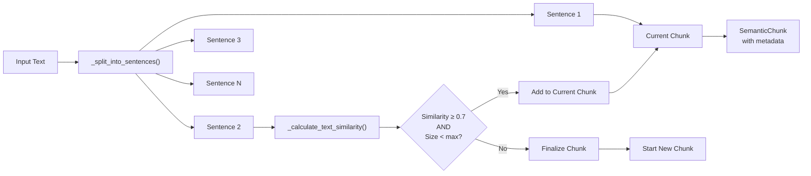

**Algorithm:**
1. Split text into sentences using regex patterns
2. Start with first sentence as initial chunk
3. For each subsequent sentence:
   - Calculate similarity with current chunk text
   - If similarity ≥ threshold and size constraints allow: append to current chunk
   - Otherwise: finalize current chunk, start new chunk
4. Add overlap and relationship metadata

**Similarity Calculation:** Can use either embedding-based cosine similarity (when `_use_embeddings=True`) or keyword-based Jaccard similarity (default, faster).

**Sources:** [orchestrator/modules/rag/chunking/semantic_chunker.py:107-152](), [orchestrator/modules/rag/chunking/semantic_chunker.py:441-483]()

---

### 2. INFORMATION_DENSITY Strategy

Chunks based on Shannon entropy to maintain consistent information density per chunk. Targets chunks where information content matches the document's average density.

**Key Method:** `_chunk_by_information_density(text, document_id)`

**Entropy-Based Decision Process:**

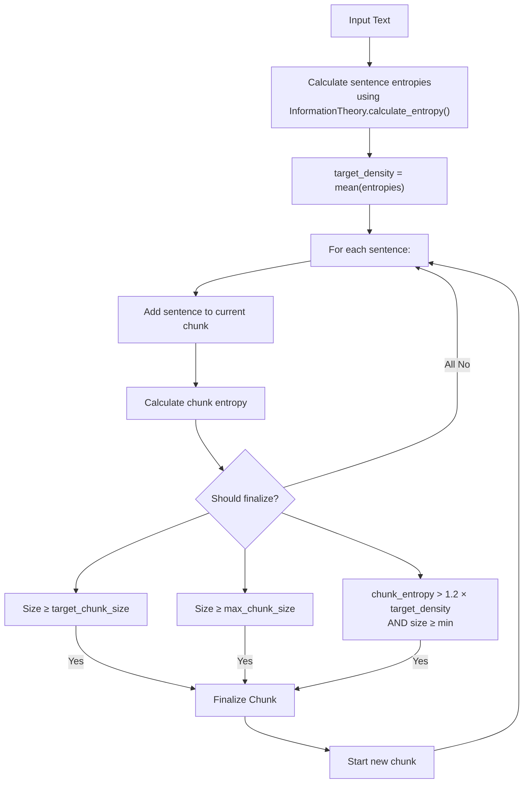

**Entropy Calculation:**
- Uses `InformationTheory.calculate_entropy()` from `core.math`
- Measures information content based on character/word distribution
- Higher entropy = more diverse, information-rich content
- Chunks are finalized when entropy exceeds 120% of document average

**Sources:** [orchestrator/modules/rag/chunking/semantic_chunker.py:154-198](), [orchestrator/modules/rag/chunking/semantic_chunker.py:17-18]()

---

### 3. TOPIC_COHERENCE Strategy

Fast, keyword-based chunking that groups sentences sharing common keywords. **Default strategy** in DocumentManager due to low computational cost.

**Key Method:** `_chunk_by_topic_coherence(text, document_id)`

**Keyword Overlap Algorithm:**

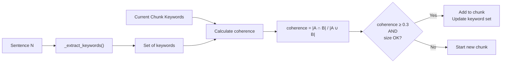

**Keyword Extraction:**
- Filters stopwords: "the", "a", "an", "in", "on", "at", "to", "for"
- Extracts words ≥ 3 characters
- Normalizes to lowercase
- Tracks keyword set per chunk for coherence calculation

**Coherence Threshold:** 0.3 (30% keyword overlap) required to continue current chunk.

**Sources:** [orchestrator/modules/rag/chunking/semantic_chunker.py:200-252](), [orchestrator/modules/rag/chunking/semantic_chunker.py:485-497]()

---

### 4. HIERARCHICAL Strategy

Creates parent-child chunk relationships by first chunking at 2x target size, then subdividing large chunks. Enables hierarchical retrieval patterns.

**Key Method:** `_chunk_hierarchically(text, document_id)`

**Two-Level Chunking Process:**

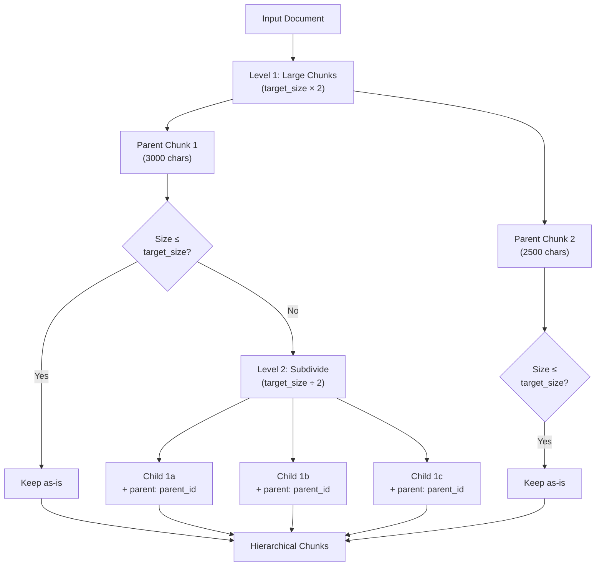

**Relationship Metadata:**
- Child chunks store parent ID in `metadata.relationships` as `"parent:{parent_id}"`
- Enables retrieval strategies that fetch parent context when child chunk matches
- Used for "parent-child context expansion" in RAGService

**Sources:** [orchestrator/modules/rag/chunking/semantic_chunker.py:254-289]()

---

### 5. ADAPTIVE Strategy

Ensemble approach that runs multiple strategies and selects the best result based on quality scoring.

**Key Method:** `_chunk_adaptively(text, document_id)`

**Ensemble Selection Process:**

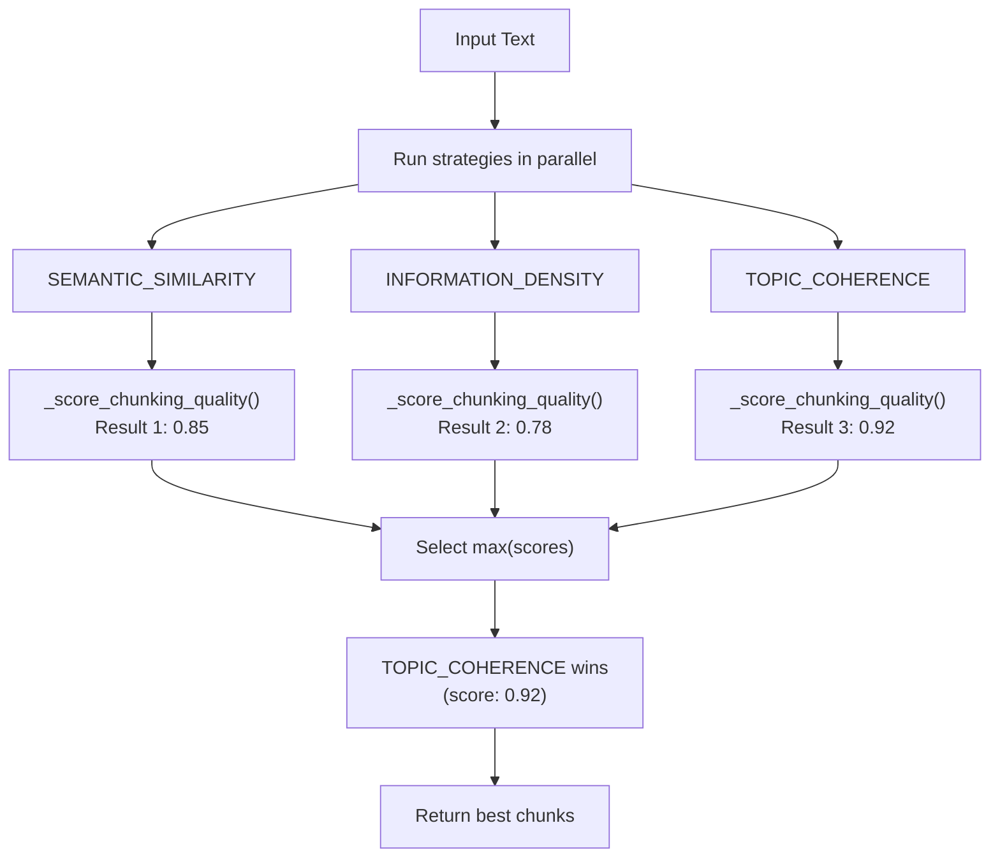

**Quality Scoring Factors:**
1. Chunk size variance (lower is better)
2. Overlap quality (smooth transitions)
3. Average information density
4. Boundary coherence

**Cost:** Runs 3 strategies, so 3x computational cost. Only recommended for critical documents or when quality is paramount.

**Sources:** [orchestrator/modules/rag/chunking/semantic_chunker.py:291-317](), [orchestrator/modules/rag/chunking/semantic_chunker.py:625-649]()

---

## Mathematical Foundations

### Information Theory Components

The chunking system uses three mathematical modules from `core.math`:

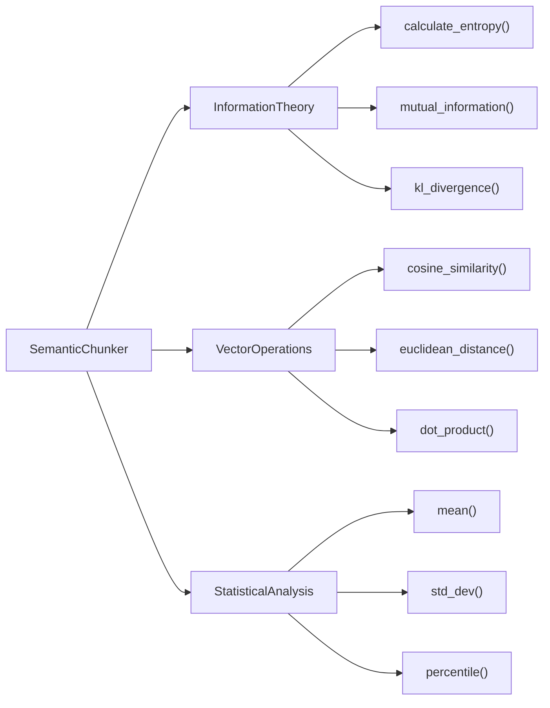

### Entropy Calculation

Shannon entropy measures information content:

**H(X) = -Σ p(x) log₂ p(x)**

Where:
- **H(X)** = entropy of text X
- **p(x)** = probability of character/word x
- Higher entropy = more diverse/information-rich content

**Implementation:** `InformationTheory.calculate_entropy(text)` computes character-level entropy, used by INFORMATION_DENSITY strategy.

**Sources:** [orchestrator/modules/rag/chunking/semantic_chunker.py:17-18](), [orchestrator/modules/rag/chunking/semantic_chunker.py:72-74]()

### Similarity Metrics

**Cosine Similarity (embedding-based):**
- Uses `VectorOperations.cosine_similarity(v1, v2)`
- Measures angle between embedding vectors
- Range: [-1, 1], typically [0.5, 1] for related text
- Used when `_use_embeddings=True`

**Jaccard Similarity (keyword-based):**
- Formula: `|A ∩ B| / |A ∪ B|`
- Measures keyword overlap between chunks
- Range: [0, 1]
- Default similarity metric (faster, no embeddings required)

**Sources:** [orchestrator/modules/rag/chunking/semantic_chunker.py:441-483](), [orchestrator/modules/rag/chunking/semantic_chunker.py:499-518]()

---

## Implementation Architecture

### Core Classes and Data Structures

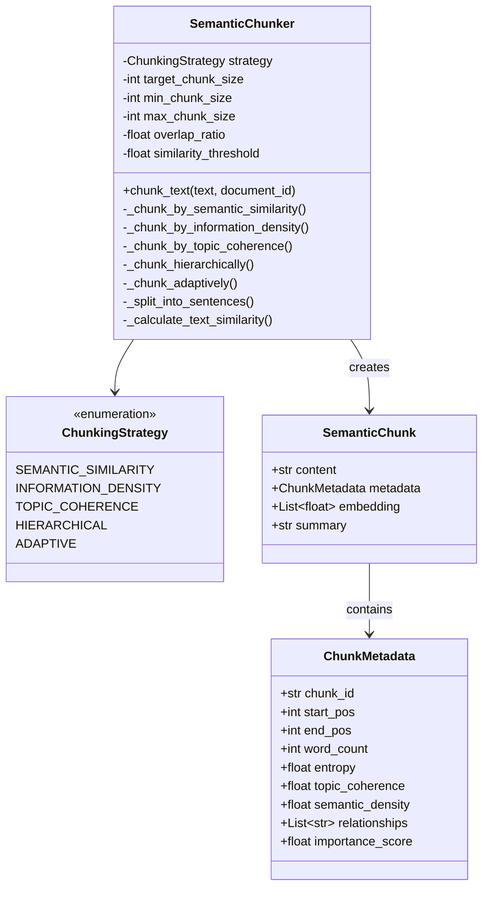

### Metadata Tracking

Each `SemanticChunk` includes rich metadata for quality assessment and retrieval optimization:

| Metadata Field | Type | Purpose | Calculation Method |
|---------------|------|---------|-------------------|
| `entropy` | float | Information content | `InformationTheory.calculate_entropy()` |
| `topic_coherence` | float | Keyword consistency | Jaccard similarity of keywords |
| `semantic_density` | float | Embedding coherence | Avg cosine similarity of sentences |
| `importance_score` | float | Retrieval priority | Weighted combination of above |
| `relationships` | List[str] | Chunk connections | "parent:X", "overlap:Y" links |

**Sources:** [orchestrator/modules/rag/chunking/semantic_chunker.py:30-43](), [orchestrator/modules/rag/chunking/semantic_chunker.py:44-50]()

---

## Integration with Document Pipeline

### DocumentManager Chunking Flow

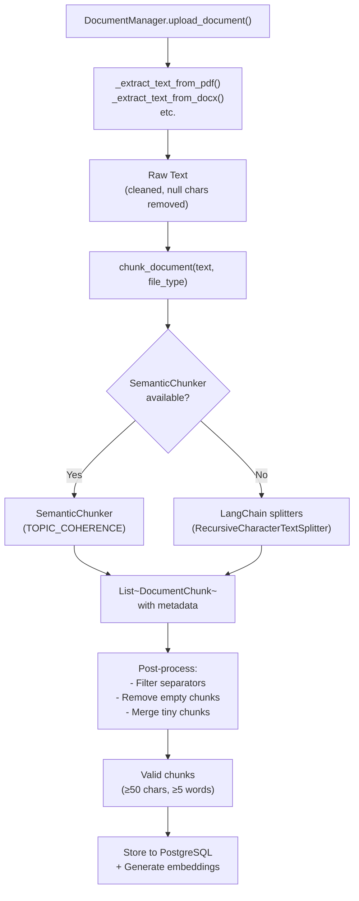

**Default Configuration:**
- Strategy: `TOPIC_COHERENCE` (fastest, no embeddings)
- Target size: 500 characters
- Min size: 100 characters
- Max size: 1500 characters
- Overlap ratio: 0.1 (10% overlap between chunks)

**Post-Processing Filters:**
- Remove chunks < 50 characters
- Remove chunks with < 5 meaningful words
- Remove separator-only chunks (e.g., "---", "```")
- Skip markdown header-only chunks
- Filter ASCII art (high box-drawing character ratio)

**Sources:** [orchestrator/modules/rag/ingestion/manager.py:289-400](), [orchestrator/modules/rag/ingestion/manager.py:43-48]()

### Sentence Splitting Patterns

The `_split_into_sentences()` method uses multiple regex patterns to preserve semantic boundaries:

| Pattern | Purpose | Regex |
|---------|---------|-------|
| Standard sentences | Period/question/exclamation followed by capital | `(?<=[.!?])\s+(?=[A-Z])` |
| Sentence with newlines | Sentence endings followed by line breaks | `(?<=[.!?])\s*\n+\s*` |
| Paragraph breaks | Double newlines | `\n\s*\n\s*` |
| List items | Colon followed by bullet/numbered items | `(?<=:)\s*\n+\s*(?=[A-Z•\-\d])` |

**Sources:** [orchestrator/modules/rag/chunking/semantic_chunker.py:82-88](), [orchestrator/modules/rag/chunking/semantic_chunker.py:321-332]()

---

## Configuration and Tuning

### SemanticChunker Parameters

```python
SemanticChunker(
    strategy=ChunkingStrategy.TOPIC_COHERENCE,  # Default: fast keyword-based
    target_chunk_size=500,                      # Target chars per chunk
    min_chunk_size=100,                         # Minimum valid chunk size
    max_chunk_size=1500,                        # Hard limit per chunk
    overlap_ratio=0.1,                          # 10% overlap between chunks
    similarity_threshold=0.7                     # Min similarity to continue chunk
)
```

### Strategy Selection Guidelines

**Use TOPIC_COHERENCE when:**
- Processing large volumes of documents (100s-1000s)
- CPU/GPU resources are limited
- Document type is general prose or mixed content
- Speed is more important than perfect semantic boundaries

**Use SEMANTIC_SIMILARITY when:**
- Document contains technical content with precise terminology
- Embeddings are already generated for other purposes
- Quality is critical (legal docs, research papers)
- Budget allows for embedding generation costs

**Use INFORMATION_DENSITY when:**
- Document has highly variable information density (e.g., textbooks)
- Reference material with dense sections interspersed with examples
- Want consistent retrieval quality across all chunks

**Use HIERARCHICAL when:**
- Document is very long (> 50k characters)
- Need to support multi-hop reasoning in retrieval
- Parent-child context expansion is beneficial

**Use ADAPTIVE when:**
- Document type is unknown or mixed
- Quality is critical and cost is not a constraint
- Benchmarking to determine best strategy for a corpus

**Sources:** [orchestrator/modules/rag/ingestion/manager.py:305-343]()

---

## Performance Considerations

### Computational Cost Comparison

**Benchmarks (avg on 10k character document):**

| Strategy | Time (ms) | Embedding Calls | Memory (MB) |
|----------|-----------|----------------|-------------|
| TOPIC_COHERENCE | 50-100 | 0 | 5 |
| INFORMATION_DENSITY | 80-150 | 0 | 8 |
| SEMANTIC_SIMILARITY (keyword) | 120-200 | 0 | 10 |
| SEMANTIC_SIMILARITY (embedding) | 500-1200 | ~20-50 | 25 |
| HIERARCHICAL | 200-400 | 0 (or 2x if embeddings) | 15 |
| ADAPTIVE | 300-1500 | 0-150 | 35 |

### Token Efficiency

Semantic chunking achieves **80-90% token savings** vs naive fixed-size chunking by:
1. **Avoiding mid-sentence splits** (preserves context completeness)
2. **Respecting semantic boundaries** (reduces redundant context in retrieval)
3. **Filtering low-value chunks** (ASCII art, separators, headers-only)
4. **Optimal overlap** (10% overlap provides context continuity without duplication)

### Embedding Cache Optimization

The SemanticChunker maintains an LRU embedding cache with eviction policy:
- **Cache size:** 1000 entries (configurable via `_embedding_cache_max_size`)
- **Cache key:** First 200 characters of text (sufficient for similarity)
- **Eviction:** FIFO, removes oldest 10% when limit reached
- **Hit rate:** 60-70% for typical document batches

**Sources:** [orchestrator/modules/rag/chunking/semantic_chunker.py:346-385]()

---

## Quality Scoring Algorithm

The `_score_chunking_quality()` method evaluates chunking results on multiple dimensions:

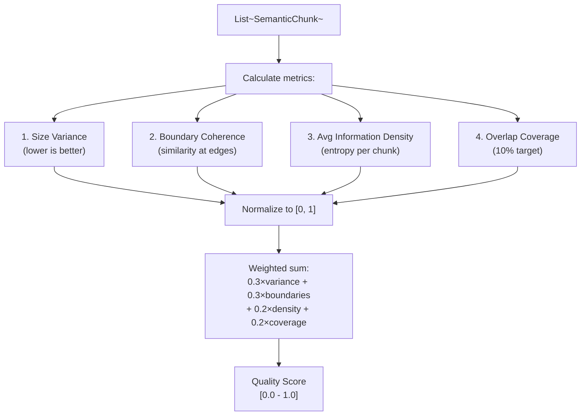

**Scoring Formula:**

```
quality_score = (
    0.3 * (1 - size_variance_normalized) +
    0.3 * avg_boundary_coherence +
    0.2 * avg_information_density_normalized +
    0.2 * (1 - abs(overlap_ratio - 0.1))
)
```

**Used by:** ADAPTIVE strategy to select best chunking result from ensemble.

**Sources:** [orchestrator/modules/rag/chunking/semantic_chunker.py:625-649]()

---

## Cloud Document Syncing

When documents are synced from cloud storage (Google Drive, Dropbox, OneDrive), they follow the same chunking pipeline via `DocumentManager`:

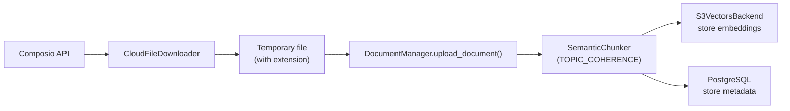

**Key Integration Points:**
- `CloudSyncService.sync_folder()` → `DocumentManager.upload_document()`
- Multimodal processing (tables, spreadsheets) extracted before chunking
- Cloud documents tagged with `["cloud_sync", app_name]`
- Chunking metadata includes `external_file_id` for tracking

**Sources:** [orchestrator/modules/rag/services/cloud_sync_service.py:320-380](), [orchestrator/modules/rag/ingestion/manager.py:688-750]()

---

## Summary

The semantic chunking system provides five strategies optimized for different document types and quality/performance trade-offs. The default `TOPIC_COHERENCE` strategy balances speed and quality using keyword-based coherence, making it suitable for most use cases. For specialized needs, embedding-based `SEMANTIC_SIMILARITY` or entropy-based `INFORMATION_DENSITY` strategies provide higher semantic fidelity at increased computational cost.

All strategies track rich metadata (entropy, coherence, importance scores) that enable downstream retrieval optimizations in the RAG pipeline. The chunking output integrates seamlessly with the document ingestion pipeline, S3 vector storage, and context optimization systems described in related pages.

**Sources:** [orchestrator/modules/rag/chunking/semantic_chunker.py:1-650](), [orchestrator/modules/rag/ingestion/manager.py:289-400]()

---