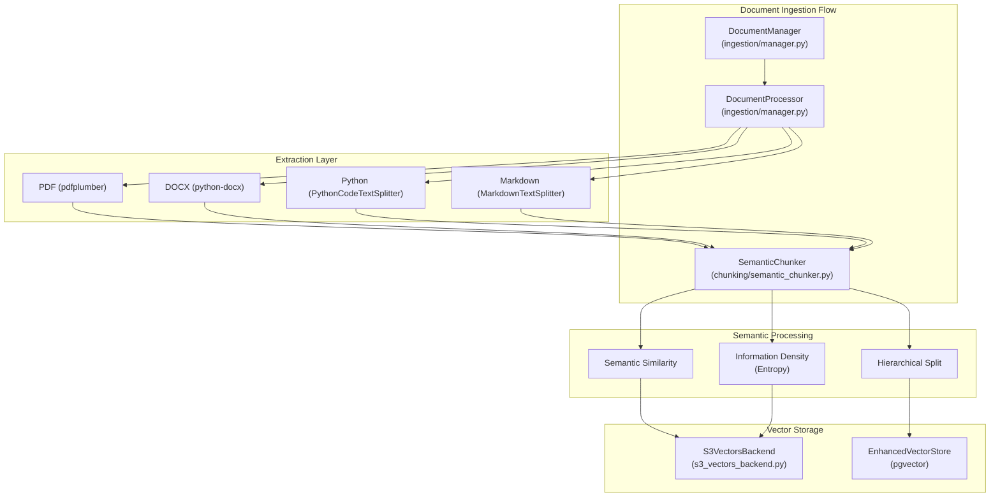
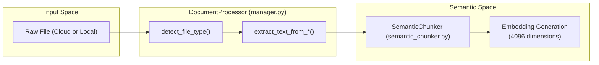
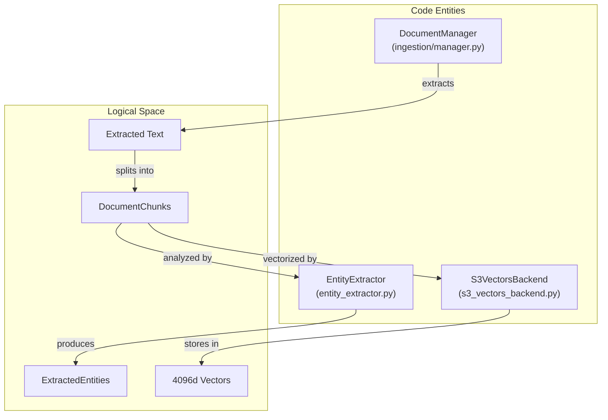

# Semantic Chunking Strategies

Relevant source files

The following files were used as context for generating this wiki page:

- [orchestrator/api/knowledge_multimodal.py](orchestrator/api/knowledge_multimodal.py)
- [orchestrator/core/database/migrations/010_vector_dimensions_4096.sql](orchestrator/core/database/migrations/010_vector_dimensions_4096.sql)
- [orchestrator/core/models/cloud_sync.py](orchestrator/core/models/cloud_sync.py)
- [orchestrator/modules/rag/chunking/semantic_chunker.py](orchestrator/modules/rag/chunking/semantic_chunker.py)
- [orchestrator/modules/rag/ingestion/manager.py](orchestrator/modules/rag/ingestion/manager.py)
- [orchestrator/modules/rag/services/cloud_file_downloader.py](orchestrator/modules/rag/services/cloud_file_downloader.py)
- [orchestrator/modules/rag/services/cloud_sync_service.py](orchestrator/modules/rag/services/cloud_sync_service.py)
- [orchestrator/modules/search/services/entity_extractor.py](orchestrator/modules/search/services/entity_extractor.py)
- [orchestrator/modules/search/vector_store/__init__.py](orchestrator/modules/search/vector_store/__init__.py)
- [orchestrator/modules/search/vector_store/backends/s3_vectors_backend.py](orchestrator/modules/search/vector_store/backends/s3_vectors_backend.py)
- [orchestrator/scripts/recreate_s3_index.py](orchestrator/scripts/recreate_s3_index.py)

## Purpose and Scope

This page documents the semantic chunking strategies used in Automatos AI's document ingestion pipeline. Chunking is the process of splitting large documents into smaller, semantically meaningful units for vector embedding and retrieval. This page covers the `SemanticChunker` implementation, mathematical foundations for entropy-based splitting, multi-modal strategies for different file types (PDF, DOCX, MD, PY), and the parent-child expansion mechanism for context retrieval.

For information about the overall RAG retrieval system and similarity search, see [RAG Retrieval System](#7.4). For the end-to-end document ingestion flow, see [Document Ingestion Pipeline](#7.2).

---

## Chunking Architecture Overview

The ingestion pipeline transforms raw files into vectorized chunks using a layered architecture that transitions from physical file formats to semantic vector space.

### Document Ingestion Flow

**Sources:**
- [orchestrator/modules/rag/ingestion/manager.py:113-130]()
- [orchestrator/modules/rag/chunking/semantic_chunker.py:52-89]()
- [orchestrator/modules/search/vector_store/backends/s3_vectors_backend.py:24-37]()

---

## Semantic Chunking Strategies

The `SemanticChunker` class supports multiple advanced strategies defined in the `ChunkingStrategy` enum [orchestrator/modules/rag/chunking/semantic_chunker.py:22-28]().

### 1. Semantic Similarity
This strategy splits text based on the cosine similarity between consecutive sentences. If the similarity falls below a defined `similarity_threshold` (default 0.7), a new chunk is started [orchestrator/modules/rag/chunking/semantic_chunker.py:62-69](). The implementation uses `VectorOperations` to calculate similarity scores [orchestrator/modules/rag/chunking/semantic_chunker.py:122-128]().

### 2. Information Density (Entropy-based)
Utilizes `InformationTheory` to calculate the Shannon entropy of sentences. Boundaries are placed where information density shifts significantly, ensuring that high-entropy (fact-dense) sections are not diluted by low-entropy transitions [orchestrator/modules/rag/chunking/semantic_chunker.py:154-181]().

### 3. Hierarchical Strategy
Creates a parent-child relationship between chunks. Large "parent" chunks provide broad context, while smaller "child" chunks allow for high-precision vector matches. This is reflected in the `DocumentChunk` dataclass which includes a `parent_content` field [orchestrator/modules/rag/ingestion/manager.py:94-111]().

### 4. Code-Aware Chunking
For Python files, the system uses the `PythonCodeTextSplitter` [orchestrator/modules/rag/ingestion/manager.py:35-36](). This splitter respects class and function boundaries, preventing logic from being severed mid-definition [orchestrator/modules/rag/ingestion/manager.py:126-129]().

**Sources:**
- [orchestrator/modules/rag/chunking/semantic_chunker.py:93-106]()
- [orchestrator/modules/rag/ingestion/manager.py:94-111]()
- [orchestrator/modules/rag/chunking/semantic_chunker.py:71-75]()

---

## Multi-Modal Extraction Logic

The `DocumentProcessor` handles format-specific extraction before passing text to the chunker.

| Format | Library | Strategy |
| :--- | :--- | :--- |
| **PDF** | `pdfplumber` | Extracts text while stripping null characters and fixing double-character artifacts [orchestrator/modules/rag/ingestion/manager.py:157-174](). |
| **DOCX** | `python-docx` | Iterates through `doc.paragraphs` to maintain structural flow [orchestrator/modules/rag/ingestion/manager.py:196-203](). |
| **Markdown** | `MarkdownTextSplitter` | Splits based on header hierarchy (h1, h2, h3) [orchestrator/modules/rag/ingestion/manager.py:33-34](). |
| **Cloud Files** | `CloudFileDownloader` | Downloads from S3/Composio before processing [orchestrator/modules/rag/services/cloud_file_downloader.py:60-78](). |

### Extraction Data Flow

**Sources:**
- [orchestrator/modules/rag/ingestion/manager.py:131-155]()
- [orchestrator/core/database/migrations/010_vector_dimensions_4096.sql:11-13]()
- [orchestrator/modules/rag/services/cloud_file_downloader.py:72-84]()

---

## Parent-Child Expansion & Metadata

The system uses a `DocumentChunk` dataclass to track context expansion data.

### Metadata Schema
Chunks include the following fields to facilitate retrieval expansion:
- `chunk_index`: The sequence number within the document [orchestrator/modules/rag/ingestion/manager.py:96]().
- `parent_content`: Stores the text of the larger section for context injection [orchestrator/modules/rag/ingestion/manager.py:100]().
- `headers`: A dictionary mapping the header hierarchy (h1, h2, h3) to the chunk [orchestrator/modules/rag/ingestion/manager.py:101]().

### S3 Vectors Integration
For multi-tenant isolation, chunks are stored in workspace-scoped S3 buckets (`automatos-vectors-{workspace_id}`) [orchestrator/modules/search/vector_store/backends/s3_vectors_backend.py:8-10](). Metadata such as `external_file_id` and `chunk_index` is stored alongside the vector in S3 to allow the `S3VectorsBackend` to reconstruct document order during search [orchestrator/modules/search/vector_store/backends/s3_vectors_backend.py:161-166]().

**Sources:**
- [orchestrator/modules/rag/ingestion/manager.py:94-111]()
- [orchestrator/modules/search/vector_store/backends/s3_vectors_backend.py:155-166]()
- [orchestrator/modules/search/vector_store/backends/s3_vectors_backend.py:42-46]()

---

## Configuration and Scaling

### Vector Dimensions
As of Migration 010, the system has transitioned to **4096 dimensions** to support high-capacity models like `qwen/qwen3-embedding-8b` [orchestrator/core/database/migrations/010_vector_dimensions_4096.sql:1-14](). This is enforced in the `S3VectorsBackend` via `config.S3_VECTORS_DIMENSION` [orchestrator/modules/search/vector_store/backends/s3_vectors_backend.py:49-51]().

### S3 Index Management
The `recreate_s3_index.py` script provides a utility to reset the S3 vector store when dimensions or embedding models change. It performs a `delete_index` followed by a `create_index` with the new `S3_VECTORS_DIMENSION` from the system configuration [orchestrator/scripts/recreate_s3_index.py:65-98]().

**Sources:**
- [orchestrator/core/database/migrations/010_vector_dimensions_4096.sql:71-82]()
- [orchestrator/scripts/recreate_s3_index.py:30-46]()
- [orchestrator/modules/search/vector_store/backends/s3_vectors_backend.py:88-97]()

---

## Entity Extraction and Knowledge Graph

Beyond basic chunking, the `EntityExtractor` performs Named Entity Recognition (NER) on chunks to build a knowledge graph.

1. **Regex Extraction**: Fast identification of technologies and acronyms using patterns like `tech_pattern` and `acronym_pattern` [orchestrator/modules/search/services/entity_extractor.py:90-121]().
2. **LLM Extraction**: Uses models like `gpt-4o-mini` to extract people, organizations, and complex concepts with descriptions via the `_extract_with_llm` method [orchestrator/modules/search/services/entity_extractor.py:123-155]().
3. **Relationship Mapping**: Identifies links like `is_part_of` or `depends_on` between extracted entities [orchestrator/modules/search/services/entity_extractor.py:31-38]().

This entity-level data is stored in the `kb_entities` and `entity_relationships` tables, providing a non-linear retrieval path that complements standard vector search [orchestrator/core/database/migrations/010_vector_dimensions_4096.sql:27-31]().

### Knowledge Extraction Pipeline

**Sources:**
- [orchestrator/modules/search/services/entity_extractor.py:18-40]()
- [orchestrator/core/database/migrations/010_vector_dimensions_4096.sql:22-47]()
- [orchestrator/modules/search/services/entity_extractor.py:95-109]()

---