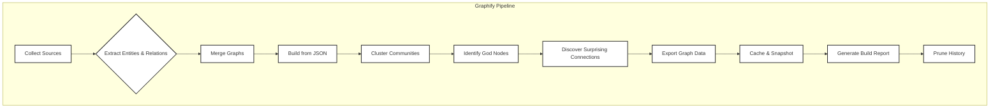
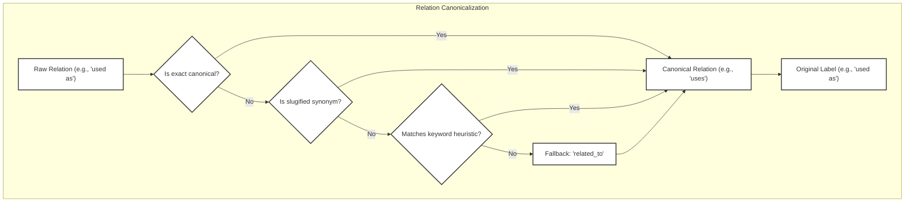
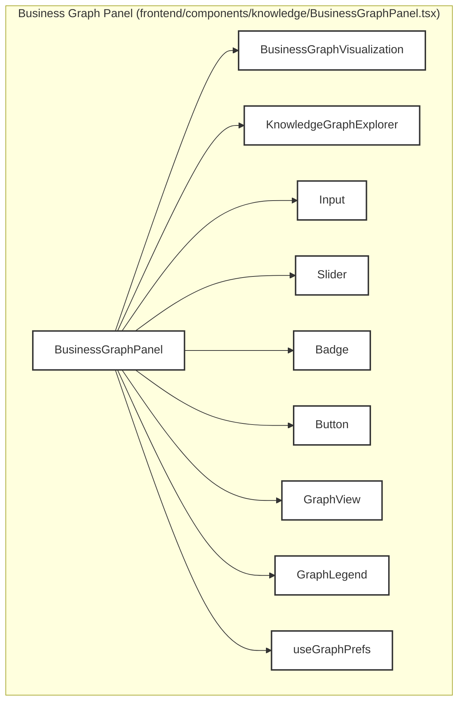
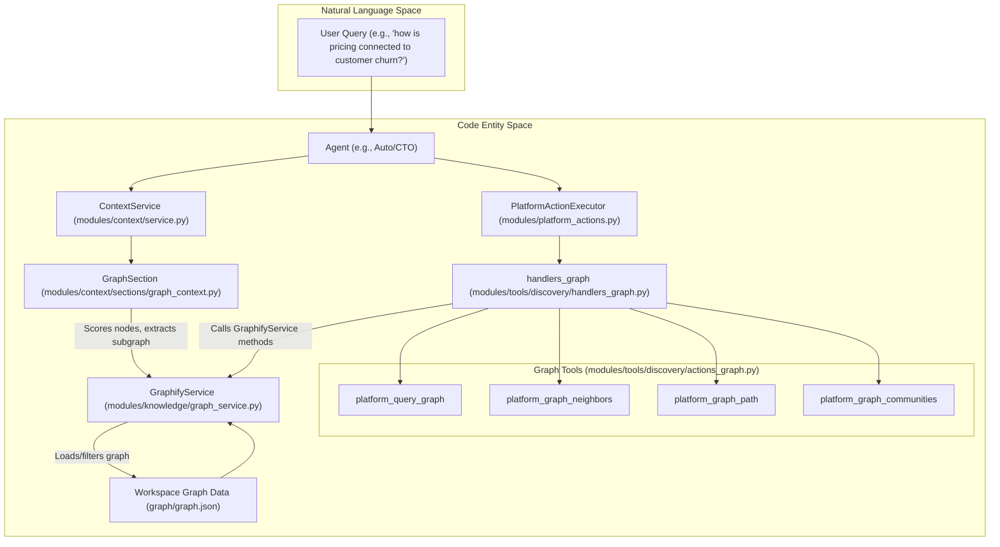

# Knowledge Graphs & Structured Data

<details>
<summary>Relevant source files</summary>

The following files were used as context for generating this wiki page:

- [frontend/components/knowledge/BusinessGraphPanel.tsx](frontend/components/knowledge/BusinessGraphPanel.tsx)
- [frontend/components/knowledge/BusinessGraphVisualization.tsx](frontend/components/knowledge/BusinessGraphVisualization.tsx)
- [frontend/components/knowledge/KnowledgeGraphExplorer.tsx](frontend/components/knowledge/KnowledgeGraphExplorer.tsx)
- [orchestrator/api/knowledge_graph.py](orchestrator/api/knowledge_graph.py)
- [orchestrator/api/shopify.py](orchestrator/api/shopify.py)
- [orchestrator/modules/context/sections/graph_context.py](orchestrator/modules/context/sections/graph_context.py)
- [orchestrator/modules/knowledge/community_reports.py](orchestrator/modules/knowledge/community_reports.py)
- [orchestrator/modules/knowledge/graph_extraction.py](orchestrator/modules/knowledge/graph_extraction.py)
- [orchestrator/modules/knowledge/graph_service.py](orchestrator/modules/knowledge/graph_service.py)
- [orchestrator/modules/tools/discovery/actions_graph.py](orchestrator/modules/tools/discovery/actions_graph.py)
- [orchestrator/modules/tools/discovery/handlers_graph.py](orchestrator/modules/tools/discovery/handlers_graph.py)
- [orchestrator/tests/test_graph_relation_vocab.py](orchestrator/tests/test_graph_relation_vocab.py)
- [orchestrator/tests/test_prd165_s2_graph.py](orchestrator/tests/test_prd165_s2_graph.py)
- [orchestrator/tests/test_prd165_s3_community.py](orchestrator/tests/test_prd165_s3_community.py)
- [orchestrator/tests/test_prd183_s1_catalog_webhook.py](orchestrator/tests/test_prd183_s1_catalog_webhook.py)
- [orchestrator/tests/test_prd189_s3_webhook_debounce.py](orchestrator/tests/test_prd189_s3_webhook_debounce.py)

</details>


This section provides a high-level overview of how Automatos AI leverages knowledge graphs and structured data to enhance agent intelligence. It covers the Business Knowledge Graph (Graphify), the Code Graph, and Natural Language to SQL (NL2SQL capabilities). These components enable agents to understand complex relationships, navigate codebases, and query structured databases using natural language.

For detailed information on each topic, please refer to the linked child pages.

## Business Knowledge Graph (Graphify)

The Business Knowledge Graph, powered by the Graphify service, is a central component for understanding the relationships and entities within a business domain. It processes various data sources, including documents, agent reports, and platform metadata, to extract structured knowledge. This knowledge is then represented as a graph, allowing for advanced querying and analysis.

The Graphify service handles the entire lifecycle of the business knowledge graph, from data ingestion and LLM-based extraction to community detection, analysis (e.g., identifying "god nodes" and "surprising connections"), and persistent storage. It exports the graph data in various formats, including NetworkX `node_link_data` JSON, HTML visualizations, and community reports. The system also supports incremental updates and historical snapshots.

For details, see [Business Knowledge Graph (Graphify)](#25.1).

### Graphify Pipeline Overview

The Graphify pipeline is designed to systematically build, enrich, and maintain the business knowledge graph. It starts by collecting diverse sources, extracting entities and relations, merging them into a unified graph, and then applying various analytical techniques.


Sources: [orchestrator/modules/knowledge/graph_service.py:9-23]()

### Canonical Relations

To ensure consistency and usability, the LLM-based graph extraction process maps free-text relations to a bounded set of canonical relations. This prevents the graph from accumulating a large number of unique, semantically similar relation types, making querying and visualization more effective. The original phrasing of the relation is preserved as a `relation_label` for display purposes.

The `canonicalize_relation` function in `modules/knowledge/graph_extraction.py` performs this mapping using a combination of exact matches, slugified synonyms, and substring heuristics.


Sources: [orchestrator/modules/knowledge/graph_extraction.py:46-141](), [orchestrator/tests/test_graph_relation_vocab.py:1-118]()

## Graph Visualization & Exploration UI

The frontend provides a rich user interface for visualizing and exploring the business knowledge graph. The `BusinessGraphPanel` component serves as the main entry point, offering controls for filtering, searching, and interacting with the graph. The `BusinessGraphVisualization` component renders the force-directed graph using WebGL/Canvas, supporting features like color modes (by node type or community), click-to-focus, hover tooltips, and "god node" halos.

For large graphs, the `KnowledgeGraphExplorer` implements a "cluster-first drill-in" approach. Instead of loading the entire graph into the browser, it allows users to browse communities, load subgraphs for specific communities, expand node neighborhoods, or find paths between nodes, all through server-side queries.

For details, see [Graph Visualization & Exploration UI](#25.2).

### Business Graph Panel Components


Sources: [frontend/components/knowledge/BusinessGraphPanel.tsx:1-206]()

### Cluster-First Exploration Flow

The `KnowledgeGraphExplorer` facilitates efficient exploration of large knowledge graphs by allowing users to interact with communities and subgraphs on demand.

```mermaid
graph TD
    subgraph "Knowledge Graph Explorer (frontend/components/knowledge/KnowledgeGraphExplorer.tsx)"
        Start[User opens Explorer] --> ListComms[List Communities (apiClient.graphCommunitiesOverview)];
        ListComms --> SelectComm[User selects a Community];
        SelectComm --> LoadSubgraph[Load Community Subgraph (apiClient.graphCommunitySubgraph)];
        LoadSubgraph --> DisplaySubgraph[Display Subgraph in BusinessGraphVisualization];
        DisplaySubgraph --> ExpandNode[User expands a Node (apiClient.graphExpandNode)];
        ExpandNode --> MergeSubgraph[Merge Node Neighborhood into current view];
        DisplaySubgraph --> FindPath[User initiates Path Search];
        FindPath --> SelectTarget[User selects Target Node];
        SelectTarget --> GetPath[Find Path (apiClient.graphPath)];
        GetPath --> DisplayPath[Display Path Subgraph];
        Start --> SearchNodes[User searches for Nodes (apiClient.graphSearchNodes)];
        SearchNodes --> FocusMatch[User focuses on a Search Match];
        FocusMatch --> LoadNodeSubgraph[Load Node Subgraph (apiClient.graphExpandNode)];
    end
    style Start fill:#fff,stroke:#333,stroke-width:2px
    style ListComms fill:#fff,stroke:#333,stroke-width:2px
    style SelectComm fill:#fff,stroke:#333,stroke-width:2px
    style LoadSubgraph fill:#fff,stroke:#333,stroke-width:2px
    style DisplaySubgraph fill:#fff,stroke:#333,stroke-width:2px
    style ExpandNode fill:#fff,stroke:#333,stroke-width:2px
    style MergeSubgraph fill:#fff,stroke:#333,stroke-width:2px
    style FindPath fill:#fff,stroke:#333,stroke-width:2px
    style SelectTarget fill:#fff,stroke:#333,stroke-width:2px
    style GetPath fill:#fff,stroke:#333,stroke:#333,stroke-width:2px
    style DisplayPath fill:#fff,stroke:#333,stroke-width:2px
    style SearchNodes fill:#fff,stroke:#333,stroke-width:2px
    style FocusMatch fill:#fff,stroke:#333,stroke-width:2px
    style LoadNodeSubgraph fill:#fff,stroke:#333,stroke-width:2px
```
Sources: [frontend/components/knowledge/KnowledgeGraphExplorer.tsx:27-158]()

## Graph Agent Tools

Agents interact with the business knowledge graph through a set of specialized platform tools. These tools, defined in `modules/tools/discovery/actions_graph.py` and implemented in `modules/tools/discovery/handlers_graph.py`, allow agents to query the graph, find neighbors of a concept, analyze impact, and discover paths between entities.

The `GraphContext` section (`modules/context/sections/graph_context.py`) is crucial for injecting relevant graph excerpts into agent prompts. It scores graph nodes based on the current message and includes a BFS neighborhood excerpt when relevant, ensuring agents have access to contextual business knowledge.

For details, see [Graph Agent Tools](#25.3).

### Graph Tools and Context Flow


Sources: [orchestrator/modules/tools/discovery/actions_graph.py:1-237](), [orchestrator/modules/tools/discovery/handlers_graph.py:1-546](), [orchestrator/modules/context/sections/graph_context.py:1-136]()

## Code Graph

The Code Graph provides a structured representation of the codebase, enabling agents to understand code relationships, dependencies, and impact. The `codegraph_service` is responsible for indexing the codebase, extracting entities (functions, classes, files), and building a graph that connects these entities. This graph can then be queried by agents to answer questions about code structure, identify relevant code sections, or analyze the impact of changes.

The Code Graph integrates with GitHub for authentication and reindexing, ensuring the graph remains up-to-date with the latest code changes. A dedicated UI, `CodeGraphPanel` and `CodeGraphVisualization`, allows developers to explore the code graph visually.

For details, see [Code Graph](#25.4).

## NL2SQL & Database Knowledge

The NL2SQL (Natural Language to SQL) module empowers agents to interact with structured databases using natural language queries. This service translates user questions into executable SQL queries, retrieves data, and presents the results in a human-readable format.

Key components include a query validator to ensure safety and correctness, an example store for training and fine-tuning the translation model, and a benchmarks runner for evaluating performance. The `database_knowledge` API provides the interface for agents to access this functionality. The `DatabaseQueryExplorer` and `Analytics UI` offer user interfaces for exploring database content and analyzing query results, with built-in tenancy safety measures.

For details, see [NL2SQL & Database Knowledge](#25.5).

---