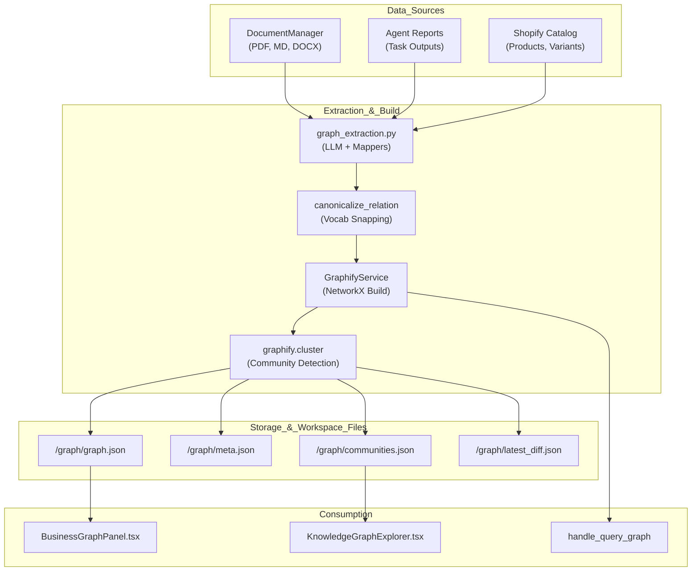

# Business Knowledge Graph (Graphify)

Relevant source files

The following files were used as context for generating this wiki page:

- [frontend/components/knowledge/BusinessGraphPanel.tsx](frontend/components/knowledge/BusinessGraphPanel.tsx)
- [frontend/components/knowledge/BusinessGraphVisualization.tsx](frontend/components/knowledge/BusinessGraphVisualization.tsx)
- [frontend/components/knowledge/KnowledgeGraphExplorer.tsx](frontend/components/knowledge/KnowledgeGraphExplorer.tsx)
- [orchestrator/api/knowledge_graph.py](orchestrator/api/knowledge_graph.py)
- [orchestrator/api/shopify.py](orchestrator/api/shopify.py)
- [orchestrator/modules/context/sections/graph_context.py](orchestrator/modules/context/sections/graph_context.py)
- [orchestrator/modules/knowledge/community_reports.py](orchestrator/modules/knowledge/community_reports.py)
- [orchestrator/modules/knowledge/graph_extraction.py](orchestrator/modules/knowledge/graph_extraction.py)
- [orchestrator/modules/knowledge/graph_service.py](orchestrator/modules/knowledge/graph_service.py)
- [orchestrator/modules/tools/discovery/actions_graph.py](orchestrator/modules/tools/discovery/actions_graph.py)
- [orchestrator/modules/tools/discovery/handlers_graph.py](orchestrator/modules/tools/discovery/handlers_graph.py)
- [orchestrator/tests/test_graph_relation_vocab.py](orchestrator/tests/test_graph_relation_vocab.py)
- [orchestrator/tests/test_prd165_s2_graph.py](orchestrator/tests/test_prd165_s2_graph.py)
- [orchestrator/tests/test_prd165_s3_community.py](orchestrator/tests/test_prd165_s3_community.py)
- [orchestrator/tests/test_prd183_s1_catalog_webhook.py](orchestrator/tests/test_prd183_s1_catalog_webhook.py)
- [orchestrator/tests/test_prd189_s3_webhook_debounce.py](orchestrator/tests/test_prd189_s3_webhook_debounce.py)

## Purpose and Scope

The Knowledge Graph & Entity Extraction system provides structured intelligence across three primary domains: unstructured documentation, agent-generated reports, and structured codebases. It extracts entities (concepts, processes, metrics, symbols) and identifies semantic, structural, or causal relationships to enable advanced retrieval, impact analysis, and context-aware reasoning.

Key capabilities include:
- **Business Graph Extraction**: LLM-powered extraction of concepts, entities, and processes from business documents and agent reports. [orchestrator/modules/knowledge/graph_extraction.py:5-10]()
- **Graphify Pipeline**: A multi-stage lifecycle (collect → extract → merge → build → cluster → export) that builds NetworkX graphs for each workspace. [orchestrator/modules/knowledge/graph_service.py:9-22]()
- **Team-Scoped Filtering**: PRD-124 compliant visibility rules ensuring agents only see graph nodes they have permission to access. [orchestrator/modules/knowledge/graph_service.py:148-181]()
- **Relation Canonicalization**: A deterministic mapper that snaps free-text LLM relations to a controlled vocabulary (e.g., `uses`, `depends_on`, `triggers`) to prevent legend flooding. [orchestrator/modules/knowledge/graph_extraction.py:46-65]()
- **Cluster-First Exploration**: Server-side subgraph queries for large graphs, allowing users to drill into communities, expand neighborhoods, or find paths without downloading the full graph. [frontend/components/knowledge/KnowledgeGraphExplorer.tsx:19-26]()

---

## System Architecture

The architecture bridges "Natural Language Space" (documentation/chat) with "Code Entity Space" (source code/structured metadata) through a unified Graphify service layer and a set of platform tool handlers.

### Knowledge Graph Lifecycle

**Sources**: [orchestrator/modules/knowledge/graph_service.py:9-22](), [orchestrator/modules/knowledge/graph_extraction.py:132-148](), [frontend/components/knowledge/BusinessGraphPanel.tsx:190-217](), [orchestrator/api/shopify.py:7-12]()

---

## Business Graph Extraction

The system uses `graph_extraction.py` to convert unstructured text into a formal graph schema. A critical component is the **Controlled Relation Vocabulary**, which prevents the graph from accruing thousands of unique, redundant relation strings.

### Relation Canonicalization
Every LLM-extracted relation is passed through `canonicalize_relation`. It uses a hierarchy of exact matches, synonyms, and keyword heuristics to snap inputs to a set of `CANONICAL_RELATIONS`. [orchestrator/modules/knowledge/graph_extraction.py:58-65]()

| Canonical Relation | Examples of Synonyms |
| :--- | :--- |
| `uses` | utilizes, leverages, consumes, used by |
| `part_of` | belongs to, contained in, component of |
| `depends_on` | requires, needs, contingent on |
| `produces` | generates, creates, outputs, returns |
| `causes` | results in, leads to, due to |
| `triggers` | invokes, calls, fires, feeds |

The original LLM-generated phrase is preserved in the `relation_label` field for UI display, while the `relation` field stores the canonical slug. [orchestrator/modules/knowledge/graph_extraction.py:132-148]()

**Sources**: [orchestrator/modules/knowledge/graph_extraction.py:46-129](), [orchestrator/tests/test_graph_relation_vocab.py:23-55]()

---

## Graphify Service Implementation

The `GraphifyService` acts as the singleton manager for workspace graphs, handling caching and incremental builds.

### Pipeline Stages
1. **Partitioning**: Debounced pending sources are split into document IDs and raw text sources (like agent reports). [orchestrator/modules/knowledge/graph_service.py:96-140]()
2. **Build**: Invokes `graphify.build.build_from_json` to construct the NetworkX object. [orchestrator/modules/knowledge/graph_service.py:45]()
3. **Clustering**: Identifies communities and scores nodes for centrality. [orchestrator/modules/knowledge/graph_service.py:46]()
4. **Diffing**: Compares the new build against the previous version to generate `latest_diff.json`. [orchestrator/modules/knowledge/graph_service.py:19]()
5. **Snapshotting**: Maintains a history of up to 30 daily snapshots in `/graph/history/`. [orchestrator/modules/knowledge/graph_service.py:81-82]()

### Team Filtering (PRD-124)
Visibility is strictly enforced via `team_filtered_view`. If an agent has a `team` assigned, the service creates a subgraph where nodes are only included if their `team_access` attribute is empty or contains the agent's team. [orchestrator/modules/knowledge/graph_service.py:168-181]()

**Sources**: [orchestrator/modules/knowledge/graph_service.py:44-54](), [orchestrator/modules/knowledge/graph_service.py:148-166]()

---

## Agent Graph Tools & Context

Agents interact with the graph through `PlatformActions` and a dedicated `ContextService` section.

### Graph Tools
Handlers in `handlers_graph.py` provide the logic for agent tools:
- `platform_query_graph`: Natural language query using BFS/DFS traversal. [orchestrator/modules/tools/discovery/handlers_graph.py:98-112]()
- `platform_graph_neighbors`: Returns direct connections for a specific concept. [orchestrator/modules/tools/discovery/handlers_graph.py:184-192]()
- `platform_graph_path`: Finds the shortest path between two concepts. [orchestrator/modules/tools/discovery/actions_graph.py:106-112]()
- `platform_graph_communities`: Lists high-level domain clusters. [orchestrator/modules/tools/discovery/actions_graph.py:145-153]()

### GraphSection (Context Injection)
The `GraphSection` (Priority 45) automatically injects relevant graph excerpts into agent prompts. It scores graph nodes against the current user message, performs a BFS traversal from the top hits, and formats the result as text. [orchestrator/modules/context/sections/graph_context.py:28-37]()

**Sources**: [orchestrator/modules/tools/discovery/handlers_graph.py:70-90](), [orchestrator/modules/context/sections/graph_context.py:46-100]()

---

## Visualization & Explorer

The frontend provides two primary ways to interact with the graph: the **Business Graph Panel** (full view) and the **Knowledge Graph Explorer** (drill-in view).

### Cluster-First Explorer (PRD-165)
For graphs too large for browser rendering, the `KnowledgeGraphExplorer` uses server-side drill-in:
1. **Communities Overview**: Lists all clusters with summaries and member counts. [frontend/components/knowledge/KnowledgeGraphExplorer.tsx:76-83]()
2. **Community Subgraph**: Loads only the nodes and links for a specific cluster. [frontend/components/knowledge/KnowledgeGraphExplorer.tsx:87-101]()
3. **Neighborhood Expansion**: Fetches the 1-hop neighbors of a selected node to grow the local view. [frontend/components/knowledge/KnowledgeGraphExplorer.tsx:103-114]()

### Force-Directed Rendering
The `BusinessGraphVisualization` uses `react-force-graph-2d` with custom drawing logic for:
- **God-node Halos**: Visual indicators for high-degree nodes. [frontend/components/knowledge/BusinessGraphVisualization.tsx:13]()
- **Directional Particles**: "Data flow" animations on focused subgraphs. [frontend/components/knowledge/BusinessGraphVisualization.tsx:12]()
- **Adaptive Labels**: Labels that appear/disappear based on zoom level and node importance. [frontend/components/knowledge/BusinessGraphVisualization.tsx:14-15]()

**Sources**: [frontend/components/knowledge/KnowledgeGraphExplorer.tsx:20-26](), [frontend/components/knowledge/BusinessGraphVisualization.tsx:6-17](), [frontend/components/knowledge/BusinessGraphPanel.tsx:68-86]()

---