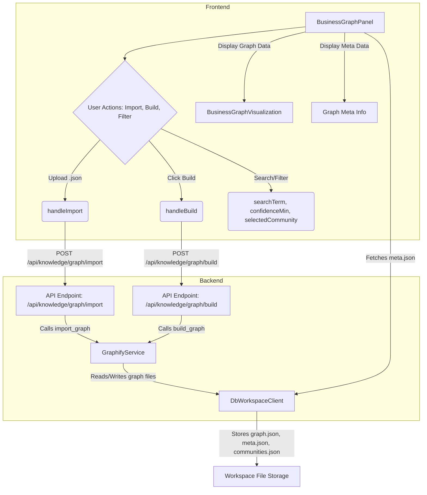

# Graph Visualization & Exploration UI

<details>
<summary>Relevant source files</summary>

The following files were used as context for generating this wiki page:

- [frontend/app/activity/execution/page.tsx](frontend/app/activity/execution/page.tsx)
- [frontend/components/__tests__/databases-tabs-apiclient.test.ts](frontend/components/__tests__/databases-tabs-apiclient.test.ts)
- [frontend/components/analytics/performance-analytics.tsx](frontend/components/analytics/performance-analytics.tsx)
- [frontend/components/context/DatabaseQueryAnalytics.tsx](frontend/components/context/DatabaseQueryAnalytics.tsx)
- [frontend/components/context/context-engineering.tsx](frontend/components/context/context-engineering.tsx)
- [frontend/components/documents/local-storage-browser.tsx](frontend/components/documents/local-storage-browser.tsx)
- [frontend/components/documents/provider-browser.tsx](frontend/components/documents/provider-browser.tsx)
- [frontend/components/knowledge/BusinessGraphPanel.tsx](frontend/components/knowledge/BusinessGraphPanel.tsx)
- [frontend/components/knowledge/BusinessGraphVisualization.tsx](frontend/components/knowledge/BusinessGraphVisualization.tsx)
- [frontend/components/knowledge/KnowledgeGraphExplorer.tsx](frontend/components/knowledge/KnowledgeGraphExplorer.tsx)
- [frontend/components/knowledge/QueryTemplatesGrid.tsx](frontend/components/knowledge/QueryTemplatesGrid.tsx)
- [frontend/components/knowledge/SemanticLayerBuilder.tsx](frontend/components/knowledge/SemanticLayerBuilder.tsx)
- [frontend/components/playbooks/PlaybooksPanel.tsx](frontend/components/playbooks/PlaybooksPanel.tsx)
- [frontend/components/team/team-management.tsx](frontend/components/team/team-management.tsx)
- [orchestrator/api/knowledge_graph.py](orchestrator/api/knowledge_graph.py)
- [orchestrator/api/shopify.py](orchestrator/api/shopify.py)
- [orchestrator/modules/context/sections/graph_context.py](orchestrator/modules/context/sections/graph_context.py)
- [orchestrator/modules/knowledge/community_reports.py](orchestrator/modules/knowledge/community_reports.py)
- [orchestrator/modules/knowledge/graph_extraction.py](orchestrator/modules/knowledge/graph_extraction.py)
- [orchestrator/modules/knowledge/graph_service.py](orchestrator/modules/knowledge/graph_service.py)
- [orchestrator/modules/tools/discovery/actions_graph.py](orchestrator/modules/tools/discovery/actions_graph.py)
- [orchestrator/modules/tools/discovery/handlers_graph.py](orchestrator/modules/tools/discovery/handlers_graph.py)
- [orchestrator/tests/test_graph_relation_vocab.py](orchestrator/tests/test_graph_relation_vocab.py)
- [orchestrator/tests/test_prd154_s12.py](orchestrator/tests/test_prd154_s12.py)
- [orchestrator/tests/test_prd165_s2_graph.py](orchestrator/tests/test_prd165_s2_graph.py)
- [orchestrator/tests/test_prd165_s3_community.py](orchestrator/tests/test_prd165_s3_community.py)
- [orchestrator/tests/test_prd183_s1_catalog_webhook.py](orchestrator/tests/test_prd183_s1_catalog_webhook.py)
- [orchestrator/tests/test_prd189_s3_webhook_debounce.py](orchestrator/tests/test_prd189_s3_webhook_debounce.py)

</details>


This page details the frontend components and backend services that enable the visualization and interactive exploration of the Business Knowledge Graph. It covers the `BusinessGraphPanel` for overall graph management, the `BusinessGraphVisualization` force-directed canvas for rendering, the `KnowledgeGraphExplorer` for cluster-first drill-in, graph preferences, and the `SemanticLayerBuilder` for defining semantic relationships.

## BusinessGraphPanel: Graph Management and Overview

The `BusinessGraphPanel` [frontend/components/knowledge/BusinessGraphPanel.tsx:67-739]() serves as the primary UI for managing and interacting with the Business Knowledge Graph. It provides functionalities such as importing graph data, triggering graph builds, and displaying metadata.

### Key Features

*   **Graph Data & Metadata Display**: Shows the number of nodes, edges, communities, and the last build time of the graph [frontend/components/knowledge/BusinessGraphPanel.tsx:198-206]().
*   **Graph Import**: Allows users to upload `.json` files containing graph data (NetworkX `node_link_data` format) [frontend/components/knowledge/BusinessGraphPanel.tsx:90-137](). This triggers the `import_graph` endpoint [orchestrator/api/knowledge_graph.py:32-82]() in the backend.
*   **Graph Build Trigger**: Initiates a full rebuild of the knowledge graph for the workspace [frontend/components/knowledge/BusinessGraphPanel.tsx:182-194](). This calls the `trigger_graph_build` endpoint [orchestrator/api/knowledge_graph.py:102-119]().
*   **Search and Filtering**: Provides an input for searching nodes and sliders for filtering by confidence score [frontend/components/knowledge/BusinessGraphPanel.tsx:74-76]().
*   **Graph Preferences**: Manages user-specific preferences for graph visualization, such as color mode and visible node/relation types, using the `useGraphPrefs` hook [frontend/components/knowledge/BusinessGraphPanel.tsx:85](). These preferences are persisted per user and workspace.

### Data Flow


**Diagram: BusinessGraphPanel Data Flow**

Sources:
- [frontend/components/knowledge/BusinessGraphPanel.tsx:67-739]()
- [frontend/components/knowledge/BusinessGraphPanel.tsx:74-76]()
- [frontend/components/knowledge/BusinessGraphPanel.tsx:85]()
- [frontend/components/knowledge/BusinessGraphPanel.tsx:90-137]()
- [frontend/components/knowledge/BusinessGraphPanel.tsx:182-194]()
- [frontend/components/knowledge/BusinessGraphPanel.tsx:198-206]()
- [orchestrator/api/knowledge_graph.py:32-82]()
- [orchestrator/api/knowledge_graph.py:102-119]()

## BusinessGraphVisualization: Force-Directed Canvas

The `BusinessGraphVisualization` component [frontend/components/knowledge/BusinessGraphVisualization.tsx:125-615]() is responsible for rendering the knowledge graph using a WebGL/Canvas force-directed layout. It leverages `react-force-graph-2d` for its core functionality.

### Visualization Features

*   **Color Modes**: Nodes can be colored by their `file_type` or by their `community` affiliation [frontend/components/knowledge/BusinessGraphVisualization.tsx:60-61](). The `colorForType` and `colorForCommunity` utilities [frontend/components/graph/graph-viz-utils.ts]() determine the color scheme.
*   **Filtering**: Supports filtering nodes by `file_type` and edges by `relation` [frontend/components/knowledge/BusinessGraphVisualization.tsx:67-70]().
*   **Click-to-Focus**: Clicking a node centers the view on it and dims other nodes/edges unless they are within a 1-hop neighborhood [frontend/components/knowledge/BusinessGraphVisualization.tsx:9-10]().
*   **Hover Tooltip**: Displays node label, type, and degree on hover [frontend/components/knowledge/BusinessGraphVisualization.tsx:11]().
*   **Edge Directional Particles**: Visualizes "data flow" on focused subgraphs [frontend/components/knowledge/BusinessGraphVisualization.tsx:12]().
*   **God Nodes**: Highlights top-5 highest-degree nodes with a halo effect [frontend/components/knowledge/BusinessGraphVisualization.tsx:13]().
*   **Adaptive Labels**: Node labels appear dynamically based on zoom level and node degree [frontend/components/knowledge/BusinessGraphVisualization.tsx:14-15]().
*   **Imperative Handle**: Exposes `zoomToFit` and `resetFocus` methods for external control [frontend/components/knowledge/BusinessGraphVisualization.tsx:81-84]().

### Node and Edge Structure

The visualization expects `GraphNode` and `GraphLink` objects [frontend/components/knowledge/BusinessGraphVisualization.tsx:44-58](), which include properties like `id`, `label`, `file_type`, `community`, `source`, `target`, `relation`, and `confidence_score`.

```mermaid
classDiagram
    direction LR
    class BusinessGraphVisualization {
        +graphData: {nodes: GraphNode[], links: GraphLink[]}
        +onNodeSelect?: (node: GraphNode | null) => void
        +selectedCommunity?: number | null
        +minConfidence?: number
        +visibleTypes?: Set<string>
        +visibleRelations?: Set<string>
        +colorMode?: ColorMode
        +hiddenTypeCount?: number
        +onClearFilters?: () => void
        +zoomToFit(): void
        +resetFocus(): void
    }

    class GraphNode {
        +id: string
        +label: string
        +file_type: string
        +community?: number
        +source_file?: string
    }

    class GraphLink {
        +source: string
        +target: string
        +relation: string
        +confidence: string
        +confidence_score: number
    }

    BusinessGraphVisualization --|> GraphNode : uses
    BusinessGraphVisualization --|> GraphLink : uses
```
**Diagram: BusinessGraphVisualization Class Diagram**

Sources:
- [frontend/components/knowledge/BusinessGraphVisualization.tsx:9-15]()
- [frontend/components/knowledge/BusinessGraphVisualization.tsx:44-58]()
- [frontend/components/knowledge/BusinessGraphVisualization.tsx:60-61]()
- [frontend/components/knowledge/BusinessGraphVisualization.tsx:67-70]()
- [frontend/components/knowledge/BusinessGraphVisualization.tsx:81-84]()
- [frontend/components/knowledge/BusinessGraphVisualization.tsx:125-615]()
- [frontend/components/graph/graph-viz-utils.ts]()

## KnowledgeGraphExplorer: Cluster-First Drill-In

The `KnowledgeGraphExplorer` [frontend/components/knowledge/KnowledgeGraphExplorer.tsx:57-361]() provides a "cluster-first" approach to exploring large knowledge graphs. Instead of loading the entire graph into the browser, it allows users to drill down into specific communities or neighborhoods on the server-side.

### Exploration Workflow

1.  **List Communities**: The explorer first fetches an overview of communities, showing their ID, member count, and an optional title/summary [frontend/components/knowledge/KnowledgeGraphExplorer.tsx:76-83]().
2.  **Load Community Subgraph**: Users can select a community to load its subgraph, which is then displayed in the `BusinessGraphVisualization` [frontend/components/knowledge/KnowledgeGraphExplorer.tsx:87-101](). This calls the `graphCommunitySubgraph` API endpoint.
3.  **Expand Node Neighborhood**: From a loaded subgraph, users can expand a specific node to fetch and merge its immediate neighbors into the current view [frontend/components/knowledge/KnowledgeGraphExplorer.tsx:103-114](). This uses the `graphExpandNode` API endpoint.
4.  **Find Path**: The explorer can find the shortest path between two selected nodes [frontend/components/knowledge/KnowledgeGraphExplorer.tsx:116-132](), utilizing the `graphPath` API endpoint.
5.  **Search-to-Focus**: Users can search for nodes by label, and the explorer will highlight matching nodes or load their neighborhood if found [frontend/components/knowledge/KnowledgeGraphExplorer.tsx:135-158](). This uses the `graphSearchNodes` API endpoint.
6.  **Editable Community Labels**: Community titles can be edited and saved, updating the backend via `graphSetCommunityLabel` [frontend/components/knowledge/KnowledgeGraphExplorer.tsx:175-185]().

### Backend API Endpoints

The `KnowledgeGraphExplorer` relies on several backend API endpoints defined in `orchestrator/api/knowledge_graph.py` for server-side graph operations:

*   `/api/knowledge/graph/communities`: Lists community overviews [orchestrator/api/knowledge_graph.py:158-166]().
*   `/api/knowledge/graph/community/{community_id}`: Retrieves a subgraph for a specific community.
*   `/api/knowledge/graph/node/{node_id}/expand`: Expands a node to include its neighbors.
*   `/api/knowledge/graph/path`: Finds a path between two nodes.
*   `/api/knowledge/graph/search`: Searches for nodes by query.
*   `/api/knowledge/graph/community/{community_id}/label`: Sets the label for a community [orchestrator/api/knowledge_graph.py:250-268]().

```mermaid
graph TD
    subgraph Frontend
        A[KnowledgeGraphExplorer] --> B{User Interaction: Select Community, Expand Node, Search}
        B -- "List Communities" --> C(useQuery: kg-communities)
        B -- "Select Community (cid)" --> D(loadCommunity(cid))
        B -- "Select Node (node)" --> E(expandNode(node))
        B -- "Search (query)" --> F(runSearch(query))
        B -- "Set Path Start (node1)" --> G(handleNodeSelect(node1))
        B -- "Select Path End (node2)" --> G
        G -- "Find Path (node1, node2)" --> H(findPath(node1, node2))
        A -- "Renders" --> I[BusinessGraphVisualization]
        D -- "Updates" --> I
        E -- "Updates" --> I
        H -- "Updates" --> I
        F -- "Highlights/Focuses" --> I
    end

    subgraph Backend (orchestrator/api/knowledge_graph.py)
        J[/api/knowledge/graph/communities]
        K[/api/knowledge/graph/community/{community_id}]
        L[/api/knowledge/graph/node/{node_id}/expand]
        M[/api/knowledge/graph/path]
        N[/api/knowledge/graph/search]
        O[/api/knowledge/graph/community/{community_id}/label]
        P[GraphifyService]
    end

    C --> J
    D --> K
    E --> L
    H --> M
    F --> N
    A -- "Edit Community Label" --> O

    J, K, L, M, N, O -- "Utilize" --> P
```
**Diagram: KnowledgeGraphExplorer Data Flow**

Sources:
- [frontend/components/knowledge/KnowledgeGraphExplorer.tsx:57-361]()
- [frontend/components/knowledge/KnowledgeGraphExplorer.tsx:76-83]()
- [frontend/components/knowledge/KnowledgeGraphExplorer.tsx:87-101]()
- [frontend/components/knowledge/KnowledgeGraphExplorer.tsx:103-114]()
- [frontend/components/knowledge/KnowledgeGraphExplorer.tsx:116-132]()
- [frontend/components/knowledge/KnowledgeGraphExplorer.tsx:135-158]()
- [frontend/components/knowledge/KnowledgeGraphExplorer.tsx:175-185]()
- [orchestrator/api/knowledge_graph.py:158-166]()
- [orchestrator/api/knowledge_graph.py:250-268]()

## Graph Preferences

Graph preferences are managed by the `useGraphPrefs` hook [frontend/components/graph/graph-viz-utils.ts]() and are persisted per user and workspace. These preferences control aspects of the visualization, such as:

*   **Color Mode**: `type` or `community` [frontend/components/knowledge/BusinessGraphVisualization.tsx:60-61]().
*   **Legend Collapse State**: Whether the legend is expanded or collapsed.
*   **Hidden Type/Relation Filters**: Which node types and edge relations are currently hidden from view.

These preferences ensure a consistent user experience across sessions and allow users to customize their graph exploration.

Sources:
- [frontend/components/graph/graph-viz-utils.ts]()
- [frontend/components/knowledge/BusinessGraphVisualization.tsx:60-61]()

## Semantic Layer Builder

The `SemanticLayerBuilder` [frontend/components/knowledge/SemanticLayerBuilder.tsx]() is a component designed to help users define and manage semantic relationships within the knowledge graph. While the provided code snippets do not detail its implementation, its purpose is to provide a UI for building a semantic layer on top of the raw graph data. This likely involves:

*   Defining custom node types and edge relations.
*   Mapping raw data attributes to semantic concepts.
*   Creating rules for inferring new relationships.

This builder would enhance the graph's utility by allowing users to imbue it with domain-specific meaning, making it more powerful for agents and human users alike.

Sources:
- [frontend/components/knowledge/SemanticLayerBuilder.tsx]()

---