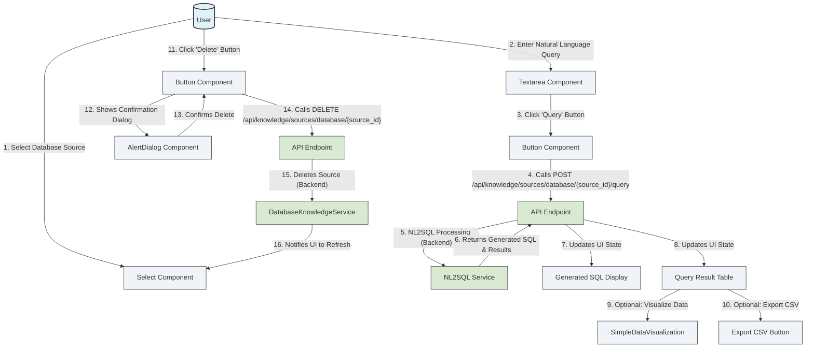

# NL2SQL & Database Knowledge

<details>
<summary>Relevant source files</summary>

The following files were used as context for generating this wiki page:

- [frontend/components/knowledge/DatabaseQueryExplorer.tsx](frontend/components/knowledge/DatabaseQueryExplorer.tsx)
- [orchestrator/alembic/versions/20260612_nl2sql_example_embedding.py](orchestrator/alembic/versions/20260612_nl2sql_example_embedding.py)
- [orchestrator/alembic/versions/prd197_substrate_metrics.py](orchestrator/alembic/versions/prd197_substrate_metrics.py)
- [orchestrator/alembic/versions/prd199_drop_fake_stats.py](orchestrator/alembic/versions/prd199_drop_fake_stats.py)
- [orchestrator/api/database_knowledge.py](orchestrator/api/database_knowledge.py)
- [orchestrator/core/models/database_knowledge.py](orchestrator/core/models/database_knowledge.py)
- [orchestrator/modules/memory/tests/conftest.py](orchestrator/modules/memory/tests/conftest.py)
- [orchestrator/modules/nl2sql/__init__.py](orchestrator/modules/nl2sql/__init__.py)
- [orchestrator/modules/nl2sql/benchmarks/runner.py](orchestrator/modules/nl2sql/benchmarks/runner.py)
- [orchestrator/modules/nl2sql/query/nl2sql_service.py](orchestrator/modules/nl2sql/query/nl2sql_service.py)
- [orchestrator/modules/nl2sql/service.py](orchestrator/modules/nl2sql/service.py)
- [orchestrator/modules/nl2sql/tests/test_validator.py](orchestrator/modules/nl2sql/tests/test_validator.py)
- [orchestrator/modules/nl2sql/training/example_store.py](orchestrator/modules/nl2sql/training/example_store.py)
- [orchestrator/tests/test_nl2sql_accuracy_stack.py](orchestrator/tests/test_nl2sql_accuracy_stack.py)
- [orchestrator/tests/test_nl2sql_training_loop.py](orchestrator/tests/test_nl2sql_training_loop.py)
- [orchestrator/tests/test_nl2sql_validation_path.py](orchestrator/tests/test_nl2sql_validation_path.py)
- [orchestrator/tests/test_prd199_nl2sql.py](orchestrator/tests/test_prd199_nl2sql.py)

</details>


This page details the Natural Language to SQL (NL2SQL) capabilities within Automatos AI, focusing on the `modules/nl2sql` service. It covers the architecture for converting natural language queries into executable SQL, including schema introspection, query validation, example-based learning, and benchmarking. The page also describes the `database_knowledge` API, the `DatabaseQueryExplorer` UI for interacting with these features, and the tenancy safety measures implemented.

Sources:
* [orchestrator/api/database_knowledge.py:1-5]()
* [orchestrator/modules/nl2sql/__init__.py:1-32]()
* [orchestrator/modules/nl2sql/service.py:1-12]()

## NL2SQL Service Architecture

The core of the NL2SQL functionality resides in the `modules/nl2sql` package. It provides services for managing database knowledge sources, generating SQL from natural language, validating queries, and maintaining a semantic layer.

The `DatabaseKnowledgeService` [orchestrator/modules/nl2sql/service.py:60-64]() is the central component, orchestrating interactions between credential resolution, LLM providers, RAG services, context engineering, and auditing. It handles schema introspection, SQL generation, validation, and execution.

The `NaturalLanguageToSQLService` [orchestrator/modules/nl2sql/query/nl2sql_service.py:36-40]() is responsible for the actual conversion of natural language questions into SQL queries using an LLM. It leverages few-shot examples, error self-correction, and schema linking to improve accuracy.

### Key Components and Data Flow

The NL2SQL process involves several steps:

1.  **Database Source Management**: Users define database connections via `DatabaseKnowledgeSource` [orchestrator/core/models/database_knowledge.py:28-34]() models, which store connection details (via `credential_id`), dialect, and cached schema metadata.
2.  **Schema Introspection**: When a database source is added or updated, the `DatabaseIntrospectionService` [orchestrator/modules/nl2sql/__init__.py:46]() connects to the database and extracts its schema (tables, columns, types, relationships). This metadata is cached in `DatabaseKnowledgeSource.schema_metadata` [orchestrator/core/models/database_knowledge.py:56]() and used by the LLM for SQL generation.
3.  **Semantic Layer**: The `DatabaseKnowledgeSource` also supports a `semantic_layer` [orchestrator/core/models/database_knowledge.py:62]() which can define business metrics and dimensions. This semantic information is injected into the LLM prompt to guide SQL generation towards business-relevant queries.
4.  **Natural Language to SQL Generation**: The `NaturalLanguageToSQLService.generate_sql` method [orchestrator/modules/nl2sql/query/nl2sql_service.py:60-76]() takes a natural language question, schema metadata, and semantic layer information to generate an SQL query using an LLM. It constructs a detailed prompt [orchestrator/modules/nl2sql/query/nl2sql_service.py:121-130]() that includes system instructions, database schema, semantic layer definitions, and few-shot examples.
5.  **Query Validation**: Before execution, the generated SQL is passed through the `SQLValidator` [orchestrator/modules/nl2sql/query/validator.py:1-10](). This validator ensures the query is safe (e.g., only `SELECT` statements, no DDL/DML), read-only, and adheres to configured limits (e.g., `LIMIT` clause). It also rewrites the query if necessary (e.g., injecting a `LIMIT` if missing).
6.  **Query Execution**: The validated SQL is executed against the target database. The `DatabaseKnowledgeService` handles connection pooling and execution with guards like statement timeouts and `EXPLAIN` dry-runs to prevent costly or unsafe queries.
7.  **Result Processing**: The query results are returned, often with visualization hints. An audit trail is maintained in `DatabaseQueryAudit` [orchestrator/core/models/database_knowledge.py:89-93]() for all executed queries.

```mermaid
graph TD
    subgraph "User Interface"
        UI[("DatabaseQueryExplorer/Analytics UI")]
    end

    subgraph "Backend Services"
        API[("/api/knowledge/sources/database")]
        DKSvc[DatabaseKnowledgeService]
        NL2SQLSvc[NaturalLanguageToSQLService]
        SQLVal[SQLValidator]
        IntrospectSvc[DatabaseIntrospectionService]
        CredResolver[CredentialResolver]
        LLMProvider[LLMProvider]
        RAGSvc[RAGService]
        AuditSvc[AuditService]
        ExampleStore[SQLExampleStore]
        BenchmarkRunner[NL2SQLBenchmarkRunner]
        GraphSvc[GraphService]
        DBSession[SQLAlchemy Session]
    end

    subgraph "Data Layer"
        DKSource[DatabaseKnowledgeSource (DB Model)]
        DQAudit[DatabaseQueryAudit (DB Model)]
        NL2SQLTrainEx[NL2SQLTrainingExample (DB Model)]
        Credentials[Credentials (DB Model)]
    end

    UI -- User Input (Natural Language Query) --> API
    API -- POST /query --> DKSvc
    API -- POST / --> DKSvc
    API -- GET / --> DKSvc
    API -- DELETE /{source_id} --> DKSvc

    DKSvc -- Fetches --> DKSource
    DKSvc -- Resolves Credential ID --> CredResolver
    CredResolver -- Retrieves Connection String --> Credentials
    DKSvc -- Introspects Schema (on add/update) --> IntrospectSvc
    IntrospectSvc -- Connects & Extracts Schema --> ExternalDB[External Database]
    IntrospectSvc -- Caches Schema Metadata --> DKSource

    DKSvc -- Builds Prompt with Schema & Semantic Layer --> NL2SQLSvc
    NL2SQLSvc -- Generates SQL --> LLMProvider
    NL2SQLSvc -- Retrieves Few-shot Examples --> ExampleStore
    ExampleStore -- Stores/Retrieves Verified Q/SQL Pairs --> NL2SQLTrainEx

    NL2SQLSvc -- Generated SQL --> SQLVal
    SQLVal -- Validates & Rewrites (e.g., adds LIMIT) --> DKSvc
    DKSvc -- Executes Validated SQL --> ExternalDB
    DKSvc -- Stores Query Audit --> DQAudit
    DKSvc -- Triggers Knowledge Graph Update (on new DB source) --> GraphSvc

    DKSvc -- Runs Benchmarks --> BenchmarkRunner
    BenchmarkRunner -- Uses --> NL2SQLSvc
    BenchmarkRunner -- Compares SQL/Results --> SQLComparator[SQLComparator]
    BenchmarkRunner -- Fetches Test Examples --> ExampleStore

    DKSource -- has --> Credentials
    DKSource -- has --> DQAudit
    DKSource -- has --> NL2SQLTrainEx

    DBSession -- Manages ORM Operations --> DKSource, DQAudit, NL2SQLTrainEx, Credentials

    style UI fill:#e0f2f7,stroke:#333,stroke-width:2px
    style API fill:#f0f4f8,stroke:#333,stroke-width:1px
    style DKSvc fill:#d9ead3,stroke:#333,stroke-width:1px
    style NL2SQLSvc fill:#d9ead3,stroke:#333,stroke-width:1px
    style SQLVal fill:#d9ead3,stroke:#333,stroke-width:1px
    style IntrospectSvc fill:#d9ead3,stroke:#333,stroke-width:1px
    style CredResolver fill:#d9ead3,stroke:#333,stroke-width:1px
    style LLMProvider fill:#d9ead3,stroke:#333,stroke-width:1px
    style RAGSvc fill:#d9ead3,stroke:#333,stroke-width:1px
    style AuditSvc fill:#d9ead3,stroke:#333,stroke-width:1px
    style ExampleStore fill:#d9ead3,stroke:#333,stroke-width:1px
    style BenchmarkRunner fill:#d9ead3,stroke:#333,stroke-width:1px
    style GraphSvc fill:#d9ead3,stroke:#333,stroke-width:1px
    style DBSession fill:#d9ead3,stroke:#333,stroke-width:1px
    style DKSource fill:#fff2cc,stroke:#333,stroke-width:1px
    style DQAudit fill:#fff2cc,stroke:#333,stroke-width:1px
    style NL2SQLTrainEx fill:#fff2cc,stroke:#333,stroke-width:1px
    style Credentials fill:#fff2cc,stroke:#333,stroke-width:1px
    style ExternalDB fill:#fce5cd,stroke:#333,stroke-width:1px
```
**Diagram: NL2SQL System Architecture and Data Flow**

Sources:
* [orchestrator/api/database_knowledge.py:71-104]()
* [orchestrator/api/database_knowledge.py:110-159]()
* [orchestrator/api/database_knowledge.py:162-181]()
* [orchestrator/modules/nl2sql/service.py:60-80]()
* [orchestrator/modules/nl2sql/service.py:113-175]()
* [orchestrator/modules/nl2sql/query/nl2sql_service.py:60-120]()
* [orchestrator/modules/nl2sql/query/nl2sql_service.py:121-130]()
* [orchestrator/modules/nl2sql/training/example_store.py:65-128]()
* [orchestrator/modules/nl2sql/benchmarks/runner.py:35-41]()
* [orchestrator/core/models/database_knowledge.py:28-87]()
* [orchestrator/core/models/database_knowledge.py:89-135]()
* [orchestrator/modules/nl2sql/__init__.py:35-67]()

## Query Validator

The `SQLValidator` [orchestrator/modules/nl2sql/query/validator.py:1-10]() is a critical component that ensures the safety and integrity of generated SQL queries before they are executed. It implements several checks:

*   **Read-Only Enforcement**: It strictly allows only `SELECT` statements, rejecting any DDL (CREATE, ALTER, DROP) or DML (INSERT, UPDATE, DELETE) operations. This is a fundamental security measure to prevent unintended modifications to the database. [orchestrator/tests/test_nl2sql_validation_path.py:115-118]()
*   **Subquery Analysis**: It can detect and reject write operations hidden within subqueries, ensuring comprehensive protection. [orchestrator/tests/test_nl2sql_validation_path.py:120-129]()
*   **Table Allowlisting**: The validator ensures that all tables referenced in the query are part of the introspected schema. It prevents queries from accessing unlisted or sensitive tables, even if they are part of `UNION` or CTEs. [orchestrator/tests/test_nl2sql_validation_path.py:131-143]()
*   **LIMIT Clause Enforcement**: It automatically caps excessive `LIMIT` clauses to a predefined `max_limit` (default 1000) or injects a `LIMIT` clause if one is missing, preventing queries from returning an overwhelming number of rows. [orchestrator/tests/test_nl2sql_validation_path.py:145-155]()
*   **Error Propagation**: If validation fails, it raises a `SQLValidationError` [orchestrator/modules/nl2sql/__init__.py:43](), preventing the unsafe query from reaching the database.

The validation process is integrated into the `DatabaseKnowledgeService.smart_query` method, ensuring that validation occurs *before* execution. [orchestrator/tests/test_nl2sql_validation_path.py:10-12]()

Sources:
* [orchestrator/modules/nl2sql/query/validator.py:1-10]()
* [orchestrator/modules/nl2sql/__init__.py:43]()
* [orchestrator/tests/test_nl2sql_validation_path.py:10-12]()
* [orchestrator/tests/test_nl2sql_validation_path.py:115-118]()
* [orchestrator/tests/test_nl2sql_validation_path.py:120-129]()
* [orchestrator/tests/test_nl2sql_validation_path.py:131-143]()
* [orchestrator/tests/test_nl2sql_validation_path.py:145-155]()

## Example Store and Training Loop

The `SQLExampleStore` [orchestrator/modules/nl2sql/training/example_store.py:25-26]() is inspired by Vanna and serves as a RAG (Retrieval Augmented Generation) mechanism for NL2SQL. It stores verified natural language question/SQL pairs, along with their embeddings, to be used as few-shot examples during SQL generation.

### Key Features:

*   **`add_example`**: This method [orchestrator/modules/nl2sql/training/example_store.py:65-82]() allows adding new question/SQL pairs. Crucially, it computes and persists the embedding vector of the question using the `EmbeddingManager` [orchestrator/modules/nl2sql/training/example_store.py:93-101](). This ensures that verified examples can be retrieved efficiently by semantic similarity without re-embedding.
*   **`get_similar_examples`**: This method [orchestrator/modules/nl2sql/training/example_store.py:130-140]() retrieves the most semantically similar verified examples for a given natural language question. It prioritizes embedding similarity for ranking, falling back to keyword-based similarity if embeddings are unavailable. [orchestrator/modules/nl2sql/training/example_store.py:160-185]()
*   **`NL2SQLTrainingExample` Model**: Verified examples are stored in the `NL2SQLTrainingExample` [orchestrator/core/models/database_knowledge.py:200-204]() SQLAlchemy model, which includes fields for `question`, `sql`, `database_source_id`, `workspace_id`, `is_verified`, and the `embedding` vector.
*   **Usage Telemetry**: The system tracks the `usage_count` and `last_used_at` for each example, allowing for insights into the most effective training data. [orchestrator/modules/nl2sql/training/example_store.py:290-291]()

This training loop allows the NL2SQL system to continuously improve its accuracy by learning from human-verified examples.

Sources:
* [orchestrator/modules/nl2sql/training/example_store.py:25-26]()
* [orchestrator/modules/nl2sql/training/example_store.py:65-82]()
* [orchestrator/modules/nl2sql/training/example_store.py:93-101]()
* [orchestrator/modules/nl2sql/training/example_store.py:130-140]()
* [orchestrator/modules/nl2sql/training/example_store.py:160-185]()
* [orchestrator/core/models/database_knowledge.py:200-204]()
* [orchestrator/modules/nl2sql/training/example_store.py:290-291]()
* [orchestrator/tests/test_nl2sql_training_loop.py:25-54]()
* [orchestrator/tests/test_nl2sql_training_loop.py:83-96]()

## Benchmarks Runner

The `NL2SQLBenchmarkRunner` [orchestrator/modules/nl2sql/benchmarks/runner.py:35-41]() provides a mechanism to automatically evaluate the performance of the NL2SQL system against a set of verified "Golden SQL" examples. This is crucial for tracking accuracy and ensuring the quality of generated SQL.

### How it Works:

1.  **Test Set Selection**: The runner can either use a provided list of `test_examples` or dynamically select a random subset of verified examples from the `SQLExampleStore` [orchestrator/modules/nl2sql/benchmarks/runner.py:59-63]().
2.  **SQL Generation**: For each test question, it calls the `NaturalLanguageToSQLService.generate_sql` method [orchestrator/modules/nl2sql/benchmarks/runner.py:77-81]() to produce an SQL query.
3.  **Comparison**: The generated SQL is compared against the expected "Golden SQL" using two metrics:
    *   **Exact Match**: A string-based comparison to see if the generated SQL is identical to the expected SQL. [orchestrator/modules/nl2sql/benchmarks/runner.py:84-85]()
    *   **Execution Match**: This is the primary metric. Both the generated SQL and the expected SQL are executed against the actual database (via a provided `execute_sql` callable). Their result sets are then compared order-insensitively to determine if they produce the same data. This is a more robust measure of correctness as it accounts for functionally equivalent but syntactically different SQL queries. [orchestrator/modules/nl2sql/benchmarks/runner.py:91-114]()
4.  **Result Reporting**: The `run_benchmark` method [orchestrator/modules/nl2sql/benchmarks/runner.py:43-54]() returns a `BenchmarkResult` [orchestrator/modules/nl2sql/benchmarks/runner.py:26-33]() object, which includes total examples, exact match rate, execution match rate, and detailed results for each example.

This benchmarking process helps in identifying regressions, evaluating improvements, and ensuring the reliability of the NL2SQL system.

Sources:
* [orchestrator/modules/nl2sql/benchmarks/runner.py:35-41]()
* [orchestrator/modules/nl2sql/benchmarks/runner.py:59-63]()
* [orchestrator/modules/nl2sql/benchmarks/runner.py:77-81]()
* [orchestrator/modules/nl2sql/benchmarks/runner.py:84-85]()
* [orchestrator/modules/nl2sql/benchmarks/runner.py:91-114]()
* [orchestrator/modules/nl2sql/benchmarks/runner.py:43-54]()
* [orchestrator/modules/nl2sql/benchmarks/runner.py:26-33]()

## `database_knowledge` API

The `orchestrator/api/database_knowledge.py` [orchestrator/api/database_knowledge.py:1-5]() defines the FastAPI routes for managing database knowledge sources and executing NL2SQL queries.

### API Endpoints:

*   **`GET /api/knowledge/sources/database`**: Lists all database knowledge sources for the current workspace. It supports filtering for `active_only` sources. [orchestrator/api/database_knowledge.py:71-104]()
*   **`POST /api/knowledge/sources/database`**: Adds a new database as a knowledge source. This endpoint triggers schema introspection and the creation of agent tools for interacting with the new database. It also schedules an incremental update for the knowledge graph. [orchestrator/api/database_knowledge.py:110-159]()
    *   **Request Body**: `DatabaseKnowledgeSourceCreate` [orchestrator/core/models/database_knowledge.py:300-307]() (name, credential\_id, description, dialect).
*   **`POST /api/knowledge/sources/database/{source_id}/query`**: Executes a natural language query against a specified database source. It returns the generated SQL, the query results, and visualization hints. [orchestrator/api/database_knowledge.py:162-181]()
    *   **Request Body**: `DatabaseQueryRequest` [orchestrator/core/models/database_knowledge.py:310-313]() (query).
*   **`GET /api/knowledge/sources/database/{source_id}/schema`**: Retrieves the introspected schema metadata for a given database source. [orchestrator/api/database_knowledge.py:209-229]()
*   **`POST /api/knowledge/sources/database/{source_id}/introspect`**: Triggers a re-introspection of the database schema. [orchestrator/api/database_knowledge.py:232-259]()
*   **`DELETE /api/knowledge/sources/database/{source_id}`**: Deletes a database knowledge source. [orchestrator/api/database_knowledge.py:262-280]()
*   **`GET /api/knowledge/sources/database/{source_id}/query_history`**: Retrieves the audit trail of queries executed against a specific source. [orchestrator/api/database_knowledge.py:283-303]()
*   **`POST /api/knowledge/sources/database/{source_id}/semantic_layer`**: Updates the semantic layer configuration for a database source. [orchestrator/api/database_knowledge.py:306-337]()
*   **`GET /api/knowledge/sources/database/{source_id}/semantic_layer`**: Retrieves the semantic layer configuration. [orchestrator/api/database_knowledge.py:340-359]()
*   **`POST /api/knowledge/sources/database/{source_id}/examples`**: Adds a new NL2SQL training example. [orchestrator/api/database_knowledge.py:362-393]()
*   **`GET /api/knowledge/sources/database/{source_id}/examples`**: Retrieves training examples, optionally filtered by verification status. [orchestrator/api/database_knowledge.py:396-419]()
*   **`DELETE /api/knowledge/sources/database/{source_id}/examples/{example_id}`**: Deletes a training example. [orchestrator/api/database_knowledge.py:422-440]()
*   **`POST /api/knowledge/sources/database/{source_id}/examples/{example_id}/verify`**: Marks a training example as verified. [orchestrator/api/database_knowledge.py:443-467]()
*   **`POST /api/knowledge/sources/database/{source_id}/benchmarks/run`**: Runs a benchmark against the database source. [orchestrator/api/database_knowledge.py:470-509]()
*   **`GET /api/knowledge/sources/database/{source_id}/benchmarks/latest`**: Retrieves the latest benchmark results. [orchestrator/api/database_knowledge.py:512-531]()

Sources:
* [orchestrator/api/database_knowledge.py:1-5]()
* [orchestrator/api/database_knowledge.py:71-104]()
* [orchestrator/api/database_knowledge.py:110-159]()
* [orchestrator/api/database_knowledge.py:162-181]()
* [orchestrator/api/database_knowledge.py:209-229]()
* [orchestrator/api/database_knowledge.py:232-259]()
* [orchestrator/api/database_knowledge.py:262-280]()
* [orchestrator/api/database_knowledge.py:283-303]()
* [orchestrator/api/database_knowledge.py:306-337]()
* [orchestrator/api/database_knowledge.py:340-359]()
* [orchestrator/api/database_knowledge.py:362-393]()
* [orchestrator/api/database_knowledge.py:396-419]()
* [orchestrator/api/database_knowledge.py:422-440]()
* [orchestrator/api/database_knowledge.py:443-467]()
* [orchestrator/api/database_knowledge.py:470-509]()
* [orchestrator/api/database_knowledge.py:512-531]()
* [orchestrator/core/models/database_knowledge.py:300-307]()
* [orchestrator/core/models/database_knowledge.py:310-313]()

## DatabaseQueryExplorer/Analytics UI

The `DatabaseQueryExplorer` component [frontend/components/knowledge/DatabaseQueryExplorer.tsx:54-57]() in the frontend provides a user interface for interacting with the NL2SQL capabilities. It allows users to:

*   **Select a Database Source**: Choose from a list of configured database knowledge sources. [frontend/components/knowledge/DatabaseQueryExplorer.tsx:63]()
*   **Enter Natural Language Queries**: Input questions in natural language. [frontend/components/knowledge/DatabaseQueryExplorer.tsx:55]()
*   **Generate and Execute SQL**: Submit the natural language query to the backend, which generates and executes SQL. [frontend/components/knowledge/DatabaseQueryExplorer.tsx:127-169]()
*   **View Generated SQL**: See the SQL query generated by the LLM. [frontend/components/knowledge/DatabaseQueryExplorer.tsx:147]()
*   **Display Query Results**: View the data returned by the SQL query in a table format. [frontend/components/knowledge/DatabaseQueryExplorer.tsx:148]()
*   **Visualize Data**: Utilize `SimpleDataVisualization` [frontend/components/knowledge/SimpleDataVisualization.tsx]() to visualize query results. [frontend/components/knowledge/DatabaseQueryExplorer.tsx:109-125]()
*   **Export Results**: Download query results as a CSV file. [frontend/components/knowledge/DatabaseQueryExplorer.tsx:172-204]()
*   **Query History**: Maintain a history of executed queries. [frontend/components/knowledge/DatabaseQueryExplorer.tsx:154-162]()
*   **Delete Database Sources**: Remove configured database connections. [frontend/components/knowledge/DatabaseQueryExplorer.tsx:70-107]()

The UI interacts with the `database_knowledge` API endpoints using `apiClient.request` [frontend/components/knowledge/DatabaseQueryExplorer.tsx:85-87](), [frontend/components/knowledge/DatabaseQueryExplorer.tsx:139-145]() to perform these operations.


**Diagram: DatabaseQueryExplorer UI Interaction Flow**

Sources:
* [frontend/components/knowledge/DatabaseQueryExplorer.tsx:54-57]()
* [frontend/components/knowledge/DatabaseQueryExplorer.tsx:63]()
* [frontend/components/knowledge/DatabaseQueryExplorer.tsx:109-125]()
* [frontend/components/knowledge/DatabaseQueryExplorer.tsx:127-169]()
* [frontend/components/knowledge/DatabaseQueryExplorer.tsx:147]()
* [frontend/components/knowledge/DatabaseQueryExplorer.tsx:148]()
* [frontend/components/knowledge/DatabaseQueryExplorer.tsx:154-162]()
* [frontend/components/knowledge/DatabaseQueryExplorer.tsx:172-204]()
* [frontend/components/knowledge/DatabaseQueryExplorer.tsx:70-107]()
* [frontend/components/knowledge/DatabaseQueryExplorer.tsx:85-87]()
* [frontend/components/knowledge/DatabaseQueryExplorer.tsx:139-145]()
* [frontend/components/knowledge/SimpleDataVisualization.tsx]()

## Tenancy Safety

Multi-tenancy is a core consideration for the NL2SQL and Database Knowledge features. Several mechanisms are in place to ensure strict data isolation between workspaces:

*   **Workspace Scoping in Models**: The `DatabaseKnowledgeSource` [orchestrator/core/models/database_knowledge.py:41]() and `DatabaseQueryAudit` [orchestrator/core/models/database_knowledge.py:101]() models include a `workspace_id` (and `tenant_id` for legacy compatibility) column, which is a foreign key to the `workspaces` table. This ensures that each database source and its associated audit logs are explicitly linked to a specific workspace.
*   **Workspace-Filtered Queries**: All API endpoints and service methods that retrieve or modify database knowledge sources explicitly filter by `workspace_id`. For example, `DatabaseKnowledgeService._get_source` [orchestrator/modules/nl2sql/service.py:86-93]() includes a `workspace_id` parameter, and the API route `get_item` [orchestrator/api/database_knowledge.py:81-83]() filters `DatabaseKnowledgeSource` records by `ctx.workspace_id`. This prevents users from one workspace from accessing or manipulating database sources belonging to another.
*   **Credential Isolation**: Database connection credentials are managed separately and referenced by `credential_id` [orchestrator/core/models/database_knowledge.py:47](). The `CredentialResolver` [orchestrator/modules/nl2sql/service.py:68]() ensures that credentials can only be resolved within the context of the requesting workspace, preventing cross-tenant credential access.
*   **Audit Trail Isolation**: The `DatabaseQueryAudit` table is also scoped by `tenant_id` [orchestrator/core/models/database_knowledge.py:101](), ensuring that query history is isolated per tenant.
*   **Permission Checks**: API routes are protected by `require_workspace_permission` [orchestrator/api/database_knowledge.py:109](), ensuring that users have the necessary permissions (e.g., `knowledge:create`, `knowledge:read`) within their workspace to perform operations on database knowledge sources.

These measures collectively enforce strict multi-tenancy, preventing data leaks or unauthorized access between different workspaces.

Sources:
* [orchestrator/core/models/database_knowledge.py:41]()
* [orchestrator/core/models/database_knowledge.py:47]()
* [orchestrator/core/models/database_knowledge.py:101]()
* [orchestrator/modules/nl2sql/service.py:86-93]()
* [orchestrator/modules/nl2sql/service.py:68]()
* [orchestrator/api/database_knowledge.py:81-83]()
* [orchestrator/api/database_knowledge.py:109]()
* [orchestr/tests/test_nl2sql_validation_path.py:19-21]()
* [orchestrator/tests/test_prd199_nl2sql.py:93-109]()

---