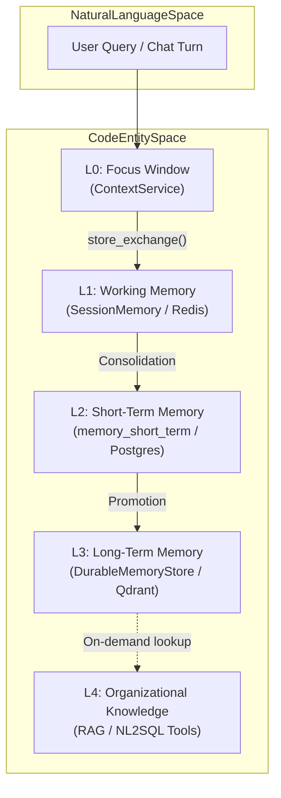
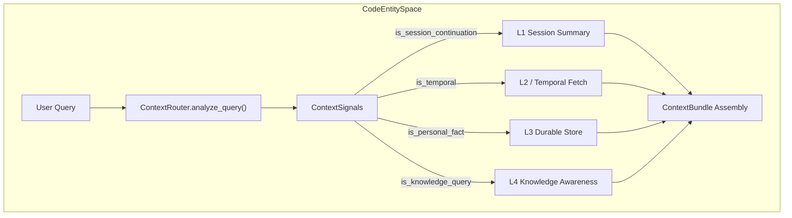

# Memory System

Relevant source files

The following files were used as context for generating this wiki page:

- [orchestrator/alembic/versions/prd206_chat_summary.py](orchestrator/alembic/versions/prd206_chat_summary.py)
- [orchestrator/consumers/chatbot/integration.py](orchestrator/consumers/chatbot/integration.py)
- [orchestrator/consumers/chatbot/smart_memory.py](orchestrator/consumers/chatbot/smart_memory.py)
- [orchestrator/consumers/chatbot/smart_orchestrator.py](orchestrator/consumers/chatbot/smart_orchestrator.py)
- [orchestrator/modules/context/sections/memory.py](orchestrator/modules/context/sections/memory.py)
- [orchestrator/modules/memory/context_router.py](orchestrator/modules/memory/context_router.py)
- [orchestrator/modules/memory/recall_ranking.py](orchestrator/modules/memory/recall_ranking.py)
- [orchestrator/modules/memory/thread_checkpoint.py](orchestrator/modules/memory/thread_checkpoint.py)
- [orchestrator/modules/memory/unified_memory_service.py](orchestrator/modules/memory/unified_memory_service.py)
- [orchestrator/modules/tools/discovery/handlers_search.py](orchestrator/modules/tools/discovery/handlers_search.py)
- [orchestrator/services/memory_archival_job.py](orchestrator/services/memory_archival_job.py)
- [orchestrator/services/memory_jobs.py](orchestrator/services/memory_jobs.py)
- [orchestrator/tests/test_l3_distill_input.py](orchestrator/tests/test_l3_distill_input.py)
- [orchestrator/tests/test_memory_restart_and_isolation.py](orchestrator/tests/test_memory_restart_and_isolation.py)
- [orchestrator/tests/test_memory_single_write_path.py](orchestrator/tests/test_memory_single_write_path.py)
- [orchestrator/tests/test_memory_stored_sse.py](orchestrator/tests/test_memory_stored_sse.py)
- [orchestrator/tests/test_p2w1_semantic_l2_recall.py](orchestrator/tests/test_p2w1_semantic_l2_recall.py)
- [orchestrator/tests/test_prd197_substrate.py](orchestrator/tests/test_prd197_substrate.py)
- [orchestrator/tests/test_prd206_recall_ranking.py](orchestrator/tests/test_prd206_recall_ranking.py)
- [orchestrator/tests/test_prd206_thread_checkpoint.py](orchestrator/tests/test_prd206_thread_checkpoint.py)
- [orchestrator/tests/test_recall_relevance_floor.py](orchestrator/tests/test_recall_relevance_floor.py)
- [orchestrator/tests/test_smart_orchestrator_store_exchange.py](orchestrator/tests/test_smart_orchestrator_store_exchange.py)
- [orchestrator/tests/test_unified_memory.py](orchestrator/tests/test_unified_memory.py)
- [orchestrator/tests/test_us011_context_budgets.py](orchestrator/tests/test_us011_context_budgets.py)

## Purpose and Scope

The Memory System provides a five-layer hierarchical architecture for storing and retrieving conversational context, user facts, temporal data, and organizational knowledge across Automatos AI. It replaces fragmented memory implementations with a centralized service (`UnifiedMemoryService`) that enforces workspace scoping, single write paths, and automated memory lifecycle management. 

For related prompt-building layers, see [Context Service](#4). For cross-agent mission memory, see [Missions & Multi-Agent Coordination](#22).

---

## 3.1 Five-Layer Memory Architecture

The system implements a biologically-inspired memory hierarchy spanning five distinct layers, each optimized for specific access patterns, storage backends, and retention policies. For detailed layer specifications, see [Five-Layer Memory Architecture](#3.1).

**Sources:** [orchestrator/modules/memory/unified_memory_service.py:8-13](), [orchestrator/modules/memory/unified_memory_service.py:127-140]()

---

## 3.2 UnifiedMemoryService

The `UnifiedMemoryService` acts as the single centralized entry point for all memory operations across system consumers [orchestrator/modules/memory/unified_memory_service.py:1-21](). It manages shared references to the in-process durable store (`DurableMemoryStore`) and the Redis client while maintaining strict tenant isolation via `MemoryNamespace` [orchestrator/modules/memory/unified_memory_service.py:161-191]().

For implementation details, API methods, and the single write contract, see [UnifiedMemoryService](#3.2).

**Sources:** [orchestrator/modules/memory/unified_memory_service.py:1-21](), [orchestrator/modules/memory/unified_memory_service.py:161-191]()

---

## 3.3 Context Router

The `ContextRouter` performs fast, regex-based signal detection on user queries (<10 ms, zero I/O) to determine which memory layers to fetch before prompt assembly [orchestrator/modules/memory/context_router.py:1-24](). It recognizes temporal references, personal facts, session continuation cues, and knowledge queries [orchestrator/modules/memory/context_router.py:61-78]().

For classification patterns, token budget distribution (`_CONTEXT_BUDGET_WEIGHTS`), and context bundles, see [Context Router](#3.3).

**Sources:** [orchestrator/modules/memory/context_router.py:1-24](), [orchestrator/modules/memory/context_router.py:61-78]()

---

## 3.4 Memory Lifecycle & Consolidation

Memory lifecycle management is governed by background tasks registered on the unified scheduler via `MemoryJobScheduler` [orchestrator/services/memory_jobs.py:1-33](). These tasks handle session consolidation (L1 to L2), contradiction-based invalidation, Ebbinghaus retention decay scoring on L2, daily L2-to-L3 promotion, and GDPR erasure cascades [orchestrator/services/memory_jobs.py:6-18]().

For background scheduler configurations and retention sweeps, see [Memory Lifecycle & Consolidation](#3.4).

**Sources:** [orchestrator/services/memory_jobs.py:1-33](), [orchestrator/services/memory_jobs.py:6-18]()

---

## 3.5 Daily Logs & Temporal Memory

Automatos maintains daily activity logs and temporal retrieval mechanisms to preserve continuity across extended operational windows [orchestrator/modules/memory/unified_memory_service.py:72-74](). Summaries are compiled asynchronously and injected into prompt sections via `MemorySection` [orchestrator/modules/context/sections/memory.py:1-40]().

For daily log aggregation, temporal query windows, and continuity evaluation gates, see [Daily Logs & Temporal Memory](#3.5).

**Sources:** [orchestrator/modules/memory/unified_memory_service.py:72-74](), [orchestrator/modules/context/sections/memory.py:1-40]()

---

## 3.6 SmartMemoryManager

`SmartMemoryManager` coordinates agent-specific and workspace-wide memory operations within chat consumers [orchestrator/consumers/chatbot/smart_memory.py:1-73](). It integrates with `SmartChatOrchestrator` to perform two-tier memory retrieval, fact extraction, and background storage without blocking streaming responses [orchestrator/consumers/chatbot/smart_memory.py:63-85](), [orchestrator/consumers/chatbot/smart_orchestrator.py:36-53]().

For widget mode behaviors and assistant memory integration, see [SmartMemoryManager](#3.6).

**Sources:** [orchestrator/consumers/chatbot/smart_memory.py:1-73](), [orchestrator/consumers/chatbot/smart_orchestrator.py:36-53]()

---

## 3.7 Memory API Reference

Memory retrieval and search functions are exposed to the system and agents through platform actions and internal routers [orchestrator/modules/tools/discovery/handlers_search.py:1-16](). Key handlers include `search_memory` for durable L3 vector search and `search_chat_history` for keyword queries across PostgreSQL message logs [orchestrator/modules/tools/discovery/handlers_search.py:14-16](), [orchestrator/modules/tools/discovery/handlers_search.py:87-90]().

For endpoint specifications, stats routers, and memory explorer hooks, see [Memory API Reference](#3.7).

**Sources:** [orchestrator/modules/tools/discovery/handlers_search.py:1-16](), [orchestrator/modules/tools/discovery/handlers_search.py:87-90]()

---

## 3.8 Shared Field Memory (Vector Field)

The Vector Field system (`VectorFieldSharedContext`) utilizes a dedicated Qdrant collection (`field_memory`) to manage ambient resonance, Ebbinghaus decay, and attractors across workspace agents. Field sections are dynamically injected into prompts to guide autonomous behavior.

For collection parameters, benchmark scripts, and prompt injection structures, see [Shared Field Memory (Vector Field)](#3.8).

---