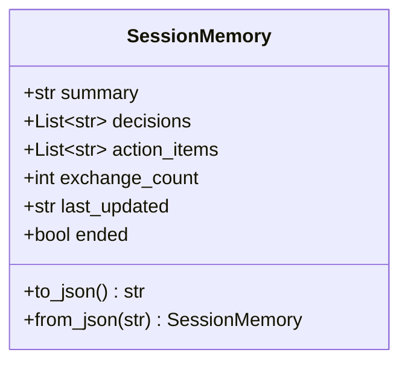
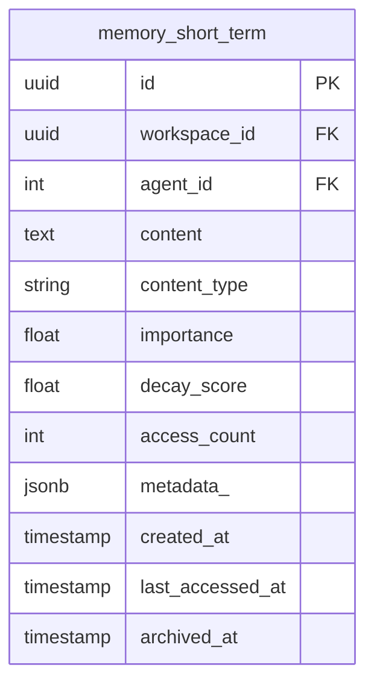
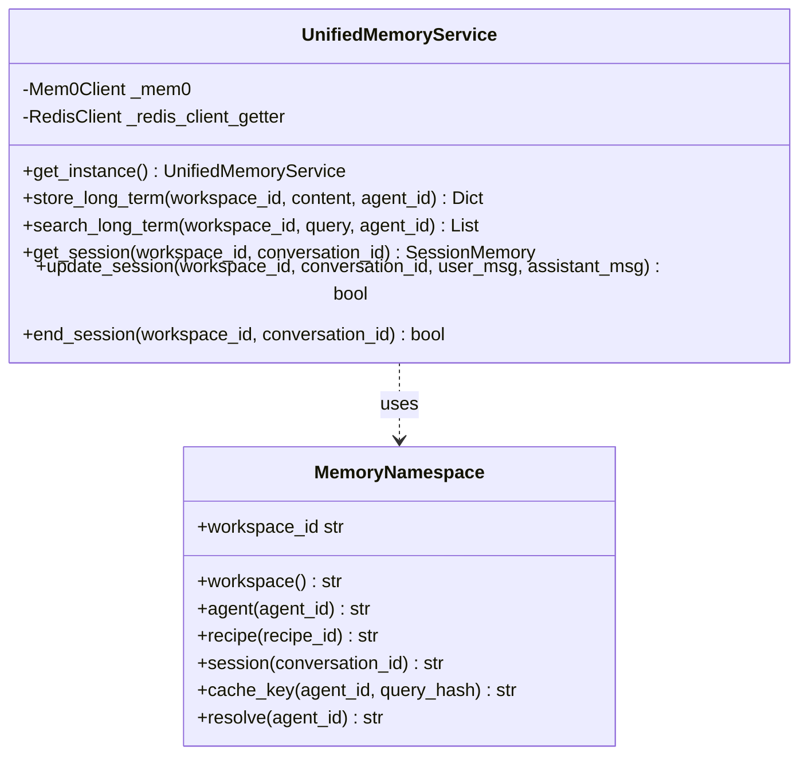

# Memory System

<details>
<summary>Relevant source files</summary>

The following files were used as context for generating this wiki page:

- [docs/PRDS/137-AUTO-CHATBOT-RECOVERY.md](docs/PRDS/137-AUTO-CHATBOT-RECOVERY.md)
- [frontend/tsconfig.tsbuildinfo](frontend/tsconfig.tsbuildinfo)
- [orchestrator/config.py](orchestrator/config.py)
- [orchestrator/consumers/chatbot/integration.py](orchestrator/consumers/chatbot/integration.py)
- [orchestrator/consumers/chatbot/prompt_analyzer.py](orchestrator/consumers/chatbot/prompt_analyzer.py)
- [orchestrator/consumers/chatbot/smart_memory.py](orchestrator/consumers/chatbot/smart_memory.py)
- [orchestrator/consumers/chatbot/smart_orchestrator.py](orchestrator/consumers/chatbot/smart_orchestrator.py)
- [orchestrator/main.py](orchestrator/main.py)
- [orchestrator/modules/agents/queries.py](orchestrator/modules/agents/queries.py)
- [orchestrator/modules/context/sections/identity.py](orchestrator/modules/context/sections/identity.py)
- [orchestrator/modules/context/sections/skills.py](orchestrator/modules/context/sections/skills.py)
- [orchestrator/modules/context/sections/task_context.py](orchestrator/modules/context/sections/task_context.py)
- [orchestrator/modules/memory/context_router.py](orchestrator/modules/memory/context_router.py)
- [orchestrator/modules/memory/integrations/mem0_client.py](orchestrator/modules/memory/integrations/mem0_client.py)
- [orchestrator/modules/memory/unified_memory_service.py](orchestrator/modules/memory/unified_memory_service.py)
- [orchestrator/tests/test_unified_memory.py](orchestrator/tests/test_unified_memory.py)
- [scripts/ralph/IMPLEMENTATION_PLAN.md](scripts/ralph/IMPLEMENTATION_PLAN.md)
- [scripts/ralph/prd.json](scripts/ralph/prd.json)
- [scripts/ralph/progress.txt](scripts/ralph/progress.txt)

</details>


The Memory System provides a five-layer hierarchical architecture for storing and retrieving conversational context, user facts, temporal data, and organizational knowledge. It replaces fragmented memory implementations with a unified API (`UnifiedMemoryService`) that enforces workspace isolation and automatic memory lifecycle management.

For context assembly and prompt injection, see [Context Service](#4). For daily activity summaries, see section 3.5 below. For agent-specific memory integration in missions, see [Missions & Multi-Agent Coordination](#22).

---

## Five-Layer Memory Architecture

The system implements a biologically-inspired memory hierarchy with five distinct layers, each optimized for different access patterns and retention policies.

**Layer Overview**

```mermaid
graph TB
    subgraph ["L0: Focus (Context Window)"]
        [L0_desc]["Current conversation<br/>No persistence"]
    end
    
    subgraph ["L1: Working Memory (Redis)"]
        [L1_session]["SessionMemory<br/>24hr TTL + 1hr grace<br/>JSON: summary, decisions, action_items"]
    end
    
    subgraph ["L2: Short-Term Memory (PostgreSQL)"]
        [L2_table]["memory_short_term table<br/>Ebbinghaus decay formula<br/>Promotion to L3 on access_count > 3"]
    end
    
    subgraph ["L3: Long-Term Memory (Mem0)"]
        [L3_mem0]["Mem0 Service<br/>Fact extraction via LLM<br/>Semantic search with cache"]
    end
    
    subgraph ["L4: Organizational Knowledge"]
        [L4_tools]["Tool-based access<br/>search_knowledge, query_database<br/>Awareness-only in prompts"]
    end
    
    [L0_desc] -->|"end_session()"| [L1_session]
    [L1_session] -->|"Consolidate on expiry"| [L2_table]
    [L2_table] -->|"access_count >= 3"| [L3_mem0]
    [L3_mem0] -.->|"No promotion"| [L4_tools]
```

**Sources:** [orchestrator/modules/memory/unified_memory_service.py:8-13](), [orchestrator/config.py:82-118]()

---

### L0: Focus (Context Window)

L0 represents the current conversation context held in the LLM's prompt. No explicit storage is required—the `ContextService` assembles messages from the request and injects them directly into the prompt.

**Key Characteristics:**
- No persistence layer
- Managed by `ContextService` message assembly
- Limited by model context window (typically 8k-128k tokens)

**Sources:** [orchestrator/modules/memory/unified_memory_service.py:9-9]()

---

### L1: Working Memory (Redis Sessions)

L1 stores active session state in Redis with a 24-hour TTL. After `end_session()` is called, the TTL extends to 1 hour to allow consolidation into L2.

**Data Model**



**Key Operations:**

| Method | Description | TTL Behavior |
|--------|-------------|--------------|
| `get_session(workspace_id, conversation_id)` | Retrieve session from Redis | Returns `None` if expired |
| `update_session(workspace_id, conversation_id, user_msg, assistant_msg)` | Append exchange, increment counter | Resets 24hr TTL |
| `end_session(workspace_id, conversation_id)` | Mark session as ended | Extends to 1hr grace period |

**Redis Key Pattern:**
```
mem:session:{workspace_id}:{conversation_id}
```

**Sources:** [orchestrator/modules/memory/unified_memory_service.py:123-149](), [orchestrator/config.py:84-87]()

---

### L2: Short-Term Memory (PostgreSQL)

L2 stores recent exchanges and activity in the `memory_short_term` table with automatic decay and promotion logic.

**Schema**



**Content Types:**
- `exchange` — User-assistant conversation pair
- `recipe_summary` — Recipe execution summary
- `heartbeat_log` — Proactive assistant findings
- `tool_result` — Tool execution results
- `session_decision` — Key decisions from ended sessions

**Ebbinghaus Decay Formula:**

The decay score is computed hourly via a background job:

```
decay_score = importance × e^(-decay_rate × hours_since_creation)
```

Where:
- `importance` ∈ [0.0, 1.0] — Initial importance score
- `decay_rate` = 0.1 (configurable via `MEMORY_DECAY_RATE`) [orchestrator/config.py:99-99]()
- Items with `decay_score < 0.3` are archived [orchestrator/config.py:101-101]()

**Promotion Logic:**

Items are promoted to L3 when:
- `access_count >= 3` (configurable via `MEMORY_PROMOTION_MIN_ACCESS_COUNT`) [orchestrator/config.py:107-107]()
- `importance >= 0.7` (configurable via `MEMORY_PROMOTION_MIN_IMPORTANCE`) [orchestrator/config.py:105-105]()

**Sources:** [orchestrator/modules/memory/unified_memory_service.py:11-11](), [orchestrator/config.py:98-109]()

---

### L3: Long-Term Memory (Mem0)

L3 uses the Mem0 service for semantic fact extraction and retrieval. Mem0 accepts conversational messages, extracts structured facts via an LLM, and stores them in a vector database for semantic search.

**Architecture**

```mermaid
graph LR
    subgraph ["UnifiedMemoryService"]
        [UMS_store]["store_long_term()"]
    end
    
    subgraph ["Mem0Client"]
        [MC_add]["add()"]
    end
    
    subgraph ["Mem0 Service (Railway)"]
        [Extract]["LLM Fact Extraction"]
        [Vector]["pgvector / Vector DB"]
    end
    
    subgraph ["Redis Cache"]
        [CacheLayer]["5-min TTL<br/>mem:cache:{workspace}:{agent}:{query_hash}"]
    end
    
    [UMS_store] --> [MC_add]
    [MC_add] --> [Extract]
    [Extract] --> [Vector]
    
    [UMS_store] -.->|"Check cache first"| [CacheLayer]
    [Vector] -.->|"Cache results"| [CacheLayer]
```

**Circuit Breaker:**

The `Mem0Client` implements a circuit breaker to prevent cascade failures:
- Opens after a failure threshold (default 3) [orchestrator/modules/memory/integrations/mem0_client.py:29-34]()
- Remains open for a cooldown period (default 300s) [orchestrator/modules/memory/integrations/mem0_client.py:34-34]()
- Allows probe requests after cooldown [orchestrator/modules/memory/integrations/mem0_client.py:51-59]()

**Key Methods:**

| Method | Mem0 Endpoint | Cache Strategy |
|--------|---------------|----------------|
| `add(messages, user_id, metadata)` | `POST /memories/` | Sends raw conversation for extraction [orchestrator/modules/memory/integrations/mem0_client.py:176-202]() |
| `search(query, user_id, limit)` | `POST /memories/search/` | 5-min cache with query hash key [orchestrator/config.py:88-89]() |

**Sources:** [orchestrator/modules/memory/integrations/mem0_client.py:25-80](), [orchestrator/modules/memory/unified_memory_service.py:12-12]()

---

### L4: Organizational Knowledge (RAG/NL2SQL)

L4 provides awareness of available knowledge sources without pre-fetching content. The `ContextRouter` injects a brief summary of available tools into the system prompt, but actual retrieval happens on-demand via tool calls.

**Key Characteristics:**
- No pre-fetch—tools are invoked by the agent when needed
- Awareness text limited by `CONTEXT_BUDGET_AWARENESS` (200 tokens default) [orchestrator/config.py:95-95]()
- Covered in detail in [Knowledge Base & RAG](#7)

**Sources:** [orchestrator/modules/memory/unified_memory_service.py:13-13](), [orchestrator/config.py:95-95]()

---

## UnifiedMemoryService API

The `UnifiedMemoryService` is a singleton that consolidates all memory operations. It replaces scattered `Mem0Client` instances with a single shared service.

**Singleton Pattern**

```python
# [orchestrator/modules/memory/unified_memory_service.py:166-171]
from modules.memory.unified_memory_service import get_unified_memory_service

service = get_unified_memory_service()
```

**Core API Methods**



**Sources:** [orchestrator/modules/memory/unified_memory_service.py:38-188]()

---

## MemoryNamespace: Workspace Isolation

The `MemoryNamespace` class builds standardized `user_id` strings for Mem0 and Redis keys, preventing inconsistencies across the platform.

**Namespace Patterns**

| Method | Pattern | Usage |
|--------|---------|-------|
| `workspace()` | `mem:{workspace_id}` | Global workspace facts [orchestrator/modules/memory/unified_memory_service.py:52-54]() |
| `agent(agent_id)` | `mem:{workspace_id}:agent:{agent_id}` | Agent-specific memories [orchestrator/modules/memory/unified_memory_service.py:56-58]() |
| `recipe(recipe_id)` | `mem:{workspace_id}:recipe:{recipe_id}` | Recipe learnings [orchestrator/modules/memory/unified_memory_service.py:60-62]() |
| `daily()` | `mem:{workspace_id}:daily` | Daily activity logs [orchestrator/modules/memory/unified_memory_service.py:72-74]() |
| `session(conversation_id)` | `mem:session:{workspace_id}:{conversation_id}` | L1 session cache [orchestrator/modules/memory/unified_memory_service.py:78-80]() |

**Sources:** [orchestrator/modules/memory/unified_memory_service.py:38-118]()

---

## Context Router: Signal-Based Retrieval

The `ContextRouter` analyzes user queries and guided by token budgets, determines which memory layers to fetch.

**Budget Allocation:**

The system enforces token budgets per source to prevent context overflow:

| Source | Config Constant | Default |
|--------|----------------|---------|
| Session summary | `CONTEXT_BUDGET_SESSION` | 500 |
| Long-term memories | `CONTEXT_BUDGET_LONG_TERM` | 800 |
| Temporal results | `CONTEXT_BUDGET_TEMPORAL` | 600 |
| Daily logs | `CONTEXT_BUDGET_DAILY` | 400 |
| Knowledge awareness | `CONTEXT_BUDGET_AWARENESS` | 200 |

**Sources:** [orchestrator/config.py:91-95]()

---

## Memory Lifecycle & Background Jobs

Three background jobs manage memory lifecycle automatically:

| Job | Interval | Purpose |
|-----|----------|---------|
| Consolidation | `MEMORY_CONSOLIDATION_INTERVAL_SECONDS` | Moves ended L1 sessions to L2 [orchestrator/config.py:111-111]() |
| Decay | `MEMORY_DECAY_INTERVAL_SECONDS` | Updates Ebbinghaus scores in L2 [orchestrator/config.py:112-112]() |
| Promotion | `MEMORY_PROMOTION_HOUR_UTC` | Promotes high-importance L2 to L3 [orchestrator/config.py:113-113]() |

**Sources:** [orchestrator/config.py:110-115]()

---

## Daily Logs & Temporal Memory

Daily logs provide summarized activity for "what happened earlier today" queries. The `UnifiedMemoryService` manages these via the `daily()` namespace.

**Sources:** [orchestrator/modules/memory/unified_memory_service.py:72-74]()

---

## SmartMemoryManager: Two-Tier Retrieval

The `SmartMemoryManager` provides a chatbot-specific wrapper around `UnifiedMemoryService`, implementing logic to separate personal facts from tool-specific preferences.

**Intent Classification:**
It uses keywords to determine if a memory is tool-specific (agent tier) or personal (global tier). For example, keywords like "slack" or "github" route to the agent tier, while "my name" or "i work at" route to the global tier [orchestrator/consumers/chatbot/smart_memory.py:92-168]().

**Widget Mode:**
When `widget_mode=True`, the manager can restrict retrieval to specific scopes, preventing leakage of global workspace context into embedded widgets [orchestrator/consumers/chatbot/smart_orchestrator.py:107-107]().

**Sources:** [orchestrator/consumers/chatbot/smart_memory.py:50-180](), [orchestrator/consumers/chatbot/smart_orchestrator.py:86-124]()

---

## Memory API Reference

The memory system is accessible via core platform actions and internal services.

**API Endpoints:**
- `GET /api/memory` — Memory management router [orchestrator/main.py:50-50]()
- `GET /api/memory-stats` — Memory usage analytics [orchestrator/main.py:54-54]()
- `GET /api/widget-memory` — Memory panel for widgets [orchestrator/main.py:51-51]()

**Sources:** [orchestrator/main.py:50-55]()

---