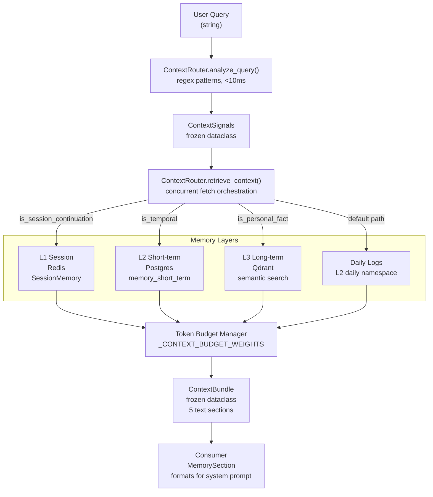
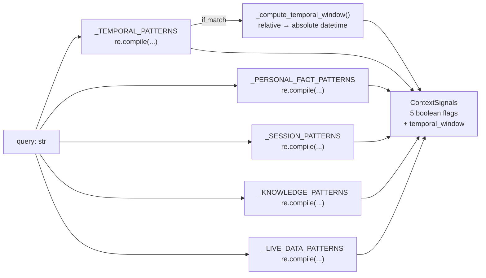
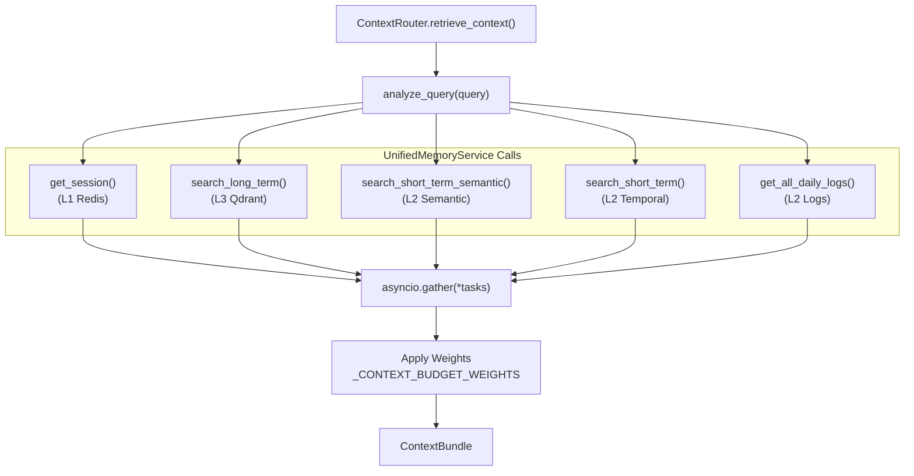

# Context Router

Relevant source files

The following files were used as context for generating this wiki page:

- [orchestrator/alembic/versions/prd206_chat_summary.py](orchestrator/alembic/versions/prd206_chat_summary.py)
- [orchestrator/consumers/chatbot/integration.py](orchestrator/consumers/chatbot/integration.py)
- [orchestrator/consumers/chatbot/smart_memory.py](orchestrator/consumers/chatbot/smart_memory.py)
- [orchestrator/consumers/chatbot/smart_orchestrator.py](orchestrator/consumers/chatbot/smart_orchestrator.py)
- [orchestrator/modules/context/sections/memory.py](orchestrator/modules/context/sections/memory.py)
- [orchestrator/modules/memory/context_router.py](orchestrator/modules/memory/context_router.py)
- [orchestrator/modules/memory/recall_ranking.py](orchestrator/modules/memory/recall_ranking.py)
- [orchestrator/modules/memory/thread_checkpoint.py](orchestrator/modules/memory/thread_checkpoint.py)
- [orchestrator/modules/memory/unified_memory_service.py](orchestrator/modules/memory/unified_memory_service.py)
- [orchestrator/modules/tools/discovery/handlers_search.py](orchestrator/modules/tools/discovery/handlers_search.py)
- [orchestrator/services/memory_archival_job.py](orchestrator/services/memory_archival_job.py)
- [orchestrator/services/memory_jobs.py](orchestrator/services/memory_jobs.py)
- [orchestrator/tests/test_l3_distill_input.py](orchestrator/tests/test_l3_distill_input.py)
- [orchestrator/tests/test_memory_restart_and_isolation.py](orchestrator/tests/test_memory_restart_and_isolation.py)
- [orchestrator/tests/test_memory_single_write_path.py](orchestrator/tests/test_memory_single_write_path.py)
- [orchestrator/tests/test_memory_stored_sse.py](orchestrator/tests/test_memory_stored_sse.py)
- [orchestrator/tests/test_p2w1_semantic_l2_recall.py](orchestrator/tests/test_p2w1_semantic_l2_recall.py)
- [orchestrator/tests/test_prd197_substrate.py](orchestrator/tests/test_prd197_substrate.py)
- [orchestrator/tests/test_prd206_recall_ranking.py](orchestrator/tests/test_prd206_recall_ranking.py)
- [orchestrator/tests/test_prd206_thread_checkpoint.py](orchestrator/tests/test_prd206_thread_checkpoint.py)
- [orchestrator/tests/test_recall_relevance_floor.py](orchestrator/tests/test_recall_relevance_floor.py)
- [orchestrator/tests/test_smart_orchestrator_store_exchange.py](orchestrator/tests/test_smart_orchestrator_store_exchange.py)
- [orchestrator/tests/test_unified_memory.py](orchestrator/tests/test_unified_memory.py)
- [orchestrator/tests/test_us011_context_budgets.py](orchestrator/tests/test_us011_context_budgets.py)

## Purpose and Scope

The **Context Router** is a pre-LLM context assembly layer that analyzes user queries to determine which memory layers should be fetched *before* the agent sees the prompt. It performs two core functions:

1.  **Signal detection** (`analyze_query`): Fast regex-based classification of queries into categories (temporal, personal_fact, session_continuation, knowledge_query, live_data) `[orchestrator/modules/memory/context_router.py:9-11]()`.
2.  **Context assembly** (`retrieve_context`): Fetches relevant data from L1 (session), L2 (short-term), and L3 (long-term) memory layers based on detected signals, respecting token budget constraints `[orchestrator/modules/memory/context_router.py:10-12]()`.

This system replaces scattered memory retrieval logic with a unified, signal-driven approach. Target latency for analysis is **<10 ms** `[orchestrator/modules/memory/context_router.py:9]()`.

---

## Architecture Overview

The Context Router sits between the query input and the memory layers, acting as an intelligent dispatcher:

**Title: Context Router Flow**

Sources: `[orchestrator/modules/memory/context_router.py:1-24]()`, `[orchestrator/modules/memory/context_router.py:381-525]()`

---

## Signal Detection

### analyze_query() Method

The `analyze_query()` method classifies queries using **compiled regex patterns** — no LLM calls, no database queries `[orchestrator/modules/memory/context_router.py:310-337]()`.

**Title: Signal Detection Logic**

Sources: `[orchestrator/modules/memory/context_router.py:82-170]()`, `[orchestrator/modules/memory/context_router.py:310-337]()`

### ContextSignals Dataclass

Frozen dataclass representing detected signals `[orchestrator/modules/memory/context_router.py:61-77]`:

| Field | Type | Description |
| :--- | :--- | :--- |
| `is_temporal` | `bool` | Relative time reference detected (e.g. "last week") |
| `is_personal_fact` | `bool` | User identity/preference query (e.g. "my email") |
| `is_session_continuation` | `bool` | Reference to current conversation (e.g. "as we just discussed") |
| `is_knowledge_query` | `bool` | Document/policy lookup (e.g. "find the onboarding guide") |
| `is_live_data` | `bool` | Real-time metrics query (e.g. "current MRR") |
| `temporal_window` | `Optional[Tuple[datetime, datetime]]` | Absolute time range if `is_temporal=True` |

Sources: `[orchestrator/modules/memory/context_router.py:61-77]()`

---

## Context Assembly

### retrieve_context() Method

The `retrieve_context()` method orchestrates concurrent fetches from multiple memory layers. It utilizes `UnifiedMemoryService` to access L1-L4 layers `[orchestrator/modules/memory/context_router.py:381-525]()`.

**Title: Concurrent Fetch Strategy**

Sources: `[orchestrator/modules/memory/context_router.py:381-525]()`, `[orchestrator/modules/memory/unified_memory_service.py:161-170]()`

### Semantic L2 Recall

A key feature of the Context Router is **semantic L2 recall**. Every non-temporal query triggers a vector match on the L2 mirror (hydrated from live Postgres rows) `[orchestrator/tests/test_p2w1_semantic_l2_recall.py:1-17]()`. This ensures relevant short-term context is found by meaning rather than just keyword matches.

### Token Budget Management

The router uses a weight-based budget system to prevent context window overflow `[orchestrator/modules/memory/context_router.py:45-54]`:

| Section | Weight | Purpose |
| :--- | :--- | :--- |
| `session` | 0.10 | L1 session state |
| `long_term` | 0.15 | L3 durable facts |
| `temporal` | 0.10 | L2 short-term results |
| `daily` | 0.08 | Daily activity logs |
| `awareness` | 0.05 | Knowledge awareness |
| `tools` | 0.20 | Reserved for tool definitions |
| `system_prompt`| 0.12 | Reserved for persona |

The usable window is calculated as 80% of the raw window `[orchestrator/modules/memory/context_router.py:54]()`.

---

## Integration with MemorySection

The `MemorySection` class in the unified prompt-building layer (`ContextService`) is the primary consumer of the Context Router `[orchestrator/modules/context/sections/memory.py:32-46]()`.

1.  **Try Router First**: `MemorySection` attempts to use `ContextRouter.retrieve_context()` for richer, signal-based context `[orchestrator/modules/context/sections/memory.py:103-125]()`.
2.  **Fallback**: If the router fails or is unavailable, it falls back to the `SmartMemoryManager` for standard two-tier retrieval `[orchestrator/modules/context/sections/memory.py:83-84]()`.
3.  **Ranking**: Retrieved memories are passed through `rank_memories` to apply composite scoring based on semantic relevance, recency decay, importance, and pinning `[orchestrator/modules/memory/recall_ranking.py:91-103]()`.

Sources: `[orchestrator/modules/context/sections/memory.py:75-101]()`, `[orchestrator/modules/memory/recall_ranking.py:1-23]()`

---