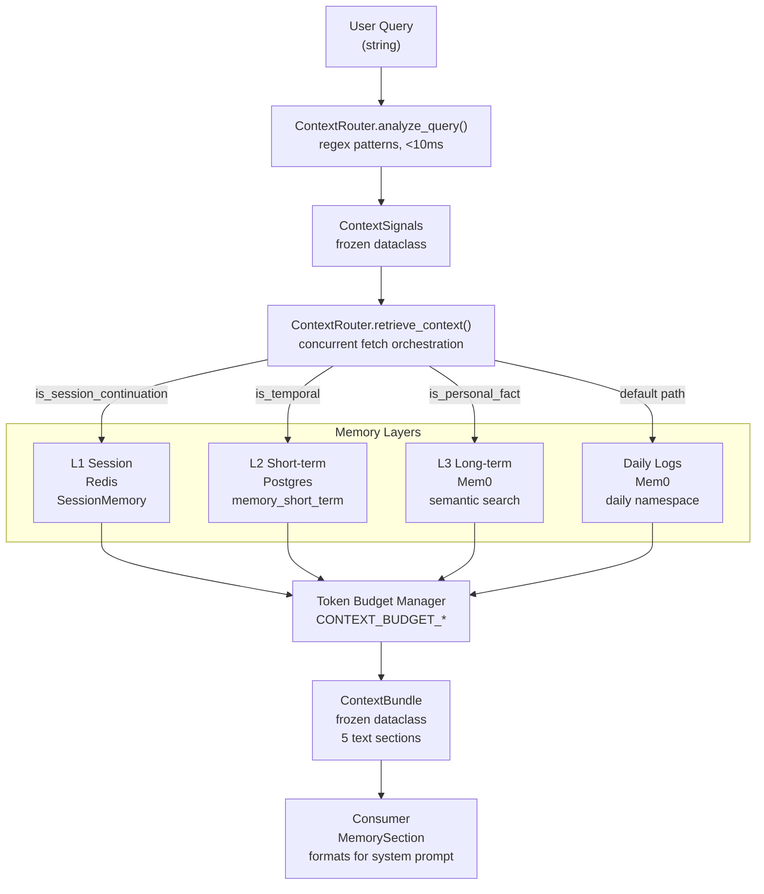
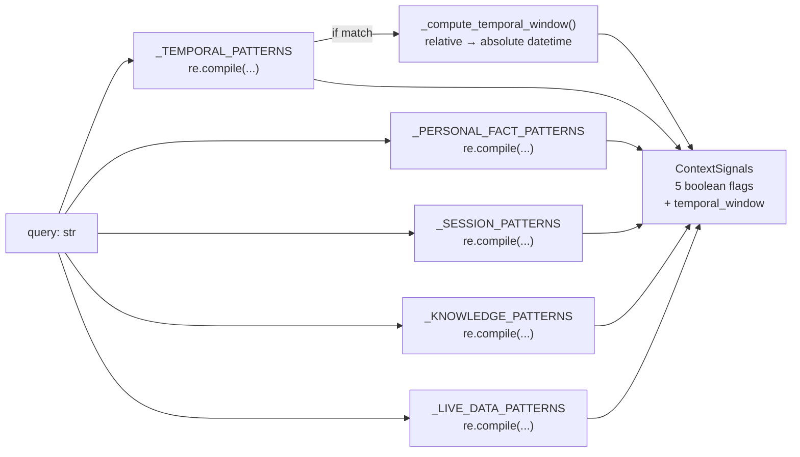
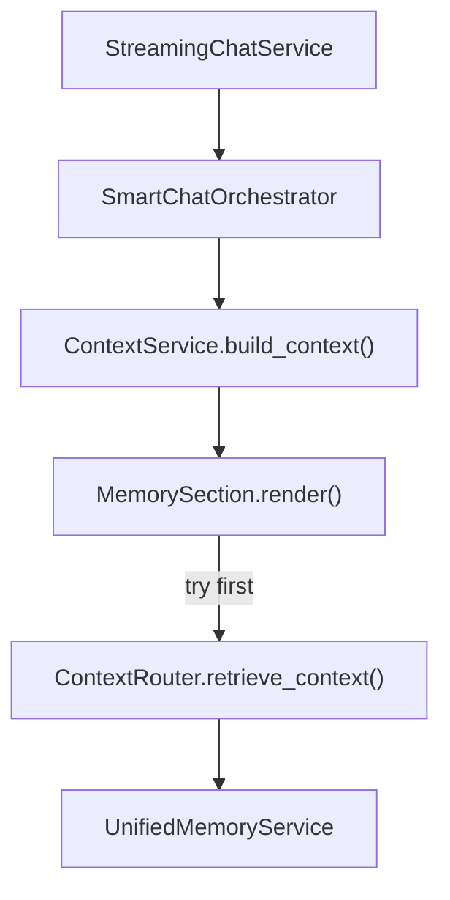

# Context Router

<details>
<summary>Relevant source files</summary>

The following files were used as context for generating this wiki page:

- [frontend/hooks/use-skills-api.ts](frontend/hooks/use-skills-api.ts)
- [orchestrator/alembic/versions/prd123_checkpoint_count.py](orchestrator/alembic/versions/prd123_checkpoint_count.py)
- [orchestrator/api/missions.py](orchestrator/api/missions.py)
- [orchestrator/config.py](orchestrator/config.py)
- [orchestrator/core/context_guard.py](orchestrator/core/context_guard.py)
- [orchestrator/core/models/orchestration.py](orchestrator/core/models/orchestration.py)
- [orchestrator/core/models/orchestration_enums.py](orchestrator/core/models/orchestration_enums.py)
- [orchestrator/main.py](orchestrator/main.py)
- [orchestrator/modules/coordination/dispatcher.py](orchestrator/modules/coordination/dispatcher.py)
- [orchestrator/modules/coordination/planner.py](orchestrator/modules/coordination/planner.py)
- [orchestrator/modules/coordination/reconciler.py](orchestrator/modules/coordination/reconciler.py)
- [orchestrator/modules/memory/context_manager.py](orchestrator/modules/memory/context_manager.py)
- [orchestrator/modules/memory/context_router.py](orchestrator/modules/memory/context_router.py)
- [orchestrator/modules/memory/unified_memory_service.py](orchestrator/modules/memory/unified_memory_service.py)
- [orchestrator/modules/tools/discovery/action_registry.py](orchestrator/modules/tools/discovery/action_registry.py)
- [orchestrator/modules/tools/execution/concurrency.py](orchestrator/modules/tools/execution/concurrency.py)
- [orchestrator/services/checkpoint_service.py](orchestrator/services/checkpoint_service.py)
- [orchestrator/services/coordinator_service.py](orchestrator/services/coordinator_service.py)
- [orchestrator/services/orchestration_state.py](orchestrator/services/orchestration_state.py)
- [orchestrator/tests/test_budget_gate.py](orchestrator/tests/test_budget_gate.py)
- [orchestrator/tests/test_dispatcher_parallel.py](orchestrator/tests/test_dispatcher_parallel.py)
- [orchestrator/tests/test_unified_memory.py](orchestrator/tests/test_unified_memory.py)
- [scripts/ralph/IMPLEMENTATION_PLAN.md](scripts/ralph/IMPLEMENTATION_PLAN.md)
- [scripts/ralph/progress.txt](scripts/ralph/progress.txt)

</details>


## Purpose and Scope

The **Context Router** is a pre-LLM context assembly layer that analyzes user queries to determine which memory layers should be fetched *before* the agent sees the prompt. It performs two core functions:

1.  **Signal detection** (`analyze_query`): Fast regex-based classification of queries into categories (temporal, personal_fact, session_continuation, knowledge_query, live_data) [orchestrator/modules/memory/context_router.py:9-11]().
2.  **Context assembly** (`retrieve_context`): Fetches relevant data from L1 (session), L2 (short-term), and L3 (long-term) memory layers based on detected signals, respecting token budget constraints [orchestrator/modules/memory/context_router.py:10-12]().

This system replaces scattered memory retrieval logic across the codebase with a unified, signal-driven approach that ensures agents receive the right context without over-fetching. Target latency for analysis is **<10 ms** [orchestrator/modules/memory/context_router.py:9]().

---

## Architecture Overview

The Context Router sits between the query input and the memory layers, acting as an intelligent dispatcher:

**Title: Context Router Flow**

Sources: [orchestrator/modules/memory/context_router.py:1-24](), [orchestrator/modules/memory/context_router.py:310-525]()

---

## Signal Detection

### analyze_query() Method

The `analyze_query()` method classifies queries using **compiled regex patterns** — no LLM calls, no database queries [orchestrator/modules/memory/context_router.py:310-337]().

**Title: Signal Detection Logic**

Sources: [orchestrator/modules/memory/context_router.py:82-170](), [orchestrator/modules/memory/context_router.py:310-337]()

### ContextSignals Dataclass

Frozen dataclass representing detected signals [orchestrator/modules/memory/context_router.py:40-56]():

| Field | Type | Description |
| :--- | :--- | :--- |
| `is_temporal` | `bool` | Relative time reference detected (e.g. "last week") |
| `is_personal_fact` | `bool` | User identity/preference query (e.g. "my email") |
| `is_session_continuation` | `bool` | Reference to current conversation (e.g. "as we just discussed") |
| `is_knowledge_query` | `bool` | Document/policy lookup (e.g. "find the onboarding guide") |
| `is_live_data` | `bool` | Real-time metrics query (e.g. "current MRR") |
| `temporal_window` | `Optional[Tuple[datetime, datetime]]` | Absolute time range if `is_temporal=True` |

Sources: [orchestrator/modules/memory/context_router.py:40-56]()

### Pattern Examples

*   **Temporal Patterns** (`_TEMPORAL_PATTERNS`): Matches "last week", "yesterday", "3 days ago", "recently" [orchestrator/modules/memory/context_router.py:86-105]().
*   **Personal Fact Patterns** (`_PERSONAL_FACT_PATTERNS`): Matches "my email", "I prefer", "remember when" [orchestrator/modules/memory/context_router.py:108-121]().
*   **Session Patterns** (`_SESSION_PATTERNS`): Matches "as I just said", "earlier in this conversation" [orchestrator/modules/memory/context_router.py:124-137]().
*   **Knowledge Patterns** (`_KNOWLEDGE_PATTERNS`): Matches "find the document", "search for policy" [orchestrator/modules/memory/context_router.py:140-153]().
*   **Live Data Patterns** (`_LIVE_DATA_PATTERNS`): Matches "current MRR", "latest stats", "how many users" [orchestrator/modules/memory/context_router.py:156-170]().

---

## Context Assembly

### retrieve_context() Method

The `retrieve_context()` method orchestrates concurrent fetches from multiple memory layers based on detected signals. All layer fetches run in parallel via `asyncio.gather()` [orchestrator/modules/memory/context_router.py:381-525]().

**Title: Concurrent Fetch Strategy**
```mermaid
graph TB
    Start["retrieve_context(workspace_id, agent_id, query, conversation_id)"]
    Analyze["signals = analyze_query(query)"]
    
    DecideL1{is_session_continuation<br/>or default<br/>+ has conversation_id?}
    DecideL3{is_personal_fact<br/>or default path?}
    DecideL2{is_temporal<br/>+ has temporal_window?}
    DecideDaily{default path<br/>(no strong signal)?}
    
    FetchL1["L1: get_session()<br/>workspace_id, conversation_id"]
    FetchL3["L3: search_long_term()<br/>workspace_id, query, agent_id"]
    FetchL2["L2: search_short_term()<br/>workspace_id, query, days=window"]
    FetchDaily["Daily: get_all_daily_logs()<br/>workspace_id, limit=10"]
    
    Gather["asyncio.gather(*tasks)<br/>concurrent execution"]
    
    Budget["Apply Token Budgets<br/>CONTEXT_BUDGET_SESSION: 500<br/>CONTEXT_BUDGET_LONG_TERM: 800<br/>CONTEXT_BUDGET_TEMPORAL: 600<br/>CONTEXT_BUDGET_DAILY: 400"]
    
    Bundle["ContextBundle<br/>session_summary: str<br/>long_term_memories: tuple<br/>temporal_results: tuple<br/>daily_logs: str<br/>knowledge_awareness: str<br/>total_tokens_estimate: int"]
    
    Start --> Analyze
    Analyze --> DecideL1
    Analyze --> DecideL3
    Analyze --> DecideL2
    Analyze --> DecideDaily
    
    DecideL1 -->|Yes| FetchL1
    DecideL3 -->|Yes| FetchL3
    DecideL2 -->|Yes| FetchL2
    DecideDaily -->|Yes| FetchDaily
    
    FetchL1 --> Gather
    FetchL3 --> Gather
    FetchL2 --> Gather
    FetchDaily --> Gather
    
    Gather --> Budget
    Budget --> Bundle
```
Sources: [orchestrator/modules/memory/context_router.py:381-525]()

### Token Budget Management

Each section has a dedicated token budget configured in `Config` [orchestrator/config.py:91-97]():

| Variable | Default (Tokens) | Purpose |
| :--- | :--- | :--- |
| `CONTEXT_BUDGET_TOKENS` | 4000 | Total combined budget |
| `CONTEXT_BUDGET_SESSION` | 500 | L1 session summary |
| `CONTEXT_BUDGET_LONG_TERM` | 800 | L3 semantic memories |
| `CONTEXT_BUDGET_TEMPORAL` | 600 | L2 short-term results |
| `CONTEXT_BUDGET_DAILY` | 400 | Daily activity logs |
| `CONTEXT_BUDGET_AWARENESS` | 200 | Capability descriptions |

Text is truncated using a **4 chars per token** heuristic via `_truncate_to_budget()` [orchestrator/modules/memory/context_router.py:344-354]().

---

## Temporal Window Calculation

The `_compute_temporal_window()` function converts relative time references into absolute `(start, end)` datetime tuples [orchestrator/modules/memory/context_router.py:177-294]().

| Pattern | Example | Computed Window |
| :--- | :--- | :--- |
| `yesterday` | "What happened yesterday?" | Previous day 00:00 to 23:59:59 [orchestrator/modules/memory/context_router.py:190-193]() |
| `last week` | "Last week's decisions" | 7 days ago to now [orchestrator/modules/memory/context_router.py:227-230]() |
| `last month` | "Last month's metrics" | 30 days ago to now [orchestrator/modules/memory/context_router.py:231-234]() |
| `\d+ days ago` | "5 days ago" | Specific day delta to now [orchestrator/modules/memory/context_router.py:252-258]() |
| `recently` | "Recently we talked about..." | 7 days ago to now (fuzzy) [orchestrator/modules/memory/context_router.py:273-276]() |

Sources: [orchestrator/modules/memory/context_router.py:177-294]()

---

## Knowledge Awareness

When `is_knowledge_query` or `is_live_data` signals are detected, the router builds a dynamic **knowledge awareness** text block describing available databases, documents, and tools [orchestrator/modules/memory/context_router.py:574-612]().

### Retrieval Flow

1.  **Cache Check**: Looks for cached awareness text in Redis using `MemoryNamespace.awareness()` [orchestrator/modules/memory/unified_memory_service.py:95-97]() [orchestrator/modules/memory/context_router.py:586-590]().
2.  **DB Query**: If not cached, queries Postgres for:
    *   `DatabaseKnowledgeSource`: Active databases [orchestrator/modules/memory/context_router.py:633-640]().
    *   `CloudDocument`: Document counts [orchestrator/modules/memory/context_router.py:643-647]().
    *   `AgentAppAssignment`: Connected Composio tools [orchestrator/modules/memory/context_router.py:650-659]().
3.  **Formatting**: Formats results into a Markdown block and caches it with a 10-minute TTL (`MEMORY_AWARENESS_CACHE_TTL_SECONDS`) [orchestrator/modules/memory/context_router.py:607-611]() [orchestrator/config.py:99]().

Sources: [orchestrator/modules/memory/context_router.py:574-673](), [orchestrator/config.py:99]()

---

## Integration with Prompt Building

The primary consumer of the Context Router is the `MemorySection` within the `ContextService` pipeline.

**Title: Prompt Injection Chain**

Sources: [orchestrator/modules/memory/context_router.py:13-24]()

### Error Handling

The router uses `_safe_fetch()` to wrap all external calls [orchestrator/modules/memory/context_router.py:532-542](). If a memory layer fetch fails (e.g., Redis is down or Mem0 API times out), the error is logged, but the rest of the context assembly continues. This ensures that memory failures never crash the chat experience [orchestrator/modules/memory/context_router.py:532-542]().

Sources: [orchestrator/modules/memory/context_router.py:532-542]()

---