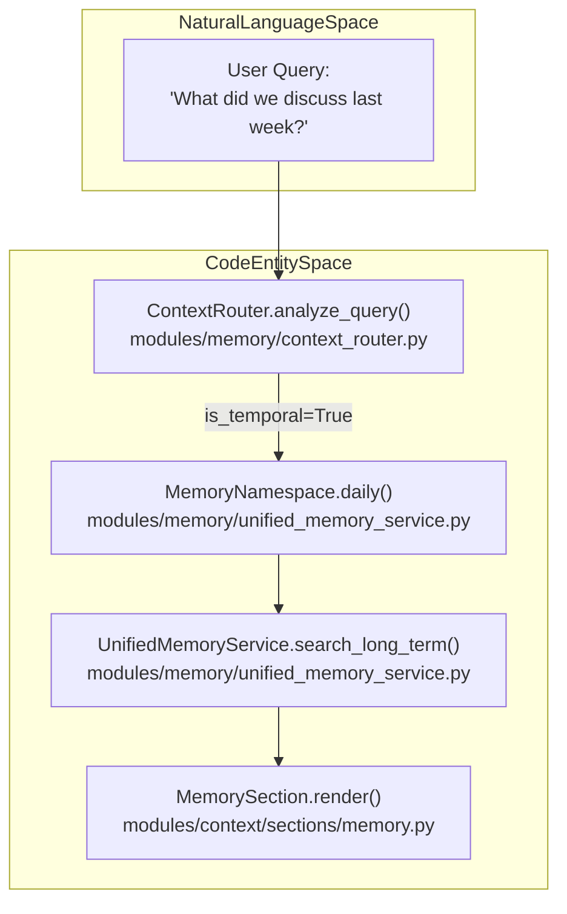
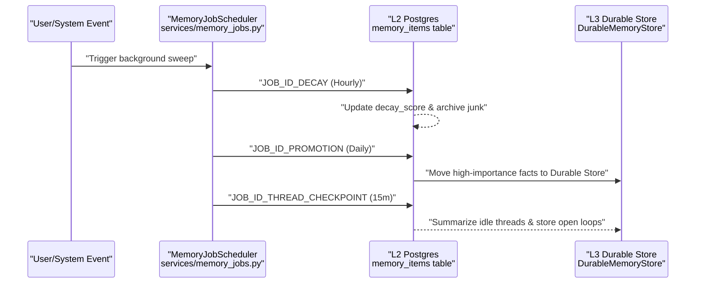

# Daily Logs & Temporal Memory

Relevant source files

The following files were used as context for generating this wiki page:

- [docs/PRDS/PRD-206-MEMORY-CONTINUITY-PERSONAL-CONTEXT.md](docs/PRDS/PRD-206-MEMORY-CONTINUITY-PERSONAL-CONTEXT.md)
- [docs/runbooks/S10-MEMORY-BASELINE-FREEZE.md](docs/runbooks/S10-MEMORY-BASELINE-FREEZE.md)
- [frontend/components/__tests__/prd205-auto-speaks.test.ts](frontend/components/__tests__/prd205-auto-speaks.test.ts)
- [orchestrator/alembic/versions/prd206_chat_summary.py](orchestrator/alembic/versions/prd206_chat_summary.py)
- [orchestrator/consumers/chatbot/integration.py](orchestrator/consumers/chatbot/integration.py)
- [orchestrator/consumers/chatbot/smart_memory.py](orchestrator/consumers/chatbot/smart_memory.py)
- [orchestrator/consumers/chatbot/smart_orchestrator.py](orchestrator/consumers/chatbot/smart_orchestrator.py)
- [orchestrator/evals/graphiti_vs_baseline.py](orchestrator/evals/graphiti_vs_baseline.py)
- [orchestrator/modules/context/sections/memory.py](orchestrator/modules/context/sections/memory.py)
- [orchestrator/modules/memory/context_router.py](orchestrator/modules/memory/context_router.py)
- [orchestrator/modules/memory/recall_ranking.py](orchestrator/modules/memory/recall_ranking.py)
- [orchestrator/modules/memory/thread_checkpoint.py](orchestrator/modules/memory/thread_checkpoint.py)
- [orchestrator/modules/memory/unified_memory_service.py](orchestrator/modules/memory/unified_memory_service.py)
- [orchestrator/modules/tools/discovery/handlers_search.py](orchestrator/modules/tools/discovery/handlers_search.py)
- [orchestrator/services/memory_archival_job.py](orchestrator/services/memory_archival_job.py)
- [orchestrator/services/memory_jobs.py](orchestrator/services/memory_jobs.py)
- [orchestrator/tests/test_l3_distill_input.py](orchestrator/tests/test_l3_distill_input.py)
- [orchestrator/tests/test_memory_restart_and_isolation.py](orchestrator/tests/test_memory_restart_and_isolation.py)
- [orchestrator/tests/test_memory_single_write_path.py](orchestrator/tests/test_memory_single_write_path.py)
- [orchestrator/tests/test_memory_stored_sse.py](orchestrator/tests/test_memory_stored_sse.py)
- [orchestrator/tests/test_p2w1_semantic_l2_recall.py](orchestrator/tests/test_p2w1_semantic_l2_recall.py)
- [orchestrator/tests/test_prd197_substrate.py](orchestrator/tests/test_prd197_substrate.py)
- [orchestrator/tests/test_prd198_graphiti_gate.py](orchestrator/tests/test_prd198_graphiti_gate.py)
- [orchestrator/tests/test_prd205_auto_speaks.py](orchestrator/tests/test_prd205_auto_speaks.py)
- [orchestrator/tests/test_prd206_recall_ranking.py](orchestrator/tests/test_prd206_recall_ranking.py)
- [orchestrator/tests/test_prd206_thread_checkpoint.py](orchestrator/tests/test_prd206_thread_checkpoint.py)
- [orchestrator/tests/test_recall_relevance_floor.py](orchestrator/tests/test_recall_relevance_floor.py)
- [orchestrator/tests/test_smart_orchestrator_store_exchange.py](orchestrator/tests/test_smart_orchestrator_store_exchange.py)
- [orchestrator/tests/test_unified_memory.py](orchestrator/tests/test_unified_memory.py)
- [orchestrator/tests/test_us011_context_budgets.py](orchestrator/tests/test_us011_context_budgets.py)

## Purpose and Scope

Daily logs provide time-indexed activity tracking for workspaces, enabling agents to answer temporal queries like "what did we work on earlier today?" or "what happened yesterday?". The system maintains a structured journal of activities extracted from chat exchanges and heartbeat executions, stored across the multi-tier memory architecture.

Daily logs primarily occupy **L2 (Short-term/Postgres)** and **L3 (Long-term/Durable)** memory tiers. For the overall memory architecture, see [Memory System](). For the unified service managing these operations, see [UnifiedMemoryService]().

Sources: [orchestrator/modules/memory/unified_memory_service.py:1-21](), [orchestrator/services/memory_jobs.py:1-22]()

---

## Architecture Overview

The system utilizes a combination of real-time extraction during chat turns and background consolidation jobs to maintain temporal awareness, bridging natural language queries to underlying code execution components.

**Natural Language to Code Space: Temporal Retrieval Architecture**

Sources: [orchestrator/modules/memory/context_router.py:1-24](), [orchestrator/modules/memory/unified_memory_service.py:38-79](), [orchestrator/modules/context/sections/memory.py:32-69]()

---

## Dual-Tier Storage Strategy

Daily logs are mirrored across tiers to balance fast temporal lookups with long-term semantic retrieval.

| Tier | Technology | Purpose | Retention |
|------|------------|---------|-----------|
| **L2** | PostgreSQL (`memory_items`) | Verbatim transcripts and episodic logs. | Ebbinghaus decay (default 0.3 threshold) [orchestrator/services/memory_jobs.py:11-13]() |
| **L3** | Qdrant (Durable Store) | Distilled daily facts and summaries. | Long-term via `MemoryNamespace.daily()` [orchestrator/modules/memory/unified_memory_service.py:72-74]() |

### Memory Namespacing
All daily logs are scoped using the `MemoryNamespace` utility to prevent cross-workspace leaks.
- **Daily Logs (L2):** `mem:{workspace_id}:daily` [orchestrator/modules/memory/unified_memory_service.py:72-74]()
- **L2 Mirror (L3):** `mem:{workspace_id}:l2` [orchestrator/modules/memory/unified_memory_service.py:76-78]()

Sources: [orchestrator/modules/memory/unified_memory_service.py:38-79](), [orchestrator/services/memory_jobs.py:1-22]()

---

## Retrieval & Temporal Awareness

The `ContextRouter` is the primary mechanism for detecting when an agent needs temporal information.

### Signal Detection
The router uses `_TEMPORAL_PATTERNS` (compiled regex) to detect keywords like "yesterday", "last week", or "recently" [orchestrator/modules/memory/context_router.py:107-126](). If `is_temporal` is flagged, the system prioritizes fetching daily logs and time-indexed memories.

### Retrieval Flow
1. **ContextRouter** analyzes the query for temporal signals [orchestrator/modules/memory/context_router.py:1-24]().
2. **MemorySection** (Priority 6) calls `retrieve_context()` [orchestrator/modules/context/sections/memory.py:120-125]().
3. The system fetches daily logs, applying a specific budget weight (8% of the usable window) [orchestrator/modules/memory/context_router.py:46-55]().

Sources: [orchestrator/modules/memory/context_router.py:107-175](), [orchestrator/modules/context/sections/memory.py:103-140]()

---

## Memory Lifecycle & Cleanup Jobs

The `MemoryJobScheduler` manages the aging and promotion of temporal data to ensure the system doesn't become cluttered with irrelevant episodic details.

### Background Jobs
- **Decay Scoring (Hourly):** Applies Ebbinghaus retention scoring to L2 rows. Items falling below the threshold are archived [orchestrator/services/memory_jobs.py:11-13]().
- **L2→L3 Promotion (Daily):** Promotes important L2 items (transcripts) to L3 durable storage based on an importance policy [orchestrator/services/memory_jobs.py:15-18]().
- **Thread Checkpoint (Every 15m):** Summarizes recently idle chat threads and moves open loops into L3 [orchestrator/services/memory_jobs.py:160-167]().

**Natural Language to Code Space: Memory Maintenance Execution**

Sources: [orchestrator/services/memory_jobs.py:32-173]()

---

## Distillation vs. Verbatim Storage

When a chat turn occurs, the `SmartMemoryManager` performs a dual-write:

1.  **Distillation:** The `_distill_durable_facts` method uses a cheap LLM (`MEMORY_DISTILL_MODEL`) to extract typed facts (e.g., `user_fact`, `procedure`) from the exchange. These are stored in **L3** [orchestrator/consumers/chatbot/smart_memory.py:26-36]().
2.  **Transcript:** The verbatim exchange is stored via `store_transcript` in **L2** for immediate temporal recall [orchestrator/tests/test_l3_distill_input.py:107-109]().

Sources: [orchestrator/consumers/chatbot/smart_memory.py:26-137]()

---

## Code Entity Reference

| Entity | Location | Purpose |
|--------|----------|---------|
| `MemoryNamespace` | [orchestrator/modules/memory/unified_memory_service.py:39-46]() | Scopes memory keys for workspaces and agents. |
| `ContextRouter` | [orchestrator/modules/memory/context_router.py:83-101]() | Detects temporal signals in user queries. |
| `MemoryJobScheduler` | [orchestrator/services/memory_jobs.py:32-43]() | Manages decay, promotion, and consolidation jobs. |
| `SmartMemoryManager` | [orchestrator/consumers/chatbot/smart_memory.py:63-74]() | Handles the real-time distillation and storage of chat facts. |
| `MemorySection` | [orchestrator/modules/context/sections/memory.py:32-46]() | System prompt injection wrapper for memories and daily logs. |

Sources: [orchestrator/modules/memory/unified_memory_service.py:39-46](), [orchestrator/modules/memory/context_router.py:83-101](), [orchestrator/services/memory_jobs.py:32-43](), [orchestrator/consumers/chatbot/smart_memory.py:63-74](), [orchestrator/modules/context/sections/memory.py:32-46]()

---