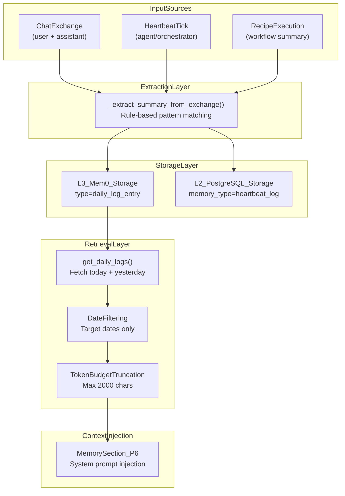
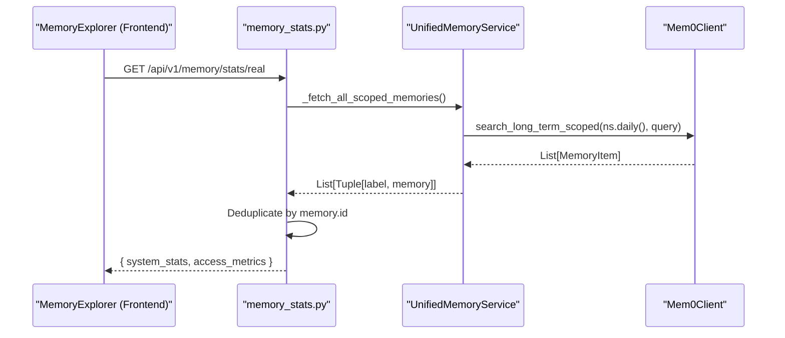

# Daily Logs & Temporal Memory

<details>
<summary>Relevant source files</summary>

The following files were used as context for generating this wiki page:

- [docs/PRDS/55-AUTONOMOUS-ASSISTANT-PLATFORM.md](docs/PRDS/55-AUTONOMOUS-ASSISTANT-PLATFORM.md)
- [frontend/components/activity/activity-memory.tsx](frontend/components/activity/activity-memory.tsx)
- [frontend/components/activity/memory-card.tsx](frontend/components/activity/memory-card.tsx)
- [frontend/components/activity/memory/health-banner.tsx](frontend/components/activity/memory/health-banner.tsx)
- [frontend/components/activity/memory/index.ts](frontend/components/activity/memory/index.ts)
- [frontend/components/activity/memory/memory-sidebar.tsx](frontend/components/activity/memory/memory-sidebar.tsx)
- [frontend/components/activity/memory/memory-viewer.tsx](frontend/components/activity/memory/memory-viewer.tsx)
- [frontend/components/activity/projects/index.ts](frontend/components/activity/projects/index.ts)
- [frontend/components/activity/projects/project-card.tsx](frontend/components/activity/projects/project-card.tsx)
- [frontend/components/auth/sign-up-form.tsx](frontend/components/auth/sign-up-form.tsx)
- [frontend/components/shared/global-search.tsx](frontend/components/shared/global-search.tsx)
- [frontend/hooks/use-global-search.ts](frontend/hooks/use-global-search.ts)
- [frontend/hooks/use-memory-explorer-api.ts](frontend/hooks/use-memory-explorer-api.ts)
- [orchestrator/alembic/versions/20260215_add_heartbeat_and_channels.py](orchestrator/alembic/versions/20260215_add_heartbeat_and_channels.py)
- [orchestrator/api/channels.py](orchestrator/api/channels.py)
- [orchestrator/api/heartbeat.py](orchestrator/api/heartbeat.py)
- [orchestrator/api/memory_stats.py](orchestrator/api/memory_stats.py)
- [orchestrator/api/widget_memory.py](orchestrator/api/widget_memory.py)
- [orchestrator/channels/base.py](orchestrator/channels/base.py)
- [orchestrator/channels/discord_adapter.py](orchestrator/channels/discord_adapter.py)
- [orchestrator/channels/google_chat_adapter.py](orchestrator/channels/google_chat_adapter.py)
- [orchestrator/channels/line_adapter.py](orchestrator/channels/line_adapter.py)
- [orchestrator/channels/manager.py](orchestrator/channels/manager.py)
- [orchestrator/channels/slack_adapter.py](orchestrator/channels/slack_adapter.py)
- [orchestrator/consumers/chatbot/smart_memory.py](orchestrator/consumers/chatbot/smart_memory.py)
- [orchestrator/core/models/channels.py](orchestrator/core/models/channels.py)
- [orchestrator/core/services/plugin_security_scanner.py](orchestrator/core/services/plugin_security_scanner.py)
- [orchestrator/modules/agents/__init__.py](orchestrator/modules/agents/__init__.py)
- [orchestrator/modules/agents/factory/__init__.py](orchestrator/modules/agents/factory/__init__.py)
- [orchestrator/modules/memory/integrations/mem0_client.py](orchestrator/modules/memory/integrations/mem0_client.py)

</details>


## Purpose and Scope

This page documents the daily log system that provides time-indexed activity tracking for workspaces. Daily logs enable agents to answer temporal queries like "what did we work on earlier today?" or "what happened yesterday?" by maintaining a structured journal of activities extracted from chat exchanges, heartbeat ticks, and workflow executions.

Daily logs are stored in both L3 (Mem0 long-term) and L2 (PostgreSQL short-term) memory tiers as part of the 5-layer memory architecture. For the overall memory architecture, see [Memory System](). For the unified service that manages storage, see [UnifiedMemoryService]().

---

## Architecture Overview

The system uses rule-based extraction to generate concise summaries, stores them in both L3 and L2 for redundancy and performance, and retrieves them with date filtering and token budget management.

**Daily Log Pipeline Architecture**


Sources: [orchestrator/consumers/chatbot/smart_memory.py:51-60](), [orchestrator/api/memory_stats.py:72-101]()

---

## Dual-Tier Storage Strategy

Daily logs are stored in **two memory tiers** to balance durability with retrieval performance:

| Tier | Technology | Purpose | Retention | Query Pattern |
|------|------------|---------|-----------|---------------|
| **L3** | Mem0 (OpenMemory) | Long-term semantic storage | Configurable (7d default) | Semantic search by date metadata |
| **L2** | PostgreSQL `memory_items` | Fast temporal queries | Ebbinghaus decay | SQL WHERE date range |

### L3 Mem0 Storage

Daily logs are stored in Mem0 with structured metadata. The `Mem0Client` handles the actual transmission to the OpenMemory server, which processes extraction and vector storage.

```python
# Payload structure for Mem0 storage
payload: Dict[str, Any] = {
    "text": text,           # Extracted summary string
    "user_id": user_id,     # Format: mem:ws_{workspace_id}:daily_logs
}
if metadata:
    payload["metadata"] = metadata # Includes type="daily_log_entry"
```
Sources: [orchestrator/modules/memory/integrations/mem0_client.py:143-176](), [orchestrator/api/memory_stats.py:78-81]()

### L2 PostgreSQL Storage

The system tracks memories in a local `memory_items` table as a secondary source. This table provides the foundation for the "Real Memory Stats" dashboard.

```python
# Querying local DB stats for the dashboard
ws_filter = MemoryItem.workspace_id == ctx.workspace_id
local_total = db.query(func.count(MemoryItem.id)).filter(ws_filter).scalar() or 0
```
Sources: [orchestrator/api/memory_stats.py:142-144](), [orchestrator/api/memory_stats.py:149-157]()

---

## Entry Format and Structure

### Timestamped Summary Format

Each daily log entry follows this format:
`[HH:MM] Discussed: <topic>. Tools: <TOOL1, TOOL2>. Actions: <action1; action2>`

### Extraction Logic

The `SmartMemoryManager` classifies messages to determine if they contain personal facts, tool usage, or general preferences to guide storage scoping.

| Logic Category | Keywords (Partial List) | Target Tier |
|-----------|----------------|---------|
| **Tool/Workflow** | slack, github, jira, database, sql | `agent` |
| **Personal Facts** | my name, i work at, i live, founder | `global` |
| **Preferences** | prefer, favorite, my style, i want | `both` |

Sources: [orchestrator/consumers/chatbot/smart_memory.py:102-130](), [orchestrator/consumers/chatbot/smart_memory.py:144-157]()

---

## Retrieval and Analytics

### Temporal Retrieval Pipeline

The system fetches memories from all scopes (workspace, agent, and daily logs) and deduplicates them by ID.

**Memory Retrieval Flow**


Sources: [orchestrator/api/memory_stats.py:66-118](), [orchestrator/api/memory_stats.py:121-140]()

### Memory Health and Hit Rates

The platform monitors the effectiveness of temporal retrieval by tracking "hits" in the `memory_access_log`. A hit is recorded when a semantic search for context successfully returns relevant results.

```python
# Hit rate calculation from access logs
access_stats = db.execute(
    text("""
        SELECT
            COUNT(*) as total_searches,
            SUM(CASE WHEN had_results THEN 1 ELSE 0 END) as hits
        FROM memory_access_log
        WHERE workspace_id = :ws_id
    """),
    {"ws_id": str(ctx.workspace_id)},
).fetchone()
```
Sources: [orchestrator/api/memory_stats.py:171-180](), [frontend/hooks/use-memory-explorer-api.ts:36-40]()

---

## Management & Cleanup

### Frontend Explorer

Users can manage temporal and semantic memories through the Memory Explorer UI. This allows for manual deletion and consolidation of daily log entries.

*   **Browse/Search:** `useMemoryBrowse` hook provides access to `GET /api/v1/memory/browse`.
*   **Consolidation:** `useConsolidateMemories` allows merging multiple entries using 'merge' or 'summarise' strategies.
*   **Deletion:** `useDeleteMemory` removes entries from the system permanently.

Sources: [frontend/hooks/use-memory-explorer-api.ts:88-102](), [frontend/hooks/use-memory-explorer-api.ts:156-177](), [frontend/components/activity/activity-memory.tsx:84-97]()

### Circuit Breaker Protection

The `Mem0Client` includes a circuit breaker to ensure that failures in the external memory service (OpenMemory/Mem0) do not stall the orchestrator.

*   **Failure Threshold:** 5 consecutive failures opens the circuit.
*   **Cooldown:** 60 seconds before a probe request is allowed.
*   **Timeout:** 15 seconds per request to allow for LLM fact extraction.

Sources: [orchestrator/modules/memory/integrations/mem0_client.py:21-23](), [orchestrator/modules/memory/integrations/mem0_client.py:27-59]()

---

## Code Entity Reference

| Entity | Location | Purpose |
|--------|----------|---------|
| `SmartMemoryManager` | [orchestrator/consumers/chatbot/smart_memory.py:50-62]() | Manages intent-based memory classification and caching. |
| `Mem0Client` | [orchestrator/modules/memory/integrations/mem0_client.py:66-70]() | Wrapper for OpenMemory API with circuit breaker and retries. |
| `MemoryItem` | [orchestrator/api/memory_stats.py:19]() | SQLAlchemy model for local L2 memory storage. |
| `_fetch_all_scoped_memories` | [orchestrator/api/memory_stats.py:66-72]() | Aggregates memories from global, agent, and daily scopes. |
| `useMemoryBrowse` | [frontend/hooks/use-memory-explorer-api.ts:88]() | React Query hook for the memory explorer interface. |

Sources: [orchestrator/consumers/chatbot/smart_memory.py](), [orchestrator/modules/memory/integrations/mem0_client.py](), [orchestrator/api/memory_stats.py](), [frontend/hooks/use-memory-explorer-api.ts]()

---