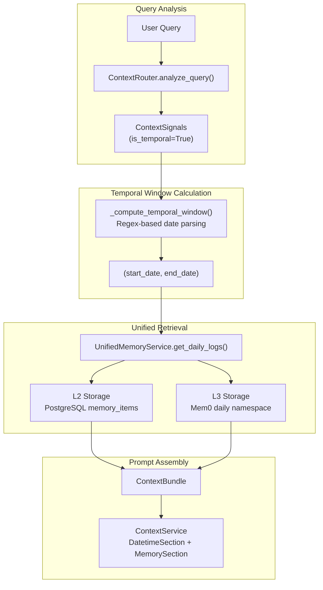
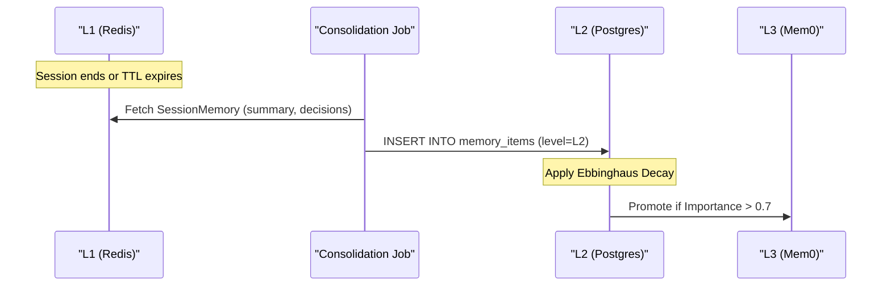

# Daily Logs & Temporal Memory

<details>
<summary>Relevant source files</summary>

The following files were used as context for generating this wiki page:

- [frontend/tsconfig.tsbuildinfo](frontend/tsconfig.tsbuildinfo)
- [orchestrator/config.py](orchestrator/config.py)
- [orchestrator/main.py](orchestrator/main.py)
- [orchestrator/modules/memory/context_router.py](orchestrator/modules/memory/context_router.py)
- [orchestrator/modules/memory/unified_memory_service.py](orchestrator/modules/memory/unified_memory_service.py)
- [orchestrator/tests/test_unified_memory.py](orchestrator/tests/test_unified_memory.py)
- [scripts/ralph/IMPLEMENTATION_PLAN.md](scripts/ralph/IMPLEMENTATION_PLAN.md)
- [scripts/ralph/prd.json](scripts/ralph/prd.json)
- [scripts/ralph/progress.txt](scripts/ralph/progress.txt)

</details>


## Purpose and Scope

Daily logs provide time-indexed activity tracking for workspaces, enabling agents to answer temporal queries such as "what did we work on earlier today?" or "what happened last week?". This system maintains a structured journal of activities extracted from chat exchanges, heartbeat ticks, and workflow executions. It bridges the gap between raw conversation history and semantic facts by providing a chronological narrative of workspace progress.

Daily logs are primarily managed by the `UnifiedMemoryService` [orchestrator/modules/memory/unified_memory_service.py:154-161]() and are categorized as part of the L2 (Short-term/Postgres) and L3 (Long-term/Mem0) memory tiers.

---

## Architecture Overview

The temporal memory system uses the `ContextRouter` [orchestrator/modules/memory/context_router.py:2-12]() to detect time-based signals in user queries and the `UnifiedMemoryService` to manage the storage and retrieval of these logs across tiered storage.

**Daily Log & Temporal Retrieval Flow**


Sources: [orchestrator/modules/memory/context_router.py:5-24](), [orchestrator/modules/memory/unified_memory_service.py:38-46]()

---

## Data Model & Namespacing

The system enforces strict namespacing to isolate temporal logs from general semantic memories. The `MemoryNamespace` class provides standardized user ID strings for Mem0 and Redis keys to prevent data leakage between workspaces and memory types [orchestrator/modules/memory/unified_memory_service.py:38-48]().

### Temporal Namespaces
*   **Daily Logs**: `mem:{workspace_id}:daily` [orchestrator/modules/memory/unified_memory_service.py:72-74]()
*   **Session Cache**: `mem:session:{workspace_id}:{conversation_id}` [orchestrator/modules/memory/unified_memory_service.py:78-80]()

### Storage Tiers

| Tier | Logic | Code Entity |
| :--- | :--- | :--- |
| **L1 (Working)** | Ephemeral session state (24h TTL) | `SessionMemory` [orchestrator/modules/memory/unified_memory_service.py:123-130]() |
| **L2 (Short-term)** | Time-decayed logs in Postgres | `UnifiedMemoryService.search_short_term` |
| **L3 (Long-term)** | Permanent daily summaries in Mem0 | `UnifiedMemoryService.search_long_term` |

Sources: [orchestrator/modules/memory/unified_memory_service.py:8-13](), [orchestrator/modules/memory/unified_memory_service.py:84-87]()

---

## Signal Detection & Temporal Windows

The `ContextRouter` uses a series of compiled regex patterns to identify when a user is asking about past events. 

### Temporal Patterns
The system recognizes relative time references like "yesterday", "last week", "a few days ago", and "recently" [orchestrator/modules/memory/context_router.py:85-105]().

### Window Calculation
The `_compute_temporal_window` function converts these relative strings into absolute `datetime` ranges [orchestrator/modules/memory/context_router.py:177-186](). For example:
*   **"yesterday"**: Generates a window from `now - 1 day` at 00:00 to `now` at 00:00 [orchestrator/modules/memory/context_router.py:189-192]().
*   **"last week"**: Generates a 7-day window ending at the start of the current day [orchestrator/modules/memory/context_router.py:202-205]().

Sources: [orchestrator/modules/memory/context_router.py:85-105](), [orchestrator/modules/memory/context_router.py:177-205]()

---

## Daily Log Consolidation

Daily logs are not just raw chat logs; they are consolidated summaries. This process is governed by the `UnifiedMemoryService` and scheduled background jobs.

**Memory Lifecycle: L1 to L2 Consolidation**


Sources: [orchestrator/modules/memory/unified_memory_service.py:123-137](), [orchestrator/config.py:98-107]()

### Configuration Parameters
The behavior of temporal memory is tuned via `config.py`:
*   **`MEMORY_SESSION_TTL_SECONDS`**: 86,400s (24 hours) for active session memory [orchestrator/config.py:85]().
*   **`MEMORY_DECAY_RATE`**: 0.1 (Ebbinghaus forgetting curve speed) [orchestrator/config.py:99]().
*   **`CONTEXT_BUDGET_TEMPORAL`**: 600 tokens allocated specifically for temporal results in the context window [orchestrator/config.py:93]().

---

## Implementation Details

### Session Memory Structure
The `SessionMemory` class tracks the current state of a conversation before it is archived into daily logs [orchestrator/modules/memory/unified_memory_service.py:123-137]().

```python
@dataclass
class SessionMemory:
    summary: str = ""
    decisions: List[str] = field(default_factory=list)
    action_items: List[str] = field(default_factory=list)
    exchange_count: int = 0
    ended: bool = False
```
Sources: [orchestrator/modules/memory/unified_memory_service.py:132-137]()

### UnifiedMemoryService Singleton
The service maintains a shared `Mem0Client` and a Redis client getter to ensure consistent memory access across the application [orchestrator/modules/memory/unified_memory_service.py:154-188](). It provides methods like `store_long_term` and `search_long_term` which automatically handle the namespacing for daily logs [orchestrator/modules/memory/unified_memory_service.py:18-20]().

---

## Maintenance & Cleanup

The system includes background jobs for memory health:
1.  **Decay Job**: Periodically reduces the "importance" score of L2 memories. Items falling below `MEMORY_DECAY_ARCHIVE_THRESHOLD` (default 0.3) are archived [orchestrator/config.py:99-101]().
2.  **Promotion Job**: Memories with high access counts or importance scores are promoted from L2 to L3 [orchestrator/config.py:104-107]().
3.  **Archival Job**: A monthly job (PRD-131d) that folds aged L2/L3 memories into the workspace knowledge graph [orchestrator/config.py:116-123]().

Sources: [orchestrator/config.py:98-123](), [orchestrator/modules/memory/unified_memory_service.py:8-13]()

---