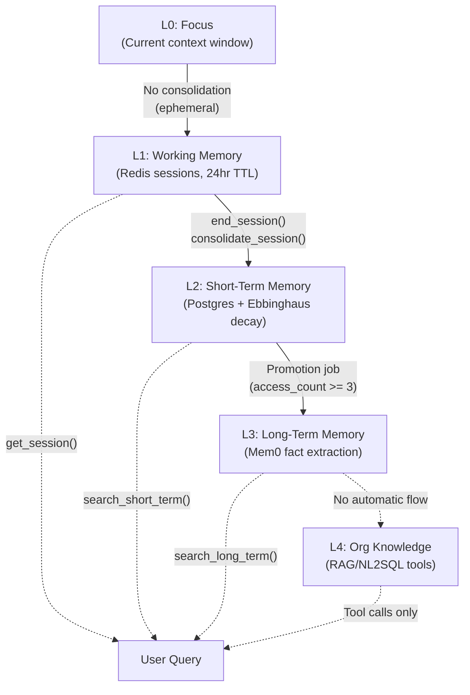
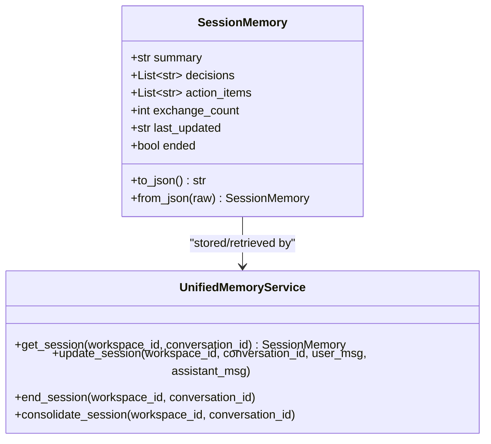
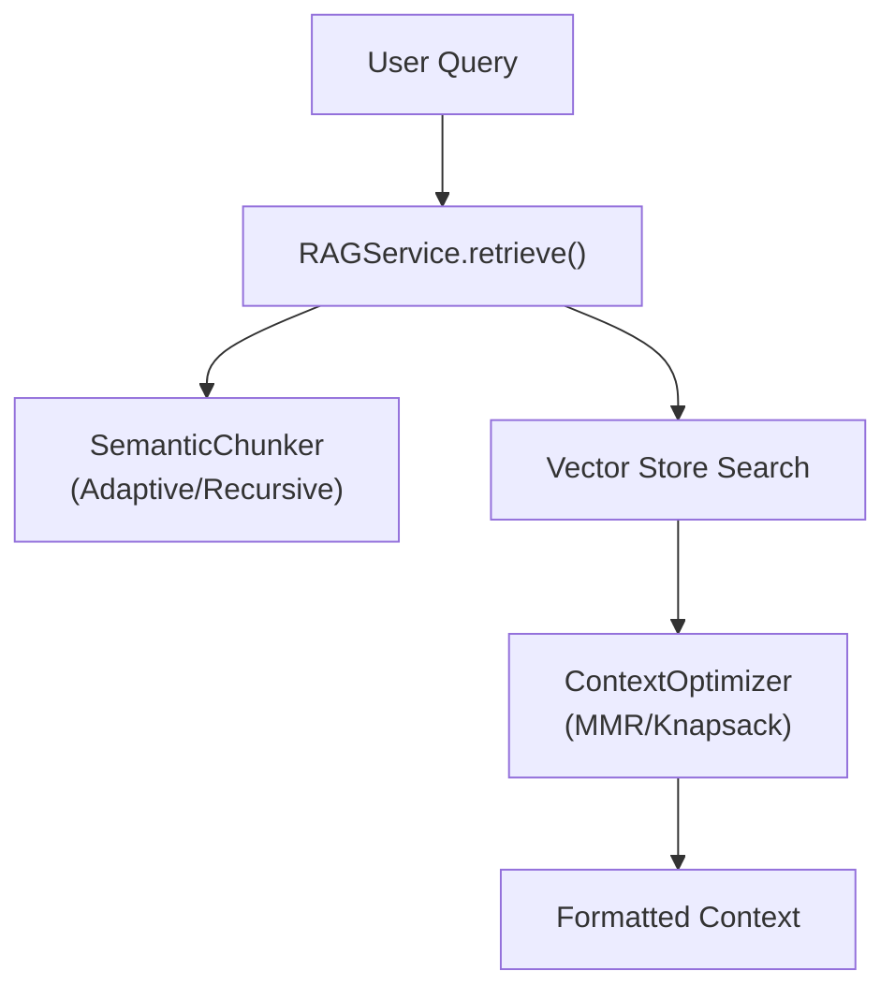

# Five-Layer Memory Architecture

<details>
<summary>Relevant source files</summary>

The following files were used as context for generating this wiki page:

- [docs/PRDS/39-MEM0-MIGRATION-PRD.md](docs/PRDS/39-MEM0-MIGRATION-PRD.md)
- [orchestrator/alembic/versions/prd123_checkpoint_count.py](orchestrator/alembic/versions/prd123_checkpoint_count.py)
- [orchestrator/api/missions.py](orchestrator/api/missions.py)
- [orchestrator/config.py](orchestrator/config.py)
- [orchestrator/core/context_guard.py](orchestrator/core/context_guard.py)
- [orchestrator/core/models/orchestration.py](orchestrator/core/models/orchestration.py)
- [orchestrator/core/models/orchestration_enums.py](orchestrator/core/models/orchestration_enums.py)
- [orchestrator/main.py](orchestrator/main.py)
- [orchestrator/mem0_openapi.json](orchestrator/mem0_openapi.json)
- [orchestrator/modules/coordination/dispatcher.py](orchestrator/modules/coordination/dispatcher.py)
- [orchestrator/modules/coordination/planner.py](orchestrator/modules/coordination/planner.py)
- [orchestrator/modules/coordination/reconciler.py](orchestrator/modules/coordination/reconciler.py)
- [orchestrator/modules/memory/context_router.py](orchestrator/modules/memory/context_router.py)
- [orchestrator/modules/memory/integrations/__init__.py](orchestrator/modules/memory/integrations/__init__.py)
- [orchestrator/modules/memory/operations/__init__.py](orchestrator/modules/memory/operations/__init__.py)
- [orchestrator/modules/memory/storage/knowledge_system.py](orchestrator/modules/memory/storage/knowledge_system.py)
- [orchestrator/modules/memory/tests/conftest.py](orchestrator/modules/memory/tests/conftest.py)
- [orchestrator/modules/memory/tests/test_hierarchical_memory.py](orchestrator/modules/memory/tests/test_hierarchical_memory.py)
- [orchestrator/modules/memory/unified_memory_service.py](orchestrator/modules/memory/unified_memory_service.py)
- [orchestrator/modules/nl2sql/tests/test_validator.py](orchestrator/modules/nl2sql/tests/test_validator.py)
- [orchestrator/modules/tools/discovery/action_registry.py](orchestrator/modules/tools/discovery/action_registry.py)
- [orchestrator/modules/tools/execution/concurrency.py](orchestrator/modules/tools/execution/concurrency.py)
- [orchestrator/services/checkpoint_service.py](orchestrator/services/checkpoint_service.py)
- [orchestrator/services/coordinator_service.py](orchestrator/services/coordinator_service.py)
- [orchestrator/services/orchestration_state.py](orchestrator/services/orchestration_state.py)
- [orchestrator/tests/test_budget_gate.py](orchestrator/tests/test_budget_gate.py)
- [orchestrator/tests/test_dispatcher_parallel.py](orchestrator/tests/test_dispatcher_parallel.py)
- [orchestrator/tests/test_unified_memory.py](orchestrator/tests/test_unified_memory.py)
- [scripts/ralph/IMPLEMENTATION_PLAN.md](scripts/ralph/IMPLEMENTATION_PLAN.md)
- [scripts/ralph/progress.txt](scripts/ralph/progress.txt)

</details>


This page documents the hierarchical memory system in Automatos AI, which organizes agent memory into five layers (L0–L4) ranging from immediate focus to organizational knowledge. The architecture enables intelligent context retrieval, automatic consolidation between layers, and workspace-scoped isolation.

**Related pages:** For memory integration in the chat system, see **9.5 Memory Integration**. For signal-based retrieval logic, see **3.3 Context Router**. For background jobs managing memory lifecycle, see **3.4 Memory Lifecycle & Consolidation**.

---

## Overview: The Five Layers

The memory system is organized as a hierarchy where each layer serves a specific retention window and access pattern:

### Memory Hierarchy Flow
Title: Memory Consolidation and Promotion Flow

Sources: [orchestrator/modules/memory/unified_memory_service.py:8-21](), [orchestrator/config.py:106-111]()

| Layer | Storage Backend | Retention | Access Pattern | Key Entity |
|-------|----------------|-----------|----------------|------------|
| **L0** | LLM context window | Current conversation only | Direct (no API) | `messages` list |
| **L1** | Redis | 24 hours (active)<br/>1 hour (after end) | `get_session()` | `SessionMemory` |
| **L2** | PostgreSQL (`memory_short_term`) | Decays via Ebbinghaus formula | `search_short_term()` | `MemoryShortTerm` model |
| **L3** | Mem0 service | Indefinite (fact-extracted) | `search_long_term()` | `Mem0Client` |
| **L4** | Vector DB + NL2SQL | Indefinite (org data) | `search_knowledge` tool | `RAGService` |

Sources: [orchestrator/config.py:82-118](), [orchestrator/modules/memory/unified_memory_service.py:8-14]()

---

## L0: Focus (Context Window)

**Definition:** The immediate conversation context passed directly to the LLM. No persistent storage — ephemeral within a single request.

**Implementation:** Managed by `ContextService` message assembly. The `messages` parameter to `build_context()` becomes the conversation history fed to the LLM.

**Code Entities:**
- `ContextService.build_context(messages=...)` — assembles L0 context.
- `ContextResult.messages` — final message array for LLM.

**No API methods** — L0 is implicitly created by the caller constructing the messages list.

---

## L1: Working Memory (Redis Sessions)

**Definition:** Short-lived session state stored in Redis per conversation, persisting across multiple turns within a 24-hour window. After `end_session()` is called, the session remains cached for 1 hour to allow consolidation.

### SessionMemory Dataclass
Title: L1 Session Memory and Service Interface

Sources: [orchestrator/modules/memory/unified_memory_service.py:123-149]()

### Redis Key Format

Sessions use the namespace pattern `mem:session:{workspace_id}:{conversation_id}` via `MemoryNamespace`.

**Code:**
```python
# From MemoryNamespace.session()
def session(self, conversation_id: str) -> str:
    return f"mem:session:{self.workspace_id}:{conversation_id}"
```
Sources: [orchestrator/modules/memory/unified_memory_service.py:78-80]()

### TTL Configuration

| State | TTL Constant | Default Value |
|-------|--------------|---------------|
| Active session | `MEMORY_SESSION_TTL_SECONDS` | 86400 (24 hours) |
| Ended session (consolidation window) | `MEMORY_SESSION_CONSOLIDATION_TTL_SECONDS` | 3600 (1 hour) |

Sources: [orchestrator/config.py:84-87]()

---

## L2: Short-Term Memory (PostgreSQL)

**Definition:** Recent memories stored in the `memory_short_term` table with an Ebbinghaus decay-based retention score. Items gradually lose relevance over time unless accessed frequently.

### Database Schema & Content Types

**Content Types:**
- `exchange` — user-assistant chat turns (from L1 consolidation).
- `recipe_summary` — workflow execution summaries.
- `heartbeat_log` — orchestrator proactive tick logs.
- `tool_result` — significant tool execution outputs.
- `session_decision` — decisions from L1 sessions.

Sources: [orchestrator/modules/memory/unified_memory_service.py:12-13]()

### Ebbinghaus Decay Formula

The decay score is calculated based on the `MEMORY_DECAY_RATE` (default 0.1) and `importance` score. Items with a score below `MEMORY_DECAY_ARCHIVE_THRESHOLD` (default 0.3) are archived.

Sources: [orchestrator/config.py:100-106]()

---

## L3: Long-Term Memory (Mem0)

**Definition:** Persistent, fact-extracted memories stored in the external Mem0 service. Optimized for semantic search and long-term retention.

### Mem0Client Wrapper

The `UnifiedMemoryService` holds a single shared `Mem0Client` instance which handles communication with the Mem0 API.

```python
# From UnifiedMemoryService.__init__
from modules.memory.integrations.mem0_client import Mem0Client

self._mem0 = Mem0Client()
```
Sources: [orchestrator/modules/memory/unified_memory_service.py:177-182]()

### L3 Cache Layer (Redis)

L3 search results are cached in Redis for 5 minutes (configurable via `MEMORY_CACHE_TTL_SECONDS`) to avoid redundant Mem0 API calls.

Sources: [orchestrator/config.py:88-89](), [orchestrator/modules/memory/unified_memory_service.py:84-92]()

---

## L4: Organizational Knowledge (RAG/NL2SQL)

**Definition:** Organizational data sources (documents, databases) accessed via tool calls. L4 is **not pre-fetched** into context — the LLM must explicitly invoke tools to query it.

### RAG Service Architecture
Title: L4 RAG Retrieval Pipeline


### Available Tools

| Tool Name | Purpose | Backend |
|-----------|---------|---------|
| `search_knowledge` | Semantic search over uploaded documents | `RAGService` |
| `query_database` | Natural language queries to databases | NL2SQL service |
| `platform_search_memory` | Search across memory layers via tool | `ActionRegistry` promoted tool |

Sources: [scripts/ralph/progress.txt:73]()

---

## UnifiedMemoryService Architecture

`UnifiedMemoryService` is a singleton managing all memory layers (L1–L3). It holds one shared `Mem0Client`, one Redis client getter, and provides all memory APIs.

Title: UnifiedMemoryService Component Relationship

Sources: [orchestrator/modules/memory/unified_memory_service.py:154-188]()

---

## MemoryNamespace (Standardized user_id)

`MemoryNamespace` is a frozen dataclass that builds all Mem0/Redis keys using a single pattern to prevent data leaks.

### Namespace Methods

| Method | Pattern | Purpose |
|--------|---------|---------|
| `workspace()` | `mem:{ws_id}` | Workspace-wide facts [orchestrator/modules/memory/unified_memory_service.py:52-54]() |
| `agent(id)` | `mem:{ws_id}:agent:{id}` | Agent-specific facts [orchestrator/modules/memory/unified_memory_service.py:56-58]() |
| `session(id)` | `mem:session:{ws_id}:{id}` | L1 Redis session key [orchestrator/modules/memory/unified_memory_service.py:78-80]() |
| `daily()` | `mem:{ws_id}:daily` | Daily activity logs [orchestrator/modules/memory/unified_memory_service.py:72-74]() |

Sources: [orchestrator/modules/memory/unified_memory_service.py:38-117]()

---

## ContextRouter (Signal-Based Retrieval)

`ContextRouter` analyzes user queries using regex patterns to detect which memory layers should be fetched.

### Signal Detection

| Signal | Source Layer |
|--------|--------------|
| `is_temporal` | L2 Short-Term |
| `is_personal_fact` | L3 Long-Term |
| `is_knowledge` | L4 Knowledge |

Sources: [orchestrator/modules/memory/context_router.py:82-171]()

---

## Usage Examples

### Storing Long-Term Memory (L3)
```python
from modules.memory.unified_memory_service import get_unified_memory_service

service = get_unified_memory_service()
await service.store_long_term(
    workspace_id="ws-123",
    content="The user prefers Python for all coding tasks.",
    agent_id=42
)
```
Sources: [orchestrator/modules/memory/unified_memory_service.py:16-21]()

### Updating Session Memory (L1)
```python
from modules.memory.unified_memory_service import get_unified_memory_service

service = get_unified_memory_service()
await service.update_session(
    workspace_id="ws-123",
    conversation_id="conv-456",
    user_msg="Hello!",
    assistant_msg="Hi there! How can I help?"
)
```
Sources: [orchestrator/modules/memory/unified_memory_service.py:154-188]()

---