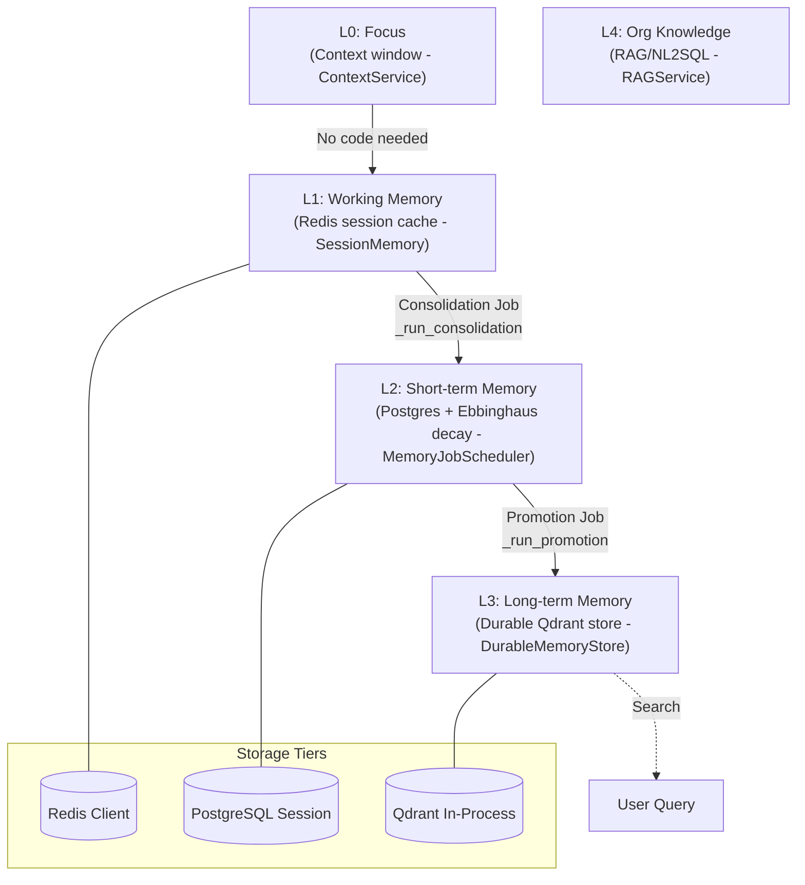
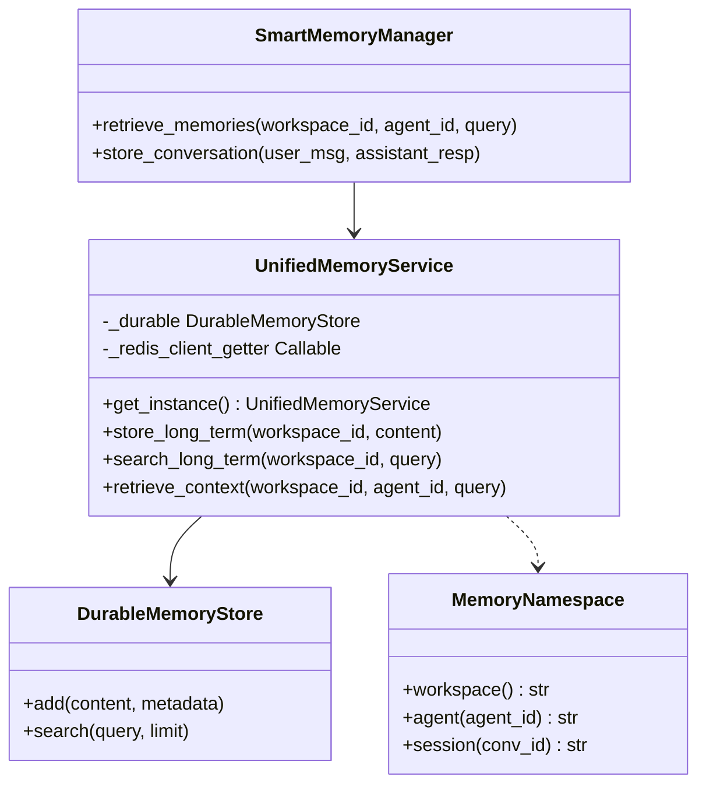
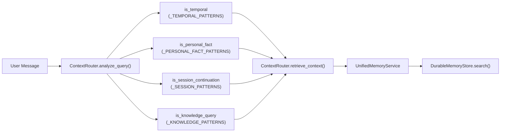

# Five-Layer Memory Architecture

Relevant source files

The following files were used as context for generating this wiki page:

- [orchestrator/alembic/versions/prd206_chat_summary.py](orchestrator/alembic/versions/prd206_chat_summary.py)
- [orchestrator/consumers/chatbot/integration.py](orchestrator/consumers/chatbot/integration.py)
- [orchestrator/consumers/chatbot/smart_memory.py](orchestrator/consumers/chatbot/smart_memory.py)
- [orchestrator/consumers/chatbot/smart_orchestrator.py](orchestrator/consumers/chatbot/smart_orchestrator.py)
- [orchestrator/modules/context/sections/memory.py](orchestrator/modules/context/sections/memory.py)
- [orchestrator/modules/memory/context_router.py](orchestrator/modules/memory/context_router.py)
- [orchestrator/modules/memory/recall_ranking.py](orchestrator/modules/memory/recall_ranking.py)
- [orchestrator/modules/memory/thread_checkpoint.py](orchestrator/modules/memory/thread_checkpoint.py)
- [orchestrator/modules/memory/unified_memory_service.py](orchestrator/modules/memory/unified_memory_service.py)
- [orchestrator/modules/tools/discovery/handlers_search.py](orchestrator/modules/tools/discovery/handlers_search.py)
- [orchestrator/services/memory_archival_job.py](orchestrator/services/memory_archival_job.py)
- [orchestrator/services/memory_jobs.py](orchestrator/services/memory_jobs.py)
- [orchestrator/tests/test_l3_distill_input.py](orchestrator/tests/test_l3_distill_input.py)
- [orchestrator/tests/test_memory_restart_and_isolation.py](orchestrator/tests/test_memory_restart_and_isolation.py)
- [orchestrator/tests/test_memory_single_write_path.py](orchestrator/tests/test_memory_single_write_path.py)
- [orchestrator/tests/test_memory_stored_sse.py](orchestrator/tests/test_memory_stored_sse.py)
- [orchestrator/tests/test_p2w1_semantic_l2_recall.py](orchestrator/tests/test_p2w1_semantic_l2_recall.py)
- [orchestrator/tests/test_prd197_substrate.py](orchestrator/tests/test_prd197_substrate.py)
- [orchestrator/tests/test_prd206_recall_ranking.py](orchestrator/tests/test_prd206_recall_ranking.py)
- [orchestrator/tests/test_prd206_thread_checkpoint.py](orchestrator/tests/test_prd206_thread_checkpoint.py)
- [orchestrator/tests/test_recall_relevance_floor.py](orchestrator/tests/test_recall_relevance_floor.py)
- [orchestrator/tests/test_smart_orchestrator_store_exchange.py](orchestrator/tests/test_smart_orchestrator_store_exchange.py)
- [orchestrator/tests/test_unified_memory.py](orchestrator/tests/test_unified_memory.py)
- [orchestrator/tests/test_us011_context_budgets.py](orchestrator/tests/test_us011_context_budgets.py)

This page documents the hierarchical memory system in Automatos AI, which organizes agent memory into five distinct layers (L0–L4) ranging from immediate conversational focus to durable organizational knowledge. The architecture coordinates context assembly, automated consolidation between tiers, and workspace-scoped isolation using `UnifiedMemoryService` and `MemoryNamespace`.

---

## Overview: The Five Layers

The memory system is structured as a multi-tier hierarchy where each layer balances retention duration, query latency, and distillation level. The `UnifiedMemoryService` class acts as the single entry point for all persistence and retrieval operations across these tiers.

### Memory Consolidation and Promotion Flow
Title: "Memory Consolidation and Promotion Flow"

Sources: [orchestrator/modules/memory/unified_memory_service.py:8-21](), [orchestrator/services/memory_jobs.py:6-22]()

| Layer | Storage Backend | Retention Window | Access Pattern / Class | Key Code Entity |
|-------|----------------|------------------|------------------------|-----------------|
| **L0** | LLM context window | Current request only | Direct injection | `ContextService` / `MemorySection` |
| **L1** | Redis | 24 hours | Session cache | `SessionMemory` |
| **L2** | PostgreSQL | Decays via Ebbinghaus | Semantic mirror | `MemoryItem` / `get_unified_memory_service()` |
| **L3** | Qdrant (Durable) | Indefinite (Distilled) | Namespace-scoped | `DurableMemoryStore` |
| **L4** | Vector DB / SQL | Indefinite (Documents) | Tool-based / RAG | `RAGService` |

Sources: [orchestrator/modules/memory/unified_memory_service.py:8-14](), [orchestrator/modules/memory/unified_memory_service.py:128-140](), [orchestrator/services/memory_jobs.py:11-19]()

---

## L0: Focus (Context Window)

**Definition:** The immediate conversation context passed directly to the LLM model. It is ephemeral and exists exclusively within the active request cycle.

**Implementation Details:** Managed by `ContextService` (Section 4). The `MemorySection` class [orchestrator/modules/context/sections/memory.py:32-51]() fetches and injects retrieved memories from lower tiers into this L0 window. It encapsulates `SmartMemoryManager.retrieve_memories()` [orchestrator/modules/context/sections/memory.py:35-39]() and the `ContextRouter` pipeline [orchestrator/modules/context/sections/memory.py:41-43]().

Sources: [orchestrator/modules/context/sections/memory.py:32-51]()

---

## L1: Working Memory (Redis)

**Definition:** Short-lived session state stored in Redis per conversation thread. It persists across browser refreshes within a 24-hour window to maintain immediate dialogue continuity.

### SessionMemory Dataclass
The `SessionMemory` dataclass maintains conversation summaries and exchange metrics before session consolidation [orchestrator/modules/memory/unified_memory_service.py:128-140](). It provides JSON serialization via `to_json()` and `from_json()` [orchestrator/modules/memory/unified_memory_service.py:141-155]().

### Redis Key Namespace
L1 sessions use `MemoryNamespace.session(conversation_id)` which generates the key pattern `mem:session:{workspace_id}:{conversation_id}` [orchestrator/modules/memory/unified_memory_service.py:82-84]().

Sources: [orchestrator/modules/memory/unified_memory_service.py:82-84](), [orchestrator/modules/memory/unified_memory_service.py:128-155]()

---

## L2: Short-Term Memory (PostgreSQL)

**Definition:** Verbatim conversation transcripts and temporal daily logs stored in PostgreSQL. This layer applies an Ebbinghaus retention scoring model.

### Ebbinghaus Decay & Background Jobs
The `MemoryJobScheduler` runs an hourly `_run_decay` task that calculates retention scores on L2 records [orchestrator/services/memory_jobs.py:77-85](). Records falling below `MEMORY_DECAY_ARCHIVE_THRESHOLD` (default `0.3`) are archived.

### Promotion (L2 → L3)
Important items are promoted daily via `_run_promotion` [orchestrator/services/memory_jobs.py:87-96](). The promotion policy evaluates high-signal types (`user_fact`, `preference`, `procedure`) based on importance thresholds [orchestrator/tests/test_unified_memory.py:50-53]().

Sources: [orchestrator/services/memory_jobs.py:77-96](), [orchestrator/tests/test_unified_memory.py:50-53]()

---

## L3: Long-Term Memory (Durable Qdrant)

**Definition:** Fact-extracted, durable memories stored in an in-process Qdrant vector store managed by `DurableMemoryStore`.

### Distillation Process
Unlike L2 (which stores verbatim text), L3 applies an LLM distillation step to extract typed facts from exchanges.
- **Taxonomy:** `user_fact`, `business_fact`, `preference`, `procedure`, `tool_outcome`, `task_learning`, `playbook_pattern`.
- **Exclusion Handling:** If no durable facts are detected, L3 storage is skipped entirely to prevent pollution.

### Recall Ranking
L3 retrieval utilizes composite rank scoring implemented in `rank_memories()`:
$$\text{score} = \text{semantic} \times \text{recency-decay} \times \text{importance} \times \text{pin-boost}$$

Sources: [orchestrator/tests/test_l3_distill_input.py:7-17](), [orchestrator/modules/memory/write_contract.py:30-36](), [orchestrator/modules/memory/recall_ranking.py:1-23]()

---

## L4: Organizational Knowledge (RAG)

**Definition:** External document repositories, knowledge bases, and enterprise SQL databases.
- **Retrieval Engine:** Accessed via `RAGService`.
- **Backends:** Uses `PgVectorLocalBackend` for local/open-core deployments or S3 Vectors for enterprise SaaS environments.
- **Execution:** Triggered dynamically via tool calls (`search_memory`, `search_chat_history`) or guided by `ContextRouter` signal analysis.

Sources: [orchestrator/tests/test_prd197_substrate.py:20-24](), [orchestrator/modules/tools/discovery/handlers_search.py:87-113]()

---

## UnifiedMemoryService & Code Architecture

The `UnifiedMemoryService` singleton coordinates all tier operations, holding references to `DurableMemoryStore` and the Redis client [orchestrator/modules/memory/unified_memory_service.py:161-190]().

### Unified Memory API Interface & Code Mapping
Title: "Unified Memory API Interface"

Sources: [orchestrator/modules/memory/unified_memory_service.py:161-196](), [orchestrator/modules/memory/unified_memory_service.py:38-85](), [orchestrator/consumers/chatbot/smart_memory.py:63-97]()

### Namespace Isolation (`MemoryNamespace`)
To prevent cross-tenant data leaks, all memory operations must use `MemoryNamespace` dataclass methods rather than raw string concatenation [orchestrator/modules/memory/unified_memory_service.py:38-46](). Supported scopes include:
- **Workspace Global:** `mem:{workspace_id}` [orchestrator/modules/memory/unified_memory_service.py:52-54]()
- **Agent Specific:** `mem:{workspace_id}:agent:{agent_id}` [orchestrator/modules/memory/unified_memory_service.py:56-58]()
- **Recipe Specific:** `mem:{workspace_id}:recipe:{recipe_id}` [orchestrator/modules/memory/unified_memory_service.py:60-62]()

Sources: [orchestrator/modules/memory/unified_memory_service.py:38-78]()

---

## Context Routing and Retrieval Flow

The `ContextRouter` analyzes user queries using compiled regex patterns (<10ms execution, no I/O) to determine which memory layers need to be queried before prompt generation [orchestrator/modules/memory/context_router.py:5-12]().

### Context Routing and Code Entity Mapping
Title: "Context Routing and Retrieval Data Flow"

Sources: [orchestrator/modules/memory/context_router.py:5-24](), [orchestrator/modules/memory/context_router.py:107-175]()

### Budget Allocation
`ContextRouter` allocates fixed proportions of the usable context window (defined as 80% of the raw window) across sections to prevent memory stores from crowding out tools or system instructions:
- **Session:** 10%
- **Long-term:** 15%
- **Temporal:** 10%
- **Daily:** 8%
- **Awareness:** 5%

Sources: [orchestrator/modules/memory/context_router.py:37-54]()

---