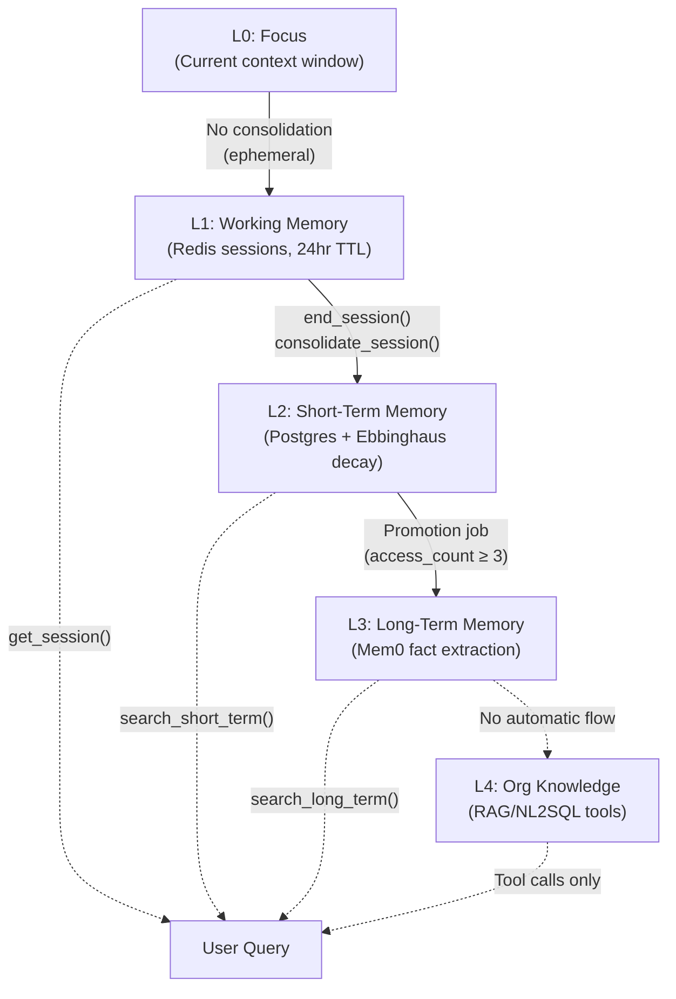
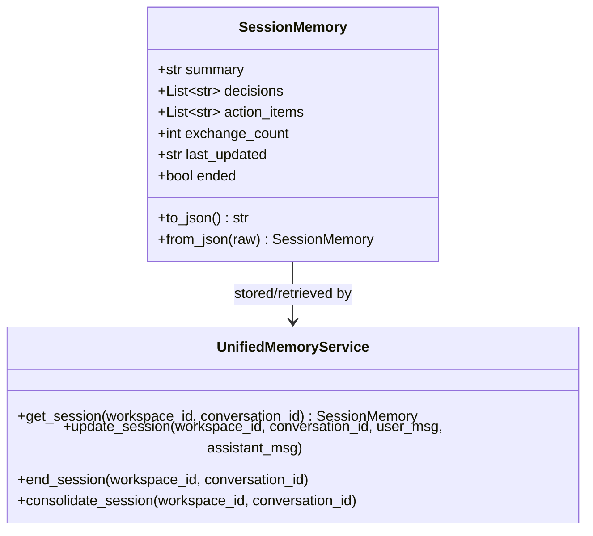
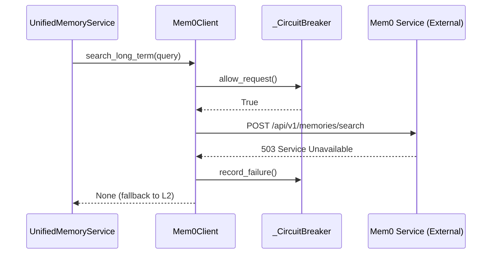
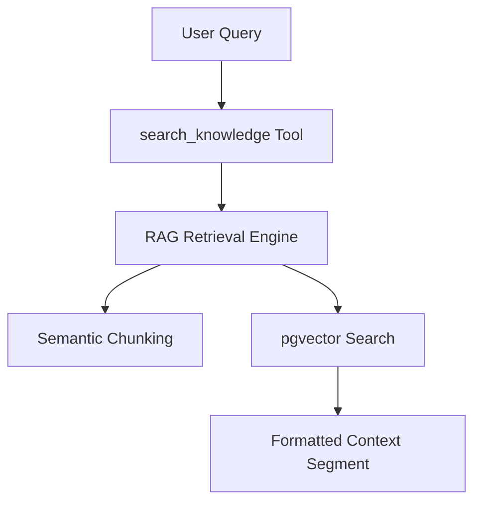
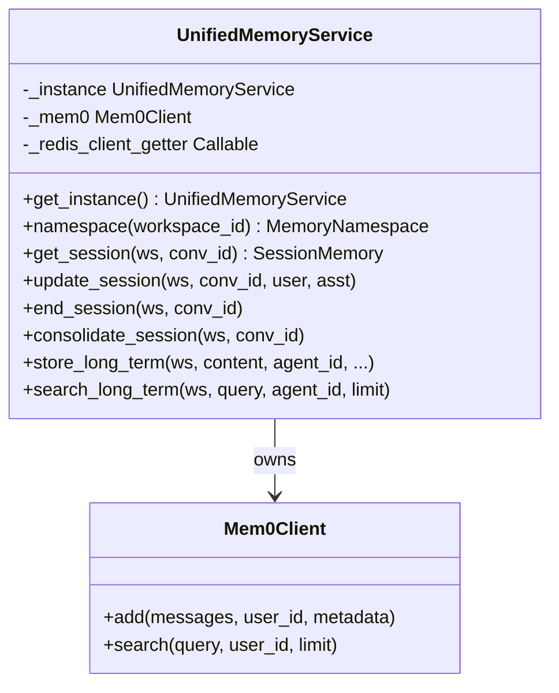

# Five-Layer Memory Architecture

<details>
<summary>Relevant source files</summary>

The following files were used as context for generating this wiki page:

- [docs/PRDS/137-AUTO-CHATBOT-RECOVERY.md](docs/PRDS/137-AUTO-CHATBOT-RECOVERY.md)
- [frontend/tsconfig.tsbuildinfo](frontend/tsconfig.tsbuildinfo)
- [orchestrator/config.py](orchestrator/config.py)
- [orchestrator/consumers/chatbot/integration.py](orchestrator/consumers/chatbot/integration.py)
- [orchestrator/consumers/chatbot/prompt_analyzer.py](orchestrator/consumers/chatbot/prompt_analyzer.py)
- [orchestrator/consumers/chatbot/smart_memory.py](orchestrator/consumers/chatbot/smart_memory.py)
- [orchestrator/consumers/chatbot/smart_orchestrator.py](orchestrator/consumers/chatbot/smart_orchestrator.py)
- [orchestrator/main.py](orchestrator/main.py)
- [orchestrator/modules/agents/queries.py](orchestrator/modules/agents/queries.py)
- [orchestrator/modules/context/sections/identity.py](orchestrator/modules/context/sections/identity.py)
- [orchestrator/modules/context/sections/skills.py](orchestrator/modules/context/sections/skills.py)
- [orchestrator/modules/context/sections/task_context.py](orchestrator/modules/context/sections/task_context.py)
- [orchestrator/modules/memory/context_router.py](orchestrator/modules/memory/context_router.py)
- [orchestrator/modules/memory/integrations/mem0_client.py](orchestrator/modules/memory/integrations/mem0_client.py)
- [orchestrator/modules/memory/unified_memory_service.py](orchestrator/modules/memory/unified_memory_service.py)
- [orchestrator/tests/test_unified_memory.py](orchestrator/tests/test_unified_memory.py)
- [scripts/ralph/IMPLEMENTATION_PLAN.md](scripts/ralph/IMPLEMENTATION_PLAN.md)
- [scripts/ralph/prd.json](scripts/ralph/prd.json)
- [scripts/ralph/progress.txt](scripts/ralph/progress.txt)

</details>


This page documents the hierarchical memory system in Automatos AI, which organizes agent memory into five layers (L0–L4) ranging from immediate focus to organizational knowledge. The architecture enables intelligent context retrieval, automatic consolidation between layers, and workspace-scoped isolation via the `UnifiedMemoryService`.

**Related pages:** For memory integration in the chat system, see **Context Service (4)**. For signal-based retrieval logic, see **Context Router (3.3)**. For background jobs managing memory lifecycle, see **Memory Lifecycle & Consolidation (3.4)**.

---

## Overview: The Five Layers

The memory system is organized as a hierarchy where each layer serves a specific retention window and access pattern:

### Memory Consolidation and Promotion Flow
Title: Memory Consolidation and Promotion Flow

Sources: [orchestrator/modules/memory/unified_memory_service.py:8-21](), [orchestrator/modules/memory/unified_memory_service.py:108-115]()

| Layer | Storage Backend | Retention | Access Pattern | Key Entity |
|-------|----------------|-----------|----------------|------------|
| **L0** | LLM context window | Current conversation only | Direct (no API) | `messages` list |
| **L1** | Redis | 24 hours (active)<br/>1 hour (after end) | `get_session()` | `SessionMemory` |
| **L2** | PostgreSQL (`memory_items`) | Decays via Ebbinghaus formula | `search_short_term()` | `MemoryItem` model |
| **L3** | Mem0 service | Indefinite (fact-extracted) | `search_long_term()` | `Mem0Client` |
| **L4** | Vector DB + NL2SQL | Indefinite (org data) | `search_knowledge` tool | `EnhancedVectorStore` |

Sources: [orchestrator/config.py:82-118](), [orchestrator/modules/memory/unified_memory_service.py:8-14]()

---

## L0: Focus (Context Window)

**Definition:** The immediate conversation context passed directly to the LLM. No persistent storage — ephemeral within a single request.

**Implementation:** Managed by `ContextService` message assembly. The `messages` parameter to `build_context()` becomes the conversation history fed to the LLM. In `IdentitySection`, the agent's persona and personality are injected to provide the immediate behavioral "memory" of who the agent is.

**Code Entities:**
- `ContextService.build_context(messages=...)` — assembles L0 context.
- `IdentitySection` — Renders Priority 1 identity context [orchestrator/modules/context/sections/identity.py:55-69]().
- `SmartChatOrchestrator.prepare_request` — Initiates context building [orchestrator/consumers/chatbot/smart_orchestrator.py:126-153]().

---

## L1: Working Memory (Redis Sessions)

**Definition:** Short-lived session state stored in Redis per conversation, persisting across multiple turns within a 24-hour window. After `end_session()` is called, the session remains cached for 1 hour to allow consolidation.

### SessionMemory Dataclass
Title: L1 Session Memory and Service Interface

Sources: [orchestrator/modules/memory/unified_memory_service.py:123-149]()

### Redis Key Format

Sessions use the namespace pattern `mem:session:{workspace_id}:{conversation_id}` via `MemoryNamespace`.

**Code:**
```python
# From MemoryNamespace.session()
def session(self, conversation_id: str) -> str:
    return f"mem:session:{self.workspace_id}:{conversation_id}"
```
Sources: [orchestrator/modules/memory/unified_memory_service.py:78-80]()

---

## L2: Short-Term Memory (PostgreSQL)

**Definition:** Recent memories stored in the `memory_items` table with an Ebbinghaus decay-based retention score. Items gradually lose relevance over time unless accessed frequently.

### Ebbinghaus Decay Formula

The decay score is calculated based on the `MEMORY_DECAY_RATE` (default 0.1). Items with a score below `MEMORY_DECAY_ARCHIVE_THRESHOLD` (default 0.3) are archived during the background decay job.

Sources: [orchestrator/config.py:100-106](), [orchestrator/modules/memory/unified_memory_service.py:100-105]()

---

## L3: Long-Term Memory (Mem0)

**Definition:** Persistent, fact-extracted memories stored in the external Mem0 service. Optimized for semantic search and long-term retention of specific user/agent facts.

### Mem0Client and Circuit Breaker
To prevent external service failures from blocking the chat loop, the `Mem0Client` implements a circuit breaker that skips calls after 3 consecutive failures for a 300s cooldown.

Title: Mem0 Integration with Circuit Breaker

Sources: [orchestrator/modules/memory/integrations/mem0_client.py:25-60](), [orchestrator/modules/memory/integrations/mem0_client.py:107-157]()

### Smart Memory Tiering
`SmartMemoryManager` classifies whether a memory should be stored globally or specifically to an agent based on keywords.
- **Global:** Personal facts like "my name is..." [orchestrator/consumers/chatbot/smart_memory.py:129-135]().
- **Agent:** Tool-specific info like "Slack channel #dev" [orchestrator/consumers/chatbot/smart_memory.py:113-126]().

---

## L4: Organizational Knowledge (RAG/NL2SQL)

**Definition:** Organizational data sources (documents, databases) accessed via tool calls. L4 is **not pre-fetched** into context — the LLM must explicitly invoke tools to query it.

### Retrieval Pipeline
Title: L4 RAG Retrieval Pipeline


---

## UnifiedMemoryService Architecture

`UnifiedMemoryService` is a singleton managing all memory layers (L1–L3). It holds one shared `Mem0Client`, one Redis client getter, and provides all memory APIs.

Title: UnifiedMemoryService Component Relationship

Sources: [orchestrator/modules/memory/unified_memory_service.py:154-188]()

---

## MemoryNamespace (Standardized Scoping)

`MemoryNamespace` is a frozen dataclass that builds all Mem0/Redis keys using a single pattern to prevent data leaks between agents and workspaces.

### Namespace Methods

| Method | Pattern | Purpose |
|--------|---------|---------|
| `workspace()` | `mem:{ws_id}` | Workspace-wide facts [orchestrator/modules/memory/unified_memory_service.py:52-54]() |
| `agent(id)` | `mem:{ws_id}:agent:{id}` | Agent-specific facts [orchestrator/modules/memory/unified_memory_service.py:56-58]() |
| `session(id)` | `mem:session:{ws_id}:{id}` | L1 Redis session key [orchestrator/modules/memory/unified_memory_service.py:78-80]() |
| `daily()` | `mem:{ws_id}:daily` | Daily activity logs [orchestrator/modules/memory/unified_memory_service.py:72-74]() |

Sources: [orchestrator/modules/memory/unified_memory_service.py:38-117]()

---

## Context Routing (Signal-Based Retrieval)

The `ContextRouter` (integrated via `SmartChatOrchestrator`) analyzes user queries using `PromptAnalyzer` to decide which memory layers to fetch.

| Signal | Pattern Example | Target Layer |
|--------|-----------------|--------------|
| `is_temporal` | "last week", "yesterday" | L2 Daily Logs |
| `is_personal_fact` | "my name", "i prefer" | L3 Mem0 |
| `is_session_continuation` | "earlier in this chat" | L1 Redis |
| `is_knowledge_query` | "search the docs" | L4 RAG |

Sources: [orchestrator/consumers/chatbot/prompt_analyzer.py:88-156](), [orchestrator/consumers/chatbot/smart_orchestrator.py:160-184]()

---