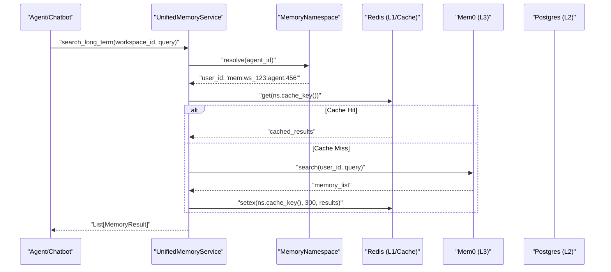
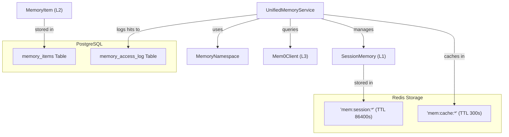

# Memory API Reference

<details>
<summary>Relevant source files</summary>

The following files were used as context for generating this wiki page:

- [frontend/components/activity/activity-memory.tsx](frontend/components/activity/activity-memory.tsx)
- [frontend/components/activity/memory-card.tsx](frontend/components/activity/memory-card.tsx)
- [frontend/components/activity/memory/health-banner.tsx](frontend/components/activity/memory/health-banner.tsx)
- [frontend/components/activity/memory/index.ts](frontend/components/activity/memory/index.ts)
- [frontend/components/activity/memory/memory-sidebar.tsx](frontend/components/activity/memory/memory-sidebar.tsx)
- [frontend/components/activity/memory/memory-viewer.tsx](frontend/components/activity/memory/memory-viewer.tsx)
- [frontend/components/activity/projects/index.ts](frontend/components/activity/projects/index.ts)
- [frontend/components/activity/projects/project-card.tsx](frontend/components/activity/projects/project-card.tsx)
- [frontend/components/shared/global-search.tsx](frontend/components/shared/global-search.tsx)
- [frontend/hooks/use-global-search.ts](frontend/hooks/use-global-search.ts)
- [frontend/hooks/use-memory-explorer-api.ts](frontend/hooks/use-memory-explorer-api.ts)
- [orchestrator/alembic/versions/prd123_checkpoint_count.py](orchestrator/alembic/versions/prd123_checkpoint_count.py)
- [orchestrator/api/memory_stats.py](orchestrator/api/memory_stats.py)
- [orchestrator/api/missions.py](orchestrator/api/missions.py)
- [orchestrator/api/widget_memory.py](orchestrator/api/widget_memory.py)
- [orchestrator/config.py](orchestrator/config.py)
- [orchestrator/core/context_guard.py](orchestrator/core/context_guard.py)
- [orchestrator/core/models/orchestration.py](orchestrator/core/models/orchestration.py)
- [orchestrator/core/models/orchestration_enums.py](orchestrator/core/models/orchestration_enums.py)
- [orchestrator/main.py](orchestrator/main.py)
- [orchestrator/modules/coordination/dispatcher.py](orchestrator/modules/coordination/dispatcher.py)
- [orchestrator/modules/coordination/planner.py](orchestrator/modules/coordination/planner.py)
- [orchestrator/modules/coordination/reconciler.py](orchestrator/modules/coordination/reconciler.py)
- [orchestrator/modules/memory/context_router.py](orchestrator/modules/memory/context_router.py)
- [orchestrator/modules/memory/unified_memory_service.py](orchestrator/modules/memory/unified_memory_service.py)
- [orchestrator/modules/tools/discovery/action_registry.py](orchestrator/modules/tools/discovery/action_registry.py)
- [orchestrator/modules/tools/execution/concurrency.py](orchestrator/modules/tools/execution/concurrency.py)
- [orchestrator/services/checkpoint_service.py](orchestrator/services/checkpoint_service.py)
- [orchestrator/services/coordinator_service.py](orchestrator/services/coordinator_service.py)
- [orchestrator/services/orchestration_state.py](orchestrator/services/orchestration_state.py)
- [orchestrator/tests/test_budget_gate.py](orchestrator/tests/test_budget_gate.py)
- [orchestrator/tests/test_dispatcher_parallel.py](orchestrator/tests/test_dispatcher_parallel.py)
- [orchestrator/tests/test_unified_memory.py](orchestrator/tests/test_unified_memory.py)
- [scripts/ralph/IMPLEMENTATION_PLAN.md](scripts/ralph/IMPLEMENTATION_PLAN.md)
- [scripts/ralph/progress.txt](scripts/ralph/progress.txt)

</details>


This page documents the programmatic interfaces for interacting with the 5-layer memory system in Automatos AI. It covers Python class methods, data structures, and REST endpoints exposed by the memory subsystem.

For architectural overview and layer descriptions, see [3.1. Five-Layer Memory Architecture](). For service implementation details, see [3.2. UnifiedMemoryService]() and [3.3. Context Router]().

---

## Overview

The memory API is exposed through three primary service classes and a set of REST endpoints:

- **`UnifiedMemoryService`** — Singleton service managing all memory operations across L1/L2/L3 layers. [orchestrator/modules/memory/unified_memory_service.py:154-188]()
- **`MemoryNamespace`** — Helper for building scoped user IDs to prevent memory leakage. [orchestrator/modules/memory/unified_memory_service.py:38-48]()
- **`SessionMemory`** — Data structure for L1 working memory stored in Redis. [orchestrator/modules/memory/unified_memory_service.py:123-149]()
- **`ContextRouter`** — Signal-based query analyzer determining which memory layers to fetch. [orchestrator/config.py:90-97]()

All memory operations are asynchronous and designed to be non-blocking. Redis and Mem0 failures are caught and logged without breaking the caller. [orchestrator/api/memory_stats.py:139-141]()

**Sources:** [orchestrator/modules/memory/unified_memory_service.py:1-188](), [orchestrator/api/memory_stats.py:139-141](), [orchestrator/config.py:82-118]()

---

## MemoryNamespace

### Purpose

`MemoryNamespace` is a frozen dataclass that builds standardized user ID strings for Mem0 and Redis keys. **All memory consumers must use this helper** to prevent inconsistencies in `user_id` formats. [orchestrator/modules/memory/unified_memory_service.py:38-48]()

### Class Definition

```python
@dataclass(frozen=True)
class MemoryNamespace:
    workspace_id: str
```

**Sources:** [orchestrator/modules/memory/unified_memory_service.py:38-48]()

### Methods

| Method | Returns | Description |
|--------|---------|-------------|
| `workspace()` | `str` | Workspace-wide facts (L3 global): `mem:{workspace_id}`. [orchestrator/modules/memory/unified_memory_service.py:52-54]() |
| `agent(agent_id)` | `str` | Agent-specific memories (L3 per-agent): `mem:{workspace_id}:agent:{agent_id}`. [orchestrator/modules/memory/unified_memory_service.py:56-58]() |
| `recipe(recipe_id)` | `str` | Recipe learnings (L3 per-recipe): `mem:{workspace_id}:recipe:{recipe_id}`. [orchestrator/modules/memory/unified_memory_service.py:60-62]() |
| `recipe_agent(recipe_id, agent_id)` | `str` | Per-agent step within recipe: `mem:{workspace_id}:recipe:{recipe_id}:agent:{agent_id}`. [orchestrator/modules/memory/unified_memory_service.py:64-66]() |
| `workflow(workflow_id)` | `str` | Workflow execution memories: `mem:{workspace_id}:workflow:{workflow_id}`. [orchestrator/modules/memory/unified_memory_service.py:68-70]() |
| `daily()` | `str` | Daily activity logs (L2): `mem:{workspace_id}:daily`. [orchestrator/modules/memory/unified_memory_service.py:72-74]() |
| `session(conversation_id)` | `str` | Session cache key (L1 Redis): `mem:session:{workspace_id}:{conversation_id}`. [orchestrator/modules/memory/unified_memory_service.py:78-80]() |
| `cache_key(agent_id, query_hash)` | `str` | L3 Mem0 search cache (Redis): `mem:cache:{workspace_id}:{scope}:{query_hash}`. [orchestrator/modules/memory/unified_memory_service.py:84-87]() |
| `resolve(agent_id)` | `str` | Auto-resolve to agent or workspace namespace based on `agent_id`. [orchestrator/modules/memory/unified_memory_service.py:107-117]() |

**Sources:** [orchestrator/modules/memory/unified_memory_service.py:50-117]()

---

## Memory API Reference (REST)

### 1. Memory Stats API
**Prefix:** `/api/v1/memory` [orchestrator/api/memory_stats.py:25]()

#### `GET /stats/real`
Fetches memory statistics, prioritizing Mem0 data with a local DB fallback. [orchestrator/api/memory_stats.py:121-125]()
- **Implementation:** Calls `_fetch_all_scoped_memories` to aggregate global, agent, and daily scopes. [orchestrator/api/memory_stats.py:66-118]()
- **Response:** Includes `total_memories`, `hit_rate` (calculated from `memory_access_log`), and counts by type/level. [orchestrator/api/memory_stats.py:146-190]()

**Sources:** [orchestrator/api/memory_stats.py:25-190]()

### 2. Widget Memory API
**Prefix:** `/api/memory` [orchestrator/main.py:46-47]()

Provides simple CRUD for the workspace-scoped memory panel.

| Endpoint | Method | Description |
|----------|--------|-------------|
| `/` | `GET` | List memories for the current workspace. |
| `/search` | `GET` | Semantic search (Mem0) or substring fallback. |
| `/` | `POST` | Create a new memory record (e.g., via `platform_store_memory`). [scripts/ralph/progress.txt:68-73]() |

**Sources:** [orchestrator/main.py:46-47](), [scripts/ralph/progress.txt:68-73]()

### 3. Missions Memory Integration
**Prefix:** `/api/missions` [orchestrator/api/missions.py:74]()

Missions (Orchestration Runs) use a specialized shared memory field (PRD-108) for inter-agent coordination. [orchestrator/services/coordinator_service.py:82-86]()

- **Shared Context:** `CoordinatorService` initializes a vector field for every mission goal. [orchestrator/services/coordinator_service.py:107-151]()
- **Task Injection:** Outputs from individual tasks are injected into the mission's shared field upon completion. [orchestrator/services/coordinator_service.py:176-200]()

**Sources:** [orchestrator/services/coordinator_service.py:82-200](), [orchestrator/api/missions.py:74-204]()

---

## Frontend Integration

### Hooks (`use-memory-explorer-api.ts`)
The frontend uses React Query to interact with memory endpoints. [orchestrator/api/memory_stats.py:121-125]()

- `useMemoryExplorerStats()`: Fetches real-time memory counts and hit rates from `/api/v1/memory/stats/real`. [orchestrator/api/memory_stats.py:121-125]()
- `useGlobalSearch()`: Provides unified search across workspace documents and memory items. [orchestrator/api/memory_stats.py:86-93]()

**Sources:** [orchestrator/api/memory_stats.py:25-190]()

### Activity Feed Memory
The `ActivityMemory` components visualize memory interactions within the system. `platform_search_memory` and `platform_store_memory` are promoted actions that appear in the tool loop. [scripts/ralph/progress.txt:68-73](), [scripts/ralph/progress.txt:92-93]()

**Sources:** [scripts/ralph/progress.txt:68-93]()

---

## Implementation Diagrams

### Data Flow: Context Retrieval
This diagram bridges the `UnifiedMemoryService` call to the underlying storage and namespace logic.



**Sources:** [orchestrator/modules/memory/unified_memory_service.py:154-205](), [orchestrator/modules/memory/unified_memory_service.py:38-117](), [orchestrator/config.py:88-89]()

### Code Entity Space: Memory Hierarchy
Mapping of internal classes to database and cache entities.



**Sources:** [orchestrator/modules/memory/unified_memory_service.py:1-188](), [orchestrator/config.py:84-89](), [orchestrator/api/memory_stats.py:143-183]()

---

## Error Handling & Fallbacks

The system implements a multi-tier fallback strategy:
1. **Mem0 to Local DB:** `get_real_memory_stats` attempts to query Mem0 via `UnifiedMemoryService`; if it fails, it defaults to the `memory_items` table in Postgres. [orchestrator/api/memory_stats.py:126-141]()
2. **Fail-Closed Permissions:** The `PlatformActionExecutor` rejects memory operations if the `caller_context` is missing, ensuring data isolation. [scripts/ralph/progress.txt:21-31]()
3. **Redis Resilience:** `UnifiedMemoryService._get_redis()` returns `None` if Redis is unreachable; the service is designed to continue execution (chat must never break due to cache failure). [orchestrator/modules/memory/unified_memory_service.py:198-205]()

**Sources:** [orchestrator/api/memory_stats.py:126-141](), [scripts/ralph/progress.txt:21-31](), [orchestrator/modules/memory/unified_memory_service.py:198-205]()

---