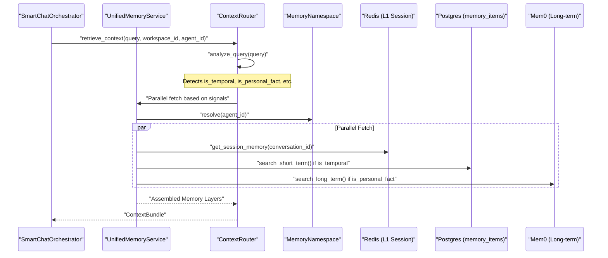
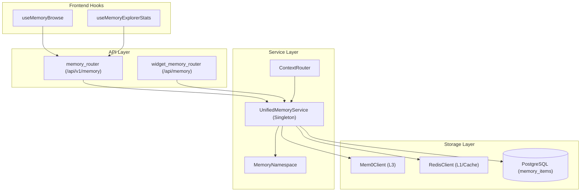

# Memory API Reference

<details>
<summary>Relevant source files</summary>

The following files were used as context for generating this wiki page:

- [frontend/components/activity/memory-card.tsx](frontend/components/activity/memory-card.tsx)
- [frontend/components/activity/memory/health-banner.tsx](frontend/components/activity/memory/health-banner.tsx)
- [frontend/components/activity/memory/index.ts](frontend/components/activity/memory/index.ts)
- [frontend/components/activity/memory/memory-sidebar.tsx](frontend/components/activity/memory/memory-sidebar.tsx)
- [frontend/components/activity/projects/index.ts](frontend/components/activity/projects/index.ts)
- [frontend/components/shared/global-search.tsx](frontend/components/shared/global-search.tsx)
- [frontend/hooks/use-memory-explorer-api.ts](frontend/hooks/use-memory-explorer-api.ts)
- [frontend/tsconfig.tsbuildinfo](frontend/tsconfig.tsbuildinfo)
- [orchestrator/api/memory_stats.py](orchestrator/api/memory_stats.py)
- [orchestrator/config.py](orchestrator/config.py)
- [orchestrator/main.py](orchestrator/main.py)
- [orchestrator/modules/memory/context_router.py](orchestrator/modules/memory/context_router.py)
- [orchestrator/modules/memory/unified_memory_service.py](orchestrator/modules/memory/unified_memory_service.py)
- [orchestrator/tests/test_unified_memory.py](orchestrator/tests/test_unified_memory.py)
- [scripts/ralph/IMPLEMENTATION_PLAN.md](scripts/ralph/IMPLEMENTATION_PLAN.md)
- [scripts/ralph/prd.json](scripts/ralph/prd.json)
- [scripts/ralph/progress.txt](scripts/ralph/progress.txt)

</details>


This page documents the programmatic interfaces for interacting with the 5-layer memory system in Automatos AI. It covers Python class methods, data structures, and REST endpoints exposed by the memory subsystem, including real-time statistics, semantic search, and context routing.

---

## Overview

The memory API is exposed through three primary service classes and a set of REST routers:

- **`UnifiedMemoryService`**: Singleton service managing all memory operations across L1/L2/L3 layers. [orchestrator/modules/memory/unified_memory_service.py:154-161]()
- **`MemoryNamespace`**: Helper for building standardized, scoped user IDs to prevent memory leakage between workspaces and agents. [orchestrator/modules/memory/unified_memory_service.py:38-48]()
- **`ContextRouter`**: Intelligent pre-LLM layer that analyzes queries to decide which memory layers to fetch. [orchestrator/modules/memory/context_router.py:5-12]()
- **`MemoryItem`**: SQLAlchemy model for vector-based storage in the `memory_items` table. [orchestrator/modules/memory/storage/knowledge_system.py:55-73]()

All memory operations are asynchronous. Failures in external integrations like Mem0 are caught to allow graceful fallbacks to local PostgreSQL storage. [orchestrator/api/memory_stats.py:4-6](), [orchestrator/api/memory_stats.py:139-141]()

**Sources:** [orchestrator/modules/memory/unified_memory_service.py:1-48](), [orchestrator/modules/memory/context_router.py:5-12](), [orchestrator/api/memory_stats.py:139-141]()

---

## MemoryNamespace

### Purpose
`MemoryNamespace` is a frozen dataclass that builds standardized user ID strings for Mem0 and Redis keys. **All memory consumers must use this helper** to maintain consistency in `user_id` formats and prevent cross-tenant data leaks. [orchestrator/modules/memory/unified_memory_service.py:38-48]()

### Class Definition
```python
@dataclass(frozen=True)
class MemoryNamespace:
    workspace_id: str
```
[orchestrator/modules/memory/unified_memory_service.py:38-41]()

### Key Scopes
| Method | Format | Description |
|--------|--------|-------------|
| `workspace()` | `mem:{workspace_id}` | Workspace-wide facts (L3 global). [orchestrator/modules/memory/unified_memory_service.py:52-54]() |
| `agent(id)` | `mem:{ws_id}:agent:{id}` | Agent-specific memories (L3 per-agent). [orchestrator/modules/memory/unified_memory_service.py:56-58]() |
| `daily()` | `mem:{workspace_id}:daily` | Daily activity logs (L2). [orchestrator/modules/memory/unified_memory_service.py:72-74]() |
| `session(id)` | `mem:session:{ws_id}:{id}` | Session cache key (L1 Redis). [orchestrator/modules/memory/unified_memory_service.py:78-80]() |
| `cache_key(id, hash)` | `mem:cache:{ws_id}:{scope}:{hash}` | Cache for L3 Mem0 search results. [orchestrator/modules/memory/unified_memory_service.py:84-87]() |

**Sources:** [orchestrator/modules/memory/unified_memory_service.py:50-117]()

---

## Memory API Reference (REST)

### 1. Real Memory Stats API
**Prefix:** `/api/v1/memory` [orchestrator/api/memory_stats.py:25]()

#### `GET /stats/real`
Fetches memory statistics, prioritizing Mem0 data via `UnifiedMemoryService` with a local DB fallback. [orchestrator/api/memory_stats.py:121-125]()
- **Implementation**: Aggregates "global", "agent", and "daily" scopes via `_fetch_all_scoped_memories`. [orchestrator/api/memory_stats.py:133-137](), [orchestrator/api/memory_stats.py:83-101]()
- **Response**: Includes `total_memories`, `hit_rate` (calculated from `memory_access_log`), and counts by type/level. [orchestrator/api/memory_stats.py:146-190]()

#### `GET /health`
Returns a health report including `mem0_available`, `search_effectiveness`, and `health_status` (healthy, degraded, or unavailable). [frontend/hooks/use-memory-explorer-api.ts:44-56]()

#### `GET /browse`
Browses or searches memories with optional `query`, `limit`, and `tier` (l2/l3) filters. [frontend/hooks/use-memory-explorer-api.ts:106-122]()

**Sources:** [orchestrator/api/memory_stats.py:25-190](), [frontend/hooks/use-memory-explorer-api.ts:36-122]()

### 2. Widget Memory API
**Prefix:** `/api/memory` [orchestrator/api/widget_memory.py:26]()

Provides simple CRUD for the workspace-scoped memory panel. [orchestrator/api/widget_memory.py:5-10]()

| Endpoint | Method | Description |
|----------|--------|-------------|
| `/` | `GET` | List memories for the current workspace. [orchestrator/api/widget_memory.py:157-162]() |
| `/search` | `GET` | Semantic search (Mem0) or substring fallback. [orchestrator/api/widget_memory.py:192-198]() |
| `/` | `POST` | Create a new memory record with `content`, `metadata`, and `tags`. [orchestrator/api/widget_memory.py:38-42]() |
| `/{id}` | `DELETE` | Remove a memory by ID. [orchestrator/api/widget_memory.py:69-73]() |

**Sources:** [orchestrator/api/widget_memory.py:26-198]()

---

## Frontend Integration

### Hooks (`use-memory-explorer-api.ts`)
The frontend uses React Query to interact with memory endpoints. [frontend/hooks/use-memory-explorer-api.ts:1-4]()

- `useMemoryBrowse(filters)`: Searches `/api/v1/memory/browse`. [frontend/hooks/use-memory-explorer-api.ts:106-122]()
- `useConsolidateMemories()`: POSTs to `/api/v1/memory/consolidate` to merge multiple memories using `merge` or `summarise` strategies. [frontend/hooks/use-memory-explorer-api.ts:176-197]()
- `useDeleteMemory()`: Deletes a memory via `DELETE /api/v1/memory/{id}`. [frontend/hooks/use-memory-explorer-api.ts:153-171]()

**Sources:** [frontend/hooks/use-memory-explorer-api.ts:83-197]()

### UI Components
- **`MemoryCard`**: Renders individual memory items with `score` badges, `tier` labels, and metadata such as `agent_name`. [frontend/components/activity/memory-card.tsx:35-142]()
- **`MemorySidebar`**: Provides a grouped list (Today, Yesterday, etc.) and filter chips (Transcripts, Missions, Failures, Facts). [frontend/components/activity/memory/memory-sidebar.tsx:57-152]()

**Sources:** [frontend/components/activity/memory-card.tsx:35-142](), [frontend/components/activity/memory/memory-sidebar.tsx:9-152]()

---

## Implementation Diagrams

### Data Flow: Context Retrieval
This diagram bridges the `retrieve_context` function call to the underlying storage entities and signal detection logic.



**Sources:** [orchestrator/modules/memory/unified_memory_service.py:1292-1484](), [orchestrator/modules/memory/context_router.py:5-24](), [orchestrator/modules/memory/context_router.py:40-78]()

### Code Entity Space: Memory API Hierarchy
Mapping of internal classes to API routes and storage providers.



**Sources:** [orchestrator/main.py:50-51](), [orchestrator/modules/memory/unified_memory_service.py:154-188](), [frontend/hooks/use-memory-explorer-api.ts:94-146]()

---

## Error Handling & Fallbacks

The system implements a multi-tier fallback strategy to ensure chat functionality is never blocked by memory infrastructure failures:
1. **Mem0 to Local DB**: `get_real_memory_stats` attempts to query Mem0; if it fails or is unconfigured, it defaults to the `memory_items` table in Postgres. [orchestrator/api/memory_stats.py:126-141]()
2. **Redis Graceful Failure**: `UnifiedMemoryService._get_redis()` returns `None` if Redis is unavailable, and callers are required to handle this to prevent breaking chat sessions. [orchestrator/modules/memory/unified_memory_service.py:198-204]()
3. **Substring Search Fallback**: If Mem0 is unconfigured, the Widget Memory API falls back to a naive substring search against the local database. [orchestrator/api/widget_memory.py:131-141]()

**Sources:** [orchestrator/api/memory_stats.py:126-141](), [orchestrator/modules/memory/unified_memory_service.py:198-204](), [orchestrator/api/widget_memory.py:131-141]()

---