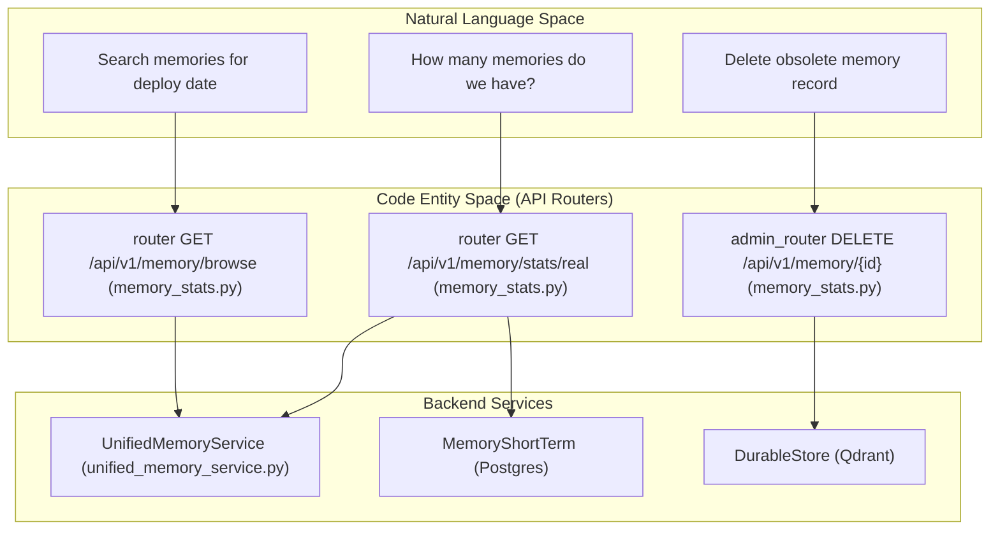
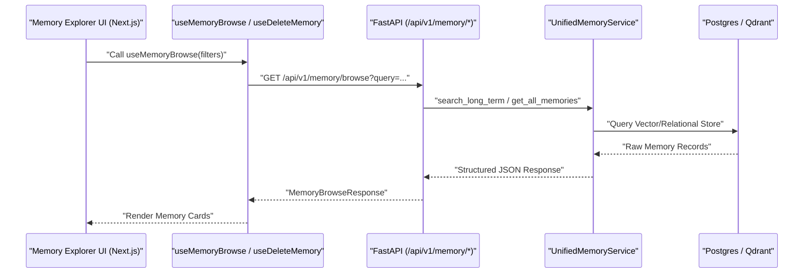

# Memory API Reference

Relevant source files

The following files were used as context for generating this wiki page:

- [docs/PRDS/PRD-143-OBS-TIER-MANIFEST.md](docs/PRDS/PRD-143-OBS-TIER-MANIFEST.md)
- [frontend/components/activity/memory-card.tsx](frontend/components/activity/memory-card.tsx)
- [frontend/components/activity/memory/health-banner.tsx](frontend/components/activity/memory/health-banner.tsx)
- [frontend/components/activity/memory/index.ts](frontend/components/activity/memory/index.ts)
- [frontend/components/activity/memory/memory-sidebar.tsx](frontend/components/activity/memory/memory-sidebar.tsx)
- [frontend/components/activity/projects/index.ts](frontend/components/activity/projects/index.ts)
- [frontend/hooks/use-memory-explorer-api.ts](frontend/hooks/use-memory-explorer-api.ts)
- [orchestrator/api/composio_analytics.py](orchestrator/api/composio_analytics.py)
- [orchestrator/api/database_analytics.py](orchestrator/api/database_analytics.py)
- [orchestrator/api/llm_analytics.py](orchestrator/api/llm_analytics.py)
- [orchestrator/api/memory_stats.py](orchestrator/api/memory_stats.py)
- [orchestrator/api/widget_memory.py](orchestrator/api/widget_memory.py)
- [orchestrator/core/llm/openrouter_analytics.py](orchestrator/core/llm/openrouter_analytics.py)
- [orchestrator/core/services/mission_memory_service.py](orchestrator/core/services/mission_memory_service.py)
- [orchestrator/modules/memory/injection_filter.py](orchestrator/modules/memory/injection_filter.py)
- [orchestrator/modules/memory/resume_context.py](orchestrator/modules/memory/resume_context.py)
- [orchestrator/modules/tools/discovery/actions_marketplace.py](orchestrator/modules/tools/discovery/actions_marketplace.py)
- [orchestrator/modules/tools/discovery/actions_monitoring.py](orchestrator/modules/tools/discovery/actions_monitoring.py)
- [orchestrator/modules/tools/discovery/actions_playbooks.py](orchestrator/modules/tools/discovery/actions_playbooks.py)
- [orchestrator/modules/tools/discovery/actions_reports.py](orchestrator/modules/tools/discovery/actions_reports.py)
- [orchestrator/modules/tools/discovery/actions_workspace.py](orchestrator/modules/tools/discovery/actions_workspace.py)
- [orchestrator/modules/tools/discovery/handlers_monitoring.py](orchestrator/modules/tools/discovery/handlers_monitoring.py)
- [orchestrator/modules/tools/discovery/handlers_reports.py](orchestrator/modules/tools/discovery/handlers_reports.py)
- [orchestrator/modules/tools/discovery/handlers_workspace.py](orchestrator/modules/tools/discovery/handlers_workspace.py)
- [orchestrator/tests/test_prd143_obs_routers_batch2.py](orchestrator/tests/test_prd143_obs_routers_batch2.py)
- [orchestrator/tests/test_prd206_resume_context.py](orchestrator/tests/test_prd206_resume_context.py)

## Purpose and Scope

This page documents the REST API endpoints, stats routers, frontend hooks, and platform action integrations for the Automatos AI memory subsystem. It covers `memory_stats.py` (Memory Explorer & Admin routers), `widget_memory.py` (Widget-layer memory CRUD), and frontend React Query hooks in `use-memory-explorer-api.ts`, detailing how workspace data isolation, fallback behaviors, and agent platform actions interact with the 5-layer memory architecture.

For core memory architecture and background services, see [3.1. Five-Layer Memory Architecture](), [3.2. UnifiedMemoryService](), and [3.3. Context Router]().

---

## Memory Explorer API (`memory_stats.py`)

The Memory Explorer API exposes endpoints under the `/api/v1/memory` prefix [orchestrator/api/memory_stats.py:32-35](). It is divided into two security tiers:

1. **User Router (`router`)**: Workspace-scoped endpoints (`/browse`, `/health`, `/stats/real`, `/layers`) filtered strictly on `ctx.workspace_id` via hybrid authentication. Authenticated workspace members can inspect their own workspace memory without super-admin privileges [orchestrator/api/memory_stats.py:26-35]().
2. **Admin Router (`admin_router`)**: Destructive and LLM-expensive endpoints (e.g., memory deletion `DELETE /{id}`, consolidation `POST /consolidate`) protected by `require_super_admin` [orchestrator/api/memory_stats.py:37-44]().

### Key Endpoints

| Endpoint | Method | Security Tier | Description |
|----------|--------|---------------|-------------|
| `/api/v1/memory/stats/real` | `GET` | User (Hybrid) | Queries durable store (Mem0) or falls back to local `MemoryShortTerm` table, returning global and per-agent memory counts and types [orchestrator/api/memory_stats.py:140-166](). |
| `/api/v1/memory/browse` | `GET` | User (Hybrid) | Searches and lists memories across global, agent-specific, and daily namespaces [orchestrator/api/memory_stats.py:85-137](). |
| `/api/v1/memory/consolidate` | `POST` | Super Admin | Triggers LLM-based consolidation or merging of short-term memories [orchestrator/api/memory_stats.py:37-44](). |
| `/api/v1/memory/{id}` | `DELETE` | Super Admin | Deletes a specific memory record by ID from the durable store [orchestrator/api/memory_stats.py:37-44](). |

Sources: [orchestrator/api/memory_stats.py:26-44](), [orchestrator/api/memory_stats.py:85-166]()

---

## Widget Memory API (`widget_memory.py`)

The Widget Memory API (`/api/memory`) provides lightweight REST CRUD operations for the embeddable chat widget and widget-layer memory panels [orchestrator/api/widget_memory.py:5-30]().

### Implementation Mechanics
- **UnifiedMemoryService Integration**: Attempts to resolve `UnifiedMemoryService` via `_get_memory_service()`. If Qdrant/durable store is configured, it proxies CRUD and search operations directly to the durable backend [orchestrator/api/widget_memory.py:114-131]().
- **In-Memory Fallback**: If the durable memory service is unavailable, operations fall back to an in-memory workspace-keyed dictionary (`_fallback_store`) with substring search capabilities [orchestrator/api/widget_memory.py:137-181]().

Sources: [orchestrator/api/widget_memory.py:5-181]()

---

## Frontend Memory Explorer Hooks (`use-memory-explorer-api.ts`)

The frontend interacts with the memory explorer endpoints via React Query hooks defined in `frontend/hooks/use-memory-explorer-api.ts`. These hooks manage query caching, optimistic updates, and background refetching.

### Core Hook Definitions

| Hook Name | Return Type | API Route Called | Description |
|-----------|-------------|------------------|-------------|
| `useMemoryBrowse(filters)` | `MemoryBrowseResponse` | `GET /api/v1/memory/browse` | Fetches filtered/searched memories across L2/L3 tiers [frontend/hooks/use-memory-explorer-api.ts:106-122](). |
| `useMemoryHealth()` | `MemoryHealthResponse` | `GET /api/v1/memory/health` | Retrieves health status and hit rates of Mem0/Qdrant backend [frontend/hooks/use-memory-explorer-api.ts:127-134](). |
| `useMemoryExplorerStats()` | `MemoryStatsResponse` | `GET /api/v1/memory/stats/real` | Fetches aggregate system memory statistics [frontend/hooks/use-memory-explorer-api.ts:139-146](). |
| `useDeleteMemory()` | Mutation | `DELETE /api/v1/memory/{id}` | Deletes a memory item and invalidates explorer queries [frontend/hooks/use-memory-explorer-api.ts:153-171](). |
| `useConsolidateMemories()` | Mutation | `POST /api/v1/memory/consolidate` | Merges or summarizes multiple memory records [frontend/hooks/use-memory-explorer-api.ts:176-197](). |

Sources: [frontend/hooks/use-memory-explorer-api.ts:1-197]()

---

## Platform Memory Actions (`actions_workspace.py` & `handlers_workspace.py`)

Agents can interact with the memory subsystem programmatically during execution via registered platform actions [orchestrator/modules/tools/discovery/actions_workspace.py:38-143]().

- **`platform_get_memory_stats`**: Invokes `handlers_workspace.get_memory_stats()` to query Mem0 and agent collections, returning a structured breakdown of global and agent-specific memories for LLM consumption [orchestrator/modules/tools/discovery/handlers_workspace.py:61-132]().
- **`platform_store_memory`**: Validates content against exclusion policies and persists curated facts into long-term storage with provenance (`source_type`, `confidence`, `scope`) [orchestrator/modules/tools/discovery/actions_workspace.py:61-143]().

Sources: [orchestrator/modules/tools/discovery/actions_workspace.py:38-143](), [orchestrator/modules/tools/discovery/handlers_workspace.py:61-132]()

---

## Implementation Diagrams

### Natural Language Space to Code Entity Space: Memory API Routing
This diagram maps natural language queries from users and agents to the corresponding FastAPI routers and service functions in the codebase.

Sources: [orchestrator/api/memory_stats.py:32-44](), [orchestrator/api/memory_stats.py:85-166]()

### Memory Explorer & React Query Data Flow
This diagram illustrates how frontend UI components fetch and mutate memory data through React Query hooks and FastAPI endpoints.

Sources: [frontend/hooks/use-memory-explorer-api.ts:106-122](), [orchestrator/api/memory_stats.py:85-137]()

---

## Error Handling & Fallbacks

The memory API implements robust graceful degradation strategies:
1. **Durable Store Unavailability**: If the Qdrant backend is unreachable, memory stats and search endpoints fall back to querying the local `MemoryShortTerm` Postgres table [orchestrator/api/memory_stats.py:158-166]().
2. **Widget Fallback Store**: The widget memory API defaults to an in-memory dictionary store if the primary Mem0 service client fails to initialize [orchestrator/api/widget_memory.py:127-131]().
3. **Tenant Scoping Protection**: All read operations enforce workspace isolation by filtering strictly on `ctx.workspace_id`, preventing cross-tenant leakage even if backend exceptions occur [orchestrator/api/memory_stats.py:26-35]().

Sources: [orchestrator/api/memory_stats.py:26-166](), [orchestrator/api/widget_memory.py:127-131]()

---