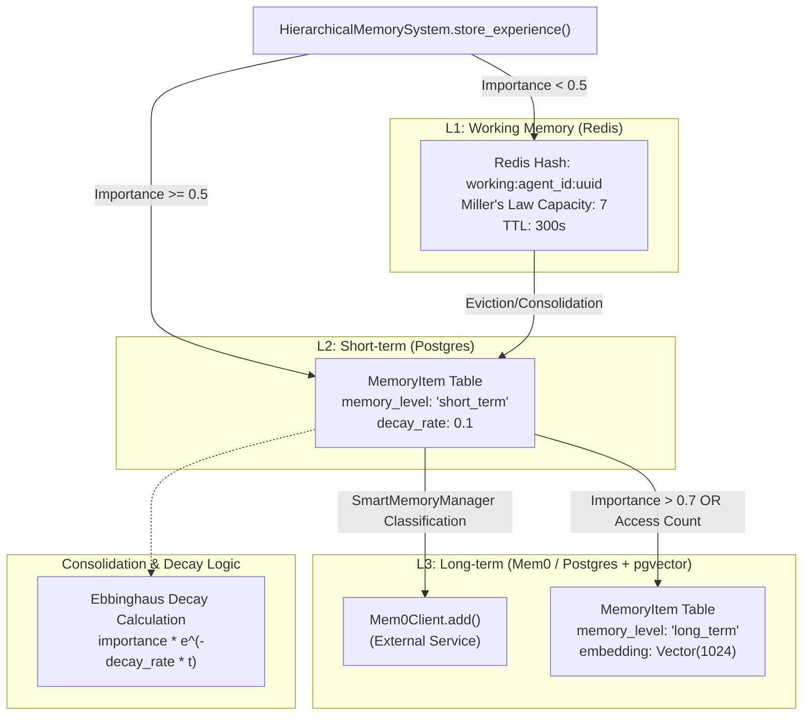
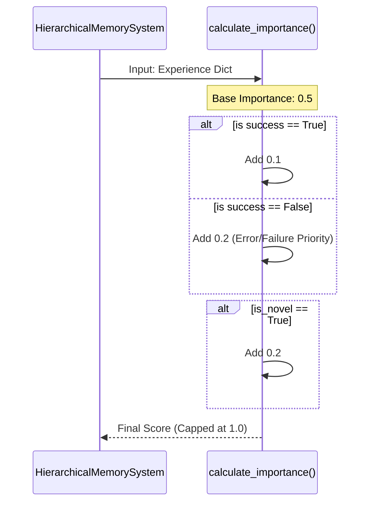
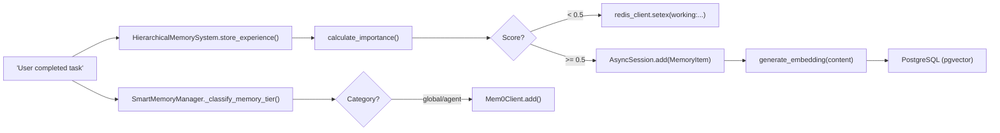

# Memory Lifecycle & Consolidation

Relevant source files

The following files were used as context for generating this wiki page:

- [docs/PRDS/39-MEM0-MIGRATION-PRD.md](docs/PRDS/39-MEM0-MIGRATION-PRD.md)
- [docs/PRDS/55-AUTONOMOUS-ASSISTANT-PLATFORM.md](docs/PRDS/55-AUTONOMOUS-ASSISTANT-PLATFORM.md)
- [frontend/components/auth/sign-up-form.tsx](frontend/components/auth/sign-up-form.tsx)
- [orchestrator/alembic/versions/20260215_add_heartbeat_and_channels.py](orchestrator/alembic/versions/20260215_add_heartbeat_and_channels.py)
- [orchestrator/api/channels.py](orchestrator/api/channels.py)
- [orchestrator/api/heartbeat.py](orchestrator/api/heartbeat.py)
- [orchestrator/channels/base.py](orchestrator/channels/base.py)
- [orchestrator/channels/discord_adapter.py](orchestrator/channels/discord_adapter.py)
- [orchestrator/channels/google_chat_adapter.py](orchestrator/channels/google_chat_adapter.py)
- [orchestrator/channels/line_adapter.py](orchestrator/channels/line_adapter.py)
- [orchestrator/channels/manager.py](orchestrator/channels/manager.py)
- [orchestrator/channels/slack_adapter.py](orchestrator/channels/slack_adapter.py)
- [orchestrator/consumers/chatbot/smart_memory.py](orchestrator/consumers/chatbot/smart_memory.py)
- [orchestrator/core/models/channels.py](orchestrator/core/models/channels.py)
- [orchestrator/core/services/plugin_security_scanner.py](orchestrator/core/services/plugin_security_scanner.py)
- [orchestrator/mem0_openapi.json](orchestrator/mem0_openapi.json)
- [orchestrator/modules/agents/__init__.py](orchestrator/modules/agents/__init__.py)
- [orchestrator/modules/agents/factory/__init__.py](orchestrator/modules/agents/factory/__init__.py)
- [orchestrator/modules/memory/integrations/__init__.py](orchestrator/modules/memory/integrations/__init__.py)
- [orchestrator/modules/memory/integrations/mem0_client.py](orchestrator/modules/memory/integrations/mem0_client.py)
- [orchestrator/modules/memory/operations/__init__.py](orchestrator/modules/memory/operations/__init__.py)
- [orchestrator/modules/memory/storage/knowledge_system.py](orchestrator/modules/memory/storage/knowledge_system.py)
- [orchestrator/modules/memory/tests/conftest.py](orchestrator/modules/memory/tests/conftest.py)
- [orchestrator/modules/memory/tests/test_hierarchical_memory.py](orchestrator/modules/memory/tests/test_hierarchical_memory.py)
- [orchestrator/modules/nl2sql/tests/test_validator.py](orchestrator/modules/nl2sql/tests/test_validator.py)

This page describes how memories flow through the 5-layer memory stack, from ephemeral session state to long-term facts. Specifically, it covers **session consolidation** (L1→L2), **Ebbinghaus decay** (L2 time-based archiving), and **promotion** (L2→L3 based on access patterns). For memory retrieval and context assembly, see [Context Router](#3.3). For the overall memory architecture, see [Five-Layer Memory Architecture](#3.1).

---

## Overview

Memories in Automatos AI follow a natural lifecycle from working memory to long-term storage:

1.  **L1 (Working/Session)**: Active conversation state and recent task experiences stored in Redis with a capacity limit based on Miller's Law (7 items) [orchestrator/modules/memory/storage/knowledge_system.py:165-166]().
2.  **L2 (Short-term)**: Recent exchanges and experiences stored in Postgres, subject to decay and windowing (24-hour window) [orchestrator/modules/memory/storage/knowledge_system.py:167-168]().
3.  **L3 (Long-term)**: Important facts and persistent knowledge stored via `Mem0Client` [orchestrator/modules/memory/integrations/mem0_client.py:66]() or persistent `MemoryItem` records with vector embeddings for semantic search [orchestrator/modules/memory/storage/knowledge_system.py:55-78]().

The lifecycle is managed by the `HierarchicalMemorySystem` which coordinates transitions between these layers based on importance, recency, and frequency of access.

### Memory Lifecycle Flow
**Title: Memory Transition Diagram (Code Entity Space)**

**Sources:** [orchestrator/modules/memory/storage/knowledge_system.py:40-45](), [orchestrator/modules/memory/storage/knowledge_system.py:165-170](), [orchestrator/modules/memory/storage/knowledge_system.py:196-203](), [orchestrator/consumers/chatbot/smart_memory.py:51-60]()

---

## L1 Working Memory Lifecycle

### Miller's Law Enforcement
The system enforces a working memory capacity of 7 items, inspired by Miller's Law [orchestrator/modules/memory/storage/knowledge_system.py:165](). When new experiences are added to L1 via Redis, the system checks the current count for the specific agent. If the limit is exceeded, the least important or oldest items are evicted to make room for new context [orchestrator/modules/memory/tests/test_hierarchical_memory.py:102-120]().

### Working Memory TTL
Working memory items in Redis have a default TTL of 300 seconds (5 minutes) [orchestrator/modules/memory/storage/knowledge_system.py:166](). This ensures that the "immediate focus" of an agent remains fresh and relevant to the current task.

**Sources:** [orchestrator/modules/memory/storage/knowledge_system.py:165-170](), [orchestrator/modules/memory/tests/test_hierarchical_memory.py:102-120]()

---

## L2 Short-term Memory & Decay

### Ebbinghaus Decay Implementation
Short-term memories stored in the `memory_items` table [orchestrator/modules/memory/storage/knowledge_system.py:57]() undergo a decay process. The `decay_rate` (default 0.1) determines how quickly the memory's retrieval priority drops over time [orchestrator/modules/memory/storage/knowledge_system.py:69]().

**Importance Calculation Factors:**
*   **Success/Failure**: Failures and errors receive higher importance scores to ensure the agent learns from mistakes [orchestrator/modules/memory/tests/test_hierarchical_memory.py:158-163]().
*   **Novelty**: Novel experiences (`is_novel: True`) are prioritized for retention [orchestrator/modules/memory/tests/test_hierarchical_memory.py:165-171]().
*   **Goal Relevance**: Items marked as relevant to the current objective are protected from rapid decay.

### Importance Scaling
**Title: Importance Scoring Logic (Code to Logic Mapping)**

**Sources:** [orchestrator/modules/memory/storage/knowledge_system.py:65-72](), [orchestrator/modules/memory/tests/test_hierarchical_memory.py:148-190]()

---

## Promotion to L3 Long-term Memory

### Vectorization and Persistence
Memories that reach the `LONG_TERM` level [orchestrator/modules/memory/storage/knowledge_system.py:43]() are processed by the `EnhancedVectorStore` [orchestrator/modules/memory/storage/knowledge_system.py:32](). The `HierarchicalMemorySystem` uses a centralized `embedding_manager` to generate vectors matching the DB schema (e.g., 1024-dimension) [orchestrator/modules/memory/storage/knowledge_system.py:66]().

### Promotion via SmartMemoryManager
The `SmartMemoryManager` classifies incoming interactions to determine if they should be promoted to L3 (Mem0) [orchestrator/consumers/chatbot/smart_memory.py:81](). 

*   **Global Facts**: Personal facts (name, job, location) are stored in the global tier [orchestrator/consumers/chatbot/smart_memory.py:118-124]().
*   **Agent Facts**: Tool-specific patterns or workflow preferences are stored in the agent-specific tier [orchestrator/consumers/chatbot/smart_memory.py:102-115]().
*   **Preferences**: Stored in both tiers to ensure consistent behavior across all agents [orchestrator/consumers/chatbot/smart_memory.py:127-130]().

### Mem0 Integration & Reliability
Promotion to Mem0 is handled by `Mem0Client` [orchestrator/modules/memory/integrations/mem0_client.py:66](), which includes:
*   **Circuit Breaker**: Opens after 5 consecutive failures to prevent blocking the ingest pipeline [orchestrator/modules/memory/integrations/mem0_client.py:21-44]().
*   **Exponential Backoff**: Retries failed requests with a 1.5s multiplier [orchestrator/modules/memory/integrations/mem0_client.py:127]().

**Sources:** [orchestrator/modules/memory/storage/knowledge_system.py:55-78](), [orchestrator/consumers/chatbot/smart_memory.py:81-158](), [orchestrator/modules/memory/integrations/mem0_client.py:20-63]()

---

## Implementation Details

### Core Classes and Functions

| Class/Function | File Path | Purpose |
| :--- | :--- | :--- |
| `HierarchicalMemorySystem` | [orchestrator/modules/memory/storage/knowledge_system.py:126]() | Main orchestrator for memory lifecycle and multi-tier storage. |
| `MemoryItem` | [orchestrator/modules/memory/storage/knowledge_system.py:55]() | SQLAlchemy model for L2 and L3 memory entries with pgvector support. |
| `SmartMemoryManager` | [orchestrator/consumers/chatbot/smart_memory.py:50]() | Logic for intent-based memory classification and background storage. |
| `Mem0Client` | [orchestrator/modules/memory/integrations/mem0_client.py:66]() | Wrapper for external long-term fact storage with circuit breaking. |
| `store_experience` | [orchestrator/modules/memory/storage/knowledge_system.py:196]() | Logic for routing a new experience to the correct memory tier. |

### Memory Operations Pipeline
**Title: Memory Storage Pipeline (Natural Language to Code)**

**Sources:** [orchestrator/modules/memory/storage/knowledge_system.py:126-180](), [orchestrator/consumers/chatbot/smart_memory.py:81-158](), [orchestrator/modules/memory/integrations/mem0_client.py:143-176]()

---