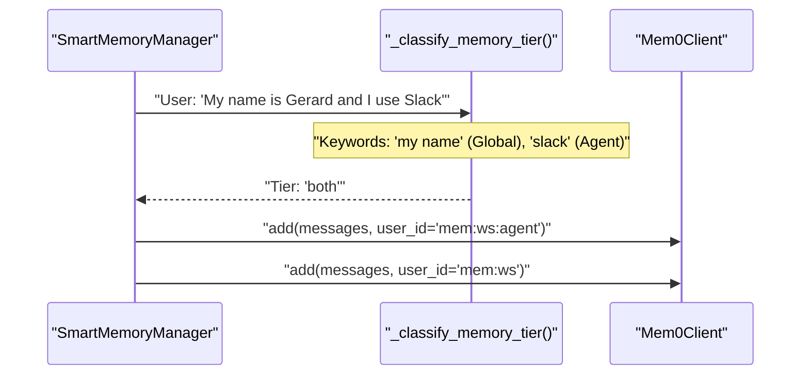

# Memory Lifecycle & Consolidation

<details>
<summary>Relevant source files</summary>

The following files were used as context for generating this wiki page:

- [docs/PRDS/137-AUTO-CHATBOT-RECOVERY.md](docs/PRDS/137-AUTO-CHATBOT-RECOVERY.md)
- [frontend/tsconfig.tsbuildinfo](frontend/tsconfig.tsbuildinfo)
- [orchestrator/config.py](orchestrator/config.py)
- [orchestrator/consumers/chatbot/integration.py](orchestrator/consumers/chatbot/integration.py)
- [orchestrator/consumers/chatbot/prompt_analyzer.py](orchestrator/consumers/chatbot/prompt_analyzer.py)
- [orchestrator/consumers/chatbot/smart_memory.py](orchestrator/consumers/chatbot/smart_memory.py)
- [orchestrator/consumers/chatbot/smart_orchestrator.py](orchestrator/consumers/chatbot/smart_orchestrator.py)
- [orchestrator/main.py](orchestrator/main.py)
- [orchestrator/modules/agents/queries.py](orchestrator/modules/agents/queries.py)
- [orchestrator/modules/context/sections/identity.py](orchestrator/modules/context/sections/identity.py)
- [orchestrator/modules/context/sections/skills.py](orchestrator/modules/context/sections/skills.py)
- [orchestrator/modules/context/sections/task_context.py](orchestrator/modules/context/sections/task_context.py)
- [orchestrator/modules/memory/context_router.py](orchestrator/modules/memory/context_router.py)
- [orchestrator/modules/memory/integrations/mem0_client.py](orchestrator/modules/memory/integrations/mem0_client.py)
- [orchestrator/modules/memory/unified_memory_service.py](orchestrator/modules/memory/unified_memory_service.py)
- [orchestrator/tests/test_unified_memory.py](orchestrator/tests/test_unified_memory.py)
- [scripts/ralph/IMPLEMENTATION_PLAN.md](scripts/ralph/IMPLEMENTATION_PLAN.md)
- [scripts/ralph/prd.json](scripts/ralph/prd.json)
- [scripts/ralph/progress.txt](scripts/ralph/progress.txt)

</details>


This page describes how memories flow through the 5-layer memory stack, from ephemeral session state to long-term facts. Specifically, it covers **session consolidation** (L1→L2), **Ebbinghaus decay** (L2 time-based archiving), and **promotion** (L2→L3 based on importance and access patterns).

---

## Overview

The memory lifecycle in Automatos AI is governed by the `UnifiedMemoryService` [orchestrator/modules/memory/unified_memory_service.py:154](), which acts as the central coordinator for the 5-layer stack. Memories move between layers based on temporal relevance, frequency of access, and importance scores.

1.  **L1 (Working/Session)**: Active conversation state stored in Redis [orchestrator/modules/memory/unified_memory_service.py:120-148]().
2.  **L2 (Short-term)**: Summarized session results and experiences stored in Postgres, subject to **Ebbinghaus decay** [orchestrator/config.py:98-103]().
3.  **L3 (Long-term)**: Extracted facts and persistent knowledge stored via Mem0 [orchestrator/modules/memory/integrations/mem0_client.py:77-105]().
4.  **L4 (Knowledge Graph)**: Deep organizational context; long-term memories are eventually folded into the graph via monthly archival jobs [orchestrator/config.py:116-123]().

### Memory Transition Architecture
Title: "Memory Transition Diagram (Code Entity Space)"
```mermaid
graph TB
    subgraph "L1: Working Memory (Redis)"
        Session["SessionMemory Class<br/>Key: mem:session:ws:conv<br/>TTL: 24h / 1h"]
    end
    
    subgraph "L2: Short-term (Postgres)"
        DailyLog["Daily Activity Logs<br/>Decay Rate: 0.1<br/>Archive Threshold: 0.3"]
    end
    
    subgraph "L3: Long-term (Mem0)"
        Mem0["Mem0Client.add()<br/>Namespace: mem:ws:agent<br/>Circuit Breaker Protected"]
    end

    Chat["StreamingChatService"] -->|store_exchange| Session
    Session -->|end_session()| Consolidation["Consolidation Job"]
    Consolidation -->|L1 to L2| DailyLog
    
    DailyLog -->|Promotion Logic| Promotion["Promotion Job"]
    Promotion -->|Importance > 0.7| Mem0
    
    DailyLog -->|Decay Logic| Decay["Decay Job"]
    Decay -->|Score < 0.3| Archival["Graphify Archival (L4)"]
```
**Sources:** [orchestrator/modules/memory/unified_memory_service.py:38-118](), [orchestrator/modules/memory/unified_memory_service.py:123-148](), [orchestrator/config.py:84-123](), [orchestrator/consumers/chatbot/smart_orchestrator.py:117-120]()

---

## L1 Session Consolidation

### Working Memory Lifecycle
Active conversations are managed as `SessionMemory` objects in Redis [orchestrator/modules/memory/unified_memory_service.py:123](). This layer tracks:
*   **Summary**: A running recap of the current conversation [orchestrator/modules/memory/unified_memory_service.py:132]().
*   **Decisions & Action Items**: Structured outputs extracted from the exchange [orchestrator/modules/memory/unified_memory_service.py:133-134]().
*   **Exchange Count**: Used to trigger periodic summarization [orchestrator/modules/memory/unified_memory_service.py:135]().

### The Consolidation Trigger
When a session is explicitly ended or the `MEMORY_SESSION_CONSOLIDATION_TTL_SECONDS` (default 3600s) expires [orchestrator/config.py:86-87](), the `UnifiedMemoryService` triggers consolidation. This process takes the L1 `SessionMemory` and flattens it into an L2 record (Daily Log) for the workspace [orchestrator/modules/memory/unified_memory_service.py:72-74]().

**Sources:** [orchestrator/modules/memory/unified_memory_service.py:123-148](), [orchestrator/config.py:84-87]()

---

## L2 Decay & Ebbinghaus Forgetting

### Decay Mechanism
Short-term memories (L2) are not permanent. They are subject to a decay algorithm based on the Ebbinghaus Forgetting Curve.
*   **Decay Rate**: Configured via `MEMORY_DECAY_RATE` (default 0.1) [orchestrator/config.py:98-99]().
*   **Archival Threshold**: When a memory's importance falls below `MEMORY_DECAY_ARCHIVE_THRESHOLD` (default 0.3), it is moved to inactive storage or folded into L4 [orchestrator/config.py:100-101]().

### Background Decay Jobs
The `MEMORY_DECAY_INTERVAL_SECONDS` (default 3600s) governs how often the background worker scans L2 memories to apply decay [orchestrator/config.py:112](). This ensures the context window isn't cluttered with stale, low-importance information.

**Sources:** [orchestrator/config.py:98-114]()

---

## L2 → L3 Promotion

### Promotion Criteria
Not all short-term memories are discarded. High-value memories are promoted to L3 (Mem0) based on two primary signals:
1.  **Importance Score**: Must meet `MEMORY_PROMOTION_MIN_IMPORTANCE` (default 0.7) [orchestrator/config.py:104-105]().
2.  **Access Frequency**: Frequently retrieved items (`MEMORY_PROMOTION_MIN_ACCESS_COUNT` >= 3) are deemed "facts" and promoted [orchestrator/config.py:106-107]().

### Fact Extraction (Mem0)
Promotion involves sending the memory content to `Mem0Client.add()` [orchestrator/modules/memory/integrations/mem0_client.py:176](). The `SmartMemoryManager` classifies whether these facts are `global`, `agent-specific`, or `both` [orchestrator/consumers/chatbot/smart_memory.py:92-168]().

Title: "Memory Promotion & Tier Classification"


**Sources:** [orchestrator/config.py:104-109](), [orchestrator/consumers/chatbot/smart_memory.py:92-168](), [orchestrator/modules/memory/integrations/mem0_client.py:176-200]()

---

## Reliability & Background Jobs

### Circuit Breaker
Since L3 promotion and retrieval rely on the external Mem0 API, the system implements a `_CircuitBreaker` [orchestrator/modules/memory/integrations/mem0_client.py:25-60]().
*   **Threshold**: Opens after 3 consecutive failures [orchestrator/modules/memory/integrations/mem0_client.py:29]().
*   **Cooldown**: Remains open for 300 seconds to prevent cascading failures in the chat loop [orchestrator/modules/memory/integrations/mem0_client.py:29]().

### Monthly Archival (L4)
Monthly archival jobs (`MEMORY_ARCHIVAL_CRON_DAY=1`) fold aged L2 and L3 memories into the workspace Business Knowledge Graph [orchestrator/config.py:116-123](). This represents the final stage of the memory lifecycle, where discrete facts become part of the organizational "God Node" graph.

| Parameter | Default Value | Purpose |
| :--- | :--- | :--- |
| `MEMORY_JOBS_ENABLED` | `true` | Master toggle for background consolidation/decay [orchestrator/config.py:114](). |
| `MEMORY_PROMOTION_HOUR_UTC` | `3` | Hour when the daily promotion job runs [orchestrator/config.py:113](). |
| `MEMORY_ARCHIVAL_L3_RETENTION_DAYS` | `180` | Days before L3 facts are folded into L4 graph [orchestrator/config.py:122](). |

**Sources:** [orchestrator/modules/memory/integrations/mem0_client.py:25-60](), [orchestrator/config.py:111-124]()

---