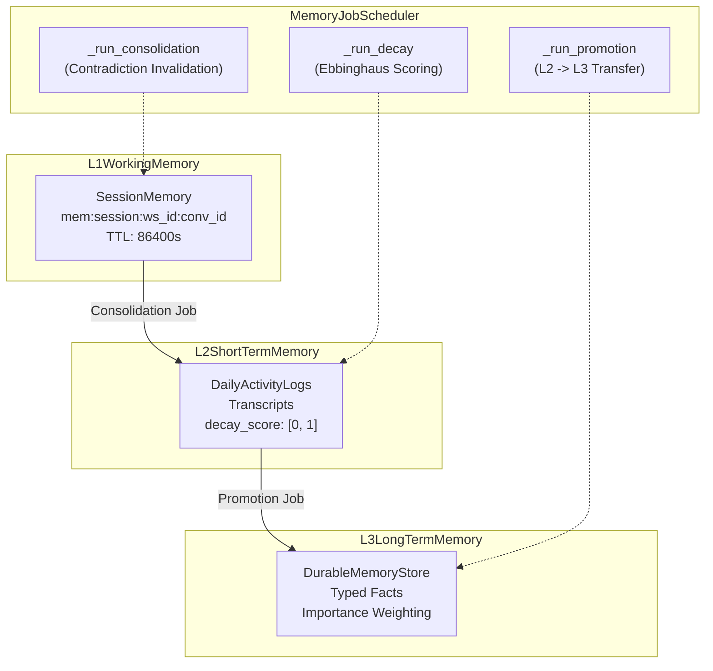
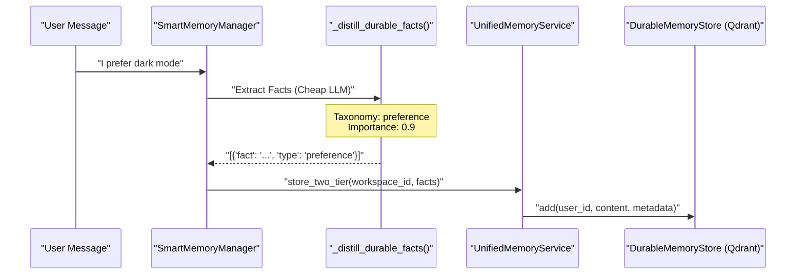
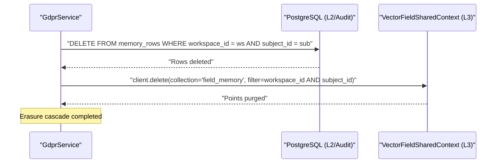

# Memory Lifecycle & Consolidation

Relevant source files

The following files were used as context for generating this wiki page:

- [frontend/components/missions/create-mission-modal.tsx](frontend/components/missions/create-mission-modal.tsx)
- [frontend/components/missions/index.ts](frontend/components/missions/index.ts)
- [frontend/components/missions/mission-card.tsx](frontend/components/missions/mission-card.tsx)
- [frontend/components/missions/mission-detail-page.tsx](frontend/components/missions/mission-detail-page.tsx)
- [frontend/components/missions/mission-field-inspector.tsx](frontend/components/missions/mission-field-inspector.tsx)
- [frontend/components/missions/mission-field-panel.tsx](frontend/components/missions/mission-field-panel.tsx)
- [frontend/components/missions/mission-field-viz.tsx](frontend/components/missions/mission-field-viz.tsx)
- [frontend/hooks/use-missions-api.ts](frontend/hooks/use-missions-api.ts)
- [frontend/types/missions.ts](frontend/types/missions.ts)
- [orchestrator/alembic/versions/prd123_checkpoint_count.py](orchestrator/alembic/versions/prd123_checkpoint_count.py)
- [orchestrator/alembic/versions/prd206_chat_summary.py](orchestrator/alembic/versions/prd206_chat_summary.py)
- [orchestrator/api/missions.py](orchestrator/api/missions.py)
- [orchestrator/consumers/chatbot/integration.py](orchestrator/consumers/chatbot/integration.py)
- [orchestrator/consumers/chatbot/smart_memory.py](orchestrator/consumers/chatbot/smart_memory.py)
- [orchestrator/consumers/chatbot/smart_orchestrator.py](orchestrator/consumers/chatbot/smart_orchestrator.py)
- [orchestrator/core/models/orchestration.py](orchestrator/core/models/orchestration.py)
- [orchestrator/core/models/orchestration_enums.py](orchestrator/core/models/orchestration_enums.py)
- [orchestrator/modules/context/adapters/vector_field.py](orchestrator/modules/context/adapters/vector_field.py)
- [orchestrator/modules/context/sections/memory.py](orchestrator/modules/context/sections/memory.py)
- [orchestrator/modules/coordination/dispatcher.py](orchestrator/modules/coordination/dispatcher.py)
- [orchestrator/modules/coordination/planner.py](orchestrator/modules/coordination/planner.py)
- [orchestrator/modules/coordination/primitive_heartbeat.py](orchestrator/modules/coordination/primitive_heartbeat.py)
- [orchestrator/modules/coordination/reconciler.py](orchestrator/modules/coordination/reconciler.py)
- [orchestrator/modules/coordination/verification.py](orchestrator/modules/coordination/verification.py)
- [orchestrator/modules/memory/context_router.py](orchestrator/modules/memory/context_router.py)
- [orchestrator/modules/memory/durable_store.py](orchestrator/modules/memory/durable_store.py)
- [orchestrator/modules/memory/recall_ranking.py](orchestrator/modules/memory/recall_ranking.py)
- [orchestrator/modules/memory/thread_checkpoint.py](orchestrator/modules/memory/thread_checkpoint.py)
- [orchestrator/modules/memory/unified_memory_service.py](orchestrator/modules/memory/unified_memory_service.py)
- [orchestrator/modules/tools/discovery/handlers_search.py](orchestrator/modules/tools/discovery/handlers_search.py)
- [orchestrator/services/coordinator_service.py](orchestrator/services/coordinator_service.py)
- [orchestrator/services/gdpr_service.py](orchestrator/services/gdpr_service.py)
- [orchestrator/services/memory_archival_job.py](orchestrator/services/memory_archival_job.py)
- [orchestrator/services/memory_jobs.py](orchestrator/services/memory_jobs.py)
- [orchestrator/tests/test_dispatcher_parallel.py](orchestrator/tests/test_dispatcher_parallel.py)
- [orchestrator/tests/test_l3_distill_input.py](orchestrator/tests/test_l3_distill_input.py)
- [orchestrator/tests/test_memory_restart_and_isolation.py](orchestrator/tests/test_memory_restart_and_isolation.py)
- [orchestrator/tests/test_memory_single_write_path.py](orchestrator/tests/test_memory_single_write_path.py)
- [orchestrator/tests/test_memory_stored_sse.py](orchestrator/tests/test_memory_stored_sse.py)
- [orchestrator/tests/test_mission_final_output_promotion.py](orchestrator/tests/test_mission_final_output_promotion.py)
- [orchestrator/tests/test_mission_retry_feeds_critique.py](orchestrator/tests/test_mission_retry_feeds_critique.py)
- [orchestrator/tests/test_p2w1_semantic_l2_recall.py](orchestrator/tests/test_p2w1_semantic_l2_recall.py)
- [orchestrator/tests/test_p2w2_gdpr_subject_tags.py](orchestrator/tests/test_p2w2_gdpr_subject_tags.py)
- [orchestrator/tests/test_prd181_gdpr.py](orchestrator/tests/test_prd181_gdpr.py)
- [orchestrator/tests/test_prd197_substrate.py](orchestrator/tests/test_prd197_substrate.py)
- [orchestrator/tests/test_prd206_recall_ranking.py](orchestrator/tests/test_prd206_recall_ranking.py)
- [orchestrator/tests/test_prd206_thread_checkpoint.py](orchestrator/tests/test_prd206_thread_checkpoint.py)
- [orchestrator/tests/test_recall_relevance_floor.py](orchestrator/tests/test_recall_relevance_floor.py)
- [orchestrator/tests/test_smart_orchestrator_store_exchange.py](orchestrator/tests/test_smart_orchestrator_store_exchange.py)
- [orchestrator/tests/test_unified_memory.py](orchestrator/tests/test_unified_memory.py)
- [orchestrator/tests/test_us011_context_budgets.py](orchestrator/tests/test_us011_context_budgets.py)
- [orchestrator/tests/test_w1s1_hotpath_telemetry.py](orchestrator/tests/test_w1s1_hotpath_telemetry.py)

This wiki page details the mechanics of session consolidation (L1→L2), Ebbinghaus decay scoring, promotion (L2→L3), background tasks managed by `MemoryJobScheduler`, and GDPR-compliant memory erasure cascades across memory tiers.

---

## 1. Overview & Architecture

Memories in Automatos AI transition through a structured hierarchy managed by `UnifiedMemoryService` [orchestrator/modules/memory/unified_memory_service.py:161-170]() and background workers coordinated by `MemoryJobScheduler` [orchestrator/services/memory_jobs.py:32-44](). The system maintains strict tenant separation via workspace scoping and handles automated decay, promotion, and purging.

### Memory Transition & Background Jobs
Title: "Memory Transition and Background Jobs Architecture"

**Sources:** [orchestrator/modules/memory/unified_memory_service.py:8-13](), [orchestrator/modules/memory/unified_memory_service.py:82-85](), [orchestrator/services/memory_jobs.py:4-19]()

---

## 2. L1 Working Memory & Session Consolidation (L1 → L2)

### Session State (`SessionMemory`)
`SessionMemory` tracks the conversation `summary`, `exchange_count`, and `ended` boolean flag in Redis [orchestrator/modules/memory/unified_memory_service.py:128-140](). Keys are generated using `MemoryNamespace.session(conversation_id)` [orchestrator/modules/memory/unified_memory_service.py:82-85](). This layer ensures low-latency context retrieval across immediate browser interactions within a 24-hour window.

### Consolidation Mechanics
The background job `JOB_ID_CONSOLIDATION` [orchestrator/services/memory_jobs.py:35]() processes active session closures:
* Summarizes raw transcript exchanges into structured text blocks.
* Identifies contradictions against existing L3 facts and invalidates superseded entries [orchestrator/services/memory_jobs.py:7-9]().
* Flushes consolidated session records into L2 short-term tables via `UnifiedMemoryService` [orchestrator/modules/memory/unified_memory_service.py:161-190]().

**Sources:** [orchestrator/modules/memory/unified_memory_service.py:82-85](), [orchestrator/modules/memory/unified_memory_service.py:128-140](), [orchestrator/services/memory_jobs.py:32-35]()

---

## 3. L2 Short-term Memory & Ebbinghaus Decay

### Ebbinghaus Decay Scoring
Short-term records in L2 are governed by an hourly decay sweep (`JOB_ID_DECAY`) [orchestrator/services/memory_jobs.py:36]() which evaluates the `decay_score` of each row:
* **Decay Curve**: Scores decrease over time following an Ebbinghaus retention curve parameterized by `MEMORY_DECAY_RATE` (default `0.004`) [orchestrator/tests/test_unified_memory.py:47-48]().
* **Archival Threshold**: Items dropping below `MEMORY_DECAY_ARCHIVE_THRESHOLD` (default `0.3`) are pruned from hot L2 query sets and moved to archival storage [orchestrator/services/memory_jobs.py:12-13]().

### Daily Temporal Logs
Daily activity is aggregated under namespaces created by `MemoryNamespace.daily()` [orchestrator/modules/memory/unified_memory_service.py:72-74](). These summaries provide chronological context injected via `MemorySection` during prompt assembly [orchestrator/modules/context/sections/memory.py:33-37]().

**Sources:** [orchestrator/modules/memory/unified_memory_service.py:72-74](), [orchestrator/services/memory_jobs.py:11-13](), [orchestrator/services/memory_jobs.py:36](), [orchestrator/tests/test_unified_memory.py:47-48]()

---

## 4. Promotion to L3 Long-term Memory (L2 → L3)

### Promotion Logic (`JOB_ID_PROMOTION`)
The promotion background job runs daily at 03:00 UTC to evaluate L2 records for promotion to the durable Qdrant backend (`DurableMemoryStore`) [orchestrator/services/memory_jobs.py:37, 89-96]().
* **Importance Policy**: Verifies that extracted facts meet type-specific importance floors (`0.5` for high-signal types like `user_fact` or `preference`, `0.7` for general facts) [orchestrator/tests/test_unified_memory.py:50-52]().
* **Deduplication**: Computes content hashes to prevent duplicate entries from being written into Qdrant collections [orchestrator/services/memory_jobs.py:18]().

### Fact Distillation Pipeline
During chat turns, `SmartMemoryManager._distill_durable_facts` invokes a lightweight LLM (`MEMORY_DISTILL_MODEL`) to parse raw text into a structured taxonomy (`tool_outcome`, `task_learning`, `playbook_pattern`, `user_fact`, `business_fact`, `preference`, `procedure`) [orchestrator/consumers/chatbot/smart_memory.py:109-137](), [orchestrator/tests/test_l3_distill_input.py:7-10]().

### Fact Distillation & Storage Flow
Title: "Memory Distillation and Storage Data Flow"

**Sources:** [orchestrator/consumers/chatbot/smart_memory.py:109-137](), [orchestrator/services/memory_jobs.py:37](), [orchestrator/services/memory_jobs.py:89-96](), [orchestrator/tests/test_l3_distill_input.py:7-16]()

---

## 5. Background Maintenance Jobs (`memory_jobs.py`)

The `MemoryJobScheduler` orchestrates the complete lifecycle of memory maintenance across the system:

| Job ID | Frequency | Target / Purpose |
| :--- | :--- | :--- |
| `JOB_ID_CONSOLIDATION` | Hourly | Resolves contradictions and merges duplicate L3 memories [orchestrator/services/memory_jobs.py:35](). |
| `JOB_ID_DECAY` | Hourly | Applies Ebbinghaus decay formulas to L2 items [orchestrator/services/memory_jobs.py:36](). |
| `JOB_ID_PROMOTION` | Daily (03:00) | Promotes qualified L2 short-term records to L3 Qdrant store [orchestrator/services/memory_jobs.py:37, 89-96](). |
| `JOB_ID_ARCHIVAL` | Monthly | Offloads stale memory tiers into workspace knowledge graphs [orchestrator/services/memory_jobs.py:38, 98](). |
| `JOB_ID_AUDIT_RETENTION` | Daily | Cleans up expired audit trails and execution ledgers [orchestrator/services/memory_jobs.py:39, 114-118](). |
| `JOB_ID_SNAPSHOT` | Daily | Backs up vector memory planes to S3 object storage [orchestrator/services/memory_jobs.py:40, 129-132](). |
| `JOB_ID_THREAD_CHECKPOINT` | 15 Minutes | Checkpoints idle chat threads and extracts new decisions [orchestrator/services/memory_jobs.py:42, 160-163](). |

**Sources:** [orchestrator/services/memory_jobs.py:32-44](), [orchestrator/services/memory_jobs.py:98-176]()

---

## 6. GDPR Erasure of Memory

### Erasure Architecture
To comply with GDPR data subject access rights, `GdprService` executes complete memory erasure cascades across all persistent tiers. Because memories span relational tables (Postgres L2) and vector collections (Qdrant L3 / `VectorFieldSharedContext`), erasure requires coordinated multi-store deletions.

### Subject-Tag Filtering & Deletion
Every durable vector point created within shared vector spaces maintains a keyword-indexed `subject_id` payload field [orchestrator/modules/context/adapters/vector_field.py:144-147](). When an erasure request is received:
1. `GdprService` targets the given `workspace_id` and `subject_id`.
2. Issues filtered delete queries across Postgres L2 activity tables and daily log stores.
3. Executes a Qdrant payload-filter delete against the `field_memory` collection matching `workspace_id` and `subject_id`.

### GDPR Memory Erasure Data Flow
Title: "GDPR Memory Erasure Data Flow"

**Sources:** [orchestrator/services/gdpr_service.py](), [orchestrator/modules/context/adapters/vector_field.py:144-147](), [orchestrator/tests/test_prd181_gdpr.py](), [orchestrator/tests/test_p2w2_gdpr_subject_tags.py]()

---