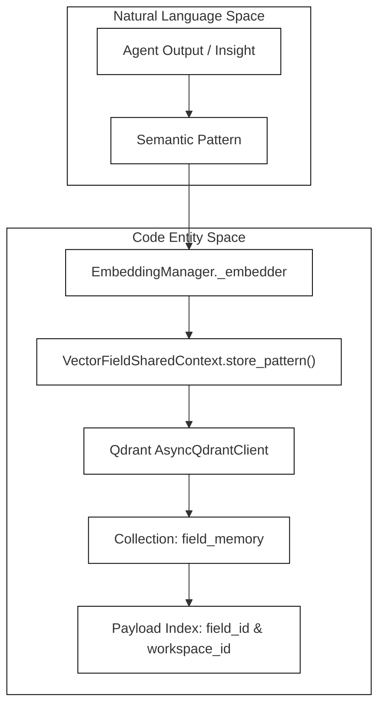
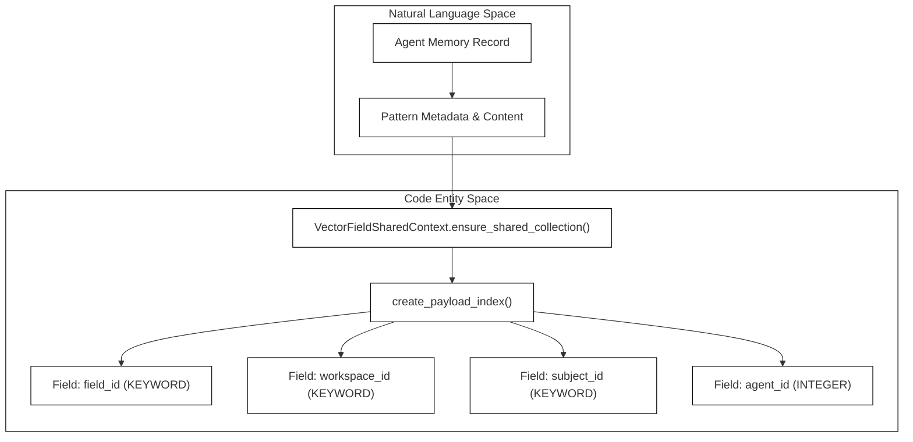

# Shared Field Memory (Vector Field)

<details>
<summary>Relevant source files</summary>

The following files were used as context for generating this wiki page:

- [frontend/components/missions/create-mission-modal.tsx](frontend/components/missions/create-mission-modal.tsx)
- [frontend/components/missions/index.ts](frontend/components/missions/index.ts)
- [frontend/components/missions/mission-card.tsx](frontend/components/missions/mission-card.tsx)
- [frontend/components/missions/mission-detail-page.tsx](frontend/components/missions/mission-detail-page.tsx)
- [frontend/components/missions/mission-field-inspector.tsx](frontend/components/missions/mission-field-inspector.tsx)
- [frontend/components/missions/mission-field-panel.tsx](frontend/components/missions/mission-field-panel.tsx)
- [frontend/components/missions/mission-field-viz.tsx](frontend/components/missions/mission-field-viz.tsx)
- [frontend/hooks/use-missions-api.ts](frontend/hooks/use-missions-api.ts)
- [frontend/types/missions.ts](frontend/types/missions.ts)
- [orchestrator/alembic/versions/prd123_checkpoint_count.py](orchestrator/alembic/versions/prd123_checkpoint_count.py)
- [orchestrator/api/missions.py](orchestrator/api/missions.py)
- [orchestrator/core/llm/clients/openrouter_embedding.py](orchestrator/core/llm/clients/openrouter_embedding.py)
- [orchestrator/core/models/orchestration.py](orchestrator/core/models/orchestration.py)
- [orchestrator/core/models/orchestration_enums.py](orchestrator/core/models/orchestration_enums.py)
- [orchestrator/modules/context/adapters/vector_field.py](orchestrator/modules/context/adapters/vector_field.py)
- [orchestrator/modules/coordination/dispatcher.py](orchestrator/modules/coordination/dispatcher.py)
- [orchestrator/modules/coordination/planner.py](orchestrator/modules/coordination/planner.py)
- [orchestrator/modules/coordination/primitive_heartbeat.py](orchestrator/modules/coordination/primitive_heartbeat.py)
- [orchestrator/modules/coordination/reconciler.py](orchestrator/modules/coordination/reconciler.py)
- [orchestrator/modules/coordination/verification.py](orchestrator/modules/coordination/verification.py)
- [orchestrator/modules/memory/durable_store.py](orchestrator/modules/memory/durable_store.py)
- [orchestrator/services/coordinator_service.py](orchestrator/services/coordinator_service.py)
- [orchestrator/services/gdpr_service.py](orchestrator/services/gdpr_service.py)
- [orchestrator/tests/test_dispatcher_parallel.py](orchestrator/tests/test_dispatcher_parallel.py)
- [orchestrator/tests/test_mission_final_output_promotion.py](orchestrator/tests/test_mission_final_output_promotion.py)
- [orchestrator/tests/test_mission_retry_feeds_critique.py](orchestrator/tests/test_mission_retry_feeds_critique.py)
- [orchestrator/tests/test_openrouter_embedding_routing.py](orchestrator/tests/test_openrouter_embedding_routing.py)
- [orchestrator/tests/test_p2w2_gdpr_subject_tags.py](orchestrator/tests/test_p2w2_gdpr_subject_tags.py)
- [orchestrator/tests/test_prd181_gdpr.py](orchestrator/tests/test_prd181_gdpr.py)
- [orchestrator/tests/test_w1s1_hotpath_telemetry.py](orchestrator/tests/test_w1s1_hotpath_telemetry.py)
- [tools/benchmark_field_memory.py](tools/benchmark_field_memory.py)
- [tools/benchmark_results/benchmark_redis_20260330_135424.json](tools/benchmark_results/benchmark_redis_20260330_135424.json)
- [tools/benchmark_results/benchmark_redis_parallel_20260330_164310.json](tools/benchmark_results/benchmark_redis_parallel_20260330_164310.json)
- [tools/benchmark_results/benchmark_vector_field_20260330_133126.json](tools/benchmark_results/benchmark_vector_field_20260330_133126.json)
- [tools/benchmark_results/benchmark_vector_field_parallel_20260330_145313.json](tools/benchmark_results/benchmark_vector_field_parallel_20260330_145313.json)
- [tools/benchmark_results/benchmark_vector_field_parallel_20260330_152355.json](tools/benchmark_results/benchmark_vector_field_parallel_20260330_152355.json)
- [tools/benchmark_results/benchmark_vector_field_parallel_20260330_155229.json](tools/benchmark_results/benchmark_vector_field_parallel_20260330_155229.json)
- [tools/compare_benchmarks.py](tools/compare_benchmarks.py)

</details>


## Purpose and Scope
This page details the implementation of the **Shared Field Memory** subsystem (`VectorFieldSharedContext`), which powers real-time semantic knowledge sharing across AI agents operating within Automatos AI missions. Rather than relying on isolated conversation histories or fragmented message stores, agents inject patterns into and query from a unified Qdrant vector collection (`field_memory`). This page covers the architectural design, payload schema, mathematical models for resonance and decay, prompt section assembly, benchmark tooling, and frontend visualization components.

---

## 1. Architecture of `VectorFieldSharedContext`

The shared vector field is implemented by `VectorFieldSharedContext`, which conforms to the `SharedContextPort` interface `[orchestrator/modules/context/adapters/vector_field.py:68-78]()`. It provides a swappable alternative to Redis-based shared context `[orchestrator/modules/context/adapters/vector_field.py:5-7]()`.

Unlike multi-collection architectures that scale linearly with the number of active missions, Automatos AI uses a **single shared Qdrant collection** named `field_memory` `[orchestrator/modules/context/adapters/vector_field.py:50]`. Tenant and mission isolation are enforced via payload filtering on `field_id` and `workspace_id` `[orchestrator/modules/context/adapters/vector_field.py:75-78]()`.


*Sources: [orchestrator/modules/context/adapters/vector_field.py:48-97]()*, [orchestrator/modules/context/adapters/vector_field.py:114-162]()

---

## 2. Payload Schema & Indexing

When `VectorFieldSharedContext` initializes, it ensures the `field_memory` collection exists with 2048-dimensional vectors configured for cosine distance and on-disk payload storage `[orchestrator/modules/context/adapters/vector_field.py:121-137]()`. 

Payload indexes are established idempotently on boot for filtering performance and GDPR compliance `[orchestrator/modules/context/adapters/vector_field.py:140-161]()`:
* `field_id`: Scopes patterns to a specific mission run.
* `workspace_id`: Scopes recall across a tenant workspace `[orchestrator/modules/context/adapters/vector_field.py:143]()`.
* `subject_id`: Keyword-indexed for subject-level GDPR erasure cascades (`workspace_id` + `subject_id`) `[orchestrator/modules/context/adapters/vector_field.py:145-146]()`.
* `content_hash`: Prevents duplicate semantic insertions.
* `agent_id`: Tracks the originating agent `[orchestrator/modules/context/adapters/vector_field.py:148]()`.
* `created_at`: Temporal ordering and decay calculations `[orchestrator/modules/context/adapters/vector_field.py:149]()`.


*Sources: [orchestrator/modules/context/adapters/vector_field.py:114-162]()*

---

## 3. Resonance, Decay, and Attractors

Agents interacting within a mission share a collective cognitive state driven by mathematical resonance rather than strict insertion order `[orchestrator/modules/context/adapters/vector_field.py:71-73]()`.

### Scoring Mechanics
Query-time relevance is evaluated via **resonance** `[orchestrator/modules/context/adapters/vector_field.py:15]()`:
$$\text{Resonance} = \text{cosine\_similarity}^2 \times \text{decayed\_strength}$$

The underlying scoring parameters are governed by `field_scoring.ScoringParams` `[orchestrator/modules/context/adapters/vector_field.py:101-110]()`:
* `decay_rate`: Controls how rapidly inactive patterns lose potency over time.
* `reinforce_bonus`: Boosts strength when a pattern is repeatedly accessed or reinforced by multiple agents.
* `reinforce_cap`: Upper ceiling for pattern strength.
* `archival_threshold`: Threshold below which points are marked for compaction.

Background compaction passes execute bounded sweeps, returning a `CompactionResult` containing prune counts and scroll offsets `[orchestrator/modules/context/adapters/vector_field.py:53-66]`.

*Sources: [orchestrator/modules/context/adapters/vector_field.py:15-17]*, [orchestrator/modules/context/adapters/vector_field.py:101-110]()

---

## 4. Field Sections in Prompts & Mission Digests

During task execution and mission planning, task outputs are sanitized and injected into downstream prompts as context digests `[orchestrator/services/coordinator_service.py:105-119]()`.

To prevent base-64 image blobs or excessive raw outputs from exhausting token budgets, `_sanitize_for_field()` strips binary data and bounds character lengths `[orchestrator/services/coordinator_service.py:115-119]()`:

```python
def _sanitize_for_field(raw: str) -> str:
    """Strip inline base64 image blobs before a task output enters dispatch context."""
    return _BASE64_IMAGE_RE.sub("[image — see generated-images API]", raw or "")
```

*Sources: [orchestrator/services/coordinator_service.py:105-119]()*, [orchestrator/modules/coordinator_service.py:1-160]()

---

## 5. Benchmarks in `tools/`

Performance characteristics, vector search latency, and parallel throughput of the `field_memory` collection are evaluated via automated benchmarking suites stored under `tools/` `[tools/benchmark_field_memory.py]()`. 

Benchmark scripts simulate concurrent agent access patterns, measuring scaling behavior across varying point counts and concurrency levels. Results are serialized into JSON report files under `tools/benchmark_results/` (e.g., `benchmark_vector_field_parallel_20260330_155229.json`), enabling regression tracking against Redis and pgvector baselines via `tools/compare_benchmarks.py`.

*Sources: [tools/benchmark_field_memory.py]()*, [tools/compare_benchmarks.py]()

---

## 6. Frontend Integration & Visualization

Operators inspect the shared field state in real-time through the frontend mission monitoring dashboard `[frontend/components/missions/mission-field-panel.tsx:115-181]()`.

The UI component hierarchy consists of:
* `MissionFieldPanel`: Manages field scope selection (`mission` vs `workspace`) and handles backend availability states (`active`, `missing`, `unavailable`) `[frontend/components/missions/mission-field-panel.tsx:115-181]()`.
* `MissionFieldViz`: A dynamic 3D WebGL visualization loaded client-side via Next.js dynamic imports, rendering agent nodes, semantic clusters, and decay gradients `[frontend/components/missions/mission-field-panel.tsx:10-13]()`.

*Sources: [frontend/components/missions/mission-field-panel.tsx:1-181]()*, [frontend/components/missions/mission-field-viz.tsx]()

---