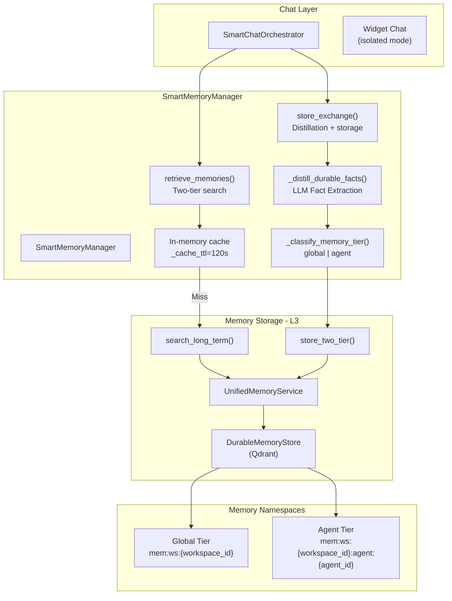
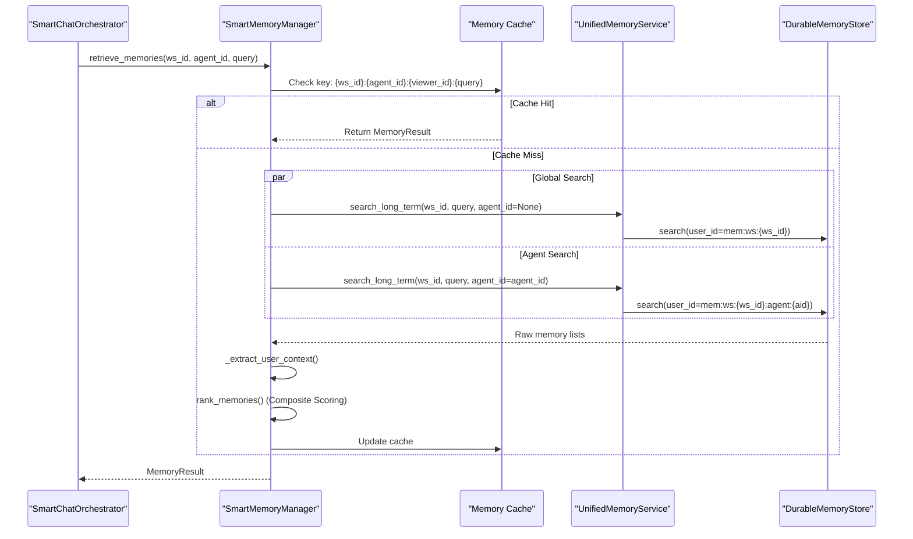

# SmartMemoryManager

Relevant source files

The following files were used as context for generating this wiki page:

- [orchestrator/alembic/versions/prd206_chat_summary.py](orchestrator/alembic/versions/prd206_chat_summary.py)
- [orchestrator/consumers/chatbot/integration.py](orchestrator/consumers/chatbot/integration.py)
- [orchestrator/consumers/chatbot/smart_memory.py](orchestrator/consumers/chatbot/smart_memory.py)
- [orchestrator/consumers/chatbot/smart_orchestrator.py](orchestrator/consumers/chatbot/smart_orchestrator.py)
- [orchestrator/modules/context/sections/memory.py](orchestrator/modules/context/sections/memory.py)
- [orchestrator/modules/memory/context_router.py](orchestrator/modules/memory/context_router.py)
- [orchestrator/modules/memory/recall_ranking.py](orchestrator/modules/memory/recall_ranking.py)
- [orchestrator/modules/memory/thread_checkpoint.py](orchestrator/modules/memory/thread_checkpoint.py)
- [orchestrator/modules/memory/unified_memory_service.py](orchestrator/modules/memory/unified_memory_service.py)
- [orchestrator/modules/tools/discovery/handlers_search.py](orchestrator/modules/tools/discovery/handlers_search.py)
- [orchestrator/services/memory_archival_job.py](orchestrator/services/memory_archival_job.py)
- [orchestrator/services/memory_jobs.py](orchestrator/services/memory_jobs.py)
- [orchestrator/tests/test_l3_distill_input.py](orchestrator/tests/test_l3_distill_input.py)
- [orchestrator/tests/test_memory_restart_and_isolation.py](orchestrator/tests/test_memory_restart_and_isolation.py)
- [orchestrator/tests/test_memory_single_write_path.py](orchestrator/tests/test_memory_single_write_path.py)
- [orchestrator/tests/test_memory_stored_sse.py](orchestrator/tests/test_memory_stored_sse.py)
- [orchestrator/tests/test_p2w1_semantic_l2_recall.py](orchestrator/tests/test_p2w1_semantic_l2_recall.py)
- [orchestrator/tests/test_prd197_substrate.py](orchestrator/tests/test_prd197_substrate.py)
- [orchestrator/tests/test_prd206_recall_ranking.py](orchestrator/tests/test_prd206_recall_ranking.py)
- [orchestrator/tests/test_prd206_thread_checkpoint.py](orchestrator/tests/test_prd206_thread_checkpoint.py)
- [orchestrator/tests/test_recall_relevance_floor.py](orchestrator/tests/test_recall_relevance_floor.py)
- [orchestrator/tests/test_smart_orchestrator_store_exchange.py](orchestrator/tests/test_smart_orchestrator_store_exchange.py)
- [orchestrator/tests/test_unified_memory.py](orchestrator/tests/test_unified_memory.py)
- [orchestrator/tests/test_us011_context_budgets.py](orchestrator/tests/test_us011_context_budgets.py)

The `SmartMemoryManager` provides intelligent memory management for chatbot interactions within the Automatos AI platform. It orchestrates two-tier memory retrieval (global workspace memories + agent-specific memories), performs smart storage classification via distillation, and handles daily activity logging. This system acts as a high-level manager between the chat interface and the `UnifiedMemoryService`.

For lower-level memory storage operations, see [UnifiedMemoryService](3.2). For prompt assembly with memory injection, see [Context Service](4).

---

## Architecture Overview

The `SmartMemoryManager` is the primary interface used by the `SmartChatOrchestrator` to interact with the multi-layered memory system. It abstracts the complexity of searching across different `MemoryNamespace` scopes and handles the logic for extracting user-specific facts like names and preferences.

### System Data Flow

**Sources:**
- [orchestrator/consumers/chatbot/smart_memory.py:63-85]()
- [orchestrator/modules/memory/unified_memory_service.py:161-196]()
- [orchestrator/consumers/chatbot/smart_orchestrator.py:148-154]()

---

## Core Classes and Data Structures

### UserContext
A dataclass that holds extracted user facts from memories. This is used to personalize the system prompt by identifying names and preferences.

| Field | Type | Description |
|-------|------|-------------|
| `name` | `Optional[str]` | User's name extracted from memories |
| `preferences` | `List[str]` | User preferences ("I prefer...", "I like...") |
| `facts` | `List[str]` | General facts about the user |
| `recent_topics` | `List[str]` | Recently discussed topics |

**Sources:**
- [orchestrator/consumers/chatbot/smart_memory.py:40-52]()

### MemoryResult
The unified return type for retrieval operations, containing both raw data and processed context.

| Field | Type | Description |
|-------|------|-------------|
| `memories` | `List[Dict[str, Any]]` | Raw memory items from the durable store |
| `user_context` | `UserContext` | Extracted user context |
| `formatted_context` | `str` | LLM-ready formatted string |
| `retrieval_time_ms` | `float` | Query execution time |

**Sources:**
- [orchestrator/consumers/chatbot/smart_memory.py:55-61]()

---

## Two-Tier Memory Retrieval

The system performs parallel searches across two distinct tiers to provide both general user context and agent-specific patterns.

### Retrieval Logic
1. **Global Tier**: Searches memories scoped to the `workspace_id`. These contain facts about the user that apply across all agents.
2. **Agent Tier**: Searches memories scoped to the `workspace_id` AND `agent_id`. These contain patterns specific to how the user interacts with a particular agent.

### Retrieval Sequence

**Sources:**
- [orchestrator/consumers/chatbot/smart_memory.py:151-240]()
- [orchestrator/modules/memory/recall_ranking.py:91-119]()

### Widget Mode Isolation
When `widget_mode` is enabled, the `SmartMemoryManager` strictly restricts retrieval to the **Agent Tier** only. This prevents external widget users from accessing global workspace memories.

**Sources:**
- [orchestrator/consumers/chatbot/smart_memory.py:157-158]()
- [orchestrator/consumers/chatbot/smart_memory.py:190-193]()

---

## Memory Storage & Distillation

The system uses a distillation pattern to ensure only durable, high-value facts reach the L3 memory layer, rather than raw interaction logs.

### Distillation Process
Before storage, the conversation turn is sent to a low-cost LLM tier (`MEMORY_DISTILL_MODEL`) to extract typed facts.
* **Taxonomy**: Facts are categorized into types like `user_fact`, `preference`, `business_fact`, `procedure`, `tool_outcome`, or `task_learning`.
* **Importance**: The LLM assigns an importance score between `0` and `1`.
* **Filtering**: If no durable facts are found, the L3 write is skipped entirely.

**Sources:**
- [orchestrator/consumers/chatbot/smart_memory.py:441-490]()
- [orchestrator/modules/memory/write_contract.py:32-36]()
- [orchestrator/tests/test_l3_distill_input.py:7-16]()

### Tier Selection Rules
The `_classify_memory_tier()` method determines if a fact belongs to the `global` workspace namespace or the `agent` namespace.
* **Agent Tier**: Used for explicit agent-scoped instructions (e.g., "Always cc this channel when using this agent").
* **Global Tier**: The default for all other facts to prevent redundant multi-namespace writing.

**Sources:**
- [orchestrator/consumers/chatbot/smart_memory.py:109-137]()

---

## Composite Recall Ranking

Memories are not just ranked by semantic similarity. The `recall_ranking` module applies a composite score to prioritize memories that are more relevant to the current user context.

### Scoring Factors
The final score is calculated as: `semantic × recency-decay × importance × pin-boost × same-page × same-project`.

| Factor | Logic |
| :--- | :--- |
| **Recency** | Score halves per `half_life_days` (default 30). |
| **Importance** | Maps [0, 1] importance to a [0.5, 1.5] multiplier. |
| **Pin Boost** | Multiplies score by 2.0 if the memory is pinned. |
| **Context Boost** | Multiplies by 1.15 if the memory matches the current page or project. |

**Sources:**
- [orchestrator/modules/memory/recall_ranking.py:51-88]()
- [orchestrator/tests/test_prd206_recall_ranking.py:53-69]()

---

## Integration with Chat Orchestrator

The `SmartChatOrchestrator` uses the `SmartMemoryManager` during the `prepare_request` phase to fetch context and the `store_exchange` phase to persist learnings.

### Preparation Phase
1. Calls `retrieve_memories` to get relevant context.
2. Inject `MemorySection` into the `ContextService`.
3. The `ContextRouter` may also be used for richer temporal or knowledge-based queries.

**Sources:**
- [orchestrator/consumers/chatbot/smart_orchestrator.py:161-205]()
- [orchestrator/modules/context/sections/memory.py:75-101]()
- [orchestrator/modules/memory/context_router.py:107-126]()

### Storage Phase
After the assistant response is generated, `store_exchange` is called in a fire-and-forget background task to avoid blocking the user response.

**Sources:**
- [orchestrator/consumers/chatbot/smart_orchestrator.py:36-51]()
- [orchestrator/consumers/chatbot/smart_orchestrator.py:375-400]()

---