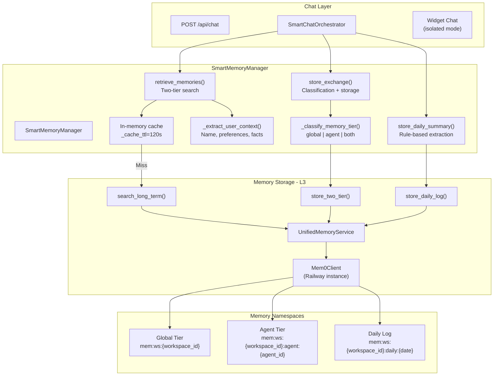
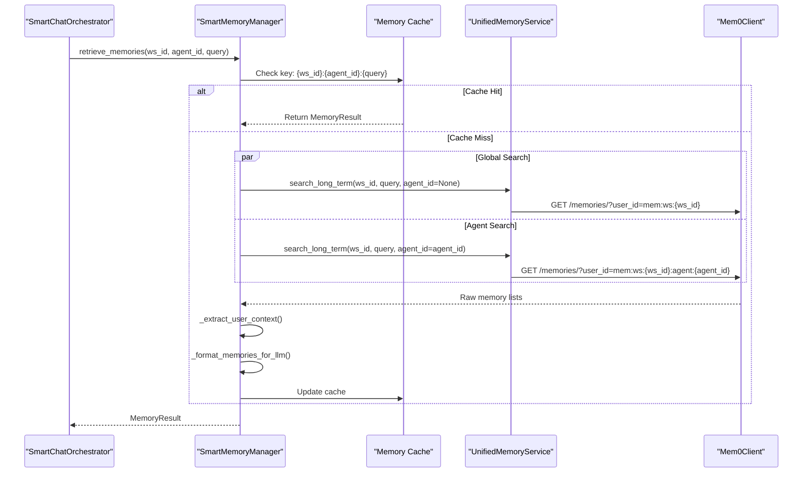
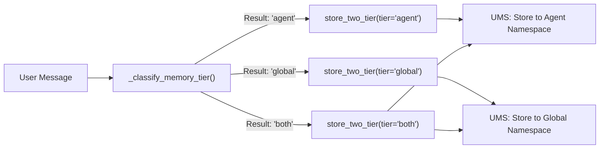

# SmartMemoryManager

Relevant source files

The following files were used as context for generating this wiki page:

- [docs/PRDS/55-AUTONOMOUS-ASSISTANT-PLATFORM.md](docs/PRDS/55-AUTONOMOUS-ASSISTANT-PLATFORM.md)
- [docs/reviews/COMPOSIO-TOOL-REGRESSION-REVIEW.md](docs/reviews/COMPOSIO-TOOL-REGRESSION-REVIEW.md)
- [frontend/components/auth/sign-up-form.tsx](frontend/components/auth/sign-up-form.tsx)
- [orchestrator/alembic/versions/20260215_add_heartbeat_and_channels.py](orchestrator/alembic/versions/20260215_add_heartbeat_and_channels.py)
- [orchestrator/api/channels.py](orchestrator/api/channels.py)
- [orchestrator/api/chat.py](orchestrator/api/chat.py)
- [orchestrator/api/chat_voice.py](orchestrator/api/chat_voice.py)
- [orchestrator/api/heartbeat.py](orchestrator/api/heartbeat.py)
- [orchestrator/channels/base.py](orchestrator/channels/base.py)
- [orchestrator/channels/discord_adapter.py](orchestrator/channels/discord_adapter.py)
- [orchestrator/channels/google_chat_adapter.py](orchestrator/channels/google_chat_adapter.py)
- [orchestrator/channels/line_adapter.py](orchestrator/channels/line_adapter.py)
- [orchestrator/channels/manager.py](orchestrator/channels/manager.py)
- [orchestrator/channels/slack_adapter.py](orchestrator/channels/slack_adapter.py)
- [orchestrator/consumers/chatbot/auto.py](orchestrator/consumers/chatbot/auto.py)
- [orchestrator/consumers/chatbot/intent_classifier.py](orchestrator/consumers/chatbot/intent_classifier.py)
- [orchestrator/consumers/chatbot/personality.py](orchestrator/consumers/chatbot/personality.py)
- [orchestrator/consumers/chatbot/service.py](orchestrator/consumers/chatbot/service.py)
- [orchestrator/consumers/chatbot/smart_memory.py](orchestrator/consumers/chatbot/smart_memory.py)
- [orchestrator/consumers/chatbot/smart_tool_router.py](orchestrator/consumers/chatbot/smart_tool_router.py)
- [orchestrator/core/llm/manager.py](orchestrator/core/llm/manager.py)
- [orchestrator/core/models/channels.py](orchestrator/core/models/channels.py)
- [orchestrator/core/routing/engine.py](orchestrator/core/routing/engine.py)
- [orchestrator/core/services/plugin_security_scanner.py](orchestrator/core/services/plugin_security_scanner.py)
- [orchestrator/modules/agents/__init__.py](orchestrator/modules/agents/__init__.py)
- [orchestrator/modules/agents/factory/__init__.py](orchestrator/modules/agents/factory/__init__.py)
- [orchestrator/modules/memory/integrations/mem0_client.py](orchestrator/modules/memory/integrations/mem0_client.py)
- [orchestrator/modules/orchestrator/service.py](orchestrator/modules/orchestrator/service.py)
- [orchestrator/modules/tools/discovery/actions_analytics_enhanced.py](orchestrator/modules/tools/discovery/actions_analytics_enhanced.py)
- [orchestrator/modules/tools/discovery/handlers_analytics_enhanced.py](orchestrator/modules/tools/discovery/handlers_analytics_enhanced.py)
- [orchestrator/modules/tools/discovery/handlers_search.py](orchestrator/modules/tools/discovery/handlers_search.py)
- [orchestrator/modules/tools/discovery/platform_actions.py](orchestrator/modules/tools/discovery/platform_actions.py)
- [orchestrator/modules/tools/discovery/platform_executor.py](orchestrator/modules/tools/discovery/platform_executor.py)
- [orchestrator/modules/tools/tool_router.py](orchestrator/modules/tools/tool_router.py)

The `SmartMemoryManager` provides intelligent memory management for chatbot interactions with two-tier memory retrieval (global workspace memories + agent-specific memories), smart storage classification, and daily activity logging. This system sits between the chat interface and the `UnifiedMemoryService`, orchestrating memory operations with workspace/agent scoping, caching, and user context extraction.

For lower-level memory storage operations, see [UnifiedMemoryService](3.2). For prompt assembly with memory injection, see [Context Service](4). For daily log retrieval in heartbeat operations, see [Heartbeat & Proactive Assistant](11).

---

## Architecture Overview

The `SmartMemoryManager` acts as the primary interface for the `SmartChatOrchestrator` to interact with the multi-layered memory system. It abstracts the complexity of searching across different `MemoryNamespace` scopes and handles the logic for extracting user-specific facts like names and preferences.

### System Data Flow

**Sources:**
- [orchestrator/consumers/chatbot/smart_memory.py:50-80]()
- [orchestrator/consumers/chatbot/service.py:161-165]()
- [orchestrator/modules/memory/integrations/mem0_client.py:66-98]()

---

## Core Classes and Data Structures

### UserContext
A dataclass that holds extracted user facts from memories. This is used to personalize the system prompt.

| Field | Type | Description |
|-------|------|-------------|
| `name` | `Optional[str]` | User's name extracted from memories |
| `preferences` | `List[str]` | User preferences ("I prefer...", "I like...") |
| `facts` | `List[str]` | General facts about the user |
| `recent_topics` | `List[str]` | Recently discussed topics |
| `last_interaction` | `Optional[datetime]` | Timestamp of last interaction |

**Sources:**
- [orchestrator/consumers/chatbot/smart_memory.py:26-38]()

### MemoryResult
The unified return type for retrieval operations, containing both raw data and processed context.

| Field | Type | Description |
|-------|------|-------------|
| `memories` | `List[Dict[str, Any]]` | Raw memory items from Mem0 |
| `user_context` | `UserContext` | Extracted user context |
| `formatted_context` | `str` | LLM-ready formatted string |
| `retrieval_time_ms` | `float` | Query execution time |

**Sources:**
- [orchestrator/consumers/chatbot/smart_memory.py:42-47]()

### SmartMemoryManager
The central class managing chat memory. It uses lazy initialization for the `UnifiedMemoryService` via the `unified_service` property and maintains a 120-second TTL cache to reduce latency.

**Sources:**
- [orchestrator/consumers/chatbot/smart_memory.py:50-80]()

---

## Two-Tier Memory Retrieval

The system performs parallel searches across two distinct tiers to provide both general user context and agent-specific tool patterns.

### Retrieval Logic

1.  **Global Tier**: Searches memories scoped to the `workspace_id`. These contain facts about the user that apply across all agents (e.g., "User's name is Alice").
2.  **Agent Tier**: Searches memories scoped to the `workspace_id` AND `agent_id`. These contain patterns specific to how the user interacts with a particular agent's tools.

### Retrieval Sequence

**Sources:**
- [orchestrator/consumers/chatbot/smart_memory.py:163-267]()
- [orchestrator/modules/memory/integrations/mem0_client.py:215-240]()

### Widget Mode Isolation
When `widget_mode` is enabled (e.g., for embedded customer support bots), the `SmartMemoryManager` strictly restricts retrieval to the **Agent Tier** only. This prevents a widget user from accessing global workspace memories.

**Sources:**
- [orchestrator/consumers/chatbot/smart_memory.py:169-170]()
- [orchestrator/consumers/chatbot/smart_memory.py:201-219]()

---

## Memory Storage Classification

The `_classify_memory_tier()` method determines where a conversation exchange should be stored based on keyword analysis of the user's message.

### Tier Selection Rules

| Category | Keywords | Target Tier |
| :--- | :--- | :--- |
| **Strong Agent** | "always cc", "default channel", "send to", "@" | `agent` |
| **Personal** | "my name", "i work at", "i live in" | `global` |
| **Tool/Workflow** | "slack", "github", "jira", "spreadsheet" | `agent` |
| **Preferences** | "prefer", "favorite", "my style" | `both` |
| **Mixed** | Personal + Tool keywords | `both` |

**Sources:**
- [orchestrator/consumers/chatbot/smart_memory.py:81-157]()

### Storage Process

**Sources:**
- [orchestrator/consumers/chatbot/smart_memory.py:375-465]()

---

## Daily Log System

The `SmartMemoryManager` maintains a temporal record of activities using the "Daily Log" system.

### Extraction Logic
The `_extract_summary_from_exchange()` function uses regex to identify topics, tools (platform actions or external apps), and decisions.

### Log Storage and Retrieval
Logs are stored in Mem0 using a date-based namespace: `mem:ws:{workspace_id}:daily:{YYYY-MM-DD}`. When the orchestrator prepares a request, it calls `get_daily_logs()`, which retrieves today's and yesterday's logs.

**Sources:**
- [orchestrator/consumers/chatbot/smart_memory.py:471-531]()
- [orchestrator/consumers/chatbot/smart_memory.py:621-704]()

---

## Circuit Breaker and Resilience

To prevent slow Mem0 responses from hanging the chat interface, the `Mem0Client` implements a circuit breaker.

### Circuit Breaker Configuration
*   **Failure Threshold**: 5 consecutive failures [orchestrator/modules/memory/integrations/mem0_client.py:21-21]().
*   **Cooldown**: 60 seconds [orchestrator/modules/memory/integrations/mem0_client.py:22-22]().
*   **Max Retries**: 1 retry with exponential backoff [orchestrator/modules/memory/integrations/mem0_client.py:24-24]().

**Sources:**
- [orchestrator/modules/memory/integrations/mem0_client.py:20-63]()
- [orchestrator/modules/memory/integrations/mem0_client.py:100-141]()

---

## Memory Stats and Monitoring

The system provides a specialized API for monitoring memory health and usage across tiers.

### Memory Stats API
The `GET /api/v1/memory/stats/real` endpoint queries the `UnifiedMemoryService` to aggregate counts and calculate a **Hit Rate** based on the `memory_access_log` table.

**Sources:**
- [orchestrator/modules/tools/discovery/platform_executor.py:183-183]()
- [orchestrator/modules/tools/discovery/platform_executor.py:51-51]()

---

## Implementation Summary Table

| Component | File Path | Role |
| :--- | :--- | :--- |
| `SmartMemoryManager` | `orchestrator/consumers/chatbot/smart_memory.py` | Orchestration, Caching, Classification |
| `Mem0Client` | `orchestrator/modules/memory/integrations/mem0_client.py` | Low-level API client, Circuit Breaker |
| `ChatService` | `orchestrator/consumers/chatbot/service.py` | Database operations for chat/messages |
| `PlatformActionExecutor` | `orchestrator/modules/tools/discovery/platform_executor.py` | Execution of platform memory tools |

**Sources:**
- [orchestrator/consumers/chatbot/smart_memory.py:50-68]()
- [orchestrator/modules/memory/integrations/mem0_client.py:66-70]()
- [orchestrator/consumers/chatbot/service.py:161-165]()
- [orchestrator/modules/tools/discovery/platform_executor.py:164-168]()

---